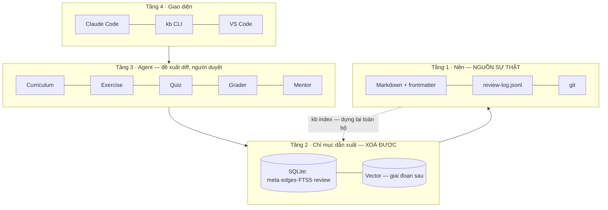
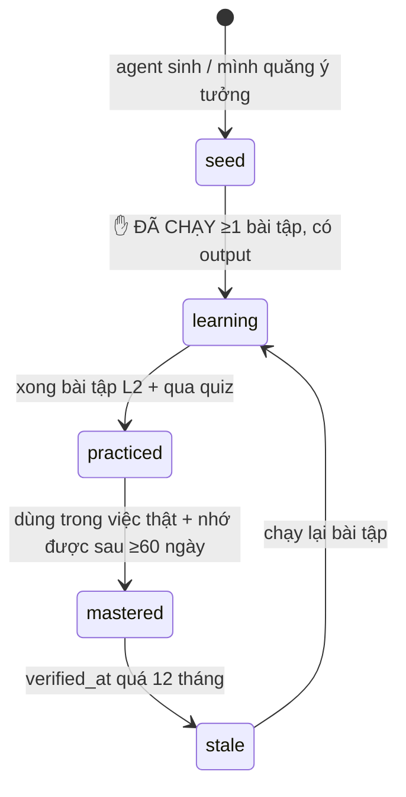
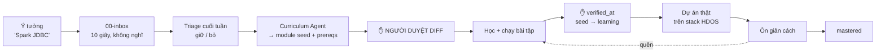
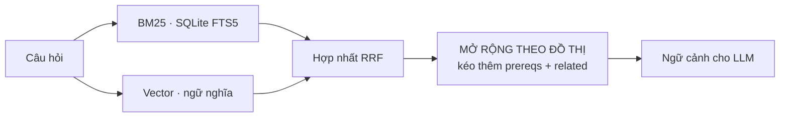

# Learning OS — kiến trúc

Thiết kế hệ điều hành học tập cá nhân: mọi ý tưởng bắt gặp đều trở thành một
**module học hoàn chỉnh**, có lộ trình, bài tập, dự án, kiểm tra và lịch ôn — và
vẫn dùng được sau 5 năm với 10.000 ghi chú.

Đây là bản thiết kế. Phần đã chạy được đánh dấu ✅, phần chưa xây đánh dấu ⏳.

---

## 0. Ba nguyên tắc nền

Ba điều này quyết định mọi lựa chọn kỹ thuật phía sau. Vi phạm cái nào là hỏng cả hệ.

### 0.1 Markdown trong git là NGUỒN SỰ THẬT. Mọi thứ khác là chỉ mục vứt đi được

Vector DB, graph DB, SQLite index — tất cả phải **dựng lại được từ Markdown bằng một
lệnh**. Xoá sạch chúng đi thì không mất gì ngoài thời gian reindex.

Kiểu chết thường gặp nhất của hệ thống tri thức có AI: kiến thức bị nhốt trong một
chỉ mục độc quyền. Đổi model embedding, hỏng database, ngừng dịch vụ → mất kiến thức
của nhiều năm. Ở đây không thể xảy ra: `.md` mở bằng `cat` cũng đọc được.

**Hệ quả bắt buộc:** không có trường dữ liệu nào chỉ tồn tại trong index.

### 0.2 Nội dung do AI sinh ra mà CHƯA KIỂM CHỨNG là kiến thức giả

Một module do LLM viết, chưa ai chạy thử, đọc rất thuyết phục. Sáu tháng sau bạn tin
nó như tin thứ mình tự học. Đó là nợ nguy hiểm hơn không có ghi chú — đặc biệt khi
bạn làm dữ liệu y tế.

**Cơ chế chặn:** mọi thứ AI sinh ra vào kho ở trạng thái `seed`. Nó **không được**
lên `learning` cho tới khi có ít nhất một bài tập **đã chạy thật, có output dán lại**.
Điểm thành thạo bỏ qua hoàn toàn nội dung chưa kiểm chứng.

### 0.3 Agent đề xuất DIFF, không tự ghi

Mọi output của agent vào kho dưới dạng thay đổi git mà người duyệt. Đây chính là ý
"GitHub của việc học": nội dung học đi qua review như code.

Không có cái này thì sau 3 tháng kho đầy nội dung không ai đọc, không ai chịu trách
nhiệm, và không phân biệt nổi đâu là thứ mình thật sự biết.

---

## 1. Bốn tầng



Mũi tên đứt là điều quan trọng nhất trong sơ đồ: tầng 2 luôn tái tạo được từ tầng 1.

---

## 2. Mô hình dữ liệu — frontmatter

Đây là hợp đồng giữa người và máy. Mọi agent, mọi truy vấn đều dựa vào nó.

```yaml
---
id: spark-jdbc                 # slug ỔN ĐỊNH, không bao giờ đổi (đổi tên file vẫn giữ link)
title: Spark JDBC
type: module                   # module | note | daily | runbook | project | exercise
status: seed                   # seed → learning → practiced → mastered → stale
difficulty: 3                  # 1–5
prereqs: [spark-architecture, jdbc, db-index]
related: [predicate-pushdown, partitioning]
tags: [spark, data-engineering]
est_hours: 6
sources:
  - {kind: doc,  url: "...", why: "chương Data Sources V2 giải thích pushdown"}
  - {kind: book, ref: "...", why: "..."}
projects: [hdos-ingest-jdbc]
created: 2026-07-30
updated: 2026-07-30
verified_at:                   # ngày CUỐI CÙNG chạy lại bài tập và nó vẫn đúng
---
```

### Trường nào KHÔNG được nằm ở đây

| Không lưu | Vì sao | Lấy ở đâu |
|---|---|---|
| `enables` | Là chiều ngược của `prereqs` — lưu cả hai chiều là bảo đảm lệch nhau | Suy ra lúc index |
| `backlinks` | Như trên | Suy ra lúc index |
| `mastery` | Tự chấm là tự khen. Phải **tính**, không được khai | Từ `review-log.jsonl` |
| `review.due`, `ease`… | Trạng thái đổi mỗi lần ôn → frontmatter nhiễu diff | Replay `review-log.jsonl` |

`mastery` tính từ: tỉ lệ đúng khi tự kiểm × số lần quên (`lapses`) × bài tập đã chạy
thật hay chưa × độ cũ của lần nhớ được gần nhất. Không có đường nào để tự nâng điểm.

### `verified_at` — trường chống mục ruỗng

Ở quy mô 10.000 ghi chú, kẻ thù không phải khối lượng mà là **nội dung cũ sai**.
`verified_at` quá 12 tháng → `kb doctor` đánh `stale`, và RAG hạ trọng số khi truy hồi.

---

## 3. Chỉ mục dẫn xuất — SQLite, một file, không dịch vụ

```sql
CREATE TABLE node(id TEXT PRIMARY KEY, path, title, type, status, difficulty,
                  est_hours, created, updated, verified_at);
CREATE TABLE edge(src, dst, kind);          -- prereq | related | link | project
CREATE TABLE chunk(id, node_id, heading, body, ord);
CREATE VIRTUAL TABLE chunk_fts USING fts5(body, content=chunk);
CREATE TABLE review_state(item_id PRIMARY KEY, ease, interval_days, reps, lapses, due);
```

Không commit vào git (`.gitignore`) — nó dẫn xuất được. `kb index` dựng lại từ đầu.

**Vì sao SQLite chứ không phải Neo4j:** ở 10k node / 50k cạnh, truy vấn duyệt đồ thị
sâu bằng recursive CTE mất vài mili-giây. Thêm một graph database là thêm một dịch vụ
phải nuôi, backup, nâng cấp — đổi lấy thứ chưa đo được là chậm. **Chỉ thêm khi có
truy vấn SQLite làm không nổi**, và lúc đó cũng chỉ là một chỉ mục dẫn xuất khác.

---

## 4. Knowledge graph

### Cạnh đến từ ba nguồn

| Nguồn | Loại cạnh | Trọng số |
|---|---|---|
| `prereqs:` trong frontmatter | `prereq` — **có hướng, phải là DAG** | mạnh |
| `related:` trong frontmatter | `related` — vô hướng | trung bình |
| `[[wikilink]]` trong thân bài | `link` | yếu |

### Hai truy vấn làm nên giá trị

**Lộ trình học** — cho một đích, trả về thứ tự học đúng:

```sql
WITH RECURSIVE need(id) AS (
  SELECT 'spark-jdbc'
  UNION SELECT e.dst FROM edge e JOIN need n ON e.src = n.id WHERE e.kind='prereq'
)
SELECT id FROM need;            -- rồi sắp topo, lọc bỏ cái đã mastered
```

Đây chính là mục 2 trong yêu cầu của bạn: nhập "Spark JDBC" → hệ tự phát hiện thiếu
`spark-architecture`, `jdbc`, `db-index` và xếp chúng lên trước.

**Kiểm tra sức khoẻ đồ thị** — `kb doctor`:

- **Chu trình** trong cạnh `prereq` → không thể học được, phải báo lỗi
- **Mồ côi** — node không cạnh nào trỏ tới → sẽ không bao giờ tìm lại được
- **Trùng khái niệm** — hai node độ tương đồng cao → gộp
- **`seed` quá 30 ngày** — sinh ra rồi bỏ đó, kiến thức giả đang tích lại

---

## 5. Thuật toán ôn tập — và vì sao dùng log append-only

### Vấn đề thiết kế

Trạng thái ôn tập (khi nào ôn lại, độ dễ, số lần quên) là **dữ liệu quý, không suy
ra được từ Markdown**. Nhưng nhét vào frontmatter thì mỗi lần ôn là một diff bẩn.

### Lời giải: log sự kiện, trạng thái là kết quả replay

`99-meta/review-log.jsonl` — chỉ ghi thêm, không sửa:

```jsonl
{"ts":"2026-07-30T08:12:00","item":"spark-jdbc","grade":2,"latency_s":45,"mode":"concept"}
{"ts":"2026-08-02T07:55:00","item":"spark-jdbc#watermark","grade":0,"latency_s":90,"mode":"card"}
```

Ba cái lợi cùng lúc:

1. Diff sạch — mỗi lần ôn là một dòng thêm vào cuối
2. **Đường cong quên có sẵn** — toàn bộ lịch sử nằm đó, tính được tỉ lệ nhớ thật của
   chính mình theo từng khoảng thời gian, rồi hiệu chỉnh lại tham số
3. Sai thuật toán thì thay thuật toán và replay lại — không mất dữ liệu

*(Đúng mô hình commit log của [Kafka](../03-topics/kafka.md): trạng thái là kết quả
phát lại log, không phải thứ được sửa tại chỗ.)*

### Hai làn ôn riêng biệt

| Làn | Đơn vị | Câu hỏi | Khoảng cách |
|---|---|---|---|
| **Khái niệm** | cả module | "còn giải thích được X không?" | dài: 7 → 21 → 60 → 180 ngày |
| **Ghi nhớ** | thẻ nhỏ | một Q/A nguyên tử | SM-2: 1 → 3 → n×ease |

Gộp hai làn là sai: "giải thích được watermark" và "nhớ lệnh reset offset" quên theo
hai nhịp hoàn toàn khác nhau.

### SM-2 rút gọn (đang dùng)

```python
# grade: 0 quên hẳn · 1 khó · 2 được · 3 dễ
if grade < 2:
    reps, interval, lapses = 0, 1, lapses + 1        # quên → về mốc đầu
else:
    interval = 1 if reps == 0 else 3 if reps == 1 else round(interval * ease)
    reps += 1
ease = max(1.3, ease + 0.1 - (3 - grade) * (0.08 + (3 - grade) * 0.02))
```

Điểm yếu phải biết: **tự chấm không đáng tin.** Giảm nhẹ bằng hai cách — bắt nhớ lại
trước khi mở đáp án, và ưu tiên tín hiệu khách quan (bài tập có chạy không, quiz đúng
mấy câu) hơn điểm tự chấm.

---

## 6. Vòng đời một module



Cửa `seed → learning` là **cửa duy nhất máy không tự mở được**. Đó là chỗ nguyên tắc
0.2 được thi hành.

---

## 7. Pipeline: ý tưởng → thành thạo



Hai cửa ✋ là nơi con người bắt buộc phải có mặt. Bỏ chúng đi thì hệ thống sinh nội
dung nhanh hơn khả năng bạn kiểm chứng, và tỉ lệ kiến thức giả tăng vô hạn.

---

## 8. Thiết kế agent

**Điều phối bằng pipeline tất định, không để agent tự nói chuyện với nhau.** Agent là
hàm không trạng thái: vào ngữ cảnh, ra artifact. Luồng do script quyết định.

| Agent | Vào | Ra | Ưu tiên |
|---|---|---|---|
| **Curriculum** | tên chủ đề + đồ thị hiện có | module skeleton, `prereqs`, lộ trình L1–L4 | ✅ cốt lõi |
| **Research** | chủ đề | nguồn có **lý do vì sao đáng đọc**, kèm trích dẫn | cốt lõi |
| **Exercise** | module + bậc | bài tập có **tiêu chí xong kiểm chứng được** | cốt lõi |
| **Quiz/Flashcard** | thân module | Q/A nguyên tử → làn ghi nhớ | cốt lõi |
| **Project** | nhiều module + stack thật | dự án nhiều bước tăng dần độ khó | giai đoạn 2 |
| **Grader** | câu trả lời của mình | chấm + chỉ ra chỗ yếu → sinh lại nội dung | giai đoạn 2 |
| **Graph** | toàn kho | phát hiện chu trình, mồ côi, trùng | giai đoạn 2 |
| **Mentor** | SQLite + review log | "hôm nay học gì" — điều phối tất cả | giai đoạn 3 |

### Ràng buộc chung cho mọi agent

1. **Chỉ đề xuất diff.** Không có quyền ghi thẳng.
2. **Trích dẫn hoặc im lặng.** Research Agent không được bịa nguồn; không tìm được
   thì nói không tìm được.
3. **Bài tập phải kiểm chứng được.** "Hiểu về partition" không phải bài tập.
   "Chạy 100 message không key rồi có key, dán thứ tự nhận về" mới là.
4. **Neo vào stack thật.** Bài tập Spark JDBC phải trỏ HIS Postgres → Iceberg trên
   MinIO → Trino `.60`, không phải cơ sở dữ liệu mẫu.

Điều 4 là thứ phân biệt hệ này với một khoá học online: nó biết bạn có `.60`, có
Trino ở `:8080`, có `hdos_silver`.

---

## 9. Tìm kiếm và RAG

### Ba đường truy hồi, hợp nhất



**Bước mở rộng theo đồ thị là thứ làm nó thành RAG cho việc HỌC.** Hỏi "vì sao query
Trino chậm" — vector trả về đoạn nói về Trino, nhưng câu trả lời thật nằm ở
[Iceberg](../03-topics/iceberg.md) (file nhỏ). Kéo theo prereq thì bắt được; RAG
thường thì không.

### Chunking

Cắt theo **heading `##`**, không cắt theo số token cố định. Markdown đã có ranh giới
ngữ nghĩa sẵn — cắt ngang giữa bảng khái niệm là phá luôn thông tin. Mỗi chunk mang
theo `node_id`, đường dẫn heading, tags.

### Embedding — điểm riêng của trường hợp này

Ghi chú của bạn **trộn tiếng Việt và thuật ngữ tiếng Anh** trong cùng một câu. Model
chỉ mạnh tiếng Anh sẽ hỏng. Cần model đa ngữ (`bge-m3` hoặc tương đương), **chạy
local** — ghi chú công việc không gửi ra ngoài.

### Khi nào mới cần vector

**Chưa cần bây giờ.** Dưới ~300 ghi chú, FTS5 + đồ thị đã tốt hơn vector về cả tốc độ
lẫn độ chính xác, mà không phải nuôi model. Vector đáng thêm khi bắt đầu hỏi kiểu
khái niệm mà không nhớ từ khoá: *"cái gì liên quan tới dữ liệu tới muộn"* → phải ra
watermark, allowed lateness, late-arriving dimension.

---

## 10. Sinh bài tập và dự án

### Bài tập — bốn bậc × sáu dạng

| Bậc | Đặc trưng | Tiêu chí xong |
|---|---|---|
| Beginner | làm theo hướng dẫn | chạy được, có output |
| Intermediate | tự ghép nhiều mảnh | giải thích được vì sao chọn cách đó |
| Advanced | **cố ý làm hỏng rồi sửa** | chẩn đoán đúng nguyên nhân |
| Expert | đánh đổi kiến trúc | bảo vệ lựa chọn **bằng số đo** |

Dạng: coding · SQL · kiến trúc · debug · tình huống · sự cố production.

**Bậc Advanced phải phá trước khi sửa.** Học hạ tầng mà chưa từng thấy nó hỏng thì
chưa học. Đây là lý do các bài "cố ý gửi message không key", "cố ý JOIN hai bảng lớn"
trong các file chủ đề hiện có được đánh dấu quan trọng nhất.

### Dự án — chuỗi tăng dần trên chính stack HDOS

```
P1  Spark JDBC đọc HIS Postgres → Parquet trên MinIO
P2  → Iceberg, có partition spec tự chọn
P3  → Trino truy vấn, đo trước/sau khi compaction
P4  → dbt test bắt lỗi grain
P5  → Airflow điều phối cả chuỗi, idempotent, backfill được
P6  → Kafka/Flink CDC chạy song song luồng batch
```

Mỗi dự án tiêu thụ 2–3 module và **buộc chúng phải khớp nhau** — chỗ duy nhất phát
hiện ra mình hiểu sai một khái niệm là khi ghép nó với khái niệm khác.

---

## 11. Versioning và đồng bộ

| Thứ | Vào git? | Vì sao |
|---|---|---|
| `*.md` | ✅ | nguồn sự thật |
| `review-log.jsonl` | ✅ | quý, không suy ra được, append-only nên diff sạch |
| `kb.sqlite` | ❌ | dẫn xuất, dựng lại bằng `kb index` |
| vector index | ❌ | dẫn xuất, và nặng |

Một người viết nên không có xung đột. Remote là GitLab công ty. Clone máy mới:
`git clone && kb index` là xong.

---

## 12. Quy mô: 100 → 1.000 → 10.000

| Mốc | Cái gì gãy | Cái gì cứu |
|---|---|---|
| **100** | không gãy gì | `grep` + mục lục thủ công là đủ |
| **1.000** | duyệt thư mục vô dụng, mục lục tay không kịp | FTS5 + đồ thị + `03-topics/` làm cổng vào |
| **10.000** | **trùng lặp và mục ruỗng**, không phải khối lượng | `verified_at`, phát hiện trùng, `kb doctor` chạy tự động, và **xoá** |

Điều ít ai chuẩn bị: ở 10.000 ghi chú, **việc khó nhất là vứt bớt**. Một kho chỉ lớn
lên mà không bao giờ cắt tỉa sẽ biến thành nghĩa địa — mỗi lần tìm ra 40 kết quả,
30 cái sai hoặc cũ, và bạn ngừng tin nó. Ngừng tin là chết.

Vì vậy `verified_at` và trạng thái `stale` có mặt từ ngày đầu, dù bây giờ chưa cần.

Và: ở mốc đó **con người không còn làm chỉ mục được nữa**. Đồ thị prereq + điểm thành
thạo trở thành cách điều hướng chính. Đó là lý do đầu tư vào metadata bây giờ — nó
trả lãi ở năm thứ ba, không phải tuần này.

---

## 13. Lộ trình triển khai

| GĐ | Khi nào | Xây gì | Công |
|---|---|---|---|
| **0** ✅ | xong | Markdown + git + thư mục + 6 module + `on-tap.py` | đã có |
| **1** ⏳ | ngay | `kb.py`: index · doctor · due · review · path. SQLite. Không dịch vụ. | ~300 dòng |
| **2** ⏳ | >50 ghi chú | Agent qua Claude Code: Curriculum, Exercise, Quiz — ra diff | prompt + script |
| **3** ⏳ | >300 ghi chú | Hybrid search + embedding local + mở rộng đồ thị | thêm 1 model |
| **4** ⏳ | chỉ khi cần | Dashboard, biểu đồ quên, web UI | tuỳ |

**Giai đoạn 1 có giá trị ngay ở 10 ghi chú. Giai đoạn 3 chỉ có giá trị ở 300.**

Xây giai đoạn 3 bây giờ là lặp lại đúng lần thất bại trước: dựng xong hệ thống rồi
không dùng. Vault Obsidian rỗng là bằng chứng — công cụ đã có sẵn, thứ thiếu là thói
quen.

---

## 14. Những thứ CỐ Ý KHÔNG XÂY

| Không xây | Vì sao |
|---|---|
| Graph database riêng | SQLite recursive CTE đủ tới 10k node. Thêm dịch vụ = thêm nợ vận hành |
| Vector DB dạng service | Chạy dạng **file** (sqlite-vec/LanceDB). `.60` đã 18 container dùng chung |
| Web UI ở giai đoạn đầu | VS Code + GitLab đã render sẵn. UI riêng là chỗ tốn công nhất, giá trị thấp nhất |
| Agent tự động ghi vào kho | Vi phạm nguyên tắc 0.3 |
| Đồng bộ realtime nhiều máy | Một người viết. git là đủ |
| Nhập từ Notion/Obsidian | Không có gì để nhập — vault cũ rỗng |

---

## Liên kết

- [README kho](../README.md) — cấu trúc và quy ước hiện hành
- [03-topics/](../03-topics/) — 6 module đang có
- [Kafka](../03-topics/kafka.md) — mô hình commit log dùng lại cho review log
