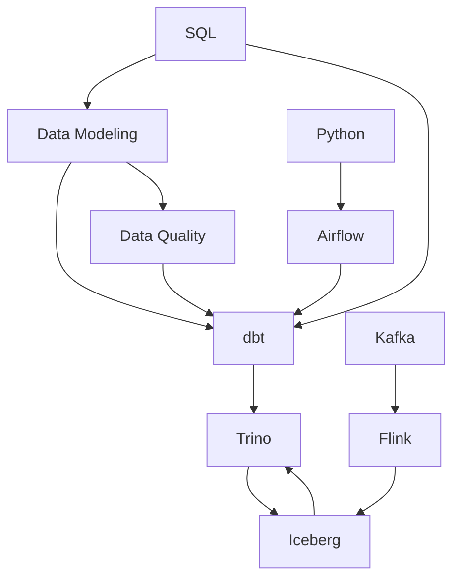

# Second Brain — Vũ Hoàng

Wikipedia cá nhân cho Software Engineering, Data Engineering, Backend, DevOps và AI.
Markdown thuần trong git, tương thích [Docusaurus](https://docusaurus.io/) — mở bằng
VS Code, duyệt bằng GitLab, dựng thành site khi cần.

**Ba nguyên tắc, mọi thứ dưới đây phục vụ chúng:**

1. **Một kiến thức một chỗ.** Không có bản sao. Trùng thì merge, không tạo file mới.
2. **Không ghi chú nào mồ côi.** Mọi file phải được `index.md` của thư mục trỏ tới, và
   phải có mục *Related Topics*.
3. **Chưa chạy được thì chưa gọi là học.** `verified_at` trống = chưa kiểm chứng bằng
   tay = đọc với thái độ nghi ngờ.

## Cấu trúc

| Thư mục | Chứa gì |
|---|---|
| [`docs/`](docs/) | **Tài liệu tham chiếu.** Giải thích *nó là gì, vì sao, đánh đổi ra sao* |
| [`tutorials/`](docs/tutorials/) | **Bài tập chạy thật**, có ô dán output |
| [`case-studies/`](docs/case-studies/) | Trường hợp thật đã gặp, kèm cái sai lúc đầu |
| [`examples/`](docs/examples/) | Đoạn code chạy được nguyên trạng, để copy |
| [`cheatsheets/`](docs/cheatsheets/) | Bảng tra nhanh khi **đang làm**, không dùng để học lần đầu |
| [`faqs/`](docs/faqs/) | Câu hỏi cắt ngang nhiều chủ đề |
| [`glossary/`](docs/glossary/) | Thuật ngữ, định nghĩa một câu |
| [`inbox/`](inbox/) | Quăng thô, chưa phân loại. Dọn hằng tuần |
| [`templates/`](templates/) | Khuôn cho tài liệu mới |

## Bản đồ tri thức



## Mục lục `docs/`

### Data Engineering

| Nhóm | Nội dung | Trạng thái |
|---|---|---|
| [Data Modeling](docs/data-modeling/) | [Grain](docs/data-modeling/foundations/grain.md) · [Fact/Dimension](docs/data-modeling/foundations/fact-and-dimension.md) · [**SCD**](docs/data-modeling/dimension-techniques/scd.md) · [Junk dimension](docs/data-modeling/dimension-techniques/junk-dimension.md) · [Surrogate key](docs/data-modeling/foundations/surrogate-key.md) · [Star/Snowflake/OBT](docs/data-modeling/layout-and-process/star-snowflake-obt.md) · [Quy trình thiết kế](docs/data-modeling/layout-and-process/design-process.md) | 📝 đang viết |
| [Data Quality](docs/data-quality/) | [Sáu chiều chất lượng](docs/data-quality/six-dimensions.md) | 📝 đang viết |
| [ETL & Streaming](docs/etl/) | [**dbt**](docs/etl/dbt/) · [Kafka](docs/etl/kafka/) · [Flink](docs/etl/flink/) | 🔄 dbt đang học |
| [Query Engines](docs/query-engines/) | [Trino](docs/query-engines/trino/) | ⬜ chưa bắt đầu |
| [Storage](docs/storage/) | [Iceberg](docs/storage/iceberg/) | ⬜ chưa bắt đầu |
| [Orchestration](docs/orchestration/) | [Airflow](docs/orchestration/airflow/) | ⬜ chưa bắt đầu |
| [Databases](docs/databases/) | [SQL](docs/databases/sql/) | ⬜ chưa bắt đầu |
| [Languages](docs/languages/) | [Python](docs/languages/python/) | ⬜ chưa bắt đầu |

### Chưa có nội dung

`concepts/` · `architecture/` · `patterns/` · `algorithms/` · `protocols/` ·
`tools/` · `backend/` · `frontend/` · `devops/` · `cloud/` · `ai/` · `security/` ·
`networking/`

Thư mục dựng sẵn theo kiến trúc, chưa viết gì. Chủ đề mới không hợp thư mục nào thì
tạo thư mục mới — `languages/` ra đời như vậy.

## Quy ước

| Thứ | Quy tắc |
|---|---|
| Tên thư mục | tiếng Anh, kebab-case (`data-modeling/`) |
| Tên file | tiếng Anh, kebab-case (`surrogate-key.md`). Trang chủ thư mục là `index.md` |
| Nội dung | **tiếng Việt**, giữ nguyên thuật ngữ tiếng Anh (`grain`, `incremental`, `rebalance`) |
| Tài liệu lớn | dùng [`templates/full-topic.md`](templates/full-topic.md) — 20 mục |
| Tài liệu nhỏ | dùng [`templates/short-topic.md`](templates/short-topic.md) — 8 mục |
| Nhãn thư mục | `_category_.json` cho Docusaurus sidebar |

### Front matter bắt buộc

```yaml
---
title: SCD — Slowly Changing Dimension
description: <một câu, hiện ở kết quả tìm kiếm>
tags: [scd, data-modeling]
domain: data-engineering
category: concept          # concept | technology | pattern | tool | tutorial
status: review             # draft | review | stable
difficulty: intermediate   # beginner | intermediate | advanced
verified_at:               # TRỐNG = chưa chạy tay, chưa tin được
updated: 2026-07-31
---
```

`verified_at` là cột sống của kho. Ngày 30/07/2026 một module do AI sinh ghi sai tên
catalog Trino — đọc rất thuyết phục, sai ở đúng chỗ khó kiểm nhất là chi tiết môi
trường. Trống nghĩa là chưa ai chạy thật.

## Kiến thức mới đi vào đâu

| Vừa có | Hỏi | Vào |
|---|---|---|
| Đọc được cái hay, chưa hiểu | Đã hiểu chưa? **Chưa** | [`inbox/`](inbox/) |
| Hiểu một khái niệm không phụ thuộc công cụ | Đúng cả khi đổi công cụ? **Có** | `docs/<nhóm khái niệm>/` |
| Hiểu một tính năng của công cụ | Gắn với một công nghệ? **Có** | `docs/<nhóm>/<công nghệ>/` |
| Chạy được một thứ, có output | Người khác làm lại được? **Có** | [`tutorials/`](docs/tutorials/) |
| Debug xong một sự cố thật | Có bài học rộng hơn ca này? **Có** | [`case-studies/`](docs/case-studies/) |

**Trước khi tạo file mới, tìm xem đã có chưa.** Có rồi thì cập nhật, đừng tạo bản thứ hai.

```bash
grep -ril "slowly changing" docs/
```

## Dựng site Docusaurus

Kho đang là markdown thuần, chưa có `package.json`. Muốn bật site:

```bash
npx create-docusaurus@latest site classic
# trỏ docs plugin về ../docs, bật @docusaurus/theme-mermaid
```

Front matter và `_category_.json` đã theo chuẩn Docusaurus nên không phải sửa nội dung.

## Đồng bộ

```bash
git add -A && git commit -m "docs: ..." && git push
```
