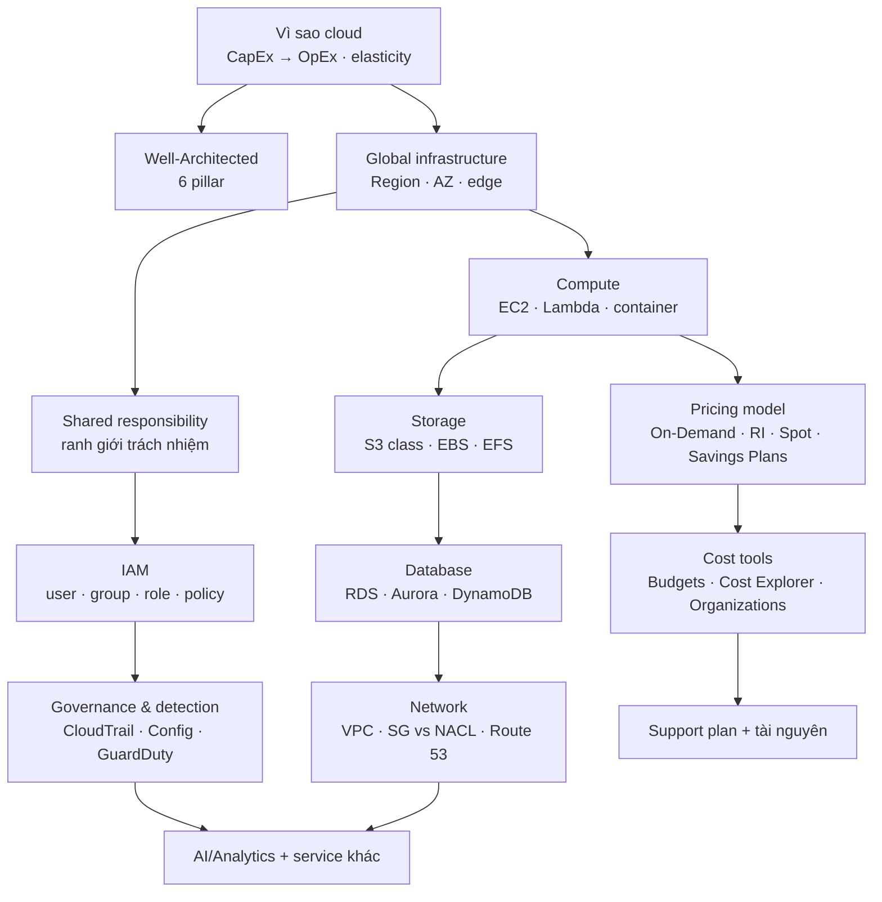

# AWS

> **Chốt:** CLF-C02 **không** đo khả năng dựng hệ thống — nó đo xem nghe một yêu cầu
> nghiệp vụ có **gọi đúng tên service** không. Nên tầng `foundations/` ở đây cố ý viết
> **rộng và nông**: 19 tài liệu khớp đúng 19 task statement của exam guide, mỗi cái trả
> lời "service nào, vì sao cái kia sai", chứ không dạy triển khai.

Exam guide nói thẳng năm việc **ngoài phạm vi** CLF-C02: *coding, cloud architecture
design, troubleshooting, implementation, load and performance testing*. Đọc dòng đó
trước khi học — nó cắt bỏ đúng những thứ ngốn thời gian nhất mà không ra điểm.

## Hai tầng chủ đề

| Tầng | Kỳ thi | Nội dung | Trạng thái |
|---|---|---|---|
| [**Foundations**](foundations/index.md) | CLF-C02 | 19 task statement — khái niệm cloud, security/compliance, danh mục service, billing & support | 🔄 đang làm |
| [**Architecting**](architecting/index.md) | SAA-C03 | Thiết kế resilient / high-performing / secure / cost-optimized | ⬜ chưa bắt đầu |

**Tách ở ranh giới "nhận diện" ↔ "thiết kế"** vì đó là ranh giới thật giữa hai kỳ thi,
không phải vì hai cái tên khác nhau. CLF hỏi *S3 Glacier Deep Archive là gì*; SAA hỏi
*với RPO 1 giờ và ngân sách X thì chọn lớp nào*. Cùng một service, hai loại câu hỏi —
và câu loại hai cần thêm đúng một thứ: **con số**.

Gộp cả hai vào một thư mục thì `reference/` có hơn 40 file và không còn đo được "còn
thiếu bao nhiêu cho kỳ thi đang thi". Bảng [Độ phủ](#độ-phủ-so-với-exam-guide) tồn tại
để trả lời đúng câu đó.

## Kỳ thi CLF-C02, những con số phải biết trước

| Thứ | Giá trị |
|---|---|
| Số câu | **65** — nhưng chỉ **50 câu tính điểm**, 15 câu còn lại AWS thử nghiệm, **không đánh dấu** |
| Thời gian | 90 phút |
| Dạng câu | multiple choice (1 đúng / 3 sai) · multiple response (≥2 đúng trong ≥5 lựa chọn) |
| Thang điểm | 100–1.000, **đậu từ 700** |
| Bỏ trống | tính là **sai** — không có điểm trừ khi đoán, nên **không bao giờ để trống câu nào** |
| Chấm theo | **compensatory** — không cần đậu từng domain, chỉ cần tổng đạt |
| Giá | 100 USD |
| Ngôn ngữ | **không có tiếng Việt** — thi bằng tiếng Anh (hoặc 11 ngôn ngữ khác) |

Hai dòng đáng đổi hành vi ngay: **15 câu không tính điểm** nghĩa là gặp một câu lạ hoàn
toàn thì xác suất cao nó không tính điểm — đừng để nó phá nhịp. Và **chấm compensatory**
nghĩa là dồn sức vào Domain 2 + 3 (64% điểm) hợp lý hơn là cố phủ đều.

## Bốn domain và trọng số

| Domain | Trọng số | Số task statement | Nó hỏi gì |
|---|---|---|---|
| 1 — Cloud Concepts | 24% | 4 | Vì sao cloud, Well-Architected, migration, kinh tế cloud |
| 2 — Security and Compliance | **30%** | 4 | Shared responsibility, governance, IAM, công cụ bảo mật |
| 3 — Cloud Technology and Services | **34%** | 8 | Danh mục service: compute, database, network, storage, AI/analytics |
| 4 — Billing, Pricing, and Support | 12% | 3 | Pricing model, công cụ chi phí, support plan |

**Domain 2 nặng hơn cả Domain 1 dù nghe "phụ" hơn** — 30% so với 24%. Đây là chỗ người
học tự lượng sức sai nhiều nhất: học hết tên service (Domain 3) rồi trượt vì shared
responsibility model và IAM.

## Learning path

**Đường ngắn nhất tới chỗ đậu được: Vì sao cloud → Global infrastructure → Shared
responsibility → IAM → Compute → Storage → Pricing model.** Bảy bước đó phủ phần lớn
câu hỏi lặp lại. Phần còn lại là **bề rộng danh mục** — học bằng cheatsheet và flashcard,
không học bằng cách đọc kỹ từng service.

## Năm cái bẫy, nói trước

| Bẫy | Hậu quả trong đề thi | Nằm ở |
|---|---|---|
| Đọc câu hỏi mà bỏ qua chữ **MOST / LEAST / BEST** | Hai đáp án đều *đúng về kỹ thuật*, chỉ một cái đúng với từ bị bỏ qua | [cheatsheet văn phong đề](foundations/cheatsheets/exam-wording.md) |
| Nhầm **security group** với **network ACL** | Chọn SG để *chặn* một IP — SG không có rule deny | [networking](foundations/reference/networking.md) |
| Nhầm ranh giới **shared responsibility** theo service | Cho rằng dùng RDS là AWS vá OS *và* quản luôn user trong DB | [shared-responsibility](foundations/reference/shared-responsibility.md) |
| Nhầm **Reserved Instance** với **Savings Plans** | Chọn RI cho workload đổi instance family liên tục | [pricing-models](foundations/reference/pricing-models.md) |
| Nhầm **Trusted Advisor** với **Inspector / GuardDuty / Config** | Bốn service đều "kiểm tra bảo mật", bốn câu trả lời khác nhau | [security-components](foundations/reference/security-components.md) |

Cả năm đều **không phải thiếu kiến thức**. Biết cả hai service, vẫn chọn sai — vì câu hỏi
đo **ranh giới giữa chúng**, mà ranh giới không nằm trong phần giới thiệu của service nào.

## Độ phủ so với exam guide

19 task statement của exam guide → **19 tài liệu**, một-đối-một. Cột *TT* chuyển 🟡 khi
file đã viết, ✅ khi chủ repo đã tự chạy lab/kiểm chứng và điền `verified_at`.

| Task | Nội dung | Domain | Tài liệu | TT |
|---|---|---|---|---|
| 1.1 | Define the benefits of the AWS Cloud | 1 | [cloud-value-proposition](foundations/reference/cloud-value-proposition.md) | 🟡 |
| 1.2 | Identify design principles of the AWS Cloud | 1 | [well-architected-framework](foundations/reference/well-architected-framework.md) | 🟡 |
| 1.3 | Benefits of and strategies for migration | 1 | [migration-and-caf](foundations/reference/migration-and-caf.md) | 🟡 |
| 1.4 | Concepts of cloud economics | 1 | [cloud-economics](foundations/reference/cloud-economics.md) | 🟡 |
| 2.1 | AWS shared responsibility model | 2 | [shared-responsibility](foundations/reference/shared-responsibility.md) | 🟡 |
| 2.2 | Cloud security, governance, compliance | 2 | [security-governance-compliance](foundations/reference/security-governance-compliance.md) | 🟡 |
| 2.3 | AWS access management capabilities | 2 | [access-management](foundations/reference/access-management.md) | 🟡 |
| 2.4 | Components and resources for security | 2 | [security-components](foundations/reference/security-components.md) | 🟡 |
| 3.1 | Methods of deploying and operating | 3 | [deploy-and-access-methods](foundations/reference/deploy-and-access-methods.md) | 🟡 |
| 3.2 | AWS global infrastructure | 3 | [global-infrastructure](foundations/reference/global-infrastructure.md) | 🟡 |
| 3.3 | AWS compute services | 3 | [compute](foundations/reference/compute.md) | 🟡 |
| 3.4 | AWS database services | 3 | [databases](foundations/reference/databases.md) | 🟡 |
| 3.5 | AWS network services | 3 | [networking](foundations/reference/networking.md) | 🟡 |
| 3.6 | AWS storage services | 3 | [storage](foundations/reference/storage.md) | 🟡 |
| 3.7 | AI/ML and analytics services | 3 | [ai-ml-and-analytics](foundations/reference/ai-ml-and-analytics.md) | 🟡 |
| 3.8 | Other in-scope service categories | 3 | [other-service-categories](foundations/reference/other-service-categories.md) | 🟡 |
| 4.1 | Compare AWS pricing models | 4 | [pricing-models](foundations/reference/pricing-models.md) | 🟡 |
| 4.2 | Resources for billing, budget, cost | 4 | [billing-and-cost-management](foundations/reference/billing-and-cost-management.md) | 🟡 |
| 4.3 | Technical resources and Support options | 4 | [support-and-technical-resources](foundations/reference/support-and-technical-resources.md) | 🟡 |

Phủ hết 19 task **là** mục tiêu ở tầng này — khác với các chủ đề khác trong kho, vì đây
là một kỳ thi có danh mục đóng. Thứ **không** phải mục tiêu: viết sâu. Một tài liệu CLF
đủ tốt khi nó trả lời được *"service nào, và vì sao ba cái kia sai"*.

## Lab chạy ở đâu — và cảnh báo

Cùng quy ước với phần còn lại của kho: **code sống ngoài repo**, ở `~/aws-lab/`
(Docker Compose, một emulator AWS local nghe ở cổng 4566). Repo chỉ giữ output đã dán lại.

**Emulator chỉ mô phỏng *API*, không mô phỏng AWS.** Nó phủ được chừng **một phần ba**
phạm vi đề — đúng phần gọi API được: S3, IAM, DynamoDB, SQS, Lambda, CloudFormation.
Nó **không** mô phỏng:

| Không có trong emulator | Nên hậu quả |
|---|---|
| Mạng thật (AZ, subnet, routing, latency) | Lab HA/DR cho kết quả "xanh" ở chỗ AWS thật sẽ đỏ |
| Hoá đơn và pricing | Không học được Domain 4 bằng tay |
| IAM *từ chối* thật (policy evaluation) | Policy viết sai vẫn pass → ảo giác thuộc bài |
| AZ sập, failover | Reliability chỉ còn là lý thuyết |

Nên **ba domain học được bằng lab local là 2 (một phần) và 3**; Domain 1 và 4 học bằng
đọc. Lab mạng/HA/DR/pricing phải chạy trên **AWS Free Tier thật**, và trước lab thật đầu
tiên thì bắt buộc: **billing alert**, **MFA cho root user**, và một **checklist xoá
resource** — NAT Gateway không thuộc Free Tier và tính tiền theo giờ kể cả khi không ai
dùng.

## Nguồn

[AWS Certified Cloud Practitioner (CLF-C02) Exam Guide](https://d1.awsstatic.com/training-and-certification/docs-cloud-practitioner/AWS-Certified-Cloud-Practitioner_Exam-Guide_C02.pdf)
— bản chính thức, Version 1.0, hiệu lực từ 19/09/2023 (thay CLF-C01).

Chọn exam guide làm xương sống thay vì một khoá học là cố ý: nó là **danh mục đóng** —
có cả danh sách service *trong* phạm vi và *ngoài* phạm vi. Mọi khoá học đều dạy thừa
hoặc thiếu so với nó, và chỉ khi so với nó thì mới đo được *còn thiếu bao nhiêu*.

## Related Topics

- [Foundations (CLF-C02)](foundations/index.md) — tầng đang làm
- [Architecting (SAA-C03)](architecting/index.md) — tầng sau
- [Storage · Iceberg](../storage/index.md) — S3 là nơi mọi thứ trong kho này cuối cùng nằm
- [ETL](../etl/index.md) — Glue, Kinesis, MSK là phiên bản managed của những thứ ở đó
- [Glossary](../glossary/index.md)
