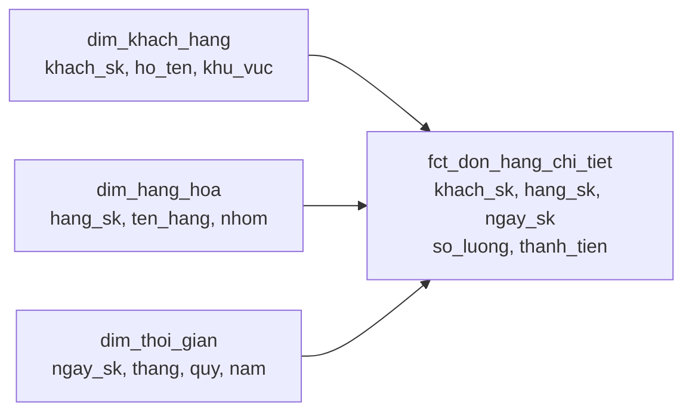

# Fact và Dimension

> **Chốt:** Fact là **cái đo được** (bao nhiêu tiền, bao nhiêu cái) — dài, hẹp, mọc
> thêm mỗi ngày. Dimension là **cái mô tả** (ai, cái gì, ở đâu) — ngắn, rộng, đổi chậm.
> Đặt sai chỗ một cột là hỏng cả mô hình, không phải chuyện thẩm mỹ.

## Mục tiêu

Cho một quy tắc quyết định được: cột này thuộc bảng nào. Từ đó mới có được star schema
và mới trả lời được câu hỏi phân tích mà không phải join lung tung.

## Tổng quan

| | Fact | Dimension |
|---|---|---|
| Chứa gì | Số đo (`thanh_tien`, `so_luong`) + các khoá | Thuộc tính mô tả (`ten`, `khu_vuc`, `nhom`) |
| Hình dạng | **Dài và hẹp** — triệu dòng, ít cột | **Ngắn và rộng** — nghìn dòng, nhiều cột |
| Nhịp đổi | Thêm dòng liên tục, hiếm khi sửa | Đổi chậm, vài lần/năm → [SCD](scd.md) |
| Vai trò trong query | `SUM` / `COUNT` cái này | `GROUP BY` / `WHERE` theo cái này |
| Grain | Một sự kiện = một dòng | Một thực thể (hoặc một phiên bản) = một dòng |

**Phép thử một câu:** cột này bạn sẽ `SUM` hay `GROUP BY`? `SUM` → fact. `GROUP BY` → dimension.

## Ví dụ



```text
fct_don_hang_chi_tiet   ← grain: một dòng hàng trong một đơn hàng
khach_sk | hang_sk | ngay_sk  | so_luong | thanh_tien
2        | 17      | 20260110 | 2        | 300000
```

Fact chỉ có **khoá và số**. Muốn biết khách tên gì thì join sang dimension. Đó là chủ
ý: tên khách đổi thì sửa **một** dòng dimension, không phải sửa triệu dòng fact.

## Ba loại fact

| Loại | Grain | Ví dụ | Cộng được không |
|---|---|---|---|
| **Transaction** | Một sự kiện | Một dòng hàng trong đơn | ✅ cộng theo mọi chiều |
| **Periodic snapshot** | Một kỳ × một thực thể | Số dư tài khoản cuối mỗi ngày | ⚠️ **không** cộng theo thời gian |
| **Accumulating snapshot** | Một quy trình, cập nhật dần | Đơn hàng: đặt → đóng gói → giao → nhận | ⚠️ dòng bị `UPDATE` nhiều lần |

Loại 2 là chỗ hay sai nhất: cộng số dư cuối ngày của 30 ngày lại được một con số **vô
nghĩa**. Số đo không cộng được theo mọi chiều gọi là *semi-additive*.

## Trade-offs

| Tách fact/dimension (star) | Gộp hết vào một bảng (OBT) |
|---|---|
| Không lặp dữ liệu; sửa thuộc tính ở một chỗ | Không cần join, query đơn giản |
| Phải join mọi lúc | Sửa tên khách = viết lại triệu dòng |
| Hỗ trợ [SCD](scd.md) tự nhiên | Lịch sử lẫn lộn, rất khó làm as-was |

Xem [Star, Snowflake, OBT](star-snowflake-obt.md).

## Common Mistakes

| Lỗi | Hậu quả |
|---|---|
| Để thuộc tính mô tả (`ten_khach`) trong fact | Đổi tên phải viết lại triệu dòng; và tên nào là "đúng"? |
| Để số đo đổi liên tục trong dimension | Dimension phình vô hạn nếu là Type 2 — **đó là fact** |
| Cộng periodic snapshot theo thời gian | Ra số vô nghĩa, không lỗi nào báo |
| Fact giữ natural key thay vì surrogate key | Nhân bản dòng khi dim là Type 2 — xem [SCD](scd.md#common-mistakes) |
| Không có `dim_thoi_gian`, dùng thẳng cột ngày | Không `GROUP BY` được theo quý/tuần/ngày lễ mà không viết hàm mỗi lần |

## FAQ

<details>
<summary>Cột <code>trang_thai_don_hang</code> — fact hay dimension?</summary>

Bẫy kinh điển. Nó *mô tả*, nên nghe như dimension — nhưng nó đổi **liên tục** trong
vòng đời một đơn. Cách đúng: `trang_thai` hiện tại nằm trong accumulating snapshot fact
(cột mốc thời gian cho từng bước), còn *danh mục* trạng thái ("Đã giao", "Đã huỷ")
là một dimension nhỏ.

</details>

<details>
<summary>Vì sao cần <code>dim_thoi_gian</code> khi bảng đã có cột ngày?</summary>

Để `GROUP BY quy`, `WHERE la_ngay_le = true`, `GROUP BY tuan_tai_chinh` mà không phải
viết hàm ngày tháng trong mọi query — và để mọi báo cáo dùng **cùng một** định nghĩa
quý. Đây là dimension duy nhất sinh sẵn được bằng script.

</details>

<details>
<summary>Fact có được join thẳng vào fact khác không?</summary>

Tránh. Hai fact khác grain join với nhau là nhân bản dòng. Cách đúng: cộng mỗi fact về
cùng một grain trước, rồi mới ghép — hoặc join gián tiếp qua dimension chung.

</details>

## Related Topics

- [Grain](grain.md) — phải khai grain của fact trước khi chọn cột
- [SCD](scd.md) — dimension đổi thì xử lý thế nào
- [Star, Snowflake, OBT](star-snowflake-obt.md) — cách bố trí fact quanh dimension
- [Surrogate key](surrogate-key.md) — thứ nối fact với dimension
- [Quy trình thiết kế](design-process.md) — bước 3 và 4 chính là chọn dim và fact

## References

- Kimball & Ross — *The Data Warehouse Toolkit*, chương 1–3
