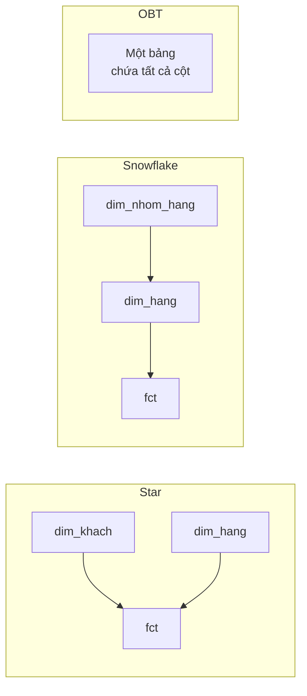

# Star, Snowflake và One Big Table

> **Chốt:** Cùng một mô hình logic ([grain](../foundations/grain.md), [fact/dim](../foundations/fact-and-dimension.md))
> bố trí được theo ba cách. Chọn cách nào là **quyết định hiệu năng và chi phí**, không
> phải quyết định mô hình hoá.

## Tổng quan

| | Star | Snowflake | OBT |
|---|---|---|---|
| Dimension | Dẹt, 1 tầng | Chuẩn hoá, nhiều tầng | Nhúng thẳng vào fact |
| Số join | Ít | Nhiều | Không |
| Lặp dữ liệu | Có (trong dim) | Ít nhất | Nhiều nhất |
| Sửa một thuộc tính | 1 dòng dim | 1 dòng bảng con | **Triệu dòng** |
| Hợp với | Warehouse cổ điển | Nơi chi phí lưu trữ đắt | Lakehouse dạng cột, BI đọc nhiều |

## Cần trả lời

- [ ] Vì sao Kimball khuyên **star**, chống snowflake — dù snowflake "chuẩn hơn"
- [ ] Vì sao lưu trữ dạng cột (Parquet/Iceberg) + nén làm OBT bớt tốn kém hơn xưa
- [ ] OBT xử lý [SCD Type 2](../dimension-techniques/scd.md) thế nào — và vì sao đó là điểm yếu chí mạng của nó
- [ ] Mô hình lai: star ở tầng silver, OBT ở tầng gold cho BI
- [ ] Data Vault đứng ở đâu trong bức tranh này

## Trade-offs

| Được | Mất |
|---|---|
| Star: cân bằng, dễ hiểu, hỗ trợ SCD tự nhiên | Vẫn phải join |
| Snowflake: ít lặp nhất | Nhiều join, người dùng BI khó tự viết query |
| OBT: query nhanh nhất, không join | Sửa thuộc tính rất đắt; as-was gần như không làm được |

## Common Mistakes

- Dùng OBT rồi phát hiện cần lịch sử *as-was* — lúc đó đã muộn.
- Snowflake hoá dimension chỉ vì "chuẩn hoá là tốt": tiết kiệm vài MB, đánh đổi bằng
  mọi query của người dùng cuối.

## Related Topics

- [Fact và Dimension](../foundations/fact-and-dimension.md)
- [Quy trình thiết kế](design-process.md)
- [SCD](../dimension-techniques/scd.md)
- [Iceberg](../../storage/iceberg/index.md) — lưu trữ dạng cột đổi phép tính chi phí

## References

- Kimball & Ross — *The Data Warehouse Toolkit*, chương 1
