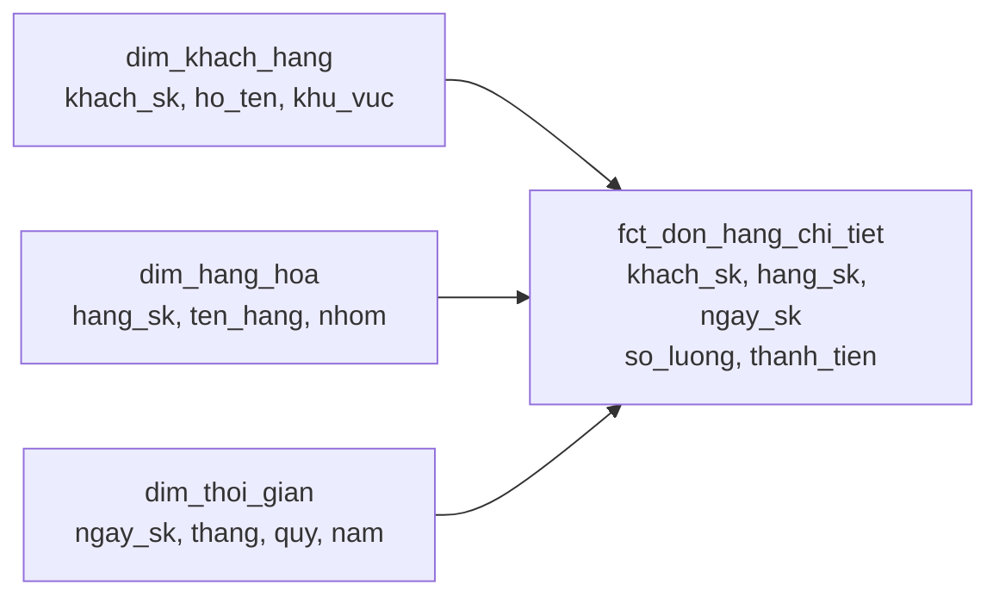

# Fact và Dimension

> **Chốt:** Fact là **cái đo được** (bao nhiêu tiền, bao nhiêu cái) — dài, hẹp, mọc
> thêm mỗi ngày. Dimension là **cái mô tả** (ai, cái gì, ở đâu) — ngắn, rộng, đổi chậm.
> Đặt sai chỗ một cột là hỏng cả mô hình, không phải chuyện thẩm mỹ.

## Mục tiêu

Cho một quy tắc quyết định được: cột này thuộc bảng nào. Từ đó mới có được star schema
và mới trả lời được câu hỏi phân tích mà không phải join lung tung.

## Tổng quan

| | Fact | Dimension |
|---|---|---|
| Chứa gì | Số đo (`thanh_tien`, `so_luong`) + các khoá | Thuộc tính mô tả (`ten`, `khu_vuc`, `nhom`) |
| Hình dạng | **Dài và hẹp** — triệu dòng, ít cột | **Ngắn và rộng** — nghìn dòng, nhiều cột |
| Nhịp đổi | Thêm dòng liên tục, hiếm khi sửa | Đổi chậm, vài lần/năm → [SCD](../skills/scd.md) |
| Vai trò trong query | `SUM` / `COUNT` cái này | `GROUP BY` / `WHERE` theo cái này |
| Grain | Một sự kiện = một dòng | Một thực thể (hoặc một phiên bản) = một dòng |

**Phép thử một câu:** cột này bạn sẽ `SUM` hay `GROUP BY`? `SUM` → fact. `GROUP BY` → dimension.

## Ví dụ



```text
fct_don_hang_chi_tiet   ← grain: một dòng hàng trong một đơn hàng
khach_sk | hang_sk | ngay_sk  | so_luong | thanh_tien
2        | 17      | 20260110 | 2        | 300000
```

Fact chỉ có **khoá và số**. Muốn biết khách tên gì thì join sang dimension. Đó là chủ
ý: tên khách đổi thì sửa **một** dòng dimension, không phải sửa triệu dòng fact.

## Ba loại fact

Kimball chia fact thành ba loại theo **grain** và **cách nạp**. Chọn sai loại thì không
phải chuyện thẩm mỹ — có loại **không cộng được theo thời gian**, và cộng nhầm thì ra số
vô nghĩa mà không có gì báo.

| Loại | Grain | Nạp thế nào | Cộng theo thời gian |
|---|---|---|---|
| **Transaction** | Một sự kiện | Chỉ `INSERT` | ✅ được |
| **Periodic snapshot** | Một kỳ × một thực thể | `INSERT` mỗi kỳ | ❌ **không** |
| **Accumulating snapshot** | Một quy trình | `INSERT` rồi `UPDATE` nhiều lần | ⚠️ tuỳ cột |

### 1. Transaction fact — loại phổ biến nhất

Một dòng = **một chuyện đã xảy ra**. Ghi rồi thì không sửa.

```text
fct_don_hang_chi_tiet
don_hang_id | dong | ngay       | khach_sk | so_luong | thanh_tien
DH001       | 1    | 2026-07-01 | 2        | 2        | 300000
DH001       | 2    | 2026-07-01 | 2        | 1        | 300000
```

Đây là loại **dễ nhất và an toàn nhất**:

- Cộng được theo **mọi** chiều — theo ngày, theo khách, theo hàng, theo mọi tổ hợp.
- Chỉ `INSERT`, không bao giờ `UPDATE` → hợp `incremental` tự nhiên.
- Sai thì dựng lại từ nguồn được.

**Mặc định nên là loại này.** Hai loại dưới chỉ dùng khi transaction fact không trả lời
được câu hỏi.

### 2. Periodic snapshot — ảnh chụp định kỳ

Một dòng = **trạng thái của một thực thể tại cuối một kỳ**. Dùng khi câu hỏi là *"tại
thời điểm đó tình hình thế nào"*, mà không có sự kiện nào để đếm.

```text
fct_so_du_cuoi_ngay
┌────────────┬───────────┬──────────┐
│    ngay    │ tai_khoan │  so_du   │
├────────────┼───────────┼──────────┤
│ 2026-07-01 │ TK01      │ 10000000 │
│ 2026-07-02 │ TK01      │ 10000000 │
│ 2026-07-03 │ TK01      │ 12000000 │
│ 2026-07-01 │ TK02      │  5000000 │
│ 2026-07-02 │ TK02      │  5000000 │
│ 2026-07-03 │ TK02      │  4000000 │
└────────────┴───────────┴──────────┘
```

Số dư có tồn tại như một sự kiện không? Không — nó là **trạng thái**. Không có "giao
dịch số dư" nào để ghi vào transaction fact.

#### Bẫy: cộng theo thời gian ra số vô nghĩa

```sql
SELECT sum(so_du) AS tong FROM fct_so_du;
```

```text
┌───────────────┐
│ tong_vo_nghia │
├───────────────┤
│      46000000 │
└───────────────┘
```

**46 triệu không tồn tại.** Tổng tài sản thật nhiều nhất là 16 triệu. Con số 46 triệu ra
từ việc cộng cùng một khoản tiền nhiều lần — mỗi ngày một lần.

Hai cách cộng **đúng**:

```sql
-- Cong theo TAI KHOAN, tai MOT thoi diem: hop le
SELECT ngay, sum(so_du) AS tong_tai_san FROM fct_so_du GROUP BY 1;
```

```text
┌────────────┬──────────────┐
│    ngay    │ tong_tai_san │
├────────────┼──────────────┤
│ 2026-07-01 │     15000000 │
│ 2026-07-02 │     15000000 │
│ 2026-07-03 │     16000000 │
└────────────┴──────────────┘
```

```sql
-- Theo thoi gian thi dung TRUNG BINH, khong dung tong
SELECT tai_khoan, round(avg(so_du)) AS so_du_tb FROM fct_so_du GROUP BY 1;
```

```text
┌───────────┬────────────┐
│ tai_khoan │  so_du_tb  │
├───────────┼────────────┤
│ TK01      │ 10666667.0 │
│ TK02      │  4666667.0 │
└───────────┴────────────┘
```

**Luật:** số đo cộng được theo *một số* chiều nhưng không phải *mọi* chiều gọi là
**semi-additive**. Với chiều thời gian, dùng `avg`, `max`, hoặc lấy giá trị cuối kỳ —
đừng dùng `sum`.

### 3. Accumulating snapshot — theo dõi một quy trình

Một dòng = **một lần chạy của một quy trình nhiều bước**. Khác hai loại trên ở chỗ dòng
bị **`UPDATE` nhiều lần** khi quy trình tiến triển.

```text
fct_don_hang_qua_trinh
┌─────────┬────────────┬───────────────┬────────────┬────────────┐
│ ma_don  │  ngay_dat  │ ngay_dong_goi │ ngay_giao  │ ngay_nhan  │
├─────────┼────────────┼───────────────┼────────────┼────────────┤
│ DH1     │ 2026-07-01 │ 2026-07-01    │ 2026-07-02 │ 2026-07-05 │
│ DH2     │ 2026-07-02 │ 2026-07-04    │ 2026-07-05 │ NULL       │
│ DH3     │ 2026-07-03 │ NULL          │ NULL       │ NULL       │
└─────────┴────────────┴───────────────┴────────────┴────────────┘
```

Mỗi cột mốc là một `NULL` chờ được điền. `DH3` mới đặt, `DH2` đang giao, `DH1` xong.

#### Giá trị thật: đo độ trễ từng chặng

Đây là thứ transaction fact **không** làm được — nó có các sự kiện rời rạc, nhưng không
có chỗ nào tính được khoảng cách giữa chúng mà không self-join.

```sql
SELECT ma_don,
  date_diff('day', ngay_dat,       ngay_dong_goi) AS cho_dong_goi,
  date_diff('day', ngay_dong_goi,  ngay_giao)     AS cho_giao,
  date_diff('day', ngay_giao,      ngay_nhan)     AS cho_nhan,
  date_diff('day', ngay_dat,       ngay_nhan)     AS tong_thoi_gian
FROM fct_don_hang_qua_trinh;
```

```text
┌─────────┬──────────────┬──────────┬──────────┬────────────────┐
│ ma_don  │ cho_dong_goi │ cho_giao │ cho_nhan │ tong_thoi_gian │
├─────────┼──────────────┼──────────┼──────────┼────────────────┤
│ DH1     │            0 │        1 │        3 │              4 │
│ DH2     │            2 │        1 │     NULL │           NULL │
│ DH3     │         NULL │     NULL │     NULL │           NULL │
└─────────┴──────────────┴──────────┴──────────┴────────────────┘
```

Và đếm số đơn đang kẹt ở mỗi chặng — báo cáo vận hành kinh điển:

```text
┌──────────────┬───────────────┬───────────┬──────────┐
│ cho_dong_goi │ dang_cho_giao │ dang_giao │ hoan_tat │
├──────────────┼───────────────┼───────────┼──────────┤
│            1 │             0 │         1 │        1 │
└──────────────┴───────────────┴───────────┴──────────┘
```

#### Ba cái giá phải trả

| Cái giá | Chi tiết |
|---|---|
| Có `UPDATE` | Không dùng `incremental` kiểu append được; cần `unique_key` |
| Cột `NULL` khắp nơi | `JOIN` thường **loại sạch** dòng chưa xong — xem [ca thật](../case-studies/don-dang-giao-bien-mat.md) |
| Không có lịch sử trạng thái | Chỉ biết *khi nào* tới mốc, không biết đã quay lui hay chưa |

### Additivity — thứ quan trọng hơn cả ba loại

Phân loại theo *cộng được hay không* thực ra hữu ích hơn phân loại theo tên.

**Điểm hay bị hiểu sai:** additivity **không phải tính chất của riêng số đo** — nó là
tính chất của **cặp (số đo × chiều)**. Cùng một cột có thể cộng được theo chiều này và
không cộng được theo chiều kia. Đó chính là lý do có từ *semi*-additive.

| Số đo | Theo khách hàng | Theo sản phẩm | Theo **thời gian** |
|---|---|---|---|
| `thanh_tien` | ✅ | ✅ | ✅ → **additive** |
| `so_du` | ✅ | — | ❌ → **semi-additive** |
| `so_luong_ton_kho` | — | ✅ | ❌ → **semi-additive** |
| `ty_le_loi` | ❌ | ❌ | ❌ → **non-additive** |

Đọc bảng theo hàng: `so_du` cộng theo khách thì đúng (tổng tài sản của tất cả khách),
cộng theo thời gian thì vô nghĩa. `thanh_tien` cộng theo hướng nào cũng đúng.

### Additive — cộng thoải mái

Số đo **đếm được và cộng dồn tự nhiên**: `thanh_tien`, `so_luong`, `chi_phi`, `so_gio`.

Dấu hiệu nhận ra: nếu chia đôi khoảng thời gian rồi cộng hai nửa lại, có ra đúng tổng
ban đầu không? Có → additive.

Đây là loại duy nhất **không cần suy nghĩ** khi viết báo cáo. Cố gắng thiết kế fact sao
cho phần lớn số đo thuộc loại này.

### Semi-additive — cộng được, trừ chiều thời gian

Gần như luôn là số đo mô tả **trạng thái tồn tại tại một thời điểm**: số dư, tồn kho, số
nhân viên, số thuê bao đang hoạt động.

Lý do không cộng theo thời gian: **cùng một thực thể tồn tại qua nhiều kỳ**. Cộng qua các
kỳ là đếm lại chính nó — như phần [Periodic snapshot](#2-periodic-snapshot--ảnh-chụp-định-kỳ)
đã chứng minh: 46 triệu trong khi tổng thật nhiều nhất 16 triệu.

Bốn cách gộp đúng theo thời gian, chọn theo **câu hỏi nghiệp vụ**:

| Cách | Trả lời câu hỏi | Ví dụ dùng |
|---|---|---|
| Giá trị **cuối kỳ** | "Hiện tại còn bao nhiêu" | Số dư cuối tháng lên báo cáo tài chính |
| **Trung bình** | "Trung bình duy trì bao nhiêu" | Số dư bình quân để tính lãi |
| **Lớn nhất / nhỏ nhất** | "Đỉnh / đáy là bao nhiêu" | Tồn kho cao nhất để tính sức chứa kho |
| Giá trị **đầu kỳ** | "Bắt đầu kỳ có bao nhiêu" | Đối chiếu đầu kỳ ↔ cuối kỳ |

Không có cách nào "đúng nhất" — sai lầm là dùng `sum`, còn chọn cái nào trong bốn cái
này là câu hỏi nghiệp vụ.

### Non-additive — không cộng được theo chiều nào

Ba họ hay gặp, và cả ba đều hỏng theo cùng một kiểu: **chúng là kết quả của một phép
chia đã thực hiện quá sớm.**

#### Họ 1 — tỷ lệ và phần trăm

```text
┌──────────┬────────┬────────┬───────────────┐
│ khu_vuc  │ so_loi │ so_don │ ty_le_loi_pct │
├──────────┼────────┼────────┼───────────────┤
│ Miền Bắc │     90 │    100 │          90.0 │
│ Miền Nam │      5 │   1000 │           0.5 │
└──────────┴────────┴────────┴───────────────┘
```

```text
┌──────────────────────────┬────────────┐
│ trung_binh_cac_ty_le_SAI │ ty_le_dung │
├──────────────────────────┼────────────┤
│                    45.25 │       8.64 │
└──────────────────────────┴────────────┘
```

**Sai hơn năm lần** — vì hai khu vực có mẫu số chênh 10 lần, mà `avg` coi chúng ngang nhau.

#### Họ 2 — trung bình đã tính sẵn

Cùng bản chất nhưng hay bị bỏ qua hơn, và sai nặng hơn nhiều:

```text
┌──────────┬────────┬───────────┬────────────┐
│ khu_vuc  │ so_don │ tong_tien │    gtdh    │   ← giá trị đơn hàng trung bình
├──────────┼────────┼───────────┼────────────┤
│ Miền Bắc │    100 │   1000000 │    10000.0 │
│ Miền Nam │      1 │  50000000 │ 50000000.0 │
└──────────┴────────┴───────────┴────────────┘
```

```text
┌───────────────┬──────────┐
│ tb_cua_tb_SAI │ tb_that  │
├───────────────┼──────────┤
│    25005000.0 │ 504950.0 │
└───────────────┴──────────┘
```

**Sai 49 lần.** Trung bình của các trung bình không phải trung bình — trừ khi mọi nhóm
có cùng số phần tử, điều gần như không bao giờ đúng.

#### Họ 3 — đếm phân biệt (`count distinct`)

Họ này ít ai xếp vào non-additive, nhưng nó hỏng y hệt:

```text
┌────────────┬──────────────┐
│    ngay    │ dau_moi_ngay │   ← khách truy cập duy nhất mỗi ngày
├────────────┼──────────────┤
│ 2026-07-01 │            3 │
│ 2026-07-02 │            2 │
│ 2026-07-03 │            2 │
└────────────┴──────────────┘
```

Vậy cả kỳ có bao nhiêu khách duy nhất?

```text
cộng ba ngày   = 7      ← SAI
đếm cả kỳ      = 4      ← ĐÚNG
```

**Phồng 75%**, vì `U1` xuất hiện cả ba ngày và bị đếm ba lần. Đây là lý do chỉ số
*"người dùng hoạt động hàng tháng"* **không** suy ra được từ bảng ngày — phải tính lại
từ dữ liệu gốc ở đúng mức thời gian cần.

### Luật lưu trữ: đừng chia sớm

Cả ba họ non-additive có **cùng một cách sửa**:

> **Lưu tử số và mẫu số vào fact. Để lớp báo cáo chia.**

| Đừng lưu | Lưu thay bằng | Báo cáo tính |
|---|---|---|
| `ty_le_loi` | `so_loi`, `so_don` | `sum(so_loi) / sum(so_don)` |
| `gia_tri_don_tb` | `tong_tien`, `so_don` | `sum(tong_tien) / sum(so_don)` |
| `ty_le_chuyen_doi` | `so_mua`, `so_xem` | `sum(so_mua) / sum(so_xem)` |

Nhờ vậy **mọi mức gộp đều đúng** — theo ngày, theo tháng, theo khu vực, theo mọi tổ hợp —
mà không cần ai nhớ luật gì.

Với `count distinct` thì không có tử/mẫu để lưu. Hai lựa chọn: tính lại từ fact chi tiết
ở đúng mức cần, hoặc lưu cấu trúc xấp xỉ như HyperLogLog nếu warehouse hỗ trợ.

### Phép thử một câu

Trước khi đưa một cột số vào fact, hỏi:

> **"Cột này cộng qua hai dòng bất kỳ, kết quả có nghĩa không?"**

- Có với mọi chiều → additive, yên tâm.
- Có với một số chiều → semi-additive, **ghi vào mô tả cột** chiều nào không cộng được.
- Không với chiều nào → non-additive, **đừng lưu nó** — lưu tử và mẫu.

Bước "ghi vào mô tả cột" quan trọng hơn vẻ ngoài: người viết báo cáo sáu tháng sau không
đọc file này, họ đọc `schema.yml`. Xem [Docs và lineage](../../etl/dbt/reference/docs-and-lineage.md).

### Chọn loại nào

```text
Có sự kiện rời rạc để ghi không?
├─ Có  → Transaction fact          ← mặc định, chọn cái này
└─ Không
   ├─ Cần trạng thái tại từng thời điểm  → Periodic snapshot
   │                                       (nhớ: semi-additive)
   └─ Cần đo độ trễ giữa các bước       → Accumulating snapshot
                                          (nhớ: có UPDATE, có NULL)
```

Ba loại **không loại trừ nhau**. Một hệ thống chín chắn thường có cả ba cho cùng một
nghiệp vụ: transaction để phân tích chi tiết, periodic để báo cáo tồn/số dư, accumulating
để theo dõi vận hành.

### Loại thứ tư ít gặp: factless fact

Fact **không có số đo nào**, chỉ có các khoá. Dùng để ghi lại *"chuyện này đã xảy ra"*
hoặc *"quan hệ này tồn tại"*:

```text
fct_sinh_vien_diem_danh
ngay_sk | sinh_vien_sk | lop_sk        ← khong co cot so nao
```

Đếm bằng `count(*)`. Giá trị lớn nhất là trả lời câu hỏi **phủ định**: *"sinh viên nào
KHÔNG đi học buổi nào"* — thứ chỉ trả lời được khi có bảng ghi lại sự kiện đã xảy ra để
đối chiếu với danh sách đầy đủ.

## Trade-offs

| Tách fact/dimension (star) | Gộp hết vào một bảng (OBT) |
|---|---|
| Không lặp dữ liệu; sửa thuộc tính ở một chỗ | Không cần join, query đơn giản |
| Phải join mọi lúc | Sửa tên khách = viết lại triệu dòng |
| Hỗ trợ [SCD](../skills/scd.md) tự nhiên | Lịch sử lẫn lộn, rất khó làm as-was |

Xem [Star, Snowflake, OBT](star-snowflake-obt.md).

## Common Mistakes

| Lỗi | Hậu quả |
|---|---|
| Để thuộc tính mô tả (`ten_khach`) trong fact | Đổi tên phải viết lại triệu dòng; và tên nào là "đúng"? |
| Để số đo đổi liên tục trong dimension | Dimension phình vô hạn nếu là Type 2 — **đó là fact** |
| Cộng periodic snapshot theo thời gian | Ra số vô nghĩa, không lỗi nào báo |
| Fact giữ natural key thay vì surrogate key | Nhân bản dòng khi dim là Type 2 — xem [SCD](../skills/scd.md#common-mistakes) |
| Không có `dim_thoi_gian`, dùng thẳng cột ngày | Không `GROUP BY` được theo quý/tuần/ngày lễ mà không viết hàm mỗi lần |

## FAQ

<details>
<summary>Cột <code>trang_thai_don_hang</code> — fact hay dimension?</summary>

Bẫy kinh điển. Nó *mô tả*, nên nghe như dimension — nhưng nó đổi **liên tục** trong
vòng đời một đơn. Cách đúng: `trang_thai` hiện tại nằm trong accumulating snapshot fact
(cột mốc thời gian cho từng bước), còn *danh mục* trạng thái ("Đã giao", "Đã huỷ")
là một dimension nhỏ.

Còn khi trạng thái đã chốt cứng lúc ghi thì câu hỏi đổi thành *tách dimension riêng hay
để thẳng trong fact* — xem [Junk dimension](../skills/junk-dimension.md).

</details>

<details>
<summary>Vì sao cần <code>dim_thoi_gian</code> khi bảng đã có cột ngày?</summary>

Để `GROUP BY quy`, `WHERE la_ngay_le = true`, `GROUP BY tuan_tai_chinh` mà không phải
viết hàm ngày tháng trong mọi query — và để mọi báo cáo dùng **cùng một** định nghĩa
quý. Đây là dimension duy nhất sinh sẵn được bằng script.

</details>

<details>
<summary>Fact có được join thẳng vào fact khác không?</summary>

Tránh. Hai fact khác grain join với nhau là nhân bản dòng. Cách đúng: cộng mỗi fact về
cùng một grain trước, rồi mới ghép — hoặc join gián tiếp qua dimension chung.

</details>

## Related Topics

- [Grain](grain.md) — phải khai grain của fact trước khi chọn cột
- [SCD](../skills/scd.md) — dimension đổi thì xử lý thế nào
- [Star, Snowflake, OBT](star-snowflake-obt.md) — cách bố trí fact quanh dimension
- [Surrogate key](surrogate-key.md) — thứ nối fact với dimension
- [Quy trình thiết kế](design-process.md) — bước 3 và 4 chính là chọn dim và fact

## References

- Kimball & Ross — *The Data Warehouse Toolkit*, chương 1–3
