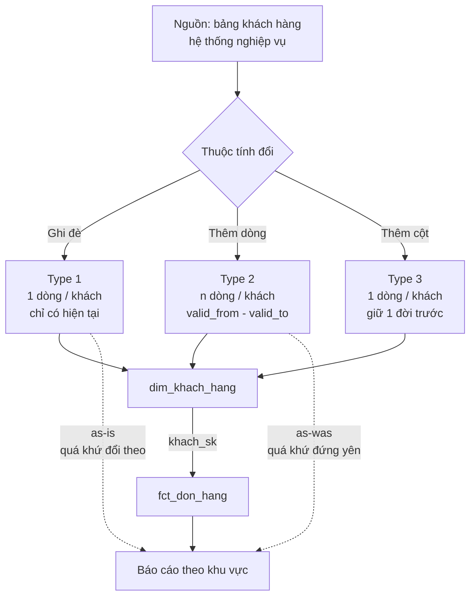
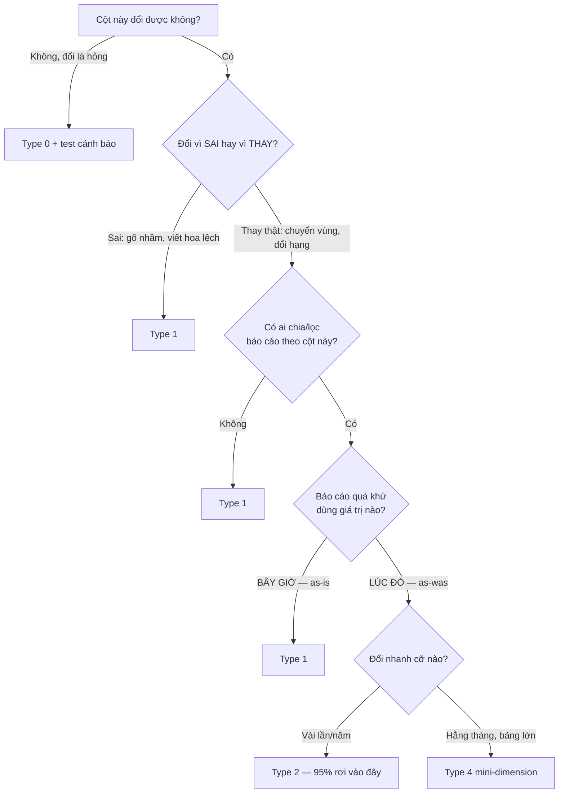

# SCD — Slowly Changing Dimension

> **Chốt:** SCD không phải kỹ thuật, mà là **một quyết định nghiệp vụ**: khi thuộc
> tính của một thực thể đổi, báo cáo về quá khứ nên dùng giá trị *lúc đó* hay giá trị
> *bây giờ*? Chọn xong mới tới chuyện viết SQL. Chọn sai thì SQL đúng vẫn ra số sai.

## Mục tiêu

Trả lời một câu hỏi rất cụ thể xuất hiện ở **mọi** hệ thống báo cáo:

> Khách hàng chuyển từ Miền Bắc vào Miền Nam. Đơn hàng họ đặt hồi tháng 1 — lúc còn
> ở Miền Bắc — bây giờ nên tính vào vùng nào?

Không có câu trả lời đúng phổ quát. Có **hai** câu trả lời, cả hai đều hợp lý, và
chúng dẫn tới hai thiết kế bảng khác nhau. SCD là bộ từ vựng để nói về lựa chọn đó
và các cách hiện thực hoá nó.

## Tổng quan

Dimension là bảng mô tả *thực thể* (khách hàng, sản phẩm, cửa hàng). Thuộc tính của
chúng đổi — chậm, vài lần một năm. Mỗi lần đổi, hệ thống phải quyết định làm gì với
giá trị cũ: **ghi đè** (mất lịch sử) hay **giữ lại** (tốn chỗ, phức tạp hơn khi join).

Sáu "Type" được đánh số từ 0 đến 6 là sáu cách xử lý. Thực tế **95% là Type 1 và
Type 2** — học chắc hai cái đó, biết ba cái còn lại tồn tại là đủ.

> **Vì sao gọi là "slowly".** Cột đổi hằng giờ (số dư tài khoản, trạng thái đơn) không
> phải thuộc tính dimension — đó là **fact**. Nhầm chỗ này thì dựng SCD Type 2 cho thứ
> đổi liên tục và bảng phình gấp hàng nghìn lần. Xem [Fact và Dimension](fact-and-dimension.md).

## Vì sao cần

Không có SCD — tức là mặc định ghi đè mọi thứ — thì hệ thống mắc một lỗi rất khó phát hiện:

**Báo cáo về quá khứ tự thay đổi số theo thời điểm chạy.**

Chạy báo cáo doanh thu tháng 1 vào tháng 2 ra một con số. Chạy lại đúng báo cáo đó vào
tháng 4 ra con số khác — dù tháng 1 đã đóng sổ, không có đơn hàng nào mới. Nguyên nhân:
ai đó sửa một dòng master data ở giữa.

Đây là loại lỗi làm mất niềm tin vào cả hệ thống, vì nó **không giống lỗi**. Không có
exception, không có test đỏ, không có log. Nó giống như có người sửa số.

## Kiến trúc



Điểm mấu chốt trong sơ đồ: **mũi tên `khach_sk` từ dim sang fact.** Type 2 chỉ có tác
dụng nếu fact giữ surrogate key của *phiên bản đúng tại thời điểm sự kiện*. Xem §
[Common Mistakes](#common-mistakes).

## Thành phần

Bộ cột của một bảng dimension Type 2:

| Cột | Vai trò | Bỏ đi thì sao |
|---|---|---|
| `khach_sk` | **Surrogate key** — khoá thật. Mỗi *phiên bản* một giá trị | Fact không trỏ được tới đúng phiên bản → mất toàn bộ ý nghĩa Type 2 |
| `khach_hang_id` | **Natural key** — mã nghiệp vụ. **Lặp lại** qua các phiên bản | Không gom được các phiên bản của cùng một khách |
| `valid_from` | Dòng này bắt đầu đúng từ khi nào | Không xác định được phiên bản nào áp cho ngày nào |
| `valid_to` | Dòng này hết hiệu lực khi nào | Như trên |
| `is_current` | Cờ tiện lợi, bằng `valid_to = '9999-12-31'` | Không mất mát gì, chỉ dài dòng hơn khi query |
| `dbt_scd_id` / hash | Vân tay của phiên bản, để phát hiện thay đổi | Phải so từng cột thủ công |

## Luồng hoạt động

Một chu kỳ nạp Type 2:

1. **Đọc nguồn** — ảnh chụp bảng khách hàng hôm nay.
2. **So với dòng `is_current`** trong dimension theo natural key.
3. **Không đổi** → không làm gì.
4. **Có đổi** → đóng dòng cũ: `valid_to = hôm nay`, `is_current = false`.
5. **Thêm dòng mới**: SK mới, `valid_from = hôm nay`, `valid_to = '9999-12-31'`.
6. **Natural key mới** → thêm dòng mới hoàn toàn.
7. **Natural key biến mất khỏi nguồn** → đánh dấu `is_deleted`, **không** xoá dòng.
8. **Nạp fact** → tra SK theo khoảng thời gian (dimension lookup, xem [Ví dụ](#ví-dụ)).

Bước 7 hay bị bỏ. Nguồn xoá cứng một khách mà dimension không biết thì khách đó "sống"
mãi trong báo cáo.

## Ví dụ

Khách hàng `KH001` — Nguyễn Văn A — đăng ký ở **Miền Bắc**. Ngày 15/03/2026 chuyển
vào Nam, nhân viên sửa hồ sơ thành **Miền Nam**. Hai đơn hàng:

| Đơn | Ngày | Tiền |
|---|---|---|
| DH500 | 10/01/2026 | 5.000.000 |
| DH900 | 20/05/2026 | 3.000.000 |

### Type 0 — đóng băng

```text
khach_hang_id | ho_ten       | ngay_mo_tai_khoan
KH001         | Nguyễn Văn A | 2024-06-01         ← không bao giờ đổi
```

Không phải "chưa hỗ trợ cập nhật" mà là **cấm cập nhật**. Ngày mở tài khoản mà đổi
được thì đó là dữ liệu hỏng, không phải dữ liệu mới. Giá trị của việc gọi tên nó ra:
đặt được test — cột này đổi giữa hai lần chạy là **cảnh báo**.

### Type 1 — ghi đè

```text
TRƯỚC:
khach_hang_id | ho_ten       | khu_vuc
KH001         | Nguyễn Văn A | Miền Bắc

SAU 15/03/2026:
khach_hang_id | ho_ten       | khu_vuc
KH001         | Nguyễn Văn A | Miền Nam     ← Miền Bắc biến mất vĩnh viễn
```

Doanh thu tháng 1 giờ hiện ở **Miền Nam**, dù lúc đó khách ở Miền Bắc.

**Luôn hợp lệ cho Type 1:** sửa lỗi chính tả tên, chuẩn hoá viết hoa, sửa email gõ
nhầm. Những cái đó không có "lịch sử" đáng giữ — chỉ có bản đúng và bản sai.

### Type 2 — thêm dòng

```text
khach_sk | khach_hang_id | ho_ten       | khu_vuc  | valid_from | valid_to   | is_current
1        | KH001         | Nguyễn Văn A | Miền Bắc | 2024-06-01 | 2026-03-15 | false
2        | KH001         | Nguyễn Văn A | Miền Nam | 2026-03-15 | 9999-12-31 | true
```

**Grain của bảng đã đổi.** Không còn "một khách một dòng" mà là **"một phiên bản của
một khách một dòng"**. Hệ quả trực tiếp: `unique` trên `khach_hang_id` sẽ FAIL — và
đó là fail đúng, y hệt ca đã gặp thật ở [dbt: testing](../etl/dbt/testing.md).

Test đúng cho bảng Type 2:

```yaml
models:
  - name: dim_khach_hang
    tests:
      - unique:
          column_name: khach_sk                       # SK là khoá thật
      - dbt_utils.unique_combination_of_columns:
          combination_of_columns: [khach_hang_id, valid_from]
      - dbt_utils.expression_is_true:
          expression: "valid_from < valid_to"          # không có khoảng lộn ngược
```

**Fact phải giữ SK, không phải natural key:**

```text
don_hang_id | khach_sk | ngay        | thanh_tien
DH500       | 1        | 2026-01-10  | 5000000     ← SK 1 = phiên bản Miền Bắc
DH900       | 2        | 2026-05-20  | 3000000     ← SK 2 = phiên bản Miền Nam
```

Việc gán SK đúng lúc nạp fact gọi là **dimension lookup**:

```sql
select
    f.don_hang_id,
    d.khach_sk,                          -- SK đúng của thời điểm đó
    f.ngay,
    f.thanh_tien
from {{ ref('stg_don_hang') }} f
join {{ ref('dim_khach_hang') }} d
  on  f.khach_hang_id = d.khach_hang_id
  and f.ngay >= d.valid_from
  and f.ngay <  d.valid_to               -- ← điều kiện khoảng thời gian
```

Sau đó báo cáo chỉ việc `join ... on f.khach_sk = d.khach_sk` — không cần điều kiện
thời gian nữa, và tự động ra đúng *as-was*.

### Type 3 — thêm cột

```text
khach_hang_id | khu_vuc  | khu_vuc_truoc | ngay_doi_khu_vuc
KH001         | Miền Nam | Miền Bắc      | 2026-03-15
```

Vẫn **một dòng một khách**, nên mọi join cũ chạy nguyên. Đổi lần thứ hai là mất đời
đầu tiên.

### Type 4 — mini-dimension

Dimension 5 triệu khách; `khu_vuc` đổi vài năm một lần nhưng `nhom_thu_nhap` và
`nhom_tuoi` đổi hằng quý. Type 2 cho cả bảng thì mỗi lần đổi nhóm thu nhập là sinh
thêm 5 triệu dòng. Tách cột hay đổi ra bảng nhỏ riêng:

```text
dim_khach_hang       (ổn định: tên, ngày sinh, ngày mở tài khoản)
dim_khach_hang_nhom  (hay đổi: nhóm thu nhập × nhóm tuổi — chỉ vài trăm tổ hợp)
fct_don_hang         (khach_sk, khach_nhom_sk, ...)
```

### Type 6 — kết hợp 1+2+3

Bảng Type 2 đầy đủ, cộng một cột được Type-1-hoá trên **mọi** dòng của cùng khách:

```text
khach_sk | khach_hang_id | khu_vuc_luc_do | khu_vuc_hien_tai | valid_from | valid_to
1        | KH001         | Miền Bắc       | Miền Nam         | 2024-06-01 | 2026-03-15
2        | KH001         | Miền Nam       | Miền Nam         | 2026-03-15 | 9999-12-31
```

`GROUP BY khu_vuc_luc_do` cho *as-was*, `GROUP BY khu_vuc_hien_tai` cho *as-is* — một
bảng trả lời cả hai câu hỏi. Giá phải trả: mỗi lần khách đổi vùng phải `UPDATE` lại
**toàn bộ** dòng lịch sử của khách đó.

## Khi nào nên dùng

Hỏi theo đúng thứ tự này, **từng cột một** — không hỏi cho cả bảng:



**Ba câu phải hỏi người dùng nghiệp vụ, không tự quyết:**

1. *"Khách hàng chuyển từ Miền Bắc vào Miền Nam. Doanh thu tháng 1 của họ nên hiện ở
   vùng nào?"* — hỏi bằng ví dụ cụ thể, đừng hỏi "anh muốn SCD mấy".
2. *"Có khi nào cần xem lại đúng báo cáo đã in tháng trước không?"* — nếu có, mọi cột
   dùng để chia báo cáo đều phải Type 2.
3. *"Giữ lịch sử bao lâu?"* — Type 2 vô hạn thì tốn kém; nhiều nơi chỉ cần 2 năm.

## Khi nào KHÔNG nên dùng

| Đừng dùng | Khi | Thay bằng |
|---|---|---|
| Type 2 | Cột đổi hằng ngày/hằng giờ | Đó là **fact**, không phải thuộc tính dimension |
| Type 2 | Cột không ai `GROUP BY` hay lọc theo | Type 1 — giữ lịch sử thứ không ai hỏi là tốn chỗ vô ích |
| Type 2 | Bảng dimension khổng lồ, chỉ vài cột hay đổi | Type 4 mini-dimension |
| Type 3 | Cần lịch sử theo thời gian | Type 3 giữ đúng 1 đời — nó **không phải** Type 2 rẻ tiền |
| Type 1 | Cột dùng để chia báo cáo tài chính | Type 2 — nếu không, số quá khứ tự đổi |
| SCD nói chung | Nguồn đã là bảng có `valid_from`/`valid_to` sẵn (bitemporal) | Dùng thẳng, đừng dựng thêm một tầng lịch sử nữa |

## Ưu điểm

- **Type 1** — đơn giản nhất, bảng nhỏ nhất, join nhanh nhất, không đổi grain.
- **Type 2** — tái tạo được đúng báo cáo của bất kỳ ngày nào trong quá khứ; là nền
  cho audit và đối soát.
- **Type 3** — giữ được hai cách phân loại song song mà không đổi grain, mọi query cũ chạy nguyên.
- **Type 4** — chặn được hiện tượng dimension phình theo cột đổi nhanh.
- **Type 6** — một câu query trả lời được cả *as-was* lẫn *as-is*.

## Nhược điểm

- **Type 1** — mất lịch sử **vĩnh viễn**, và báo cáo quá khứ tự đổi số.
- **Type 2** — đổi grain (mọi test và join phải sửa theo), bảng phình, join phức tạp
  hơn, và **rất dễ dùng sai** (xem Common Mistakes).
- **Type 3** — chỉ giữ một đời; lần đổi thứ hai là mất đời đầu.
- **Type 4** — thêm một bảng, thêm một khoá trong fact, thêm chỗ để sai.
- **Type 6** — phải `UPDATE` lan toả toàn bộ lịch sử mỗi lần đổi; tốn nhất khi vận hành.

## Trade-offs

| Được | Mất | Đổi lấy |
|---|---|---|
| Type 2: lịch sử đầy đủ | Bảng lớn, grain đổi, join phải kèm SK | Khả năng tái tạo báo cáo quá khứ |
| Type 1: đơn giản, nhanh | Không tái tạo được quá khứ | Chi phí lưu trữ và độ phức tạp thấp |
| Type 4: dimension không phình | Thêm bảng và khoá | Hiệu năng khi cột đổi nhanh |
| Type 6: trả lời được cả hai câu | Update lan toả, chi phí ghi cao | Sự tiện lợi lúc query |

**Bất đối xứng quyết định mọi thứ:** từ Type 2 hạ xuống Type 1 lúc nào cũng được (chỉ
cần lọc `is_current`). Từ Type 1 lên Type 2 thì **lịch sử đã ghi đè không lấy lại
được** — chỉ bắt đầu ghi từ hôm chuyển. Vì thế **phân vân thì chọn Type 2.**

## Best Practices

1. **Quyết định theo từng cột, không theo cả bảng.** Một dimension thường trộn: tên →
   Type 1, khu vực → Type 2, ngày mở tài khoản → Type 0.
2. **Dùng `9999-12-31` cho `valid_to`, không dùng `NULL`.** Xem Common Mistakes.
3. **Fact chỉ giữ `_sk`, không giữ natural key** (hoặc giữ cả hai nhưng join bằng `_sk`).
4. **Đặt dòng "Chưa xác định" với `_sk = -1`** cho late-arriving dimension — fact tới
   trước dim thì trỏ vào đó, vá sau. Đừng để `NULL` rồi mất dòng khi inner join.
5. **Test khoảng thời gian**: `valid_from < valid_to`, và không có hai dòng cùng natural
   key mà khoảng chồng lấn.
6. **Test tổng đối chiếu nguồn** sau khi chuyển sang Type 2. Đây là chiều *accuracy*
   trong [6 chiều chất lượng](../data-quality/six-dimensions.md) — chiều duy nhất bắt
   được lỗi nhân bản do join sai.
7. **Chạy thử snapshot trên bản sao trước.** Xem Common Mistakes, dòng cuối.

## Common Mistakes

| Lỗi | Hậu quả | Phòng bằng |
|---|---|---|
| Fact join **natural key** trên dim Type 2 | Một đơn khớp **mọi** phiên bản → doanh thu nhân đôi. Test vẫn xanh vì fact không đổi | Fact chỉ giữ `_sk`; thêm test tổng đối chiếu nguồn |
| Join có `where is_current = true` | Mọi đơn quy về phiên bản hiện tại — vừa dựng Type 2 công phu rồi dùng y như Type 1 | Chỉ dùng `is_current` khi **cố ý** hỏi câu *as-is* |
| `valid_to` để `NULL` | `ngay < NULL` → `NULL` ≠ `true` → **đơn mới nhất biến mất** khỏi báo cáo, lặng lẽ | Dùng `9999-12-31`, hoặc `coalesce(valid_to, '9999-12-31')` |
| Type 2 cho cột đổi hằng ngày | Dimension phình gấp trăm lần, query chậm dần | Cột đó là fact, hoặc tách mini-dimension |
| Khoảng `valid` chồng lấn | Một đơn khớp 2 dòng → nhân bản | Test không-overlap theo natural key |
| Nguồn **xoá cứng** một dòng | Dim không biết, khách "sống" mãi trong báo cáo | Cột `is_deleted`, so danh sách khoá mỗi lần chạy |
| Late-arriving dimension | Fact tới trước dim → không tìm được SK → mất dòng | Dòng "Chưa xác định" `_sk = -1`, vá sau |
| dbt `snapshot` chạy sai một lần | **Lịch sử sai vĩnh viễn** — không có nguồn nào dựng lại | Chạy thử trên bản sao; xem [sources-seeds-snapshots](../etl/dbt/sources-seeds-snapshots.md) |

Bẫy cuối đáng nhấn: `snapshot` là thứ **duy nhất** trong dbt không tái tạo được. Model
sai thì `dbt run` lại; snapshot sai thì phần lịch sử đã ghi mất luôn.

## FAQ

<details>
<summary>SCD Type 2 khác Type 1 ở chỗ nào — nói bằng câu hỏi nghiệp vụ, không bằng kỹ thuật</summary>

Type 1 trả lời *"khách này **bây giờ** thuộc vùng nào"*; Type 2 trả lời *"lúc phát
sinh đơn đó khách thuộc vùng nào"*. Chuyện thêm dòng hay ghi đè chỉ là cách hiện thực.

</details>

<details>
<summary>Bảng dim Type 2 thì đặt <code>unique</code> lên cột nào?</summary>

Lên `khach_sk` (surrogate key). `khach_hang_id` **lặp lại** qua các phiên bản, đặt
`unique` lên đó là fail — và fail đúng, vì grain đã đổi thành "một phiên bản một dòng".

</details>

<details>
<summary>Doanh thu tự nhiên gấp đôi sau khi chuyển dim sang Type 2 — nghi gì đầu tiên?</summary>

Fact đang join bằng natural key nên khớp với **mọi** phiên bản của khách. Phải join
bằng `_sk`, hoặc nếu join theo natural key thì bắt buộc kèm điều kiện khoảng thời gian
`ngay >= valid_from and ngay < valid_to`.

</details>

<details>
<summary>Vì sao <code>valid_to</code> không nên để <code>NULL</code>?</summary>

`ngay < NULL` trả về `NULL`, không phải `true` → dòng hiện tại không khớp điều kiện
join → dữ liệu mới nhất biến mất khỏi báo cáo mà không có lỗi nào báo ra. Đây là chỗ
NULL ba trạng thái cắn vào đúng chỗ đau nhất.

</details>

<details>
<summary>Phân vân giữa Type 1 và Type 2, không hỏi được ai — chọn cái nào?</summary>

Type 2. Bất đối xứng: từ Type 2 hạ xuống Type 1 lúc nào cũng được, nhưng từ Type 1 lên
Type 2 thì lịch sử đã ghi đè **không lấy lại được**.

</details>

<details>
<summary>Khi nào Type 3 hợp lý hơn Type 2?</summary>

Khi cần **hai cách phân loại song song trên cùng một kỳ** (vùng cũ vs vùng mới sau một
lần tổ chức lại), chứ không phải cần lịch sử theo thời gian.

</details>

<details>
<summary>Iceberg có time travel rồi, còn cần Type 2 làm gì?</summary>

Khác mục đích. Time travel cho bạn *trạng thái bảng ở một thời điểm* — dùng để debug
và khôi phục. Type 2 đưa lịch sử vào **chính mô hình dữ liệu**, để một câu `GROUP BY`
bình thường ra đúng số *as-was*. Không ai viết báo cáo hằng ngày bằng cách time travel
về từng ngày rồi cộng lại.

</details>

## Interview Questions

1. Giải thích SCD Type 1 và Type 2 bằng một ví dụ nghiệp vụ, không dùng từ "ghi đè"
   hay "thêm dòng".
2. Bảng dimension Type 2 thì primary key là gì, và vì sao không phải mã khách hàng?
3. Sau khi chuyển một dimension từ Type 1 sang Type 2, doanh thu tổng tăng gấp đôi.
   Debug thế nào?
4. Vì sao `valid_to` nên là `9999-12-31` thay vì `NULL`? *(câu này lọc người đã làm thật)*
5. Dimension có 5 triệu dòng, một thuộc tính đổi hằng tháng. Type 2 có vấn đề gì và
   xử lý ra sao?
6. Nghiệp vụ muốn xem doanh thu quá khứ theo **cả** vùng lúc đó lẫn vùng hiện tại
   trong cùng một báo cáo. Thiết kế thế nào?
7. Nguồn xoá cứng một khách hàng. Dimension Type 2 phản ứng ra sao?

## Feynman Explanation

Tưởng tượng bạn có một quyển sổ ghi địa chỉ bạn bè.

Bạn của bạn chuyển nhà. Có ba cách xử lý quyển sổ:

- **Cách 1 — tẩy đi ghi lại.** Sổ luôn gọn, luôn đúng cho việc gửi thư *hôm nay*.
  Nhưng nếu ai đó hỏi "cái thiệp cưới năm ngoái tôi gửi tới đâu?" thì bạn chịu — địa
  chỉ cũ đã bị tẩy mất.

- **Cách 2 — ghi thêm dòng mới, gạch dòng cũ và ghi chú "dùng tới ngày 15/03".** Sổ
  dày lên, tra cứu lâu hơn một chút, nhưng trả lời được mọi câu hỏi về quá khứ.

- **Cách 3 — thêm một cột "địa chỉ cũ" bên cạnh.** Gọn hơn cách 2, nhưng chỉ nhớ được
  một lần chuyển nhà. Chuyển lần thứ hai là quên mất nhà đầu tiên.

Chuyện phức tạp nằm ở chỗ này: mỗi lá thư bạn từng gửi cũng phải ghi lại **nó dùng
dòng nào trong sổ**. Nếu chỉ ghi "gửi cho Nam" mà Nam có hai dòng trong sổ, thì đếm
thư sẽ ra gấp đôi — mỗi dòng đếm một lần. Đó chính xác là lỗi doanh thu nhân đôi.

## Flashcards

```text
Q: SCD giải quyết vấn đề gì? (một câu, bằng ngôn ngữ nghiệp vụ)
A: Khi thuộc tính đổi, báo cáo về quá khứ dùng giá trị lúc đó (as-was) hay giá trị bây giờ (as-is).
---
Q: SCD Type 1 làm gì khi giá trị đổi?
A: Ghi đè. Mất lịch sử vĩnh viễn. Báo cáo quá khứ đổi số theo.
---
Q: SCD Type 2 làm gì khi giá trị đổi?
A: Đóng dòng cũ (valid_to = hôm nay), thêm dòng mới với surrogate key mới.
---
Q: Primary key của bảng dimension SCD Type 2 là cột nào?
A: Surrogate key (mỗi phiên bản một giá trị) — KHÔNG phải natural key, vì natural key lặp lại.
---
Q: Grain của dimension Type 2?
A: Một PHIÊN BẢN của một thực thể = một dòng. Không phải một thực thể một dòng.
---
Q: Vì sao valid_to nên là 9999-12-31 thay vì NULL?
A: So sánh với NULL trả về NULL chứ không phải true → dòng hiện tại không khớp join → dữ liệu mới nhất biến mất khỏi báo cáo.
---
Q: Fact table join vào dimension Type 2 bằng cột nào?
A: Bằng surrogate key đã tra sẵn lúc nạp fact. Join bằng natural key làm doanh thu nhân đôi.
---
Q: Phân vân Type 1 hay Type 2 thì chọn gì, vì sao?
A: Type 2. Hạ từ 2 xuống 1 lúc nào cũng được; lên từ 1 lên 2 thì lịch sử đã mất không lấy lại được.
---
Q: Khi nào dùng Type 4 (mini-dimension)?
A: Dimension lớn nhưng chỉ vài cột đổi nhanh — tách cột đó ra bảng nhỏ để dimension chính không phình.
---
Q: Type 3 giữ được bao nhiêu đời lịch sử?
A: Đúng một. Dùng khi cần hai cách phân loại song song, không phải khi cần lịch sử theo thời gian.
```

## Case Study

**Bối cảnh** — bài toán mart doanh thu theo vùng, lấy từ chính lab đang học.

Tình huống dựng lại: nếu `dim_khach_hang` chuyển sang Type 2 mà bảng fact vẫn join
bằng `khach_hang_id` như cũ, `DH500` sẽ khớp với **cả hai** dòng của `KH001` — kết quả
tổng doanh thu 5.000.000 thành 10.000.000.

**Điều làm nó nguy hiểm:** không có test nào bắt được.

- `unique` trên fact — vẫn xanh, fact không đổi.
- `not_null` — vẫn xanh.
- `relationships` — vẫn xanh, `khach_hang_id` vẫn tồn tại trong dim.
- Số dòng fact — vẫn đúng.

Chỉ có **tổng tiền** sai, và chỉ phát hiện được bằng một singular test đối chiếu với
hệ nguồn — tức chiều *accuracy*, chiều duy nhất không có test dựng sẵn. Đây là ví dụ
cụ thể cho luận điểm ở [6 chiều chất lượng](../data-quality/six-dimensions.md): năm
chiều kia xanh hết mà accuracy sai thì số vẫn sai.

**Chưa chạy tay.** Cần kiểm chứng trong [lab dbt](../tutorials/dbt-lab-duckdb.md)
rồi cập nhật `verified_at`. Đây là nội dung lý thuyết — đọc với thái độ nghi ngờ cho
tới khi có output thật dán vào.

## Learning Path

```text
SQL: join, grain
      ↓
Grain
      ↓
Fact và Dimension
      ↓
Surrogate key  ────┐
      ↓            │
    SCD  ←─────────┘
      ↓
Triển khai bằng dbt snapshot
      ↓
Data Vault / bitemporal (nâng cao)
```

## Related Topics

- [Grain](grain.md) — Type 2 làm đổi grain của dimension; đây là chỗ hay quên nhất
- [Fact và Dimension](fact-and-dimension.md) — cột đổi nhanh là fact, không phải dimension
- [Surrogate key](surrogate-key.md) — vì sao Type 2 **bắt buộc** có SK
- [Quy trình thiết kế](design-process.md) — SCD được quyết ở bước 3
- [6 chiều chất lượng dữ liệu](../data-quality/six-dimensions.md) — accuracy bắt lỗi nhân bản

## Prerequisites

- [SQL: join và grain](../databases/sql/index.md)
- [Grain](grain.md)
- [Fact và Dimension](fact-and-dimension.md)

## Next Topics

- [Quy trình thiết kế 4 bước](design-process.md)
- [dbt: sources, seeds, snapshots](../etl/dbt/sources-seeds-snapshots.md) — công cụ hiện thực Type 2
- [Iceberg](../storage/iceberg/index.md) — time travel khác Type 2 chỗ nào

## References

- Ralph Kimball & Margy Ross — *The Data Warehouse Toolkit* (3rd ed.), chương 5:
  nguồn gốc của cách đánh số Type 0–7
- Kimball Group — *Slowly Changing Dimensions, Part 1 & 2* (Design Tips)
- dbt docs — *Snapshots* (`strategy: timestamp` vs `check`)

## Further Reading

- Data Vault 2.0 — cách tiếp cận khác cho lịch sử: satellite thay vì SCD Type 2
- Bitemporal modeling — hai trục thời gian (*khi sự việc xảy ra* vs *khi hệ thống biết*),
  cần cho tài chính và bảo hiểm
- [Cheatsheet SCD](../cheatsheets/scd.md) — bảng tra nhanh khi đang làm
