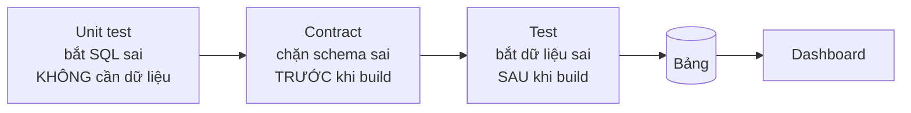

# Data Quality

**Khái niệm, không phải công cụ.** Ba tầng và sáu chiều dưới đây đúng với dbt, Great
Expectations, Soda, hay SQL viết tay — chỉ khác cú pháp.

## Ba tầng bảo vệ

Thứ tự thời gian quyết định giá trị của từng tầng:

| Tầng | Bắt cái gì | Chạy lúc nào | Bảng hỏng có ra đời không |
|---|---|---|---|
| **Unit test** | Logic biến đổi sai | Trước, không cần dữ liệu thật | Không |
| **Contract** | Schema sai kiểu / thiếu cột | Trước khi build | Không |
| **Test** | Dữ liệu sai | Sau khi build | **Có** — và dashboard có thể đã đọc nó |

Ba thứ khác nhau, đừng gọi chung là "test". Một model tính **sai công thức** vẫn pass hết
`unique`/`not_null` — dữ liệu hợp lệ, kết quả sai. Chỉ unit test bắt được ca đó.

## Nội dung

| Tài liệu | Trả lời câu hỏi | Trạng thái |
|---|---|---|
| [Sáu chiều chất lượng](six-dimensions.md) | Đang bỏ sót chiều nào | 📝 review |

## Triển khai

| Muốn | Xem |
|---|---|
| Làm bằng dbt | [dbt: testing](../etl/dbt/testing.md) |
| Kiểm độ tươi của nguồn | [dbt: sources, seeds, snapshots](../etl/dbt/sources-seeds-snapshots.md) |
| Hiểu vì sao test fail dù dữ liệu đúng | [Grain](../data-modeling/foundations/grain.md) |

## Related Topics

- [Data Modeling](../data-modeling/index.md) — thiết kế đúng thì cần ít test hơn
- [Grain](../data-modeling/foundations/grain.md) — bước 0 của mọi test
