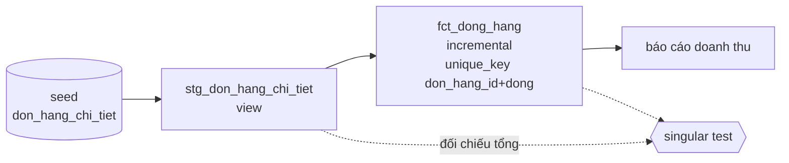
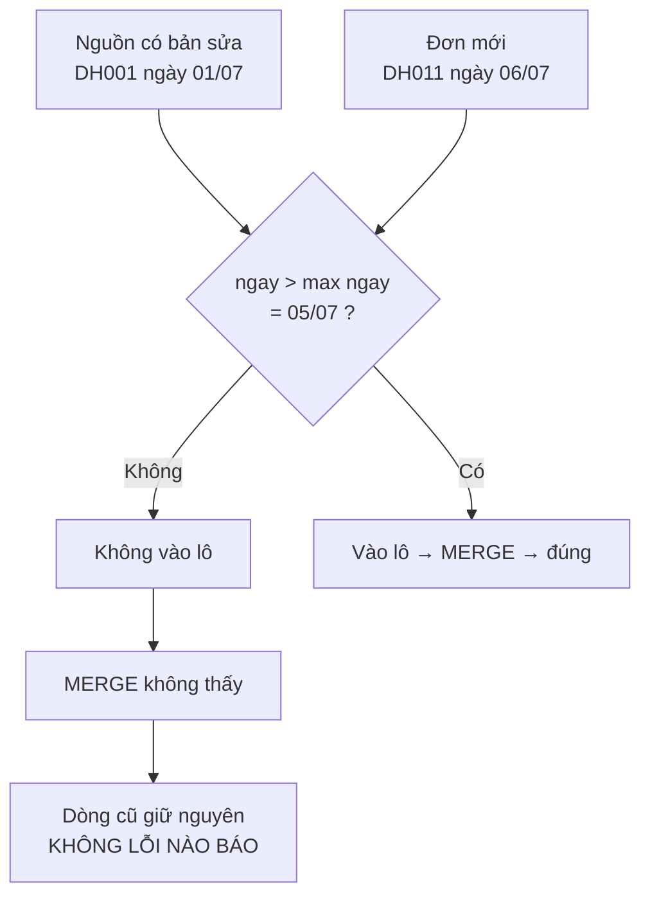

# E-commerce — incremental đánh rơi đơn sửa muộn

> **Chốt:** khi bảng incremental lệch số mà số **dòng** vẫn khớp nguồn, nghi bộ lọc
> trước, nghi join sau. Bộ lọc `ngay > max(ngay)` nhìn **ngày nghiệp vụ** — mọi bản sửa
> của dòng cũ đều nằm dưới mốc và không bao giờ lọt vào lô.

> **Về tính xác thực.** Bối cảnh doanh nghiệp dưới đây là dựng lại cho dễ kể. **Toàn bộ
> code, output và con số là thật**, chạy trên lab `~/Documents/learn-lab/dbt`
> (dbt-core 1.12.0 + dbt-duckdb 1.10.1) — kể cả lỗi. `verified_at` vẫn trống vì chủ repo
> chưa tự chạy lại.

## Bối cảnh

Một sàn thương mại điện tử. Bảng dòng hàng (`don_hang_chi_tiet`) là bảng lớn nhất — build
lại toàn bộ mỗi đêm mất quá lâu, nên nó được chuyển sang `incremental`.

Quy trình nghiệp vụ có một chi tiết mà đội dữ liệu không để ý: **chăm sóc khách hàng
được phép sửa số lượng của đơn đã đặt** trong vòng vài ngày (khách gọi lên đổi số lượng,
kho báo thiếu hàng, ghi nhầm lúc nhập). Bản sửa ghi đè dòng cũ ở hệ nguồn và **giữ
nguyên ngày đặt**.

## Triệu chứng

Kế toán báo doanh thu tháng lệch so với hệ ERP. Không nhiều — dưới 1%. Đội dữ liệu kiểm:

| Thứ đã kiểm | Kết quả |
|---|---|
| `dbt run` | xanh |
| `dbt test` — `unique`, `not_null`, `relationships` | tất cả pass |
| Số dòng `fct_dong_hang` so với `stg_don_hang_chi_tiet` | **khớp** |
| Doanh thu tổng | **lệch** |

Đây là kiểu triệu chứng tệ nhất: mọi thứ tự động đều xanh.

## Giả thuyết sai lúc đầu

**Giả thuyết 1: join làm mất dòng.** Hợp lý — `inner join` đánh rơi dòng là lỗi phổ
biến nhất khi số lệch. Nhưng nếu join mất dòng thì **số dòng phải lệch**, mà nó khớp.
Loại.

**Giả thuyết 2: lỗi làm tròn/kiểu dữ liệu.** Cũng hợp lý với mức lệch dưới 1%. Nhưng
kiểm `describe` thì mọi cột tiền đều là số nguyên, không có phép chia nào. Loại.

**Giả thuyết 3: có đơn bị đếm hai lần ở đâu đó.** Ngược dấu — nếu nhân đôi thì doanh
thu phải **cao hơn**, mà nó thấp hơn. Loại.

Bước ngoặt là khi ai đó hỏi: *"số dòng khớp, vậy có chắc từng dòng cũng khớp không?"*

## Dựng lại — tối thiểu để thấy lỗi

### Kiến trúc



### Model có lỗi

```sql
-- models/marts/fct_dong_hang.sql
{{ config(materialized='incremental', unique_key=['don_hang_id', 'dong']) }}

select don_hang_id, dong, ma_hang, so_luong, don_gia, thanh_tien, ngay
from {{ ref('stg_don_hang_chi_tiet') }}


where ngay > (select coalesce(max(ngay), date '1900-01-01') from {{ this }})

```

Nhìn qua thì đúng sách: có `is_incremental()`, có `unique_key`, có `coalesce` phòng lần
chạy đầu.

### Tái hiện

Sau khi bảng đã có 15 dòng (doanh thu 10.215.000), thêm vào nguồn hai dòng — đúng hai
việc xảy ra hằng ngày ở sàn:

```text
DH011,1,SP-C,1,900000,2026-07-06
DH001,1,SP-A,4,150000,2026-07-01
```

Dòng đầu là **đơn mới**. Dòng sau là **bản sửa muộn** của một đơn cũ — `so_luong` đổi từ
2 thành 4, còn ngày giữ nguyên 01/07.

```bash
dbt seed -s don_hang_chi_tiet --profiles-dir .
dbt run  -s fct_dong_hang     --profiles-dir .
```

```text
02:39:11  1 of 1 OK loaded seed file main.don_hang_chi_tiet .............................. [INSERT 16 in 0.06s]
02:39:14  1 of 1 OK created sql incremental model main_marts.fct_dong_hang ............... [OK in 0.11s]
```

Không lỗi, không cảnh báo. Nhưng:

```text
┌───────────────────┬─────────┬───────────┐
│       bang        │ so_dong │ doanh_thu │
├───────────────────┼─────────┼───────────┤
│ fct (incremental) │      16 │  11115000 │
│ stg (nguon that)  │      16 │  11415000 │
└───────────────────┴─────────┴───────────┘
```

**16 = 16. Nhưng 11.115.000 ≠ 11.415.000.**

Nhìn thẳng vào dòng bị nghi:

```text
┌─────────────┬───────┬─────────┬──────────┬─────────┬────────────┬────────────┐
│ don_hang_id │ dong  │ ma_hang │ so_luong │ don_gia │ thanh_tien │    ngay    │
├─────────────┼───────┼─────────┼──────────┼─────────┼────────────┼────────────┤
│ DH001       │     1 │ SP-A    │        2 │  150000 │     300000 │ 2026-07-01 │
└─────────────┴───────┴─────────┴──────────┴─────────┴────────────┴────────────┘
```

`so_luong` vẫn là **2**, trong khi nguồn đã là **4**. Lệch đúng `2 × 150.000 = 300.000`.

## Nguyên nhân gốc

Bộ lọc hỏi *"dòng nào có ngày lớn hơn ngày lớn nhất tôi đang có?"*. Bản sửa của `DH001`
mang ngày **01/07**, thấp hơn mốc **05/07** → không nằm trong lô được đọc → câu `MERGE`
không bao giờ nhìn thấy nó → dòng cũ nằm yên.

`unique_key` hoạt động đúng như thiết kế. Vấn đề là nó chỉ merge được **những gì lọt
vào lô**, và lô được chọn bằng ngày nghiệp vụ chứ không phải thời điểm bản ghi thay đổi.



## Cách sửa

### 1. Cửa sổ nhìn lại

```sql

-- Cửa sổ nhìn lại 7 ngày: bắt cả dòng sửa muộn, không chỉ dòng mới.
where ngay >= (select coalesce(max(ngay), date '1900-01-01') - interval 7 day from {{ this }})

```

```text
┌───────────────────┬─────────┬───────────┐
│       bang        │ so_dong │ doanh_thu │
├───────────────────┼─────────┼───────────┤
│ fct (lookback 7d) │      16 │  11415000 │
│ stg (nguon that)  │      16 │  11415000 │
└───────────────────┴─────────┴───────────┘
```

Khớp. Cửa sổ chỉ an toàn **vì có `unique_key`** — nạp lại 7 ngày biến thành merge, không
thành chèn trùng.

Độ rộng cửa sổ chọn bằng dữ liệu, không bằng cảm giác:

```sql
select date_diff('day', ngay, _cap_nhat_luc) as tre_ngay, count(*)
from nguon group by 1 order by 1 desc limit 20;
```

Lấy phân vị 99 rồi cộng biên. Phần đuôi dài hơn cửa sổ chính là lý do vẫn cần
`--full-refresh` định kỳ.

### 2. Lọc theo thời điểm **bản ghi đổi**, nếu nguồn có

Cửa sổ nhìn lại là cách chữa triệu chứng. Cách chữa gốc là lọc bằng đúng thứ phản ánh
"bản ghi này vừa đổi":

```sql

where _cap_nhat_luc > (select coalesce(max(_cap_nhat_luc), timestamp '1900-01-01') from {{ this }})

```

Điều kiện để dùng được: nguồn phải có cột `updated_at`/`_cap_nhat_luc` **đáng tin** — hệ
nguồn thật sự đụng vào nó ở mọi lần sửa. Nhiều hệ ERP thì không, và đó là lúc quay về
cửa sổ nhìn lại.

### 3. Test bắt được loại lỗi này

Không test tiêu chuẩn nào bắt được. Phải viết riêng:

```sql
-- tests/tong_fct_khop_staging.sql
with a as (select sum(thanh_tien) t from {{ ref('fct_dong_hang') }}),
     b as (select sum(thanh_tien) t from {{ ref('stg_don_hang_chi_tiet') }})
select a.t as fct, b.t as staging from a, b where a.t <> b.t
```

Test này quét toàn bảng nên đắt — gắn `tags: ['hang_ngay']`, chạy ở job đêm, đừng nhét
vào CI mỗi PR.

## Kết quả

| | Trước | Sau |
|---|---|---|
| Số dòng | 16 (khớp) | 16 (khớp) |
| Doanh thu | 11.115.000 | **11.415.000** (khớp nguồn) |
| Test bắt được lỗi | không có | singular test đối chiếu tổng |
| Thứ phải chấp nhận | — | mỗi lần chạy đọc lại 7 ngày dữ liệu |

## Bài học

1. **Số dòng khớp không chứng minh dữ liệu đúng.** Phải đối chiếu tổng của **số đo**.
   Đây là câu đáng viết lên tường.
2. **`unique_key` không cứu được bộ lọc sai.** Nó chỉ merge những gì đã lọt vào lô.
3. **Bộ lọc incremental phải hỏi đúng câu.** Câu đúng là *"bản ghi nào vừa đổi"*, không
   phải *"sự kiện nào vừa xảy ra"*. Hai câu này trùng nhau chỉ khi nguồn không bao giờ
   sửa lùi — và giả định đó gần như luôn sai.
4. **Bật incremental là nhận thêm nghĩa vụ.** Bốn câu hỏi bắt buộc trước khi bật, xem
   [Viết incremental model](../skills/viet-incremental-model.md).
5. **Test tiêu chuẩn kiểm dòng đang có, không kiểm dòng đáng lẽ phải có.** Khoảng trống
   đó phải lấp bằng test đối chiếu.

## Related Topics

- [Viết incremental model](../skills/viet-incremental-model.md) — cách làm đúng ngay từ đầu
- [Materialization](../reference/materializations.md) — khi nào KHÔNG nên incremental
- [Late arriving](../../../data-modeling/skills/late-arriving.md) — vấn đề này ở tầng mô hình
- [Bài tập trung bình](../tutorials/bt-02-trung-binh.md) — bài T1 dựng lại nguyên ca này
