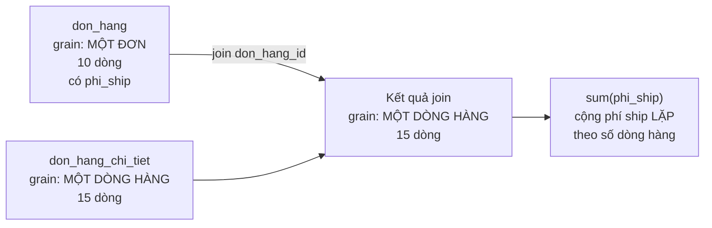

# Marketplace — phí ship cộng lặp sau join

> **Chốt:** `join` bảng đơn với bảng dòng hàng làm **phồng grain**. Mọi `sum()` trên cột
> thuộc bảng đơn — phí ship, giảm giá, thuế ở cấp đơn — sau đó đều cộng lặp theo số dòng
> hàng. SQL đúng cú pháp, dbt chạy xanh, số sai.

> **Về tính xác thực.** Bối cảnh là dựng lại; **output và con số là thật**, chạy trên lab
> `~/Documents/learn-lab/dbt` (dbt-core 1.12.0 + dbt-duckdb 1.10.1). `verified_at` trống
> vì chủ repo chưa chạy lại.

## Bối cảnh

Một marketplace. Người quản lý muốn một bảng "doanh thu theo ngày" duy nhất, gồm cả
doanh thu hàng hoá lẫn phí vận chuyển, để khỏi phải mở hai dashboard.

Đội dữ liệu khi đó chưa chia tầng — mỗi yêu cầu là một model, model tự đọc thẳng từ
`source()` và làm hết mọi việc.

## Model ban đầu

```sql
-- models/marts/doanh_thu.sql  ← một model làm hết
select
    cast(d.ngay_dat as date) as ngay,
    k.khu_vuc,
    sum(cast(ct.so_luong as bigint) * cast(ct.don_gia as bigint)) as doanh_thu
from {{ source('raw', 'don_hang') }} d
join {{ source('raw', 'don_hang_chi_tiet') }} ct on d.don_hang_id = ct.don_hang_id
join {{ source('raw', 'khach_hang') }} k on d.khach_id = k.khach_id
group by 1, 2
```

Yêu cầu mới đến: *"cho phí ship vào luôn"*. Sửa một dòng:

```sql
    sum(ct.thanh_tien) + sum(d.phi_ship) as doanh_thu   -- phí ship bị cộng đôi
```

`dbt run` xanh. Dashboard lên số. Không ai đối chiếu.

## Triệu chứng

Ba tuần sau, kế toán báo doanh thu trên dashboard **cao hơn** sổ sách khoảng 7%. Không
phải một ngày cá biệt — mọi ngày đều cao hơn, tỷ lệ khác nhau.

## Giả thuyết sai lúc đầu

**Giả thuyết 1: đơn huỷ vẫn được tính.** Hợp lý nhất — lọc trạng thái là thứ hay quên.
Kiểm: thêm `where trang_thai <> 'huy'` thì số **giảm**, nhưng vẫn cao hơn sổ sách, và
mức lệch không đổi theo tỷ lệ đơn huỷ. Không phải nguyên nhân chính.

**Giả thuyết 2: trùng đơn ở nguồn.** Kiểm `count(*)` với `count(distinct don_hang_id)`
trên bảng đơn — bằng nhau. Loại.

**Giả thuyết 3: sai múi giờ làm đơn rơi nhầm ngày.** Điều đó làm **lệch giữa các ngày**,
không làm **tổng** phồng. Loại.

Bước ngoặt là khi có người hỏi câu cơ bản nhất: *"một dòng của bảng sau khi join là
gì?"*

## Nguyên nhân gốc



Đơn `DH001` có 2 dòng hàng → sau join, `phi_ship = 60.000` của nó xuất hiện **2 lần**.
Đơn có 1 dòng thì đúng, đơn có 3 dòng thì gấp ba. Đó là lý do tỷ lệ lệch khác nhau theo
ngày: nó phụ thuộc số dòng hàng trung bình mỗi đơn của ngày đó.

Cột `phi_ship` thuộc **grain đơn**; sau join bảng đã ở **grain dòng hàng**. Gộp một cột
ở grain thô trên bảng đã bị làm mịn là phép tính vô nghĩa — và SQL không có cách nào
biết điều đó.

## Đo lỗi

Viết singular test đối chiếu mart với staging:

```sql
-- tests/tong_mart_khop_staging.sql
with a as (select sum(doanh_thu)  t from {{ ref('mart_doanh_thu_ngay') }}),
     b as (select sum(thanh_tien) t from {{ ref('stg_don_hang_chi_tiet') }})
select a.t as mart, b.t as staging
from a, b
where a.t <> b.t
```

```bash
dbt build -s mart_doanh_thu_ngay --profiles-dir . --store-failures
```

```text
02:41:13  4 of 5 FAIL 1 tong_mart_khop_staging ........................................... [FAIL 1 in 0.09s]
02:41:13  [ERROR]: in test tong_mart_khop_staging (tests/tong_mart_khop_staging.sql)
02:41:13    Got 1 result, configured to fail if != 0
02:41:13  Done. PASS=4 WARN=0 ERROR=1 SKIP=0 NO-OP=0 REUSED=0 TOTAL=5
```

`--store-failures` ghi dòng sai vào `main_dbt_test__audit`:

```text
┌──────────┬──────────┐
│   mart   │ staging  │
├──────────┼──────────┤
│ 10925000 │ 10215000 │
└──────────┴──────────┘
```

Lệch **710.000** trên 10.215.000 — **7,0%**. Đúng bằng tổng phí ship bị cộng thừa.

## Cách sửa

### 1. Tách tầng — mỗi model một câu hỏi

```sql
-- models/staging/stg_don_hang.sql          (grain: một đơn)
select don_hang_id, khach_id,
       cast(ngay_dat as date) as ngay_dat,
       trang_thai,
       cast(phi_ship as bigint) as phi_ship
from {{ ref('don_hang') }}
```

```sql
-- models/staging/stg_don_hang_chi_tiet.sql (grain: một dòng hàng)
select don_hang_id, dong, ma_hang,
       cast(so_luong as bigint) as so_luong,
       cast(don_gia  as bigint) as don_gia,
       cast(so_luong as bigint) * cast(don_gia as bigint) as thanh_tien
from {{ ref('don_hang_chi_tiet') }}
```

### 2. Gộp về cùng grain **trước** khi join

```sql
-- models/marts/mart_doanh_thu_ngay.sql
{{ config(materialized='table') }}

with hang_theo_don as (          -- hạ bảng chi tiết về grain ĐƠN trước
    select don_hang_id, sum(thanh_tien) as tien_hang
    from {{ ref('stg_don_hang_chi_tiet') }}
    group by 1
)
select
    dh.ngay_dat              as ngay,
    count(*)                 as so_don,
    sum(h.tien_hang)         as doanh_thu_hang,
    sum(dh.phi_ship)         as phi_ship,        -- giờ mới đúng: 1 đơn 1 dòng
    sum(h.tien_hang) + sum(dh.phi_ship) as tong_thu
from {{ ref('stg_don_hang') }} dh
join hang_theo_don h using (don_hang_id)
group by 1
```

Mẫu này — **gộp bảng mịn về grain thô trước khi join** — là cách chữa chung cho mọi ca
fan-out, không riêng phí ship.

Bản chỉ tính doanh thu hàng hoá, giữ đúng kết quả gốc:

```text
┌────────────┬────────┬───────────┐
│    ngay    │ so_don │ doanh_thu │
├────────────┼────────┼───────────┤
│ 2026-07-01 │      2 │   1350000 │
│ 2026-07-02 │      2 │   3150000 │
│ 2026-07-03 │      2 │   4200000 │
│ 2026-07-04 │      2 │   1095000 │
│ 2026-07-05 │      2 │    420000 │
└────────────┴────────┴───────────┘
```

Tổng 10.215.000 — khớp staging, test xanh.

### 3. Đặt cái chắn để không tái diễn

```yaml
models:
  - name: mart_doanh_thu_ngay
    description: "Doanh thu và số đơn theo ngày đặt. Grain: một dòng một ngày."
    columns:
      - name: ngay
        tests: [unique, not_null]
      - name: doanh_thu
        description: "Tổng thành tiền của các dòng hàng trong ngày, CHƯA gồm phí ship."
        tests: [khong_am]
```

Ba lớp chắn, mỗi lớp bắt một thứ khác nhau:

| Lớp | Bắt được |
|---|---|
| `unique` trên `ngay` | grain của mart bị vỡ |
| Singular test đối chiếu tổng | mọi sai lệch tổng, kể cả fan-out |
| `description` ghi **CHƯA gồm phí ship** | người dùng sau không cộng nhầm lần nữa |

Chữ "CHƯA gồm phí ship" trong description là thứ **chỉ con người viết được** — không
công cụ lineage nào suy ra được nó, và nó chính là thông tin đã thiếu ngay từ đầu.

## Kết quả

| | Trước | Sau |
|---|---|---|
| Doanh thu ngày (tổng) | 10.925.000 | **10.215.000** |
| Sai số so với sổ sách | +7,0% | 0 |
| Model đọc thẳng `source()` ở marts | có | không — qua staging |
| Test đối chiếu tổng | không có | có, chạy ở job đêm |
| `description` nói rõ phạm vi số đo | không | có |

## Bài học

1. **Sau mỗi `join`, hỏi lại: một dòng bây giờ là gì?** Grain đổi thì mọi `sum()` phía
   sau phải xét lại. Đây là câu hỏi rẻ nhất và bị bỏ qua nhiều nhất.
2. **Gộp về cùng grain trước khi join.** Mẫu `with ... group by` rồi mới join là cách
   chữa chung cho fan-out.
3. **Cột ở grain thô không được `sum()` sau khi bảng đã mịn.** Phí ship, giảm giá cấp
   đơn, thuế cấp hoá đơn — cùng một bẫy.
4. **Một model làm hết mọi việc thì không có chỗ nào để gắn test.** Chia tầng không phải
   quy ước thẩm mỹ; nó tạo ra các điểm kiểm chứng được.
5. **Test `unique`/`not_null` không bắt được lỗi này.** Chỉ test đối chiếu tổng mới bắt
   được — và nó phải được viết *trước* khi có sự cố.
6. **Tỷ lệ lệch thay đổi theo ngày là dấu hiệu của fan-out**, không phải của lỗi lọc.
   Lỗi lọc cho lệch theo một tỷ lệ ổn định hơn.

## Related Topics

- [Tổ chức layer và quy ước đặt tên](../reference/layer-va-dat-ten.md) — vì sao marts không gọi `source()`
- [Grain](../../../data-modeling/reference/grain.md) — câu hỏi gốc của cả ca này
- [Join hai fact làm phồng tổng](../../../data-modeling/case-studies/join-hai-fact-lam-phong-tong.md) — cùng bẫy ở tầng mô hình
- [Triển khai test trong dbt](../skills/implementing-tests.md) — singular test và `--store-failures`
- [Bài tập trung bình](../tutorials/bt-02-trung-binh.md) — bài T2 dựng lại nguyên ca này
