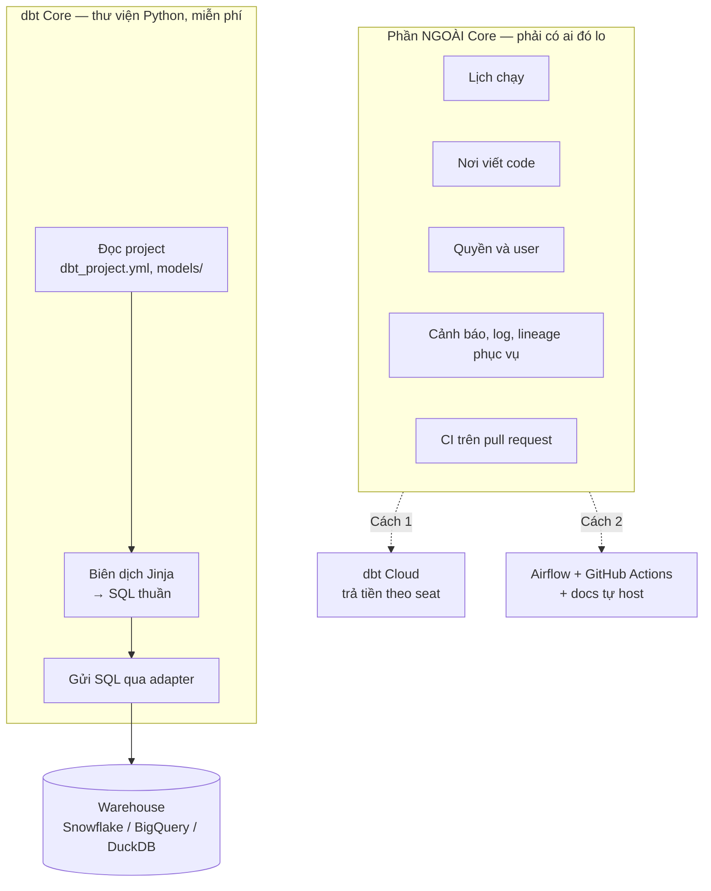
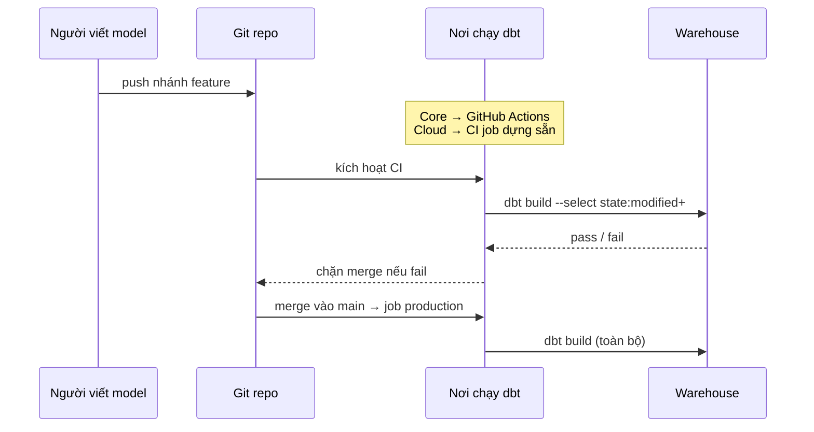

# dbt Core và dbt Cloud

> **Chốt:** hai bản dùng **cùng một engine biên dịch**. Model viết cho Core chạy
> nguyên trạng trên Cloud và ngược lại. Cloud không bán khả năng transform — nó bán
> **scheduler, IDE trên trình duyệt, quản lý quyền, và metadata API**. Nếu bạn đã có
> Airflow và CI, phần lớn thứ Cloud bán là thứ bạn đang có rồi.

## Mục tiêu

Trả lời được câu hỏi trong buổi phỏng vấn *"team các bạn dùng dbt Cloud hay Core, vì
sao"* mà không rơi vào hai cái bẫy: tưởng Cloud "mạnh hơn", hoặc tưởng Core "chuyên
nghiệp hơn".

## Tổng quan

dbt Core là một **thư viện Python** cài bằng `pip`. Nó đọc project, biên dịch Jinja
thành SQL, gửi SQL cho warehouse. Hết. Không có lịch chạy, không có giao diện, không
có khái niệm "user".

Mọi thứ còn lại — ai bấm chạy, chạy lúc nào, ai được sửa model nào, ai xem được
lineage — đều **nằm ngoài Core**. dbt Cloud là một trong các cách lấp phần ngoài đó;
Airflow + GitHub Actions + `dbt docs` tự host là cách khác.

```bash
# Core: chỉ là một lệnh trong terminal
pip install dbt-core dbt-duckdb
dbt run
```

## Vì sao cần biết ranh giới

Câu hỏi thật khi chọn không phải "bản nào tốt hơn" mà là **"đội tôi thiếu mảnh nào"**.

Đội 2 người, đã có Airflow chạy sẵn cho ingest → thiếu gần như không mảnh nào, thêm
một task `BashOperator` gọi `dbt build` là xong. Đội 20 người, một nửa là analyst
không quen git → thiếu đúng mảnh IDE + quyền, và đó là mảnh đắt nhất tự làm.

Chọn sai theo hướng "mua cho chắc" thì trả tiền cho thứ không dùng. Chọn sai theo
hướng "tự làm cho chủ động" thì sáu tháng sau có một scheduler tự chế không ai dám
sửa.

## Kiến trúc



Điểm mấu chốt: **hộp `CORE` giống hệt nhau ở cả hai cách.** Không có tính năng
transform nào chỉ Cloud mới có.

## Thành phần — cái gì thuộc về ai

| Mảnh | dbt Core | dbt Cloud |
|---|---|---|
| Biên dịch Jinja → SQL | ✅ | ✅ cùng engine |
| `ref()`, DAG, materialization | ✅ | ✅ |
| Test, snapshot, seed | ✅ | ✅ |
| Package (`dbt_utils`…) | ✅ | ✅ |
| `dbt docs generate` | ✅ sinh file tĩnh, tự đem đi host | ✅ có sẵn chỗ xem |
| **Lịch chạy (scheduler)** | ❌ tự lo — cron/Airflow/Dagster | ✅ |
| **IDE trên trình duyệt** | ❌ dùng editor máy mình | ✅ |
| **User, role, quyền theo môi trường** | ❌ | ✅ |
| **CI chạy trên PR** | ❌ tự dựng GitHub Actions | ✅ có sẵn, kèm `state:modified` |
| **Metadata / Discovery API** | ❌ chỉ có `manifest.json` tại chỗ | ✅ API truy vấn được |
| **Semantic Layer** | một phần (`dbt-metricflow` cài riêng) | ✅ kèm API phục vụ BI |
| Giá | 0 | theo **seat developer** + mức usage |

## Luồng hoạt động — cùng một `dbt build`, khác chỗ bấm



Sơ đồ giống hệt nhau cho hai bản. Chỉ hộp `Run` là khác.

## Khi nào nên dùng Cloud

- Phần lớn người viết model là **analyst không quen git/terminal** — mảnh IDE này tự
  làm rất đắt.
- **Chưa có orchestrator nào** và không muốn dựng Airflow chỉ để chạy dbt.
- Cần **quản lý quyền theo môi trường** (ai được chạy vào prod) mà không muốn tự dựng.
- Cần Semantic Layer phục vụ BI qua API.

## Khi nào KHÔNG nên dùng Cloud

- **Đã có Airflow/Dagster** chạy ổn định — thêm một task gọi dbt là vài chục dòng.
- Đội toàn engineer, quen git và CI — mảnh đắt nhất của Cloud thành thừa.
- Dữ liệu/kết nối **không được ra khỏi mạng nội bộ** và không muốn dựng đường riêng.
- Chi phí theo seat vượt quá thứ đang mua: 15 developer seat để chạy 4 job một ngày
  là trả tiền cho IDE chứ không phải cho scheduler.

## Trade-offs

| Trục | Core | Cloud |
|---|---|---|
| Chi phí tiền mặt | 0 | theo seat, tăng theo số người viết model |
| Chi phí người | cao — phải có người trực scheduler và CI | thấp |
| Kiểm soát | toàn bộ; muốn nhét gì vào giữa cũng được | trong khuôn Cloud cho phép |
| Rủi ro khoá nhà cung cấp | thấp — project là file trong git | trung bình; **project vẫn portable**, thứ khoá là job/quyền/metadata |
| Lên phiên bản dbt | tự chọn, tự chịu | Cloud đẩy theo track của họ |
| Thời gian từ 0 tới job chạy hằng ngày | ngày–tuần | giờ |

Cột "rủi ro khoá" là chỗ dễ nói quá. **Model, test, macro đều là file `.sql`/`.yml`
trong git** — rời Cloud không mất chúng. Thứ mất là lịch chạy, lịch sử run, và các
API metadata dựng trên đó.

## Ví dụ — thay thế "scheduler của Cloud" bằng 12 dòng

Với Core, mảnh scheduler trong nhiều đội chỉ là chừng này:

```yaml
# .github/workflows/dbt-prod.yml — chạy 6h sáng mỗi ngày
name: dbt production
on:
  schedule: [{cron: '0 23 * * *'}]   # 23:00 UTC = 06:00 GMT+7
jobs:
  build:
    runs-on: ubuntu-latest
    steps:
      - uses: actions/checkout@v4
      - run: pip install dbt-core dbt-snowflake
      - run: dbt deps && dbt build --target prod
        env:
          DBT_SNOWFLAKE_PASSWORD: ${{ secrets.DBT_SNOWFLAKE_PASSWORD }}
```

Thứ 12 dòng này **không** cho bạn: giao diện xem lịch sử run, cảnh báo đẹp, phân quyền
theo môi trường, retry từ node hỏng. Đó đúng là thứ Cloud bán. Nếu bốn thứ đó không
phải vấn đề của đội bạn thì 12 dòng là đủ.

## Common Mistakes

| Sai lầm | Vì sao sai |
|---|---|
| "Cloud chạy nhanh hơn" | Cả hai đều đẩy SQL xuống warehouse. Tốc độ là chuyện của warehouse, không phải của dbt |
| "Core không có CI" | Core không *đi kèm* CI. CI vẫn dựng được bằng GitHub Actions + `state:modified` |
| "Chọn Core thì sau này không chuyển sang Cloud được" | Chuyển là trỏ Cloud vào đúng repo đó. Ngược lại cũng vậy |
| Mua seat cho cả người chỉ **đọc** báo cáo | Seat developer là cho người **viết** model; người đọc dashboard không cần |
| Dùng Cloud IDE rồi bỏ luôn git discipline | Cloud vẫn là git ở dưới. Bỏ review PR thì mất cái chắn duy nhất |

## FAQ

<details>
<summary>Phỏng vấn hỏi "team dùng bản nào" thì trả lời thế nào cho chắc?</summary>

Trả lời theo **mảnh thiếu**, không theo tên sản phẩm: "Đội tôi đã có Airflow cho
ingest nên dùng Core, gắn dbt thành một task và CI bằng GitHub Actions với
`state:modified+`. Nếu phần lớn người viết model là analyst không quen git thì tôi sẽ
cân nhắc Cloud vì mảnh IDE và phân quyền tự làm rất đắt."

Câu này cho thấy bạn biết ranh giới engine/vỏ — đó là thứ người hỏi muốn nghe.

</details>

<details>
<summary>dbt Fusion / dbt-mcp có đổi câu trả lời này không?</summary>

Không đổi **ranh giới**: engine vẫn biên dịch Jinja rồi đẩy SQL xuống warehouse, phần
vỏ vẫn là scheduler/IDE/quyền. Chi tiết sản phẩm đổi theo từng quý — **kiểm bằng
`dbt --version` và trang pricing tại thời điểm quyết định**, đừng tin con số trong ghi
chú cũ. Đây đúng là loại chi tiết môi trường mà kho này cấm bịa; xem
[case study](../case-studies/ai-sinh-sai-ten-catalog-trino.md).

</details>

<details>
<summary>Chạy Core thì lineage xem ở đâu?</summary>

`dbt docs generate` sinh `target/index.html` + `manifest.json` + `catalog.json`. Đem
thư mục `target/` host tĩnh ở đâu cũng được (S3, GitHub Pages, nginx). Xem
[dbt docs và lineage](docs-and-lineage.md).

</details>

## Related Topics

- [Cấu trúc một dbt project](project-structure.md) — thứ giống nhau ở cả hai bản
- [dbt docs và lineage](docs-and-lineage.md) — tự host phần metadata
- [CI/CD cho dbt project](../skills/ci-cd-cho-dbt.md) — dựng mảnh CI bằng Core
- [dbt là gì](what-is-dbt.md) — engine mà cả hai bản dùng chung
