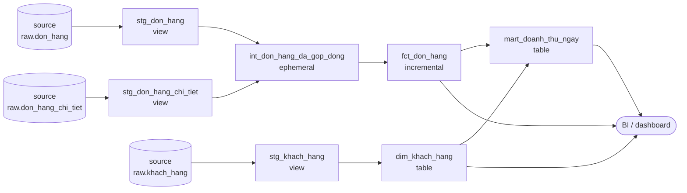

# Tổ chức layer và quy ước đặt tên

> **Chốt:** ba tầng `staging → intermediate → marts` tồn tại để mỗi model chỉ phải trả
> lời **một** câu hỏi. Tầng staging trả lời *"cột này tên gì, kiểu gì"*, tầng marts trả
> lời *"số này nghĩa là gì"*. Trộn hai câu hỏi vào một model là lý do sáu tháng sau
> không ai dám sửa nó.

## Mục tiêu

Biết một model mới nên nằm ở tầng nào, tên là gì, và **kiểm chứng được** là nó không
vi phạm luật của tầng đó — chứ không phải "đặt cho giống người ta".

## Tổng quan

| Tầng | Tiền tố | Một model tương ứng với | Materialization mặc định | Người dùng cuối đọc? |
|---|---|---|---|---|
| staging | `stg_` | **đúng một** bảng nguồn | `view` | Không |
| intermediate | `int_` | một bước biến đổi có tên | `ephemeral` / `view` | Không |
| marts | `fct_` / `dim_` | một quy trình nghiệp vụ / một thực thể | `table` / `incremental` | **Có** |

Ba luật đi kèm, mỗi luật hỏng theo một kiểu riêng:

1. **Staging không join.** Một nguồn một model. Vi phạm → không còn chỗ nào trong repo
   nói "bảng nguồn này trông như thế nào", và mọi model sau phải tự đoán.
2. **Marts không `source()` trực tiếp.** Luôn đi qua staging. Vi phạm → đổi tên cột ở
   nguồn phải sửa 12 chỗ thay vì 1.
3. **Intermediate không ai đọc trực tiếp.** Nó là chỗ để tên một bước, không phải sản
   phẩm. Vi phạm → dashboard trỏ vào `int_`, và từ đó không refactor được nữa.

## Vì sao cần

Không chia tầng thì mọi model đều thành model "làm hết mọi thứ": vừa ép kiểu, vừa
join, vừa gộp, vừa tính chỉ số. Hậu quả cụ thể:

- **Không tái dùng được.** Model B cần đúng phần ép kiểu của model A nhưng không cần
  phần gộp → copy-paste. Sau đó hai bản lệch nhau.
- **Test không biết gắn vào đâu.** `unique` trên khoá nguồn phải test ở đâu khi không
  có model nào đại diện cho nguồn?
- **Đổi nguồn là đổi khắp nơi.** Nguồn đổi `customer_id` thành `cust_id` → sửa mọi
  model có nhắc tới, thay vì sửa một `stg_`.

Ba tầng là cách rẻ nhất để mỗi thay đổi chỉ chạm vào một chỗ.

## Kiến trúc



Hai thứ đọc ra được từ sơ đồ:

- **Mũi tên chỉ đi sang phải.** Marts không bao giờ trỏ ngược về `source`.
- **Chỉ hộp bên phải nối vào `BI`.** Không dashboard nào cắm thẳng vào `stg_` hay `int_`.

## Thành phần

### Tầng staging — `stg_<nguồn>_<bảng>.sql`

Được làm đúng bốn việc:

| Việc | Ví dụ |
|---|---|
| Đổi tên cột về quy ước chung | `cust_id` → `khach_id` |
| Ép kiểu | `cast(ngay_dat as date)` |
| Tính cột dẫn xuất **hiển nhiên** | `so_luong * don_gia as thanh_tien` |
| Lọc dòng rác kỹ thuật | `where _deleted = false` |

Không được làm: join, gộp (`group by`), áp luật nghiệp vụ.

```sql
-- models/staging/stg_don_hang.sql
with nguon as (
    select * from {{ ref('don_hang') }}
)
select
    don_hang_id,
    khach_id,
    cast(ngay_dat  as date) as ngay_dat,
    cast(ngay_giao as date) as ngay_giao,
    cast(ngay_nhan as date) as ngay_nhan,
    trang_thai,
    cast(phi_ship as bigint) as phi_ship
from nguon
```

CTE `nguon` ở đầu trông thừa nhưng có lý do: khi cần debug, comment một dòng là đổi
nguồn sang bảng mẫu, không phải sửa giữa câu `select`.

### Tầng intermediate — `int_<động từ mô tả bước>.sql`

Tên phải là **một câu mô tả bước**, không phải tên bảng: `int_don_hang_da_gop_dong`,
`int_khach_hang_da_gan_hang`. Đọc tên là biết bước đó làm gì.

Có mặt khi và chỉ khi: một bước biến đổi bị **hai model marts trở lên** dùng lại, hoặc
một model marts dài quá mức đọc nổi.

Mặc định `ephemeral` — dbt nhét nó thành CTE trong model sau, không tạo object nào
trong warehouse. Đúng tinh thần "không ai đọc trực tiếp".

### Tầng marts — `fct_` / `dim_` / `mart_`

| Tiền tố | Chứa gì | Grain |
|---|---|---|
| `dim_` | thuộc tính mô tả một thực thể | một dòng một thực thể (hoặc một *phiên bản*, nếu SCD2) |
| `fct_` | số đo của một sự kiện | một dòng một sự kiện |
| `mart_` | bảng đã gộp sẵn cho một báo cáo cụ thể | một dòng một tổ hợp chiều |

Ranh giới `fct_` với `mart_`: `fct_` giữ grain nguyên bản của sự kiện, `mart_` đã
`group by`. Gộp hai loại vào một tên là mất khả năng nói "bảng này còn chi tiết tới
đâu".

## Ví dụ — cùng một yêu cầu, hai cách tổ chức

Yêu cầu: *doanh thu theo ngày, kèm khu vực khách hàng*.

**Cách gộp một model** — chạy được, nhưng:

```sql
-- models/marts/doanh_thu.sql  ← một model làm hết
select
    cast(d.ngay_dat as date) as ngay,
    k.khu_vuc,
    sum(cast(ct.so_luong as bigint) * cast(ct.don_gia as bigint)) as doanh_thu
from {{ source('raw', 'don_hang') }} d
join {{ source('raw', 'don_hang_chi_tiet') }} ct on d.don_hang_id = ct.don_hang_id
join {{ source('raw', 'khach_hang') }} k on d.khach_id = k.khach_id
group by 1, 2
```

Hỏng ở đâu: nguồn đổi kiểu `ngay_dat` → sửa ở đây; model thứ hai cũng cần
`thanh_tien` → copy lại phép nhân; muốn test `unique` trên `don_hang_id` của nguồn →
không có chỗ gắn.

**Cách chia tầng** — cùng kết quả, mỗi chỗ một việc:

```sql
-- models/marts/mart_doanh_thu_ngay.sql
select
    dh.ngay_dat                    as ngay,
    count(distinct dh.don_hang_id) as so_don,
    sum(ct.thanh_tien)             as doanh_thu
from {{ ref('stg_don_hang') }} dh
join {{ ref('stg_don_hang_chi_tiet') }} ct using (don_hang_id)
group by 1
```

Phép nhân `so_luong * don_gia` nằm **một chỗ duy nhất** trong `stg_don_hang_chi_tiet`.
Chạy thật trên lab:

```text
02:37:53  1 of 3 OK created sql view model main_staging.stg_don_hang ..................... [OK in 0.07s]
02:37:53  2 of 3 OK created sql view model main_staging.stg_don_hang_chi_tiet ............ [OK in 0.07s]
02:37:53  3 of 3 OK created sql table model main_marts.mart_doanh_thu_ngay ............... [OK in 0.04s]
02:37:53  Done. PASS=3 WARN=0 ERROR=0 SKIP=0 NO-OP=0 REUSED=0 TOTAL=3
```

Kết quả:

```text
┌────────────┬────────┬───────────┐
│    ngay    │ so_don │ doanh_thu │
├────────────┼────────┼───────────┤
│ 2026-07-01 │      2 │   1350000 │
│ 2026-07-02 │      2 │   3150000 │
│ 2026-07-03 │      2 │   4200000 │
│ 2026-07-04 │      2 │   1095000 │
│ 2026-07-05 │      2 │    420000 │
└────────────┴────────┴───────────┘
```

Tổng 10.215.000 — khớp `sum(so_luong * don_gia)` của toàn bộ 15 dòng hàng.

## Khai tầng trong `dbt_project.yml`

Materialization mặc định khai một lần theo thư mục, không rải `config()` khắp file:

```yaml
models:
  dbt_lab:
    +materialized: view          # mặc định toàn project

    staging:
      +schema: staging           # DuckDB tạo schema main_staging

    intermediate:
      +schema: intermediate
      +materialized: ephemeral

    marts:
      +schema: marts
      +materialized: table
```

Trên DuckDB, `+schema: staging` cho ra schema thật tên **`main_staging`** — dbt ghép
`<schema mặc định>_<schema khai>`. Mỗi adapter ghép một kiểu; kiểm bằng output của
`dbt run` chứ đừng đoán.

## Trade-offs

| Chọn | Được | Mất |
|---|---|---|
| Ba tầng đầy đủ | mỗi thay đổi chạm một chỗ; test gắn đúng tầng | nhiều file hơn; DAG dài hơn |
| Bỏ tầng intermediate | ít file | model marts phình; logic lặp giữa các marts |
| Gộp staging vào marts | nhanh lúc đầu | mọi thứ ở mục *Vì sao cần* |
| `stg_` là `view` | luôn tươi, không tốn chỗ | mart đọc lại nguồn mỗi lần build |
| `stg_` là `table` | mart build nhanh hơn | thêm một bản sao dữ liệu, thêm một bước phải làm tươi |

Mặc định `view` cho staging là lựa chọn đúng cho tới khi **đo được** là nó chậm. Xem
[Materialization](materializations.md).

## Common Mistakes

| Sai lầm | Hậu quả | Dấu hiệu nhận ra |
|---|---|---|
| Join trong `stg_` | mất bảng đại diện cho nguồn | grep `join` trong `models/staging/` ra kết quả |
| Marts gọi thẳng `source()` | đổi nguồn phải sửa nhiều chỗ | grep `source(` ngoài `models/staging/` |
| Dashboard trỏ vào `int_` | không refactor được nữa | `int_` materialized thành `table`/`view` có người query |
| Tên `fct_` nhưng đã `group by` | không ai biết bảng còn chi tiết tới đâu | có `group by` trong file `fct_*.sql` |
| Đặt số thứ tự vào tên file (`01_stg_don_hang`) | dbt xếp theo DAG, không theo tên; số chỉ gây nhiễu | tên file có tiền tố số |
| Một `stg_` cho hai nguồn | luật 1 gãy | `stg_` có hai `ref()`/`source()` |

## Kiểm chứng bằng lệnh, không bằng mắt

Ba luật ở trên **grep được** — nên đưa thẳng vào CI:

```bash
# Luật 1 — staging khong join
grep -rn --include='*.sql' -iE '\bjoin\b' models/staging/ && echo 'VI PHAM luat 1'

# Luật 2 — chi staging duoc goi source()
grep -rn --include='*.sql' 'source(' models/ | grep -v '^models/staging/' && echo 'VI PHAM luat 2'

# Luật 3 — khong model nao ngoai intermediate duoc ref() vao int_ ngoai marts
grep -rn --include='*.sql' "ref('int_" models/staging/ && echo 'VI PHAM thu tu tang'
```

Luật không có thứ cưỡng chế thì sáu tháng nữa lại lệch — đúng lý do
[`ROUTING.md`](https://github.com/vuhoang001/knowledge/blob/main/ROUTING.md) của kho
này có linter.

## Related Topics

- [Model và `ref()`](models-and-ref.md) — thứ dựng nên các mũi tên trong sơ đồ
- [Materialization](materializations.md) — chọn gì cho từng tầng
- [Cấu trúc một dbt project](project-structure.md) — thư mục nào chứa gì
- [Fact và Dimension](../../../data-modeling/reference/fact-and-dimension.md) — `fct_`/`dim_` lấy nghĩa từ đây
- [Grain](../../../data-modeling/reference/grain.md) — thứ quyết định `fct_` hay `mart_`
