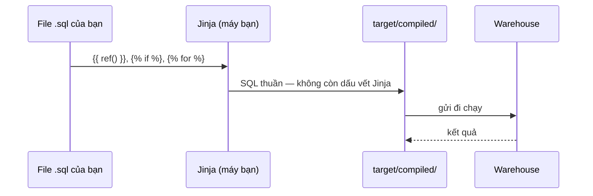

# Viết macro và dùng Jinja logic

> **Chốt:** Jinja là **máy sinh chữ**, chạy hết trên máy bạn trước khi có câu SQL nào
> được gửi đi. Warehouse không bao giờ nhìn thấy ``. Mọi nhầm lẫn về macro đều
> quy về việc quên thứ tự này.

## Mục tiêu học

Viết được macro có tham số, dùng được vòng lặp sinh cột, và **luôn kiểm bằng
`target/compiled/`** thay vì đoán — kể cả khi macro chỉ có ba dòng.

## Bước 0 — Thứ tự là tất cả



Hệ quả trực tiếp:

- Không debug macro bằng cách đọc file `.sql`. Đọc `target/compiled/`.
- Jinja **không biết dữ liệu**. Muốn Jinja biết, phải chạy một query lúc biên dịch
  (`run_query` / `dbt_utils.get_column_values`) — và điều đó làm chậm bước parse.
- `` không phải `case when`. Cái đầu chọn *chữ nào được viết ra*, cái sau chọn
  *giá trị nào được trả về*.

## Bước 1 — Macro đầu tiên

Macro nằm trong `macros/`, tên file không quan trọng, **tên macro thì toàn cục**.

```sql
-- macros/vnd.sql

round({{ cot }} / 1000000.0, 2)

```

Dùng:

```sql
select {{ vnd('sum(thanh_tien)') }} as doanh_thu_trieu
from {{ ref('stg_don_hang_chi_tiet') }}
```

Ngưỡng nên viết macro: **cùng một đoạn SQL xuất hiện lần thứ ba**. Lần thứ hai thì
copy còn rẻ hơn; từ lần thứ ba, chi phí sửa đồng loạt vượt chi phí thêm một tầng gián
tiếp.

## Bước 2 — Vòng lặp sinh cột

Bài toán: pivot doanh thu theo nhóm hàng, mà **danh sách nhóm không cố định**.

```sql
-- models/marts/mart_pivot_nhom.sql


select
    ct.ngay
    ,
    {{ vnd("sum(case when hh.nhom = '" ~ n ~ "' then ct.thanh_tien else 0 end)") }} as nhom_{{ loop.index }}
    
from {{ ref('stg_don_hang_chi_tiet') }} ct
join {{ ref('hang_hoa') }} hh using (ma_hang)
group by 1
order by 1
```

SQL biên dịch ra — đây là thứ warehouse nhận:

```sql
select
    ct.ngay,
    round(sum(case when hh.nhom = 'Thiết bị nhập' then ct.thanh_tien else 0 end) / 1000000.0, 2) as nhom_1,
    round(sum(case when hh.nhom = 'Màn hình' then ct.thanh_tien else 0 end) / 1000000.0, 2) as nhom_2,
    round(sum(case when hh.nhom = 'Máy tính' then ct.thanh_tien else 0 end) / 1000000.0, 2) as nhom_3
from "lab"."main_staging"."stg_don_hang_chi_tiet" ct
join "lab"."main"."hang_hoa" hh using (ma_hang)
group by 1
order by 1
```

Kết quả (đơn vị: triệu đồng):

```text
┌────────────┬────────┬────────┬────────┐
│    ngay    │ nhom_1 │ nhom_2 │ nhom_3 │
├────────────┼────────┼────────┼────────┤
│ 2026-07-01 │   1.05 │    0.3 │    0.0 │
│ 2026-07-02 │   0.45 │    1.8 │    0.9 │
│ 2026-07-03 │    1.5 │    0.0 │    2.7 │
│ 2026-07-04 │    0.2 │    0.9 │    0.0 │
│ 2026-07-05 │   0.42 │    0.0 │    0.0 │
└────────────┴────────┴────────┴────────┘
```

Chú ý `dbt_utils.get_column_values` **chạy một query thật lúc biên dịch**. Nghĩa là:

- Bảng `hang_hoa` phải tồn tại trước khi parse — CI trên môi trường trắng sẽ gãy.
- Thêm nhóm hàng mới ở nguồn → số cột của model **tự đổi**. Tiện, và cũng là rủi ro:
  hợp đồng cột không còn ổn định, dashboard phía sau có thể vỡ.

## Bước 3 — Khoảng trắng: ``

Không kiểm soát khoảng trắng thì SQL biên dịch ra thế này:

```sql
select
    ct.ngay,
    
    
    round(sum(case when hh.nhom = 'Thiết bị nhập' then ct.thanh_tien else 0 end) / 1000000.0, 2)
 as "thiết_bị_nhập",
```

Chạy được nhưng không đọc nổi — mà `target/compiled/` chính là nơi bạn sẽ debug. Quy
tắc: **dấu `-` nằm ở phía muốn nuốt khoảng trắng.**

| Viết | Nuốt |
|---|---|
| `` | khoảng trắng/xuống dòng **trước** thẻ |
| `` | khoảng trắng/xuống dòng **sau** thẻ |
| `` | cả hai phía |

## Bước 4 — Biến có sẵn, dùng đúng chỗ

| Biến / hàm | Là gì | Dùng khi |
|---|---|---|
| `{{ this }}` | chính model đang build | incremental: hỏi "đã có tới đâu" |
| `{{ target.name }}` | tên target (`dev`/`prod`) | giới hạn dữ liệu ở dev |
| `{{ target.schema }}` | schema đang ghi vào | log, kiểm tra |
| `{{ var('x', mac_dinh) }}` | biến khai trong `dbt_project.yml` hoặc `--vars` | tham số hoá ngày chạy lại |
| `{{ env_var('X') }}` | biến môi trường | bí mật — **chỉ** dùng ở `profiles.yml` |
| `{{ run_started_at }}` | thời điểm bắt đầu lần chạy | cột audit |
| `{{ invocation_id }}` | id của lần chạy | truy vết lô dữ liệu |
| `{{ log(..., info=True) }}` | in ra console lúc biên dịch | debug macro |

Mẫu giới hạn dữ liệu ở dev — tiết kiệm rất nhiều tiền warehouse:

```sql
select * from {{ source('erp', 'orders') }}

where order_date >= current_date - interval 7 day

```

## Bước 5 — Macro chạy query: `run_query`

```sql
-- macros/liet_ke_nhom.sql

  
  
    {{ log("Nhóm hàng: " ~ kq.columns[0].values(), info=True) }}
  

```

`` là bắt buộc. dbt parse project **hai lần**: lượt đầu chỉ dựng DAG
(`execute == false`, `run_query` trả về `none`), lượt sau mới chạy thật. Bỏ guard này
là lỗi `'None' has no attribute 'columns'` lúc parse.

```bash
dbt run-operation liet_ke_nhom --profiles-dir .   # chạy macro độc lập, không cần model
```

## Bước 6 — Hook

```yaml
# dbt_project.yml
models:
  dbt_lab:
    marts:
      +post-hook: "insert into audit_log values ('{{ this }}', '{{ run_started_at }}')"

on-run-end:
  - "{{ grant_select_tren_schema(schemas) }}"
```

Hook hay dùng nhất trong thực tế là cấp quyền `select` cho role BI sau mỗi lần build —
nếu không, bảng mới tạo ra không ai đọc được.

## Lỗi thường gặp

| Lỗi | Triệu chứng | Cách sửa |
|---|---|---|
| Debug macro bằng cách đọc file `.sql` | mất giờ | Đọc `target/compiled/` |
| Dùng `` thay cho `case when` | logic sai, không lỗi | `` chọn *chữ*, `case when` chọn *giá trị* |
| Quên `` quanh `run_query` | `'None' has no attribute` lúc parse | Thêm guard |
| Macro trùng tên với macro của package | dbt lấy nhầm bản | Tên macro là **toàn cục**; đặt tiền tố riêng, ví dụ `cty_vnd` |
| Không kiểm soát khoảng trắng | compiled SQL không đọc nổi | `` |
| `env_var()` trong model | bí mật lọt vào `manifest.json` rồi vào git | Bí mật chỉ ở `profiles.yml` |
| Macro sinh SQL khác nhau giữa dev và prod mà không ai biết | prod hỏng, dev xanh | So `target/compiled/` giữa hai target |
| Viết macro từ lần lặp thứ nhất | thêm tầng gián tiếp mà không được gì | Đợi tới lần thứ ba |

## Kiểm chứng

```bash
dbt compile -s mart_pivot_nhom               # chỉ biên dịch, không chạy
cat target/compiled/dbt_lab/models/marts/mart_pivot_nhom.sql
dbt run-operation <ten_macro> --args '{x: 1}'
```

Thói quen cần có: **mỗi lần sửa macro, mở compiled SQL đọc một lượt.** Macro là chỗ
duy nhất trong dbt mà code đúng cú pháp vẫn có thể sinh ra SQL vô nghĩa.

## Related Topics

- [Macro, Jinja và package](../reference/macros-jinja-packages.md) — phần lý thuyết
- [Quản lý package](quan-ly-package.md) — macro của người khác
- [Viết incremental model](viet-incremental-model.md) — `is_incremental()` chính là Jinja
- [Bài tập trung bình](../tutorials/bt-02-trung-binh.md) — bài T3
