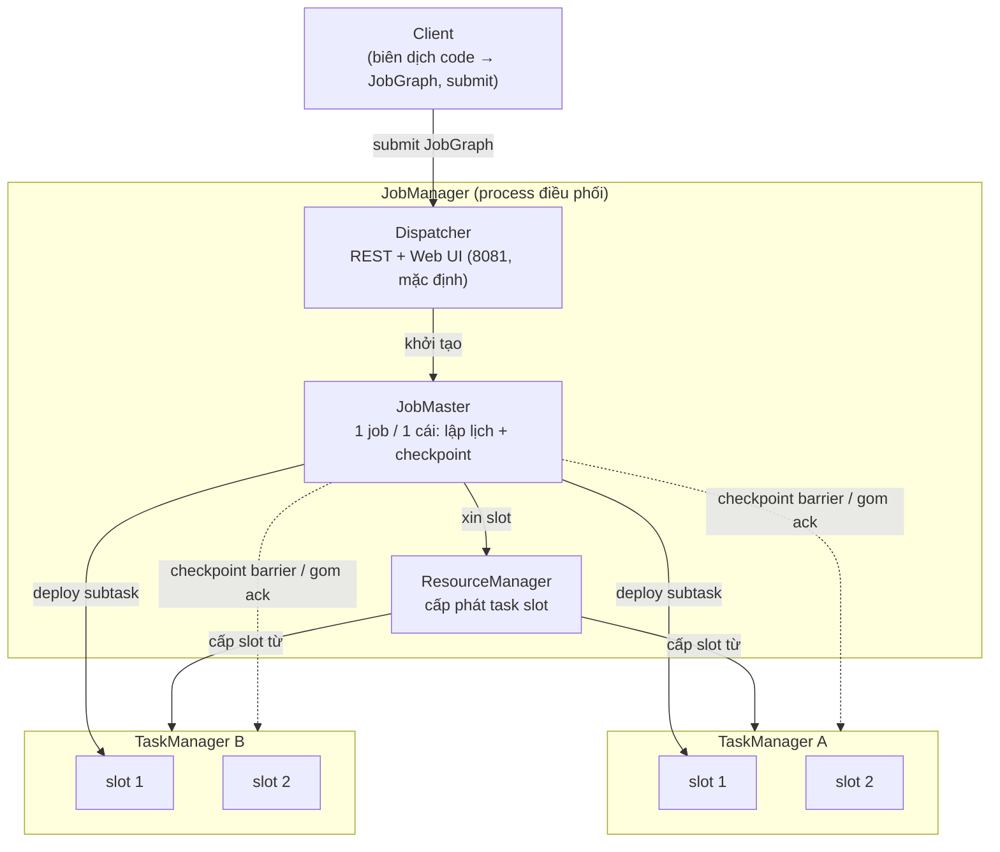

# Kiến trúc job Flink

> **Chốt:** JobManager *điều phối* (lập lịch, checkpoint, khôi phục) còn TaskManager
> *thực thi* (chạy subtask trong các task slot); scale một job là chuyện của
> **parallelism** và số **slot**, và tăng parallelism không miễn phí vì nó kéo theo
> redistribute state.

Một cụm Flink có hai loại process. Hiểu ranh giới giữa chúng là điều kiện để đọc được
UI, chẩn lỗi, và tuning.

## Toàn cảnh: ai nói chuyện với ai



## JobManager — bộ não điều phối

JobManager không chạy dữ liệu; nó điều phối. Bên trong gồm ba thành phần với vai trò
tách bạch:

- **Dispatcher** — nhận job submit từ client, khởi một **JobMaster** cho mỗi job, và
  cung cấp **REST API + Web UI** (cổng **8081** là *mặc định*, có thể đổi bằng config).
  Nó sống lâu hơn từng job; là cửa vào của cụm.
- **ResourceManager** — quản lý và cấp phát **task slot** từ các TaskManager. Đây là
  thành phần biết cụm có bao nhiêu slot rảnh và cấp cho JobMaster khi được xin. Có bản
  cho từng nền tảng (Standalone, YARN, Kubernetes) — khác nhau ở cách *xin thêm*
  TaskManager khi thiếu.
- **JobMaster** — **mỗi job một cái**. Nó lập lịch các task vào slot, **điều phối
  checkpoint** (phát barrier xuống source, gom xác nhận từ mọi subtask, chốt checkpoint
  hoàn tất), và **khôi phục** khi có subtask chết (chọn checkpoint gần nhất, restore).

Chia ba như vậy để tách *cửa vào cụm* (Dispatcher), *kế toán tài nguyên* (ResourceManager)
và *vòng đời một job* (JobMaster) — mỗi job có JobMaster riêng nên một job hỏng không kéo
job khác trong session xuống theo.

## TaskManager — nơi thật sự chạy

TaskManager (còn gọi *worker*) là nơi dữ liệu chảy qua và tính toán xảy ra:

- Chạy các **subtask** (một bản song song của một operator).
- Cung cấp **task slot** — đơn vị tài nguyên cố định; mỗi TaskManager có N slot, chia
  đều bộ nhớ managed cho chúng.
- Quản **network buffer** để trao đổi dữ liệu giữa các subtask (đây cũng là chỗ
  backpressure biểu hiện — buffer đầy thì upstream chậm lại; xem
  [backpressure-tuning](../skills/backpressure-tuning.md)).

### Mô hình bộ nhớ TaskManager

Đây là chỗ tuning hay đau nhất. Bộ nhớ một TaskManager **không** chỉ là "heap"; nó chia
thành nhiều vùng, và Flink phân bổ từ tổng `taskmanager.memory.process.size`:

| Vùng | Nằm ở | Làm gì | Đổi khi |
|---|---|---|---|
| **Framework heap** | JVM heap | Bộ nhớ cho chính framework Flink chạy | Hầu như không đụng |
| **Task heap** | JVM heap | Object của *user code* (operator, state on-heap) | State/logic on-heap lớn → OOM heap thì tăng |
| **Managed memory** | Off-heap, Flink tự quản | **RocksDB** state backend, buffer cho sort/hash (batch) | Dùng RocksDB, hoặc job batch sort nặng |
| **Network buffers** | Off-heap | Buffer trao đổi dữ liệu giữa subtask (credit-based) | Parallelism/shuffle lớn báo thiếu network buffer |
| **JVM metaspace** | Off-heap | Class metadata của JVM | Nạp nhiều class (nhiều connector/UDF) |
| **JVM overhead** | Off-heap | Thread stack, native, GC housekeeping | Native lib nặng |

Vì sao chia vậy: **managed memory nằm off-heap và Flink tự quản** để RocksDB và các
buffer lớn không nằm trong JVM heap — nếu để trong heap, chúng sẽ gây GC pause dài và
OOM khó đoán. Tách network buffer riêng để backpressure có "van" đo được. Bẫy kinh điển:
bật RocksDB nhưng để managed memory quá nhỏ → RocksDB tự cấp bộ nhớ ngoài hạn mức →
container bị OS/YARN/K8s **kill vì vượt giới hạn**, chứ không phải lỗi Flink nào báo.

Số liệu cụ thể (hạn mức mỗi vùng theo MB) phụ thuộc cấu hình và version — lấy từ log
khởi động TaskManager thật, đừng đoán. *(số minh hoạ — chưa chạy)*

## Task slot vs parallelism

Hai khái niệm hay lẫn:

- **Parallelism** của một operator = số bản song song của nó đang chạy. Parallelism 4
  nghĩa là 4 subtask cùng xử lý 4 phần dữ liệu (phân theo key nếu keyed).
- **Task slot** = một *chỗ* tài nguyên trên TaskManager để đặt subtask vào. Tổng số slot
  của cụm là trần cho parallelism.

Quy tắc thô: **số slot cần ≥ parallelism cao nhất trong job.**

### Slot sharing group

Mặc định Flink cho các subtask *thuộc các operator khác nhau nhưng cùng một pipeline*
chia **chung một slot** (slot sharing). Nhờ vậy một slot có thể chứa cả chuỗi
source→map→window→sink, và số slot cần chỉ bằng parallelism cao nhất, không phải tổng số
subtask.

Vì sao gộp có lợi: một slot khi đó cầm *cả một lát cắt dọc* của pipeline, nên (1) dùng
tài nguyên tốt hơn — source chậm không để slot của sink nằm không; (2) dữ liệu giữa các
operator trong cùng slot đi trong cùng process, đỡ qua mạng. Có thể tách bằng
`.slotSharingGroup("tên")` khi muốn cô lập một operator nặng (ví dụ một window state
khổng lồ) khỏi phần còn lại, đổi lại tốn thêm slot.

## Operator chaining

Flink **gộp** các operator liền nhau vào một *chain* để chạy trong cùng một thread, khi
chúng nối 1-1 (không đổi phân vùng) và cùng parallelism. Ví dụ `map → filter` được gộp
thành một chain.

**Được gì:** bỏ được serialize/deserialize và trao đổi buffer giữa hai operator — dữ liệu
truyền bằng lời gọi hàm trong cùng thread. Đây là một trong những tối ưu lớn nhất của Flink.

Chain bị **cắt** ở ranh giới `keyBy` (đổi phân vùng → phải shuffle qua mạng), khi đổi
parallelism, hoặc khi bạn gọi `disableChaining()`. Trong UI, một hộp = một chain, nên
đừng nhầm "một hộp" với "một operator".

## Task và subtask

- **Task** = một operator (hoặc một chain) trong JobGraph.
- **Subtask** = một bản song song cụ thể của task đó. Task có parallelism 3 → 3 subtask.

Subtask là đơn vị được đặt vào slot và được lập lịch.

## Từ code tới ExecutionGraph — bốn tầng biểu diễn

Một job SQL hay DataStream đi qua các tầng biểu diễn trước khi chạy được:

```text
User code (SQL / DataStream)
   │  (client hoặc JobManager biên dịch)
   ▼
StreamGraph      logic thô: mọi operator, chưa chain, chưa tối ưu
   ▼
JobGraph         đã CHAIN operator liền nhau; đơn vị được submit lên cụm
   ▼
ExecutionGraph   TRẢI theo parallelism: mỗi task → N subtask, gán slot, dựng cạnh dữ liệu
   ▼
Physical         subtask thật đặt trên TaskManager cụ thể, chạy
```

- **StreamGraph** — biểu diễn logic thô đúng như bạn viết, một operator một node, chưa
  tối ưu gì.
- **JobGraph** — đã **chain** các operator liền nhau thành đơn vị lớn hơn để giảm
  serialize/mạng. *Đây là thứ được serialize và submit lên cụm.*
- **ExecutionGraph** — JobMaster "trải phẳng" JobGraph theo parallelism: mỗi task thành N
  subtask, dựng các cạnh trao đổi dữ liệu (forward hay shuffle), gán slot. Đây là graph
  JobManager thực sự **lập lịch và theo dõi** — trạng thái SCHEDULED/RUNNING/FAILED bạn
  thấy trong UI là ở tầng này.
- **Physical** — subtask được deploy lên slot của TaskManager cụ thể.

## Network stack — credit-based flow control

Giữa hai subtask nối qua mạng (sau `keyBy` hay đổi parallelism), Flink dùng **credit-based
flow control**:

- Subtask **downstream** báo cho upstream biết nó còn bao nhiêu **credit** = bao nhiêu
  buffer trống sẵn sàng nhận.
- Upstream **chỉ gửi** tối đa bằng số credit đó. Downstream chậm tiêu thụ → credit về 0 →
  upstream ngừng gửi → buffer của upstream đầy dần → *nó* cũng chậm lại → áp lực **lan
  ngược** tới tận source.

Đây chính là cơ chế **backpressure** đo được trong Flink: không phải "làm rớt dữ liệu",
mà là *van tự đóng* lan từ điểm nghẽn ngược về nguồn. Trong UI, subtask backpressured cao
nghĩa là nó đang bị downstream giữ lại. Chi tiết đọc và chỉnh ở
[backpressure-tuning](../skills/backpressure-tuning.md).

## Deployment mode

| Mode | User code / JobGraph sinh ở đâu | Dùng khi |
|---|---|---|
| **Session** | Client sinh, submit vào cụm dùng chung, sẵn có | Nhiều job ngắn, chia hạ tầng |
| **Application** | Sinh **trên** cụm (trong JobManager), mỗi app một cụm | Production, cô lập tài nguyên |
| ~~Per-job~~ | (đã **deprecated**) | — không dùng cho mới |

Session mode chia cụm cho nhiều job — nhẹ để thử nghiệm nhưng một job ngốn tài nguyên có
thể ảnh hưởng job khác, và client phải biên dịch JobGraph (tốn tài nguyên client).
Application mode cô lập mỗi ứng dụng vào cụm riêng và `main()` chạy *trên* JobManager —
chuẩn production hiện nay. Per-job mode cũ đã bị deprecated; nếu tài liệu nào còn nhắc,
coi như lỗi thời.

### High availability (HA) — JobManager không phải điểm chết đơn

JobManager là điểm điều phối trung tâm; nếu nó chết mà không có HA, cả job dừng. HA giải
bằng:

- **Nhiều JobManager**, một *leader* tại một thời điểm, bầu lại qua **ZooKeeper** hoặc
  **Kubernetes** (leader election). JobManager chết → một cái khác lên leader.
- **JobGraph store + metadata checkpoint** lưu ở nơi bền (ví dụ trên HDFS/S3, con trỏ
  trong ZK/K8s ConfigMap). Nhờ đó JobManager mới lên biết *đang có job nào*, checkpoint
  gần nhất ở đâu, và **restore** thay vì mất trắng.

Không có HA thì JobManager là single point of failure; production gần như luôn bật HA.

## Trade-offs khi tăng parallelism

Tăng parallelism *không* miễn phí:

| Được | Mất | Đổi lấy |
|---|---|---|
| Throughput cao hơn (nếu chưa nghẽn) | Cần thêm slot/TaskManager | Xử lý nhiều event/giây hơn |
| Chia nhỏ tải mỗi subtask | **State redistribute** khi đổi parallelism → cần savepoint, tốn thời gian | Scale mà giữ state |
| — | **Key skew**: nếu một key nóng chiếm phần lớn dữ liệu, thêm subtask không cứu được | — |

**Bẫy key skew:** parallelism chỉ giúp khi dữ liệu chia đều theo key. Nếu 90% event có
cùng một `user_id`, subtask giữ key đó vẫn nghẽn dù bạn tăng parallelism lên bao nhiêu —
tất cả event của một key đi về đúng một subtask. Phải giải bằng cách đổi khoá (thêm salt)
hoặc pre-aggregate, không phải bằng thêm slot.

**Rescale state:** keyed state phân theo key vào các subtask qua *key group* (đơn vị chia
nhỏ nhất của state). Đổi parallelism nghĩa là gán lại key group cho subtask mới, nên state
phải đọc ra và phân bố lại — Flink chỉ làm được điều này khi **restore từ savepoint**,
không làm nóng trên job đang chạy. Đó là lý do đổi parallelism = dừng, savepoint, restore.

## Common Mistakes

| Lỗi | Hậu quả | Phòng bằng |
|---|---|---|
| Số slot < parallelism | Job không đủ chỗ chạy, treo ở SCHEDULED | Đảm bảo tổng slot ≥ parallelism cao nhất |
| Tăng parallelism để cứu key skew | Không cải thiện, phí tài nguyên | Sửa phân bố key trước |
| Đổi parallelism trực tiếp không savepoint | Mất state | Savepoint → restore với parallelism mới ([savepoint-upgrade](../skills/savepoint-upgrade.md)) |
| Nhầm một hộp UI là một operator | Chẩn sai chỗ nghẽn | Nhớ một hộp = một chain |
| Bật RocksDB nhưng managed memory quá nhỏ | Container bị kill vì vượt bộ nhớ, không lỗi Flink | Cấp đủ managed memory cho RocksDB |
| Chạy production không HA | JobManager chết → job dừng, mất metadata | Bật HA qua ZK/K8s |

## FAQ

<details>
<summary>Một slot chạy được bao nhiêu subtask?</summary>

Với slot sharing bật (mặc định), một slot chứa được cả một *chuỗi* subtask thuộc các
operator khác nhau của cùng pipeline — nhưng chỉ **một** subtask của mỗi operator. Nên
số slot cần bằng parallelism cao nhất, không phải tổng số subtask.

</details>

<details>
<summary>Vì sao đổi parallelism lại cần savepoint?</summary>

Keyed state được phân theo key (qua key group) vào các subtask. Đổi parallelism nghĩa là
phân vùng key đổi, nên state phải được đọc ra và phân bố lại. Flink làm việc này khi
restore từ savepoint, không làm được trên job đang chạy.

</details>

<details>
<summary>Session mode và application mode khác nhau ở đâu quan trọng nhất?</summary>

Ở chỗ `main()` (biên dịch JobGraph) chạy đâu và tài nguyên có cô lập không. Session:
client biên dịch, cụm dùng chung nhiều job → một job xấu ảnh hưởng cả cụm. Application:
`main()` chạy trên JobManager, mỗi app một cụm → cô lập, chuẩn production.

</details>

## Related Topics

- [Flink là gì](what-is-flink.md) — dataflow và DAG operator, nền cho file này
- [State và checkpoint](state-and-checkpoint.md) — JobManager điều phối checkpoint thế nào
- [Exactly-once trong Flink](exactly-once.md) — JobMaster gom ack checkpoint để chốt hoàn tất
- [Backpressure và tuning](../skills/backpressure-tuning.md) — đọc network buffer, credit-based flow control
- [Savepoint và nâng cấp](../skills/savepoint-upgrade.md) — đổi parallelism mà giữ state
- [Flink](../index.md) — chủ đề chứa file này
