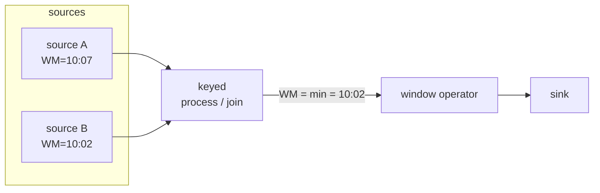
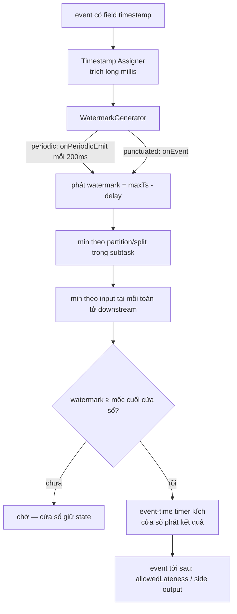

# Event time và watermark

> **Chốt:** Processing time cho số **sai một cách lặng lẽ** khi dữ liệu đến muộn hay
> không đều — không lỗi nào báo. Event time + watermark là cách duy nhất để nói
> **"cửa sổ này đã đủ event, đóng được rồi"** dựa trên thời điểm việc *xảy ra*, không
> phải thời điểm Flink *thấy* nó.

Đây là file quan trọng nhất trong nhóm. Gần như mọi lỗi "số streaming không khớp với
batch" đều truy về chỗ này.

## Ba khái niệm thời gian

| Loại | Là gì | Nằm ở đâu |
|---|---|---|
| **Event time** | Thời điểm việc **xảy ra** ở nguồn | Trong chính dữ liệu (một field timestamp) |
| **Ingestion time** | Thời điểm event **vào** Flink source | Flink gán khi đọc |
| **Processing time** | Thời điểm operator **xử lý** event | Đồng hồ máy đang chạy operator |

Processing time là đồng hồ treo tường của máy. Nhanh, không cần watermark, kết quả *không
tái lập được* — chạy lại cùng dữ liệu ra số khác vì thứ tự và độ trễ khác.

Event time đọc từ dữ liệu. Chậm hơn, cần watermark, nhưng **tái lập được** và **đúng**:
một event lúc 10:03 luôn thuộc cửa sổ 10:00–10:05 dù Flink thấy nó lúc 10:04 hay 10:09.

## Vì sao processing time cho số sai

Mạng trễ, retry, một consumer bị chậm, một partition Kafka backlog — event *xảy ra* lúc
10:03 nhưng *đến* operator lúc 10:07. Với processing time, cửa sổ 10:00–10:05 đã đóng từ
lâu, nên event này rơi vào cửa sổ 10:05–10:10 **sai**. Không có exception, không có cảnh
báo; chỉ là con số cuối tháng lệch với batch và không ai biết vì sao.

Xem [case study số sai vì processing time](../case-studies/so-sai-vi-processing-time.md)
cho một ví dụ đi từ dữ liệu tới con số lệch.

## Watermark là gì

**Watermark = một lời khẳng định trôi trong stream: "đã hết event có timestamp ≤ T".**
Nó là một record đặc biệt Flink chèn vào dòng dữ liệu, mang một giá trị thời gian T. Khi
một operator thấy watermark T, nó tin rằng *sẽ không còn event nào có event time ≤ T tới
nữa* — và vì thế mọi cửa sổ kết thúc ≤ T có thể đóng và phát kết quả.

Watermark chính là cơ chế **đẩy cửa sổ đóng**. Không có nó, một cửa sổ event-time không
bao giờ biết khi nào "đủ" và không bao giờ phát ra kết quả.

## Sinh watermark — cơ chế nội bộ

Watermark không tự có. Flink sinh nó qua một `WatermarkStrategy`, và bên trong strategy
là một `WatermarkGenerator` với hai callback quyết định *khi nào* phát watermark:

```java
// số minh hoạ — chưa chạy trên cluster
public interface WatermarkGenerator<T> {
    // gọi cho MỖI event — nơi cập nhật timestamp lớn nhất đã thấy
    void onEvent(T event, long eventTimestamp, WatermarkOutput output);

    // gọi ĐỊNH KỲ (theo interval) — nơi phát watermark ra dòng
    void onPeriodicEmit(WatermarkOutput output);
}
```

Có hai kiểu sinh, phân biệt bởi *chỗ* thực sự phát watermark:

| Kiểu | Phát ở | Dùng khi | Chi phí |
|---|---|---|---|
| **Periodic** | `onPeriodicEmit`, gọi mỗi `auto-watermark-interval` | Mặc định, hầu hết trường hợp | Ít record watermark hơn |
| **Punctuated** | `onEvent`, ngay khi thấy một event đặc biệt | Nguồn có event mang tín hiệu "hết batch" | Nhiều watermark, độ trễ thấp nhất |

Với **periodic** (kiểu thường dùng), `onEvent` chỉ cập nhật biến `maxTimestamp` đã thấy,
còn watermark thật sự được phát định kỳ trong `onPeriodicEmit`. Khoảng định kỳ đó điều
khiển bằng config:

```text
pipeline.auto-watermark-interval = 200ms   (mặc định)
```

Đặt `0` thì tắt phát periodic. Đặt nhỏ hơn → watermark tiến mượt hơn, độ trễ đóng cửa sổ
thấp hơn, đổi lại nhiều record watermark trôi trong dòng hơn.

Với **punctuated**, bạn phát watermark trong `onEvent` dựa vào một cờ trong chính event —
ví dụ event cuối của một micro-batch có flag `isEndOfBatch`. Không chờ interval, nên độ
trễ thấp nhất, nhưng mỗi event có thể sinh một watermark → tốn hơn.

### Hai built-in strategy hay dùng

```java
// số minh hoạ — chưa chạy trên cluster

// (1) Cho phép trễ tối đa d — watermark = maxTs - d
WatermarkStrategy
    .<Event>forBoundedOutOfOrderness(Duration.ofSeconds(5))
    .withTimestampAssigner((event, ts) -> event.getEventTimeMillis());

// (2) Timestamp tăng đơn điệu (không bao giờ giảm) — watermark = maxTs
WatermarkStrategy
    .<Event>forMonotonousTimestamps()
    .withTimestampAssigner((event, ts) -> event.getEventTimeMillis());
```

- `forBoundedOutOfOrderness(d)` là kiểu periodic, watermark luôn = (timestamp lớn nhất đã
  thấy − d). Đây là lựa chọn mặc định thực dụng cho hầu hết nguồn.
- `forMonotonousTimestamps` giả định event tới đúng thứ tự tuyệt đối (timestamp không bao
  giờ giảm), watermark = maxTimestamp, không trừ gì. Chỉ đúng khi nguồn đảm bảo thứ tự
  (ví dụ một partition Kafka do một producer duy nhất ghi tuần tự). Sai giả định này thì
  mọi event lệch thứ tự đều thành late.

### Bounded out-of-orderness

Event thực tế đến không đúng thứ tự (event 10:05 có thể tới trước 10:03). Chiến lược phổ
biến nhất là **bounded out-of-orderness**: chấp nhận trễ tối đa một khoảng cố định.

Với độ trễ tối đa 5 giây, watermark luôn = (timestamp lớn nhất đã thấy − 5s). Đây là
**đánh đổi cốt lõi**:

- Đặt lớn (ví dụ 5 phút) → chờ lâu, cửa sổ đóng muộn → **độ trễ cao** nhưng bắt được
  nhiều event đến muộn.
- Đặt nhỏ (ví dụ 1 giây) → cửa sổ đóng nhanh → **độ trễ thấp** nhưng event đến muộn hơn
  1 giây bị coi là *late data*.

Không có giá trị đúng tuyệt đối; nó là quyết định giữa độ trễ và độ đầy đủ.

### Ví dụ số — watermark tiến, cửa sổ đóng

Giả sử `forBoundedOutOfOrderness(5s)`, cửa sổ tumbling 10 phút `[10:00, 10:10)`. Dòng
event tới (lệch thứ tự) và watermark tương ứng (watermark = maxTs − 5s):

```text
số minh hoạ — chưa chạy trên cluster

event đến   event time   maxTs thấy   watermark phát   ghi chú
─────────   ──────────   ──────────   ──────────────   ──────────────────────────
e1          10:03:00     10:03:00     10:02:55
e2          10:05:00     10:05:00     10:04:55
e3          10:04:30     10:05:00     10:04:55         lệch thứ tự, vẫn nhận vì WM chưa tới 10:04:30
e4          10:11:00     10:11:00     10:10:55         WM ≥ 10:10 → cửa sổ [10:00,10:10) ĐÓNG, phát kết quả
e5          10:09:50     10:11:00     10:10:55         LATE — WM (10:10:55) đã vượt 10:09:50, event bị bỏ
```

Điểm mấu chốt ở `e4`: chính event *tương lai* (10:11) đẩy watermark lên 10:10:55, và đó
là cái làm cửa sổ `[10:00, 10:10)` đóng. Cửa sổ không đóng vì đồng hồ máy chạy — nó đóng
vì **có event mới có timestamp đủ lớn** kéo watermark qua mốc. Nguồn im lặng = watermark
đứng = cửa sổ không đóng (xem phần idle bên dưới).

## Lan truyền watermark qua đồ thị

Watermark không chỉ sinh ở source; nó **trôi** qua cả đồ thị toán tử, và mỗi toán tử phải
quyết định watermark của *chính mình* để đẩy tiếp xuống downstream.

Quy tắc cốt lõi: **một toán tử có nhiều input phát watermark = `min`(watermark của mọi
input).** Lý do: nó chỉ được phép khẳng định "hết event ≤ T" khi *mọi* nguồn thượng nguồn
đều đã qua T. Chỉ cần một input còn ở T′ &lt; T thì vẫn có thể còn event ≤ T tới từ input
đó.



Trong sơ đồ trên, toán tử join phát watermark = min(10:07, 10:02) = **10:02**. Source B
chậm kéo tụt watermark của cả pipeline. Đây là hành vi đúng — nhưng cũng là nguồn của bẫy
idle partition bên dưới.

### Watermark theo partition / theo split rồi hợp nhất

Một source parallel đọc nhiều partition (Kafka) hoặc nhiều split (file). Flink theo dõi
watermark **riêng cho từng partition/split** bên trong một source subtask, rồi mỗi subtask
phát ra watermark = min các partition nó đọc. Nhờ vậy một partition nhanh không "kéo"
watermark vượt quá một partition chậm — vẫn giữ đúng ngữ nghĩa "hết event ≤ T ở mọi nguồn".

Điều này lý giải vì sao watermark của cả job thực chất là **min lồng nhau nhiều tầng**:
min theo partition trong một subtask, rồi min theo input tại mỗi toán tử downstream. Một
partition duy nhất tụt lại kéo toàn bộ.

## Idleness — nguồn im lặng giữ watermark đứng

Watermark của một operator = **min** watermark của tất cả các input partition. Hệ quả
nguy hiểm: **một partition im lặng (không phát gì) giữ watermark của partition đó đứng
yên → kéo min xuống → toàn bộ cửa sổ không bao giờ đóng.** Job chạy, không lỗi, nhưng
không cửa sổ nào phát kết quả. Đây là một trong những lỗi khó chẩn nhất của Flink.

Cách chữa: **`withIdleness`** — báo cho Flink coi một partition là "nhàn rỗi" nếu nó im
quá một khoảng, tạm loại nó khỏi phép tính min watermark. Khi partition đó có event trở
lại, nó được đưa lại vào phép min.

```java
// số minh hoạ — chưa chạy trên cluster
WatermarkStrategy
    .<Event>forBoundedOutOfOrderness(Duration.ofSeconds(5))
    .withIdleness(Duration.ofMinutes(1))   // partition im 1 phút → bỏ khỏi min watermark
    .withTimestampAssigner((event, ts) -> event.getEventTimeMillis());
```

**Bẫy đi kèm:** `withIdleness` chỉ nới lỏng phép min để watermark *tiến được*. Nếu một
partition đáng lẽ có dữ liệu nhưng bị treo (không phải thật sự idle), đánh dấu nó idle sẽ
làm watermark tiến quá nhanh và event của nó khi tới lại thành late. Idleness là công cụ
cho nguồn *thật sự* có lúc im (một sensor không phát ban đêm), không phải để giấu một
partition đang backlog.

Xem [case study cửa sổ không chạy vì idle partition](../case-studies/cua-so-khong-chay-idle-partition.md).

## Watermark alignment (FLIP-182)

Vấn đề ngược với idle: một nguồn *nhanh* (một partition đọc kịp tới hiện tại) trong khi
nguồn khác còn đọc backlog cũ. Nguồn nhanh cứ đẩy event tương lai vào, buffer/state phình
để chờ nguồn chậm bắt kịp trước khi cửa sổ đóng.

**Watermark alignment** ghì các nguồn lại: nếu watermark của một split vượt quá watermark
nhóm một ngưỡng `maxAllowedWatermarkDrift`, Flink **tạm ngừng đọc** split nhanh đó cho tới
khi các split chậm bắt kịp trong ngưỡng. Nhờ vậy watermark toàn cục tiến đều, không để một
nguồn nhanh làm phình state.

```java
// số minh hoạ — chưa chạy trên cluster
WatermarkStrategy
    .<Event>forBoundedOutOfOrderness(Duration.ofSeconds(5))
    .withWatermarkAlignment("group-1", Duration.ofSeconds(20), Duration.ofSeconds(1));
    // (tên nhóm, drift tối đa cho phép, chu kỳ cập nhật)
```

Đây là tuyến phòng thủ cho các job backfill/replay từ đầu topic, nơi các partition lệch
nhau hàng giờ.

## Late data — event tới sau watermark

Event có event time ≤ watermark hiện tại nhưng *tới sau* khi watermark đã vượt qua nó là
**late data**. Mặc định Flink **bỏ** (drop) chúng — cửa sổ đã đóng và phát rồi (chính là
`e5` trong ví dụ số ở trên).

Muốn giữ, hai lựa chọn:

- **`allowedLateness(Duration)`** — giữ state cửa sổ thêm một khoảng sau khi watermark
  vượt qua; late event trong khoảng này *cập nhật lại* kết quả (phát bản cập nhật). Tốn
  thêm state, và downstream phải xử được kết quả bị phát nhiều lần (retract/update).
- **`sideOutputLateData(tag)`** — chuyển event quá muộn (ngoài cả allowedLateness) ra một
  stream phụ để xử lý riêng: log, ghi vào bảng "late" để reconcile với batch, hay cảnh báo.

```java
// số minh hoạ — chưa chạy trên cluster
OutputTag<Event> lateTag = new OutputTag<>("late-events") {};

SingleOutputStreamOperator<Result> main = stream
    .keyBy(Event::getKey)
    .window(TumblingEventTimeWindows.of(Time.minutes(10)))
    .allowedLateness(Time.minutes(1))   // event trễ ≤ 1 phút vẫn cập nhật lại cửa sổ
    .sideOutputLateData(lateTag)        // trễ hơn nữa → ra side output
    .aggregate(new CountAgg());

DataStream<Event> tooLate = main.getSideOutput(lateTag);   // hứng quá muộn để reconcile
```

Thứ tự phòng thủ: watermark delay hứng lệch thứ tự *bình thường* → `allowedLateness` hứng
trễ *vừa phải* (đổi lấy state + kết quả cập nhật) → side output hứng phần *quá muộn* để
không mất âm thầm. Chi tiết các loại cửa sổ ở [windows](../skills/windows.md).

## Timer trong ProcessFunction

Cửa sổ là API tầng cao; bên dưới, cơ chế "làm gì đó khi thời gian tới mốc T" là **timer**
trong `ProcessFunction`. Có hai loại, và chúng kích theo hai đồng hồ khác nhau:

| Loại timer | Kích khi | Đồng hồ dùng |
|---|---|---|
| **Event-time timer** | **watermark** vượt qua mốc đã đăng ký | Watermark (thời gian trong dữ liệu) |
| **Processing-time timer** | **đồng hồ máy** (wall clock) tới mốc | System clock của TaskManager |

```java
// số minh hoạ — chưa chạy trên cluster
public class MyProcess extends KeyedProcessFunction<String, Event, Result> {
    @Override
    public void processElement(Event e, Context ctx, Collector<Result> out) {
        // đăng ký kích khi WATERMARK vượt 10:10 — không phải khi đồng hồ máy tới 10:10
        ctx.timerService().registerEventTimeTimer(windowEnd);
    }

    @Override
    public void onTimer(long ts, OnTimerContext ctx, Collector<Result> out) {
        // gọi khi watermark ≥ ts — chính là lúc "cửa sổ đủ" để phát
        out.collect(buildResult());
    }
}
```

Điểm quan trọng: **event-time timer là cách cửa sổ thực sự "đóng".** Cửa sổ đăng ký một
event-time timer tại mốc cuối cửa sổ; khi watermark vượt mốc, `onTimer` chạy và phát kết
quả. Nên tất cả những gì kể trên — watermark min, idle, alignment — quy về một câu: chúng
quyết định *khi nào event-time timer kích*, và do đó *khi nào cửa sổ phát*.

Processing-time timer thì độc lập với watermark — hữu ích cho timeout thực (ví dụ "nếu
30 giây không thấy event tiếp theo của session thì đóng session"), nhưng không tái lập
được vì phụ thuộc đồng hồ máy.

## Toàn cảnh — watermark chảy từ source tới cửa sổ đóng



## Timestamp assigner

Trước khi có watermark, Flink cần biết event time của mỗi event nằm ở đâu — đó là việc
của **timestamp assigner** (`withTimestampAssigner`). Nó trích một `long` mili-giây từ
mỗi record. Nếu bạn quên gán, Flink không có event time để dựng watermark, và cửa sổ
event-time không chạy.

Assigner nên trả về **epoch millis UTC**. Nếu field nguồn là chuỗi ISO có múi giờ, chuẩn
hoá về UTC ngay tại đây — sai múi giờ ở bước này làm watermark lệch cả pipeline một cách
lặng lẽ.

## Processing vs event time — bảng so sánh

| | Processing time | Event time |
|---|---|---|
| Nguồn thời gian | Đồng hồ máy | Field trong dữ liệu |
| Cần watermark | Không | **Có** |
| Kết quả tái lập | Không (chạy lại ra số khác) | Có |
| Đúng khi dữ liệu đến muộn | **Không** — gán sai cửa sổ | Có |
| Độ trễ | Thấp nhất | Phụ thuộc watermark delay |
| Xử lý late data | Không có khái niệm | allowedLateness / side output |
| Khi nào dùng | Chỉ khi số sai không quan trọng (monitoring thô) | Mọi phép tính cần đúng |

## Bảng config watermark

| Config / API | Mặc định | Điều khiển |
|---|---|---|
| `pipeline.auto-watermark-interval` | 200ms | Chu kỳ `onPeriodicEmit` phát watermark periodic |
| `forBoundedOutOfOrderness(d)` | — | Watermark = maxTs − d, chịu lệch thứ tự tới d |
| `forMonotonousTimestamps()` | — | Watermark = maxTs, giả định thứ tự tuyệt đối |
| `withIdleness(d)` | tắt | Loại partition im &gt; d khỏi phép min watermark |
| `withWatermarkAlignment(...)` | tắt | Ghì nguồn nhanh chờ nguồn chậm (FLIP-182) |
| `allowedLateness(d)` | 0 | Giữ cửa sổ thêm d để cập nhật với late event |
| `sideOutputLateData(tag)` | tắt | Đẩy event quá muộn ra stream phụ thay vì bỏ |

## Common Mistakes

| Lỗi | Hậu quả | Phòng bằng |
|---|---|---|
| Dùng processing time cho tiện | Số sai lặng lẽ khi dữ liệu đến muộn | Dùng event time cho mọi phép tổng hợp cần đúng |
| Quên timestamp assigner | Cửa sổ event-time không chạy | Luôn gán event time trước watermark |
| Không có `withIdleness` | Một partition im giữ cửa sổ không đóng mãi | Thêm `withIdleness` khi nguồn có partition có thể im |
| Đánh dấu idle partition đang backlog | Watermark tiến quá nhanh → event của nó thành late | Chỉ idle cho nguồn *thật sự* có lúc im |
| Dùng `forMonotonousTimestamps` khi nguồn lệch thứ tự | Mọi event lệch thứ tự thành late, bị bỏ | Dùng `forBoundedOutOfOrderness` trừ khi chắc thứ tự |
| Watermark delay quá nhỏ | Nhiều event bị coi là late, bị bỏ | Đo độ out-of-order thực tế rồi đặt |
| Watermark delay quá lớn | Cửa sổ đóng muộn, độ trễ cao | Cân với yêu cầu độ trễ |
| Không side-output late data | Event muộn mất âm thầm, số lệch batch không truy được | `sideOutputLateData` để reconcile |

## FAQ

<details>
<summary>Watermark có phải là dữ liệu không?</summary>

Có — nó là một record đặc biệt Flink chèn vào dòng, trôi cùng event qua các operator.
Khác event thường ở chỗ nó không mang payload, chỉ mang một mốc thời gian T và mang nghĩa
"hết event ≤ T".

</details>

<details>
<summary>Periodic hay punctuated watermark — chọn cái nào?</summary>

Mặc định periodic (`onPeriodicEmit` mỗi 200ms) đủ cho gần như mọi job: nó gộp nhiều event
thành một watermark, ít record hơn. Chỉ chọn punctuated (`onEvent`) khi nguồn có tín hiệu
rõ "hết một batch" trong chính event và bạn cần độ trễ đóng cửa sổ thấp nhất — đổi lại
nhiều watermark hơn trôi trong dòng.

</details>

<details>
<summary>Vì sao cửa sổ của tôi không bao giờ phát dù job vẫn chạy?</summary>

Gần như luôn là watermark không tiến. Ba thủ phạm thường gặp: (1) quên timestamp assigner
nên không có event time; (2) một partition/nguồn im lặng kéo min watermark đứng — thiếu
`withIdleness`; (3) không có event mới nào có timestamp đủ lớn để đẩy watermark qua mốc
cuối cửa sổ. Kiểm tra watermark hiện tại của operator trong Web UI trước tiên.

</details>

<details>
<summary>Nếu event time trong dữ liệu bị sai (lệch múi giờ) thì sao?</summary>

Watermark sẽ tính trên timestamp sai đó, và cửa sổ gom sai — nhưng ít nhất kết quả *tái
lập được* và bạn có thể phát hiện. Với processing time bạn còn không có gì để đối chiếu.
Chuẩn hoá timestamp về epoch millis UTC ngay ở timestamp assigner.

</details>

## Related Topics

- [Window](../skills/windows.md) — allowedLateness, side output, các loại cửa sổ
- [Flink là gì](what-is-flink.md) — vì sao unbounded stream cần định nghĩa "khi nào đủ"
- [State và checkpoint](state-and-checkpoint.md) — cửa sổ giữ state, đóng cửa sổ giải phóng nó; event-time timer nằm trong state
- [Số sai vì processing time](../case-studies/so-sai-vi-processing-time.md) — ví dụ đi tới con số lệch
- [Cửa sổ không chạy vì idle partition](../case-studies/cua-so-khong-chay-idle-partition.md) — bẫy watermark đứng yên
- [Flink](../index.md) — chủ đề chứa file này
