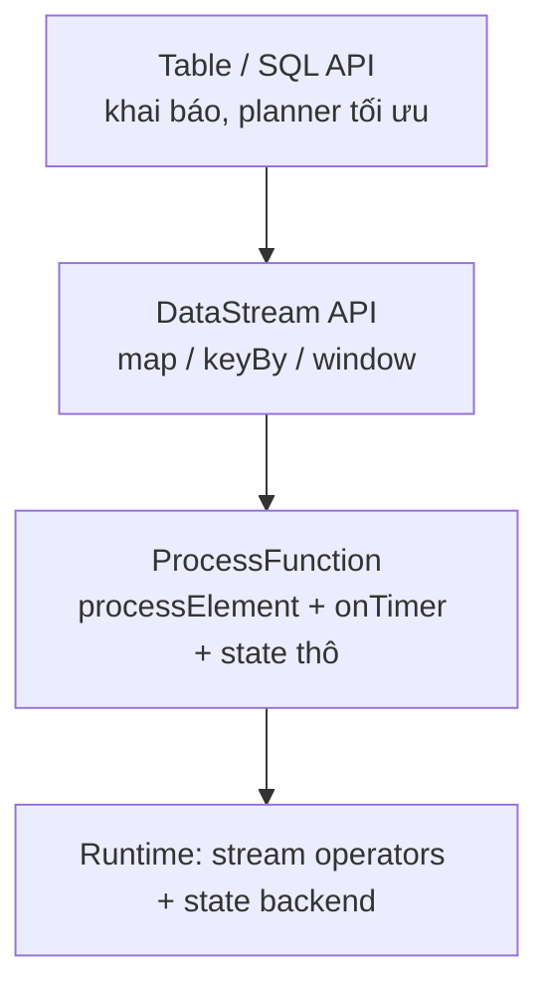

# DataStream API vs Table/SQL API

> **Chốt:** Đa số ETL và aggregation viết bằng **Table/SQL** ngắn hơn nhiều lần và để
> Flink tự tối ưu; chỉ tụt xuống **DataStream / ProcessFunction** khi cần chạm state
> thô, điều khiển timer, hoặc logic mà SQL không diễn đạt được (CEP, state machine).

Hai API không phải hai công cụ ngang hàng cho một việc — chúng ở hai **mức trừu tượng**
khác nhau, và cái giá là kiểm soát đổi lấy độ dài code.

## Ba mức trừu tượng

| Mức | API | Bạn kiểm soát | Bạn đánh mất |
|---|---|---|---|
| Cao | **Table / SQL** | Khai báo *muốn gì*; planner tự chọn *làm thế nào* | Không chạm được state thô, khó chèn logic ngoài SQL |
| Giữa | **DataStream** (`map`/`keyBy`/`window`) | Luồng transform, keyed stream, window | Vẫn dùng abstraction dựng sẵn cho window/join |
| Thấp | **ProcessFunction** | Từng event một, `ValueState`/`ListState`, timer thủ công | Phải tự viết mọi thứ — verbose, dễ sai |

`ProcessFunction` là đáy: nó cho bạn `processElement(event, ctx, out)` cộng
`onTimer(...)`. Mọi window, join, aggregation ở tầng trên cuối cùng đều quy về hai thứ
này. Nếu diễn đạt được bằng tầng cao hơn thì đừng xuống đây.



Đi xuống một tầng, bạn nhận thêm quyền kiểm soát nhưng gánh thêm code và trách nhiệm tối
ưu. Quy tắc mặc định: **ở tầng cao nhất diễn đạt được bài toán**, chỉ tụt xuống đúng chỗ
cần.

### Bảng khi-nào-dùng tầng nào

| Bài toán | Tầng nên dùng | Vì sao |
|---|---|---|
| Lọc, chiếu cột, join hai bảng, aggregation theo window | **SQL / Table** | Planner đẩy predicate, chọn join strategy, sinh watermark logic |
| Làm giàu bằng lookup có TTL riêng, dedup theo khoá tùy biến | **DataStream + KeyedProcessFunction** | Cần state tùy ý + kiểm soát TTL từng khoá |
| Bắn timer theo lịch riêng, expire state đúng lúc | **ProcessFunction** | Chỉ tầng này có `ctx.timerService()` |
| Pattern chuỗi event (A rồi B trong 5') | **CEP** hoặc **ProcessFunction** | SQL thuần không diễn đạt state machine theo chuỗi |
| State machine phức tạp (nhiều trạng thái, chuyển tùy điều kiện) | **ProcessFunction** | Cần `ValueState` giữ trạng thái + logic chuyển tự viết |

## Gặp X → chọn gì

- **Aggregation / join / filter / window đơn giản trên bảng** → **SQL**. Ngắn, planner
  đẩy được predicate, đổi được mà không viết lại Java.
- **Cần state tùy ý xuyên nhiều event** (dedup theo khoá tùy biến, đếm phiên phức tạp,
  làm giàu bằng lookup có TTL riêng) → **DataStream + `KeyedProcessFunction`**.
- **Điều khiển thời gian thủ công** (bắn timer đúng lúc, expire state theo lịch riêng) →
  **ProcessFunction**.
- **Pattern matching chuỗi event** (A rồi B trong 5 phút) → **CEP** hoặc
  `ProcessFunction`, không phải SQL thuần.

## Changelog semantics — trái tim của Table API

Đây là chỗ dễ vấp nhất khi chuyển Table ↔ DataStream: một Table **không phải lúc nào
cũng là stream "chỉ thêm"**. Bên dưới, mỗi Table là một trong hai loại stream:

| Loại | Row mang gì | Sinh ra từ |
|---|---|---|
| **Append-only** | Chỉ `+I` (insert) | `SELECT ... WHERE ...`, projection, window aggregation với window TVF |
| **Changelog (retract)** | `+I`, `-U`, `+U`, `-D` | Aggregation không window (`GROUP BY`), regular join, dedup, `ORDER BY ... LIMIT` |
| **Changelog (upsert)** | `+U`/`+I` theo khoá + `-D` tombstone | Sink/source có **primary key** (`upsert-kafka`, JDBC upsert) |

Ký hiệu row kind trong Flink: `+I` (insert), `-U` (update-before, retract bản cũ), `+U`
(update-after, phát bản mới), `-D` (delete).

### Vì sao aggregation và join sinh retract

Xét `SELECT user, COUNT(*) FROM clicks GROUP BY user`. Mỗi click mới của `u1` làm count
của `u1` **thay đổi** — mà stream đã phát count cũ ra downstream rồi. Không thể "sửa" một
row đã đi. Nên Flink phát:

```text
Output minh hoạ — chưa chạy:
+I (u1, 1)
-U (u1, 1)      <- rút lại bản cũ
+U (u1, 2)      <- phát bản mới
-U (u1, 2)
+U (u1, 3)
```

Downstream phải hiểu retract để trừ bản cũ trước khi cộng bản mới, nếu không sẽ đếm dồn
sai. Regular join (không phải interval/temporal join) cũng vậy: khi một bên có row mới
khớp, kết quả join cũ phải bị rút lại.

Khi bảng có **primary key** khai báo, Flink chuyển từ retract sang **upsert mode**: thay
vì phát cặp `-U`/`+U`, nó phát một `+U` mang khoá — sink dùng khoá để ghi đè. Gọn hơn,
nhưng đòi hỏi sink hiểu upsert.

## Chuyển đổi Table ↔ DataStream

Không phải chọn một lần cho cả job. Chuyển qua lại được — nhưng phải chọn đúng hàm theo
loại stream:

| Hàm | Dùng cho | Mất gì nếu chọn sai |
|---|---|---|
| `toDataStream(table)` | Table **append-only** | Ném lỗi nếu table có update |
| `toChangelogStream(table)` | Table **có retract/upsert** | — (giữ đủ row kind) |
| `fromDataStream(ds)` | DataStream thường → append Table | — |
| `fromChangelogStream(ds)` | `DataStream<Row>` mang row kind → changelog Table | — |

```java
// Code minh hoạ, chưa chạy
// Table -> DataStream để nhét một ProcessFunction ở giữa
DataStream<Row> stream = tableEnv.toChangelogStream(table);
DataStream<Row> enriched = stream
    .keyBy(r -> r.getField("user_id"))
    .process(new MyKeyedProcessFunction());   // logic state thô ở đây
Table back = tableEnv.fromChangelogStream(enriched);
```

Mẫu thường dùng: đọc/aggregation bằng SQL cho gọn, tách một đoạn logic khó ra
DataStream, rồi ghép lại. Đừng viết cả job bằng DataStream chỉ vì *một* chỗ cần nó.

`toDataStream` trên bảng có aggregation sẽ **ném lỗi ngay** (Flink hiện đại) hoặc âm thầm
mất retract (API cũ `toRetractStream`/`toAppendStream`). Luôn dùng `toChangelogStream`
khi bảng có thể update.

## Ưu / nhược mỗi API

**Table / SQL — planner tự tối ưu.** Bạn viết *muốn gì*, cost-based optimizer chọn *làm
thế nào*: đẩy predicate xuống source, chọn join strategy, chọn state layout, tự sinh
watermark logic khi đã khai báo. Đánh đổi: plan có thể **đổi giữa các version Flink** —
cùng SQL, bản mới sinh plan khác, savepoint có thể không tương thích (SQL job không có
uid ổn định theo cách DataStream có).

**DataStream — kiểm soát state thô.** Bạn nắm topology, đặt `.uid()` cố định, biết chính
xác operator nào giữ state gì. Đổi lại verbose và **bạn tự tối ưu** — planner không giúp.

## CEP cần DataStream

Complex Event Processing (thư viện `flink-cep`) — bắt **pattern chuỗi event** — chỉ chạy
trên `DataStream`, không có API SQL tương đương đầy đủ (`MATCH_RECOGNIZE` trong SQL bắt
được một phần nhưng hạn chế hơn).

```java
// Code minh hoạ, chưa chạy — pattern "login thất bại 3 lần trong 1 phút"
Pattern<Event, ?> p = Pattern.<Event>begin("fail")
    .where(e -> e.type.equals("LOGIN_FAIL"))
    .times(3)
    .within(Time.minutes(1));
```

Cần pattern kiểu này thì buộc xuống DataStream — đây là một trong ít bài toán SQL không
với tới.

## Cùng một bài toán, hai cách — đếm theo cửa sổ

**Table/SQL** (windowing TVF):

```sql
-- Output minh hoạ, chưa chạy:
-- window_start          | user_id | cnt
-- 2026-08-11 10:00:00   | u1      | 42
SELECT window_start, user_id, COUNT(*) AS cnt
FROM TABLE(
  TUMBLE(TABLE clicks, DESCRIPTOR(event_time), INTERVAL '1' MINUTE)
)
GROUP BY window_start, user_id;
```

**DataStream** — cùng kết quả, dài hơn nhiều:

```java
// Code minh hoạ, chưa chạy
clicks
  .assignTimestampsAndWatermarks(/* ... */)
  .keyBy(c -> c.userId)
  .window(TumblingEventTimeWindows.of(Time.minutes(1)))
  .aggregate(new CountAgg());   // AggregateFunction đếm incremental
```

SQL bản trên là bốn dòng và planner tự chọn state backend, tự sinh watermark logic khi
đã khai báo. Chỉ khi bạn cần điều gì SQL không cho — ví dụ phát thêm side output cho
event muộn kèm metadata riêng — thì mới đáng xuống DataStream.

## Bảng quyết định

| Câu hỏi | Nếu "có" | Nếu "không" |
|---|---|---|
| Diễn đạt được bằng SQL thuần (filter/join/agg/window)? | **SQL** | Đọc tiếp |
| Cần state tùy ý hoặc TTL riêng từng khoá? | **DataStream + KeyedProcessFunction** | Đọc tiếp |
| Cần điều khiển timer thủ công? | **ProcessFunction** | Đọc tiếp |
| Cần bắt pattern chuỗi event? | **CEP (DataStream)** | Quay lại **SQL** |

## Trade-offs

| Table / SQL | DataStream / ProcessFunction |
|---|---|
| Ngắn, khai báo, planner tối ưu | Verbose, bạn tự tối ưu |
| Ai đọc SQL cũng sửa được | Cần dev Java/Scala |
| Khó chạm state thô, khó logic phi-SQL | Toàn quyền state + timer |
| Upgrade/plan thay đổi giữa version có thể lệch | Ổn định hơn, bạn nắm topology (uid cố định) |
| Retract/upsert xử lý tự động | Bạn tự quản row kind khi trộn |

## Common Mistakes

- **Viết cả job bằng DataStream vì một chỗ cần state thô.** Trộn đi — SQL cho phần còn
  lại.
- **`toDataStream` trên bảng có aggregation.** Mất retract → sink đếm trùng. Dùng
  `toChangelogStream`.
- **Nghĩ SQL không có state.** Có — `GROUP BY`, join, dedup đều giữ state; vẫn phải lo
  TTL và checkpoint như DataStream.
- **Downstream không hiểu changelog.** Ghi retract stream vào sink append-only → số dồn
  sai. Sink phải hỗ trợ upsert/delete hoặc bảng phải là append-only.
- **Kỳ vọng SQL plan ổn định qua version.** Nâng Flink có thể đổi plan → savepoint SQL
  không restore được. Test trên staging.

## FAQ

<details>
<summary>SQL có chậm hơn DataStream không?</summary>

Không mặc nhiên. Planner thường sinh plan tốt hơn code DataStream viết vội. DataStream
chỉ nhanh hơn khi bạn thực sự tối ưu tay (tránh serialization thừa, state layout gọn) —
mà việc đó tốn công.

</details>

<details>
<summary>ProcessFunction khác gì RichFunction?</summary>

`RichFunction` cho vòng đời (`open`/`close`) và truy cập state. `ProcessFunction` thêm
`Context` với timer và side output — tức là điều khiển được thời gian, thứ RichFunction
thường không có.

</details>

<details>
<summary>Khi nào cần khai báo primary key trên Table?</summary>

Khi bạn muốn Flink chuyển từ retract sang upsert mode — gọn hơn (một row `+U` mang khoá
thay vì cặp `-U`/`+U`), và bắt buộc khi sink là `upsert-kafka` hoặc JDBC upsert. Không có
primary key, aggregation phát retract stream đầy đủ.

</details>

## Related Topics

- [Window trong Flink](windows.md) — window ở cả hai API
- [Connector Flink](connectors.md) — `upsert-kafka` và changelog format
- [Flink là gì](../reference/what-is-flink.md) — mô hình xử lý nền
- [Kỹ năng — Flink](../index.md)
