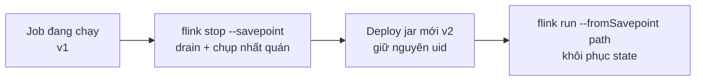
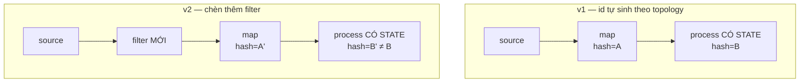
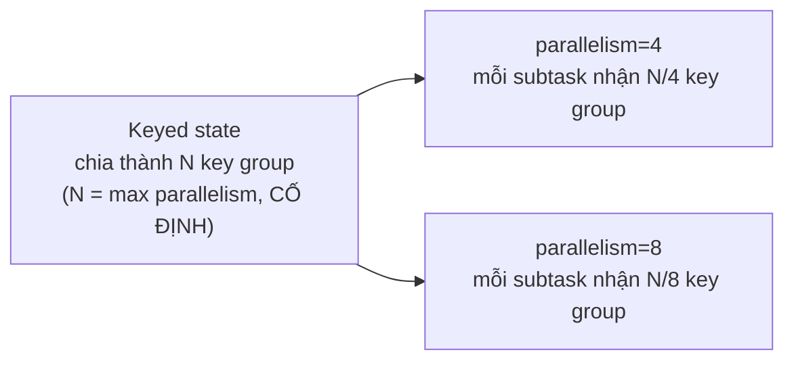

# Savepoint và nâng cấp job

> **Chốt:** Muốn sửa code streaming mà không mất state, bạn cần **savepoint** + một
> `.uid("...")` **cố định** trên mọi stateful operator. Thiếu uid, Flink tự sinh id theo
> topology — đổi một chỗ là toàn bộ ánh xạ state vỡ.

Job streaming giữ state sống hàng tháng. "Deploy version mới" mà không nghĩ tới state
nghĩa là ném đi state đó, hoặc job không start lại được.

## Savepoint vs checkpoint

| | Checkpoint | Savepoint |
|---|---|---|
| Ai kích hoạt | Flink, tự động định kỳ | Người, thủ công |
| Mục đích | **Chịu lỗi** — job crash tự khôi phục | **Nâng cấp / di chuyển / A-B / lưu trữ** |
| Vòng đời | Flink tự dọn bản cũ | Bạn giữ tới khi không cần |
| Định dạng | Native (tối ưu tốc độ, có thể incremental) | Canonical (portable) hoặc native |
| Sở hữu / dọn dẹp | Flink quản; xoá khi retain vượt số cấu hình | **Bạn** quản; Flink không tự xoá |
| Tốc độ chụp | Nhanh (incremental, sát cơ chế state backend) | Chậm hơn (canonical phải chuẩn hoá format) |

Hai thứ cùng cơ chế snapshot state (xem
[state và checkpoint](../reference/state-and-checkpoint.md)) nhưng khác **ý định**.
Checkpoint để máy tự cứu mình; savepoint để **bạn** chủ động can thiệp.

**Canonical vs native format:** savepoint canonical là định dạng độc lập state backend —
chụp bằng RocksDB, restore vào heap được, và bền hơn qua version. Native format nhanh hơn
(sát cơ chế backend) nhưng ràng buộc backend. Cho nâng cấp qua version hoặc đổi backend,
dùng canonical.

## Quy trình nâng cấp



```bash
# 1) Dừng job, chụp savepoint trong một bước (drain + stop nhất quán)
flink stop --savepoint /savepoints/my-job <jobId>
#   -> in ra đường dẫn savepoint, ví dụ: /savepoints/my-job/savepoint-abc123-...

# 2) Deploy artifact code mới (jar mới), giữ nguyên uid các operator

# 3) Khởi động lại từ savepoint
flink run --fromSavepoint /savepoints/my-job/savepoint-abc123-... my-job-v2.jar
```

Dùng `flink stop --savepoint` chứ đừng `cancel` rồi mới chụp — `stop` đảm bảo dừng đúng
điểm nhất quán (nó phát một watermark cuối `MAX_WATERMARK` để đóng mọi window đang mở
trước khi snapshot, gọi là **drain**). Cancel-rồi-chụp có thể để lại state nửa vời. (Cờ
chính xác có thể khác giữa các bản Flink — kiểm bằng `flink --help`, đừng tin trí nhớ về
flag.)

## Vì sao mỗi stateful operator cần `.uid()` cố định

Flink lưu state theo **operator ID**. Nếu bạn không đặt uid, nó **tự sinh id từ vị trí
operator trong topology** (hàm băm của cấu trúc đồ thị — dựa trên chuỗi các operator và
kết nối). Hệ quả:



- Thêm một `map` ở giữa, đổi thứ tự hai operator, hay chèn một filter → id tự sinh
  **thay đổi** → savepoint cũ không tìm thấy state cho operator "mới" → **mất state**,
  hoặc job từ chối start vì có state không khớp.

Đặt uid thủ công tách **danh tính** operator khỏi **vị trí** của nó:

```java
// Code minh hoạ, chưa chạy
stream
  .keyBy(e -> e.userId)
  .process(new DedupFunction())
  .uid("dedup-by-user")        // BẮT BUỘC trên MỌI operator có state
  .name("dedup");              // name chỉ để hiển thị UI, KHÔNG thay uid
```

Quy tắc: đặt uid **ngay từ v1**, trước khi có state để mất. Uid là chuỗi ổn định, đừng
bao giờ đổi sau khi đã lên production — đổi uid tương đương xoá state của operator đó.

### `allowNonRestoredState` — con dao hai lưỡi

```bash
flink run --fromSavepoint <path> --allowNonRestoredState my-job.jar
```

Cờ này bảo Flink: *"state trong savepoint không map được vào operator nào thì cứ bỏ, đừng
báo lỗi"*. Hữu ích khi **cố ý xoá** một operator. Nguy hiểm vì nó cũng **nuốt luôn lỗi
uid** — nếu bạn vô tình đổi uid, state đáng ra phải khôi phục bị lặng lẽ vứt đi, job vẫn
start như không có gì. Chỉ bật khi bạn *biết chắc* state nào đang bỏ và vì sao.

Nó chỉ xử một chiều: state trong savepoint **không có** operator nhận. Chiều ngược lại —
operator mới **không có** state trong savepoint — luôn được phép (operator mới khởi tạo
state rỗng), không cần cờ này.

## Schema evolution của state

State không đứng yên khi bạn sửa kiểu dữ liệu:

| Serializer | Thêm field | Xoá field | Đổi kiểu / đổi tên field | Cho state sống lâu? |
|---|---|---|---|---|
| **POJO** | OK (field mới nhận default) | OK (field bỏ bị lược) | **Không** an toàn | Được, có kiểm soát |
| **Avro** | OK (field có default) | OK | Theo luật Avro, bền hơn POJO | **Tốt nhất** |
| **Kryo** | Không | Không | Không | **Tránh** — coi như không evolve |

- **POJO** — Flink hỗ trợ thêm/bớt field. Đổi kiểu một field hoặc đổi tên thì phải xử lý
  bằng migration thủ công.
- **Avro** — evolution theo luật Avro (thêm field có default OK, kèm alias để đổi tên).
  Bền nhất cho state sống lâu.
- **Kryo** — coi như **không** evolve được. Kryo serialize theo thứ tự nội bộ, đổi lớp là
  hỏng. Tránh Kryo cho bất cứ state nào bạn định giữ qua nâng cấp.

Chọn Avro (hoặc POJO có kiểm soát) cho state phải sống qua nhiều lần deploy.

## Đổi parallelism qua savepoint

Đổi parallelism khi restore được, nhưng bị chặn bởi **max parallelism** (số key group cố
định lúc job chạy lần đầu):



- State keyed được chia thành **key group**; số key group = max parallelism, **cố định**
  từ lần đầu và **không đổi được** qua savepoint.
- Parallelism thực tế co giãn tự do trong khoảng `1..maxParallelism`.
- Đặt max parallelism đủ lớn từ đầu (mặc định Flink tự chọn theo parallelism ban đầu —
  nếu biết sẽ scale to, đặt tay lớn hơn). Đặt quá nhỏ → sau này không scale lên được mà
  không tạo state mới từ đầu. Đặt quá lớn → chút overhead metadata (thường chấp nhận
  được), nên nghiêng về đặt rộng tay.

## State Processor API — đọc/sửa savepoint

Khi cần **sửa** state trong savepoint (bootstrap state ban đầu, sửa dữ liệu hỏng, đọc
state để debug), dùng State Processor API — nó coi savepoint như một dataset đọc/ghi được
bằng batch job.

```java
// Code minh hoạ, chưa chạy — đọc state của operator "dedup-by-user" ra để kiểm tra
SavepointReader sp = SavepointReader.read(env, savepointPath, new HashMapStateBackend());
DataStream<KeyedState> state = sp.readKeyedState("dedup-by-user", new MyReaderFunction());
```

Đây là con đường duy nhất để **sửa** state ngoài luồng job đang chạy — ví dụ nạp state
khởi điểm từ một bảng batch trước khi start job streaming lần đầu.

## Common Mistakes

| Bẫy | Hậu quả |
|---|---|
| Không đặt `.uid()` từ v1 | Lần refactor đầu tiên mất sạch state |
| Đổi uid của operator đang chạy | Xoá state operator đó, âm thầm |
| Dùng `.name()` tưởng là uid | name không ảnh hưởng state mapping |
| Bật `allowNonRestoredState` thường xuyên | Nuốt lỗi uid, mất state không báo |
| State kiểu Kryo giữ qua upgrade | Không restore được sau khi sửa lớp |
| Max parallelism để mặc định rồi cần scale lớn | Kẹt, phải rebuild state |
| `cancel` rồi mới chụp savepoint | State nửa vời, window chưa drain |
| Không dọn savepoint cũ | Đầy storage — Flink không tự xoá savepoint |

## FAQ

<details>
<summary>Có cần uid cho operator không có state (map, filter thuần) không?</summary>

Không bắt buộc về mặt state, nhưng đặt hết cho **nhất quán** là thói quen tốt — đỡ phải
phân vân cái nào có state cái nào không khi topology lớn dần. Chi phí bằng không.

</details>

<details>
<summary>Savepoint có xài lại được qua các version Flink không?</summary>

Thường có (savepoint dùng định dạng canonical, portable), nhưng luôn kiểm ma trận tương
thích của bản đích trước khi nâng version Flink — đừng giả định. Test trên môi trường
staging trước, không nhảy thẳng production.

</details>

<details>
<summary>Restore từ checkpoint được không, hay chỉ savepoint?</summary>

Restore từ checkpoint retained được (`flink run --fromSavepoint <checkpoint-path>` chấp
nhận cả checkpoint), nhưng checkpoint dùng native format nên ràng buộc backend hơn và
Flink có thể dọn nó bất cứ lúc nào. Cho nâng cấp có kế hoạch, chụp savepoint chủ động —
bạn kiểm soát vòng đời của nó.

</details>

## Related Topics

- [State và checkpoint](../reference/state-and-checkpoint.md) — cơ chế snapshot bên dưới
- [Backpressure và tuning](backpressure-tuning.md) — max parallelism và scale
- [Case: state phình vì thiếu TTL](../case-studies/state-phinh-thieu-ttl.md)
- [Kỹ năng — Flink](../index.md)
