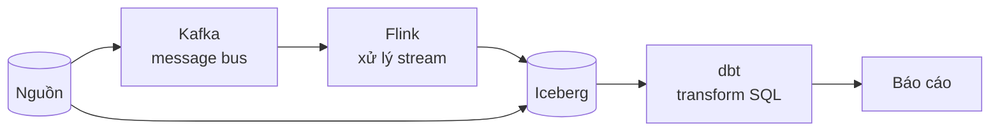

# ETL & Streaming

| Công nghệ | Vai trò | Trạng thái |
|---|---|---|
| [**dbt**](dbt/) | Chữ **T** trong ELT — transform SQL có DAG và test | 🔄 đang học |
| [Kafka](kafka/) | Message bus — một cái log, không phải hàng đợi | ⬜ chưa bắt đầu |
| [Flink](flink/) | Xử lý stream có state, theo event time | ⬜ chưa bắt đầu |

**dbt trước Kafka/Flink.** dbt dùng được ngay với kiến thức SQL sẵn có và lỗi của nó
rẻ. Kafka/Flink là hệ phân tán chạy liên tục — sai một cấu hình là mất một buổi mà
không biết nghi ai.

## Related Topics

- [Data Modeling](../data-modeling/) — thiết kế bảng trước khi transform
- [Iceberg](../storage/iceberg/) · [Trino](../query-engines/trino/) — nơi dữ liệu hạ cánh
