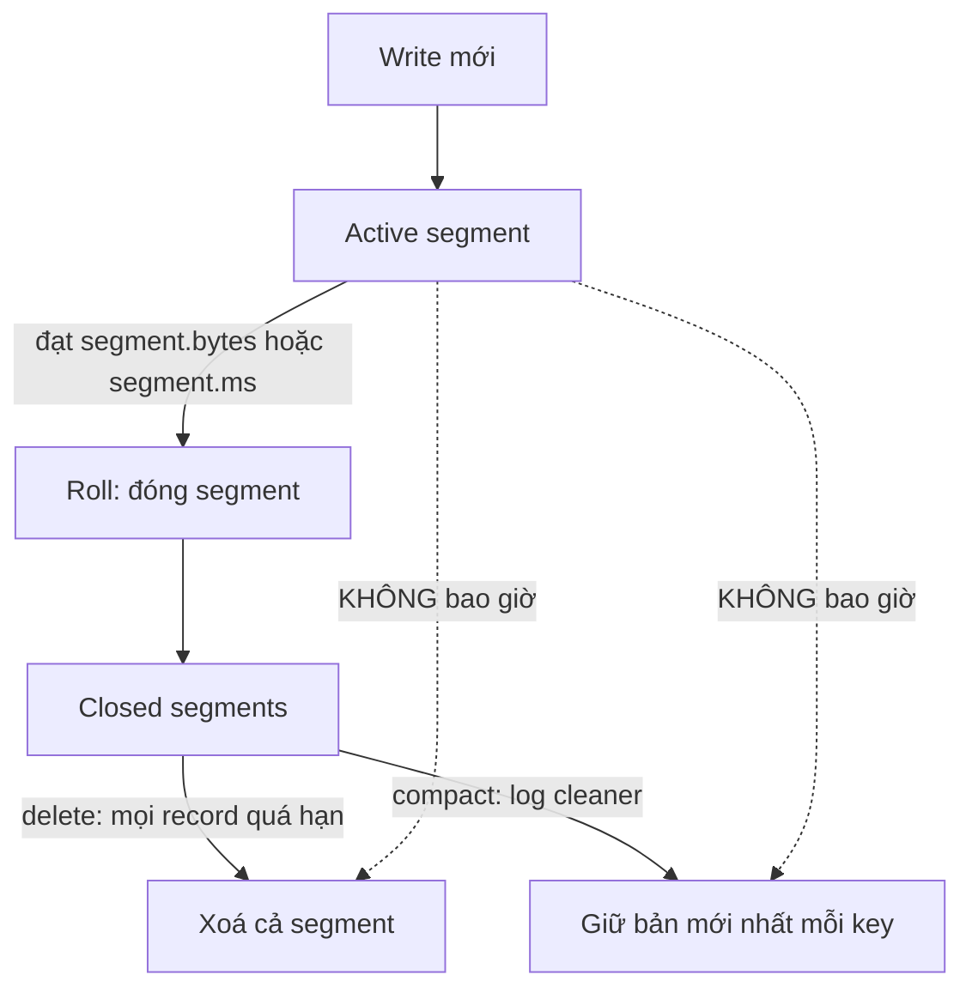

# Retention và log compaction

> **Chốt:** `cleanup.policy=delete` dọn theo **thời gian/dung lượng** (xoá cả segment, không xoá message lẻ); `cleanup.policy=compact` giữ **bản mới nhất mỗi key** — chọn sai policy là chọn sai ngữ nghĩa dữ liệu.

Log không thể phình mãi, nên Kafka phải dọn. Có đúng hai cơ chế, và chúng trả lời hai câu hỏi khác nhau: "dữ liệu này còn cần trong bao lâu?" (delete) vs "tôi chỉ cần trạng thái mới nhất của mỗi thực thể" (compact).

## Vòng đời segment — nền tảng của cả hai cơ chế

Trước khi hiểu retention hay compaction, phải hiểu **segment**. Mỗi partition không phải một file khổng lồ mà là một chuỗi **segment file** có kích thước giới hạn. Tại một thời điểm, đúng **một** segment là **active segment** — nơi mọi write mới được append. Các segment còn lại đã **đóng** (closed), bất biến.

```text
partition-0/
  00000000000000000000.log   <- segment đã đóng (base offset 0)
  00000000000000050000.log   <- segment đã đóng (base offset 50000)
  00000000000000097000.log   <- ACTIVE segment (đang append)  <== không bị xoá/compact
  ...cùng các file .index, .timeindex đi kèm
```

Segment **rolling** (đóng cái cũ, mở cái mới) xảy ra khi một trong các điều kiện đạt:

| Config | Mặc định | Làm gì | Khi nào đổi |
|---|---|---|---|
| `segment.bytes` | `1073741824` (1 GiB, mặc định) | Active segment đạt kích thước này thì roll sang segment mới | Giảm cho topic ít traffic để segment đóng sớm hơn (retention/compaction mới đụng được) |
| `segment.ms` | `604800000` (7 ngày, mặc định) | Active segment mở lâu hơn thời gian này thì roll dù chưa đầy | Giảm khi topic ghi chậm mà cần dọn sớm |

**Luật vàng phải nhớ:** cả `delete` và `compact` **chỉ đụng segment đã đóng**, không bao giờ đụng active segment. Đây là gốc rễ của gần như mọi "sao dữ liệu chưa mất/chưa nén?".



## `cleanup.policy=delete` — dọn theo thời gian/dung lượng

Đây là mặc định. Kafka xoá dữ liệu cũ theo:

- `retention.ms` — giữ message trong bao lâu (theo thời gian).
- `retention.bytes` — giữ tối đa bao nhiêu byte mỗi partition (theo dung lượng).

Điểm mấu chốt về **cách xoá**: Kafka xoá theo **segment**, không xoá message lẻ. Một partition gồm nhiều file segment; Kafka chỉ xoá **cả một segment** khi *mọi* message trong segment đó đã quá hạn. Cụ thể, một closed segment đủ điều kiện xoá khi:

- **Theo thời gian:** timestamp của record **mới nhất** trong segment đã cũ hơn `retention.ms`. Vì lấy record mới nhất, cả segment phải "chín" hết mới bị xoá.
- **Theo dung lượng:** tổng byte của partition vượt `retention.bytes`, Kafka xoá các segment cũ nhất (theo base offset) cho tới khi về dưới ngưỡng.

Nghĩa là:

- Bạn **không** xoá được một message đơn theo nội dung.
- Một message có thể sống lâu hơn `retention.ms` một chút — tới khi cả segment chứa nó đủ điều kiện xoá. Vì vậy **`retention.ms` là cận dưới, không phải chính xác**: dữ liệu sống *ít nhất* chừng đó, thường lâu hơn cho tới khi segment đóng và chín.

Ví dụ số minh hoạ (chưa chạy):

```text
Ví dụ minh hoạ — chưa chạy. retention.ms = 3600000 (1 giờ). segment.ms = 24h.
- Record R ghi lúc 10:00, nằm trong active segment mở từ 09:00.
- Lúc 11:00 R đã "quá 1 giờ" nhưng active segment CHƯA roll (mở chưa đủ 24h/chưa đầy).
- Active segment không bị xoá => R vẫn còn, đọc được, dù đã quá retention.ms.
- Segment chỉ roll lúc 09:00 hôm sau (đủ segment.ms). Sau đó, khi record MỚI NHẤT
  trong segment đó quá 1 giờ, cả segment mới bị xoá.
=> R sống lâu hơn retention.ms rất nhiều. retention.ms là cận DƯỚI.
```

Dùng cho: event stream nơi bạn quan tâm *lịch sử trong một cửa sổ thời gian* — logs, clickstream, metrics.

## `cleanup.policy=compact` — giữ bản mới nhất mỗi key

Compaction giữ lại **giá trị mới nhất cho mỗi key**, xoá các bản cũ hơn của cùng key. Kết quả: log trở thành một "bảng trạng thái hiện tại" — với mỗi key, bản ghi cuối cùng là sự thật.

Dùng cho topic dạng **"trạng thái hiện tại"**: CDC (thay đổi từ DB), changelog của Kafka Streams, cấu hình theo key, snapshot bảng. Bạn không cần toàn bộ lịch sử của một key, chỉ cần giá trị hiện tại — nhưng vẫn muốn replay được toàn bộ trạng thái từ đầu topic.

### Log cleaner làm việc thế nào — hai lượt

Compaction do các **cleaner thread** (`log.cleaner.threads`) chạy nền thực hiện. Cleaner không nén cả partition một lúc mà chọn **partition "bẩn" nhất** để xử lý, dựa trên **dirty ratio**.

**Dirty ratio** = (byte trong phần "dirty", tức chưa từng được compact) / (tổng byte log có thể compact). Cleaner chỉ đụng partition khi tỉ lệ này vượt `min.cleanable.dirty.ratio`. Ý tưởng: đừng lãng phí I/O nén một log gần như đã sạch.

Khi chọn được partition, cleaner làm **hai lượt** trên phần dirty (các closed segment chưa compact):

1. **Lượt 1 — xây offset map:** quét toàn bộ phần dirty, xây một bản đồ trong bộ nhớ `key -> offset mới nhất của key đó`. Đây là "chân lý": với mỗi key, offset lớn nhất là bản cần giữ. Kích thước map bị giới hạn bởi `log.cleaner.dedupe.buffer.size` — nếu key quá nhiều, cleaner xử lý từng phần.
2. **Lượt 2 — copy giữ bản mới nhất:** đọc lại log tuần tự, ghi ra segment mới **chỉ** những record mà offset của nó **khớp** offset trong map (tức là bản mới nhất của key đó). Bản cũ hơn bị bỏ. Segment mới thay segment cũ.

Kết quả: log sau compaction vẫn giữ **thứ tự offset** và mỗi key chỉ còn bản mới nhất trong phần đã được compact.

| Config | Mặc định | Làm gì | Khi nào đổi |
|---|---|---|---|
| `min.cleanable.dirty.ratio` | `0.5` (mặc định) | Tỉ lệ dirty tối thiểu để cleaner đụng partition | Giảm (vd 0.1) để nén hăng hơn (bớt trùng nhanh hơn, tốn I/O); tăng để đỡ tải |
| `min.compaction.lag.ms` | `0` (mặc định) | Một record phải "sống" tối thiểu chừng này trước khi được phép compact | Đặt `>0` để consumer chậm kịp thấy mọi bản trước khi bị nén đi |
| `max.compaction.lag.ms` | rất lớn (mặc định ~`Long.MAX`) | Cận trên: record dirty phải được compact trong khoảng này, bất kể dirty ratio | Đặt để đảm bảo tombstone/bản mới được nén trong SLA (vd tuân thủ xoá dữ liệu) |
| `log.cleaner.threads` | `1` (mặc định) | Số cleaner thread mỗi broker | Tăng khi có nhiều compacted partition lớn |
| `log.cleaner.dedupe.buffer.size` | mặc định broker | Bộ nhớ cho offset map | Tăng khi mỗi partition có rất nhiều distinct key |

### Ví dụ số: before/after compaction

Số minh hoạ (chưa chạy) — một compacted topic lưu trạng thái tài khoản theo `user_id`:

```text
Ví dụ minh hoạ — chưa chạy. Log TRƯỚC compaction (offset : key -> value):
  0 : u1 -> {balance:100}
  1 : u2 -> {balance:50}
  2 : u1 -> {balance:120}
  3 : u3 -> {balance:0}
  4 : u2 -> {balance:75}
  5 : u1 -> {balance:120}     <- u1 mới nhất ở offset 5
  6 : u3 -> null              <- tombstone: xoá u3

Offset map sau lượt 1: { u1:5, u2:4, u3:6 }

Log SAU compaction (giữ bản mới nhất mỗi key; tombstone u3 giữ tạm):
  4 : u2 -> {balance:75}
  5 : u1 -> {balance:120}
  6 : u3 -> null             <- còn tới khi qua delete.retention.ms rồi mới biến mất

=> offset 0,1,2,3 (bản cũ của u1,u2 và bản có giá trị của u3) bị bỏ.
   Offset của record giữ lại KHÔNG đổi — vẫn là 4,5,6. Log có "lỗ" offset, điều bình thường.
```

**Tombstone** chi tiết: để **xoá hẳn một key** khỏi compacted topic, ghi một message có `value=null` cho key đó — gọi là tombstone. Consumer đọc nó hiểu "key này đã bị xoá". Tombstone **không bị nén đi ngay** cùng lượt compaction đầu — nó được giữ thêm `delete.retention.ms` (mặc định 24h) **sau khi** compaction đã xử lý nó, rồi mới bị dọn. Lý do sống còn: nếu tombstone biến mất quá sớm, một **consumer đang offline lâu** khi quay lại đọc từ đầu sẽ **bỏ lỡ lệnh xoá** — nó thấy các bản cũ của key nhưng không thấy tombstone, nên tưởng key vẫn tồn tại. `delete.retention.ms` là cửa sổ đảm bảo mọi consumer kịp thấy tombstone trước khi nó bị dọn.

| Config | Mặc định | Làm gì |
|---|---|---|
| `delete.retention.ms` | `86400000` (24h, mặc định) | Giữ tombstone chừng này (sau khi compact xử lý) để consumer kịp thấy lệnh xoá |

## Compaction là quá trình NỀN — cái bẫy lớn

Compaction **không tức thì**. Nó chạy nền theo log cleaner, kích hoạt theo ngưỡng (`min.cleanable.dirty.ratio`). Hệ quả người ta hay vấp:

- **Bản cũ của một key vẫn tồn tại** trên đĩa và **vẫn được consumer đọc thấy** cho tới khi compaction thực sự chạy qua. Đừng giả định "ghi bản mới xong thì bản cũ biến mất ngay". Consumer đọc từ đầu topic có thể thấy nhiều bản của cùng key.
- **Active segment không bao giờ bị compact.** Segment đang được ghi (active) luôn được để nguyên; compaction chỉ đụng các segment đã đóng. Nên các message mới nhất (kể cả trùng key) sẽ nằm đó chưa nén cho tới khi segment đóng lại.

Kết quả thực tế: một compacted topic **không đảm bảo mỗi key chỉ có đúng một bản tại mọi thời điểm** — nó đảm bảo *cuối cùng* sẽ hội tụ về bản mới nhất. Consumer của compacted topic phải xử lý được việc thấy nhiều bản của một key (áp dụng theo thứ tự, bản sau ghi đè bản trước). Xem [case study compaction không như mong đợi](../case-studies/compaction-khong-nhu-mong-doi.md).

## Kết hợp `compact,delete`

Đặt `cleanup.policy=compact,delete` để vừa nén theo key vừa áp retention theo thời gian. Khi bật cả hai, cả **log cleaner** (nén trùng key) và **retention** (xoá segment quá `retention.ms`/`retention.bytes`) cùng chạy trên partition. Dùng khi bạn muốn giữ trạng thái mới nhất mỗi key **nhưng** cũng muốn key hoàn toàn không được cập nhật quá lâu thì bị dọn — tránh compacted topic phình vì hàng triệu key một-lần-rồi-thôi tồn tại mãi. Ví dụ điển hình: changelog có key vòng đời hữu hạn (session, order tạm) mà bạn không muốn giữ vô thời hạn dù chúng là "bản mới nhất".

```properties
# Ví dụ minh hoạ, chưa chạy trên cluster:
# topic changelog dạng trạng thái, vừa nén vừa hết hạn key cũ
cleanup.policy=compact,delete
retention.ms=604800000      # 7 ngày — giá trị minh hoạ
delete.retention.ms=86400000
min.cleanable.dirty.ratio=0.5
```

## Mẫu changelog / state topic — vì sao bắt buộc phải compact

Compaction không phải tính năng phụ; nó là **nền tảng cho state trong stream processing**.

- **Kafka Streams changelog:** mỗi state store (aggregation, join, KTable) được sao lưu bởi một **compacted changelog topic**. Khi một task đổi instance/khởi động lại, nó **replay changelog** để dựng lại store. Nếu topic này dùng `delete` thay vì `compact`, các update cũ của một key bị xoá theo thời gian → replay ra state **thiếu/sai**. Compaction đảm bảo: dù topic đã chạy nhiều tháng, replay từ đầu vẫn cho đúng giá trị mới nhất của **mọi** key còn sống. Đây là lý do Streams **tự đặt `cleanup.policy=compact`** cho changelog.
- **CDC (Debezium, connector DB):** một topic CDC keyed theo primary key, giá trị là row mới nhất. Compact cho phép giữ "snapshot hiện tại của bảng" mà không phình vô hạn; DELETE ở nguồn phát ra tombstone để key biến mất khỏi snapshot. Consumer materialize lại bảng chỉ cần đọc compacted topic từ đầu.

Chốt: nếu topic của bạn là "trạng thái hiện tại có thể dựng lại bằng replay", nó gần như luôn phải là `compact`.

## Khi nào KHÔNG nên dùng compaction

- **Bạn cần toàn bộ lịch sử event** (audit, event sourcing đầy đủ). Compaction cố tình vứt bản cũ — dùng nó là mất lịch sử. Dùng `delete` với retention dài, hoặc archive ra object storage.
- **Message không có key ổn định.** Compaction vô nghĩa nếu không có key để nhóm; message key=null không được compact (không có key để giữ "bản mới nhất").
- **Bạn trông đợi xoá tức thì.** Nếu cần "xoá là mất ngay lập tức" thì compaction (nền, trễ) không đáp ứng.

## Trade-offs

| | `delete` | `compact` |
|---|---|---|
| Giữ lại | mọi message trong cửa sổ thời gian/size | bản mới nhất mỗi key |
| Hợp cho | event stream, log, metrics | trạng thái hiện tại, CDC, changelog |
| Xoá lẻ | không (theo segment) | qua tombstone (theo key) |
| Lịch sử đầy đủ | có (trong retention) | không (chỉ bản mới nhất) |
| Tức thì | xoá khi segment hết hạn | nền, không tức thì |
| Đơn vị dọn | cả segment | record trùng key (giữ offset gốc) |
| Cần key | không | có (key=null không được compact) |

## Common Mistakes

| Lỗi | Hậu quả | Phòng bằng |
|---|---|---|
| Tưởng compaction xoá bản cũ ngay | Consumer thấy nhiều bản cùng key, logic sai | Viết consumer idempotent theo key, chấp nhận nén là nền |
| Dùng compact cho topic cần full history | Mất lịch sử event âm thầm | Dùng `delete` retention dài + archive |
| Quên tombstone → key không bao giờ xoá | Compacted topic phình mãi | Ghi value=null để xoá; cân nhắc `compact,delete` |
| Tính "message mất sau đúng retention.ms" | Message sống thêm tới khi segment đủ điều kiện | Nhớ xoá theo segment, không theo message; retention.ms là cận dưới |
| `delete.retention.ms` quá ngắn | Consumer offline lâu bỏ lỡ tombstone → tưởng key còn sống | Đặt đủ dài cho consumer chậm nhất kịp đọc |
| Segment quá lớn trên topic ít traffic | Retention/compaction "không chạy" vì segment chưa roll | Giảm `segment.ms`/`segment.bytes` để segment đóng sớm |

## FAQ

<details>
<summary>Compacted topic có mất dữ liệu không?</summary>

Không mất *giá trị mới nhất* của mỗi key — đó chính là bảo đảm của compaction. Nó chỉ vứt các bản *cũ hơn* của cùng key. Nếu bạn cần các bản cũ đó, compaction không dành cho bạn.

</details>

<details>
<summary>Vì sao active segment không bị compact?</summary>

Segment đang được ghi liên tục thay đổi; compact nó sẽ phức tạp và tốn kém. Kafka đợi segment đóng (đủ size hoặc đủ thời gian) rồi mới nén. Đó là lý do bản trùng key mới nhất luôn còn thấy được một thời gian.

</details>

<details>
<summary>Dirty ratio là gì, vì sao cleaner không nén ngay?</summary>

Dirty ratio là tỉ lệ phần log "chưa từng được compact" trên tổng phần có thể compact. Cleaner chỉ đụng partition khi tỉ lệ vượt `min.cleanable.dirty.ratio` (mặc định 0.5), để không lãng phí I/O nén một log gần như đã sạch. Hệ quả: một topic ít trùng key có thể lâu mới được nén — điều bình thường.

</details>

<details>
<summary>Vì sao tombstone không biến mất ngay sau khi compact?</summary>

Vì một consumer đang offline lâu cần thấy tombstone để biết key đã bị xoá. Nếu tombstone bị dọn ngay, consumer đó khi replay từ đầu sẽ thấy bản cũ của key mà không thấy lệnh xoá → tưởng key vẫn tồn tại. `delete.retention.ms` (mặc định 24h) là cửa sổ giữ tombstone để mọi consumer kịp thấy.

</details>

## Related Topics

- [Kafka là gì](what-is-kafka.md) — vì sao không xoá message lẻ theo nội dung
- [Delivery semantics](delivery-semantics.md) — compacted changelog trong EOS
- [compaction không như mong đợi](../case-studies/compaction-khong-nhu-mong-doi.md) — bẫy nền/không tức thì
- [Kafka Connect CDC](../skills/kafka-connect-cdc.md) — nguồn dữ liệu changelog điển hình
- [Kafka](../index.md) — chủ đề tổng
