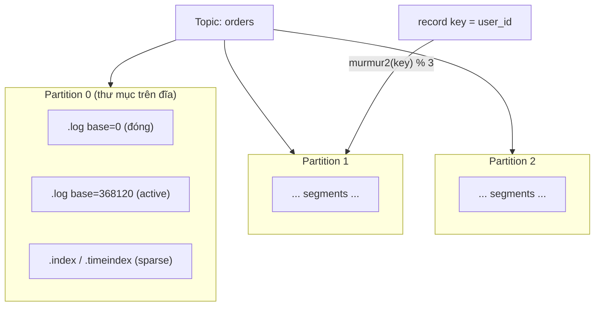

# Topic, partition, offset

> **Chốt:** Partition vừa là **đơn vị song song** vừa là **đơn vị thứ tự** — Kafka chỉ đảm bảo ordering *trong một partition*, không bao giờ xuyên partition. Trên đĩa một partition là chuỗi segment với sparse index dịch offset ra vị trí byte; muốn giữ thứ tự theo thực thể thì dùng key, và tăng partition sẽ phá ánh xạ key→partition một cách âm thầm.

Đây là mô hình nền của Kafka và cũng là nơi phần lớn lỗi "sao thứ tự loạn hết" bắt nguồn. Hiểu ba khái niệm này đúng là hiểu 80% Kafka.

## Topic chia thành partition

Một **topic** là tên logic của luồng dữ liệu. Về vật lý, topic chia thành nhiều **partition**, mỗi partition là **một log có thứ tự, append-only** nằm trên một broker (và các replica của nó). Producer ghi vào cuối partition; mỗi bản ghi nhận một **offset** — số nguyên tăng đơn điệu, duy nhất trong partition đó.

Vì mỗi partition là một log độc lập:

- **Song song**: N partition cho phép tới N consumer trong một group xử lý song song. Đây là cách Kafka scale throughput.
- **Thứ tự**: Kafka **chỉ** đảm bảo thứ tự đọc đúng thứ tự ghi **trong cùng một partition**. Hai message ở hai partition khác nhau — không có bảo đảm nào về ai đến trước.

Nói cách khác: **song song và thứ tự là cùng một trục.** Muốn nhiều song song hơn thì thêm partition, nhưng càng nhiều partition thì "đơn vị thứ tự" càng nhỏ.

## Partition trên đĩa: segment, base offset, sparse index

Một partition **không** phải một file khổng lồ. Nó là một thư mục chứa chuỗi **segment**, mỗi segment gồm ba file cùng tên (tên = base offset của segment):

```text
topic-orders-3/                     ← partition 3 của topic "orders"
├── 00000000000000000000.log        ← dữ liệu record (base offset 0)
├── 00000000000000000000.index      ← offset → vị trí byte trong .log (THƯA)
├── 00000000000000000000.timeindex  ← timestamp → offset (THƯA)
├── 00000000000000368120.log        ← segment tiếp, base offset 368120
├── 00000000000000368120.index
├── 00000000000000368120.timeindex
└── ...
```

- **base offset**: offset của record đầu tiên trong segment, cũng là tên file. Nhìn tên file là biết segment chứa khoảng offset nào.
- **`.log`**: chứa record batch nối tiếp nhau.
- **`.index`** (offset index): ánh xạ **thưa** `offset tương đối → vị trí byte`. "Thưa" nghĩa là **không** ghi mọi offset, chỉ ghi một entry sau mỗi `index.interval.bytes` (mặc định 4096 byte) dữ liệu. Đổi lại index nhỏ, giữ trong page cache.
- **`.timeindex`**: ánh xạ thưa `timestamp → offset`, phục vụ tìm theo thời gian (`offsetsForTimes`, "đọc từ 2 giờ trước").

### Tra một offset qua sparse index

Consumer muốn đọc offset 368500 (giả sử nằm trong segment base 368120). Cơ chế:

1. **Chọn segment** bằng tìm nhị phân trên tên file (base offset): 368500 nằm giữa segment base 368120 và segment kế tiếp → dùng segment 368120.
2. Trong `.index` của segment đó, tìm nhị phân entry gần nhất **không vượt quá** offset tương đối `368500 - 368120 = 380`. Sparse index không có entry cho đúng 380; nó có, ví dụ, entry cho offset tương đối 352 → vị trí byte 16480.
3. **Nhảy tới byte 16480** trong `.log` rồi **quét tuần tự** từ đó tới khi gặp offset 368500. Vì đoạn quét chỉ dài tối đa `index.interval.bytes`, chi phí bị chặn nhỏ.

Đó là mẹo hay: index thưa cho lookup **gần như** O(log n) mà tốn rất ít RAM/đĩa; phần "gần như" là đoạn quét tuyến tính ngắn cuối cùng.

### Active segment vs segment đã đóng, và rolling

- **Active segment**: segment cuối, nơi mọi ghi mới append. Chỉ có một active segment mỗi partition tại một thời điểm.
- **Segment đã đóng**: các segment trước, bất biến (immutable) — chỉ đọc, ứng viên cho retention/compaction.

Segment active bị **đóng (roll)** và mở segment mới khi:

| Điều kiện | Config | Mặc định phổ biến |
|---|---|---|
| Segment đủ lớn | `segment.bytes` | 1 GiB |
| Segment đủ già | `segment.ms` | 7 ngày |

Retention (xoá theo `retention.ms`/`retention.bytes`) và compaction chỉ tác động lên **segment đã đóng** — active segment không bao giờ bị xoá/nén. Đây là lý do đôi khi thấy "dữ liệu quá retention mà chưa mất": nó vẫn còn trong active segment chưa roll.

## Các loại offset: không chỉ có một con số

Nói "offset" một cách chung chung sẽ giấu đi vài offset quan trọng đồng thời tồn tại cho một partition:

| Offset | Ý nghĩa | Ai quan tâm |
|---|---|---|
| **Log-end offset (LEO)** | Offset của record kế tiếp sẽ được ghi (cuối log của leader) | Producer |
| **High-watermark (HW)** | Offset cao nhất đã được **replicate đủ tới mọi ISR** — consumer `read_uncommitted` chỉ đọc được **dưới** HW | Consumer, durability |
| **Last-stable-offset (LSO)** | Offset cao nhất mà **mọi transaction dưới nó đã kết thúc** (commit/abort) — consumer `read_committed` chỉ đọc tới LSO | Consumer transactional |
| **Committed offset** | Vị trí một **consumer group** đã xử lý xong (lưu ở `__consumer_offsets`) | Resume, lag |

Điểm cốt lõi: **consumer thường không đọc được tới tận LEO.** Với `read_uncommitted` nó bị chặn ở HW (record chưa replicate đủ thì chưa "hiện ra"); với `read_committed` nó bị chặn ở LSO (record trong transaction chưa commit thì chưa hiện ra). Xem [Delivery semantics](delivery-semantics.md) cho LSO và transaction.

**Leader epoch**: mỗi lần một partition đổi leader, epoch tăng. Follower dùng leader epoch để phát hiện và cắt bỏ (truncate) đúng những record "ma" nếu nó từng theo một leader cũ bị mất — chống log divergence khi leader nhảy qua lại. Đây là cái thay thế cho cơ chế truncate theo HW cũ vốn có edge case mất dữ liệu.

## Offset không phải bộ đếm message

Một điểm hay nhầm: nếu topic là **compacted**, bản cũ của một key bị nén đi để lại **lỗ offset** (offset 5 tồn tại, offset 6 bị nén mất, offset 7 tồn tại). Offset vẫn luôn **tăng đơn điệu** nhưng **không liên tục**. Đừng giả định `offset = số message đã xử lý` hay `lag = số message còn lại` một cách tuyệt đối với compacted topic.

## `__consumer_offsets`: nơi committed offset sống

Committed offset của mọi consumer group được lưu trong một **topic nội bộ compacted** tên `__consumer_offsets` (mặc định 50 partition). Nó là compacted vì ta chỉ cần **bản mới nhất** cho mỗi `(group, topic, partition)`:

```text
key   = (group.id, topic, partition)
value = committed offset + metadata (leader epoch, timestamp, ...)
```

Compaction giữ lại record mới nhất mỗi key → topic này không phình vô hạn dù group commit liên tục. Vì committed offset là dữ liệu Kafka bình thường trong một topic, nó cũng được replicate và chịu lỗi như mọi topic khác — không cần store ngoài. (Đây là lý do offset từng được lưu ở ZooKeeper thời xưa nay đã chuyển vào chính Kafka.)

## Key quyết định partition

Khi producer gửi message có **key**, Kafka chọn partition qua hash của key (mặc định thuật toán **murmur2**):

```text
partition = murmur2(key) % số_partition        # hành vi partitioner mặc định
```

Chính xác hơn: `toPositive(murmur2(serialized_key)) % numPartitions`. `toPositive` để bỏ dấu âm. Điểm mấu chốt: **cùng key → cùng partition → giữ thứ tự theo thực thể đó.** Ví dụ dùng `user_id` làm key thì mọi event của một user rơi vào cùng partition, đảm bảo xử lý đúng thứ tự cho user đó — dù toàn topic thứ tự tổng thể không được đảm bảo.

### Ví dụ số: 6 key hash vào 3 partition

Số minh hoạ — chưa chạy (giá trị hash là bịa để minh hoạ cơ chế, không phải output murmur2 thật):

```text
numPartitions = 3

key        murmur2(key) (minh hoạ)   % 3   → partition
"user-1"   1938472011                 → 0     p0
"user-2"   88213945                   → 1     p1
"user-3"   771230018                  → 2     p2
"user-4"   1120034877                 → 0     p0
"user-5"   455610232                  → 1     p1
"user-6"   9982110043                 → 1     p1     ← lệch: p1 nhận 3, p2 nhận 1
```

Hai điều rút ra: (1) mọi event của "user-1" **luôn** vào p0 → thứ tự theo user-1 được giữ; (2) phân phối **không** đều tuyệt đối — với ít key có thể lệch (hotspot). Với hàng triệu key phân phối đều dần, nhưng nếu vài key "nóng" (một seller khổng lồ) thì partition chứa nó thành hotspot dù hash đều.

### Key = null → sticky partitioner (KIP-480)

Nếu **key = null**: partitioner mặc định (Kafka mới, KIP-480) dùng **sticky partitioning** — gom một loạt message vào **cùng một partition** cho tới khi batch hiện tại đầy/đóng (`batch.size` hoặc `linger.ms`), rồi mới **đổi ngẫu nhiên** sang partition khác. Trước KIP-480 là round-robin **từng message** → mỗi partition nhận batch nhỏ, nhiều request, throughput kém.

Sticky partitioner đổi lấy: **batch đầy hơn → ít request hơn → throughput cao hơn và latency thấp hơn** ở tải vừa. Cái mất: không có key để neo → **không bảo đảm thứ tự theo thực thể**. Về lâu dài phân phối vẫn đều giữa các partition vì mỗi lần chuyển là ngẫu nhiên.

## Sơ đồ: topic → partitions → segments



## Cái bẫy lớn: tăng số partition phá ánh xạ key→partition

Bạn **tăng** được số partition của topic (không giảm được). Nhưng `murmur2(key) % N` phụ thuộc `N`. Đổi `N` → cùng một key có thể ánh xạ sang partition khác. Dữ liệu **cũ** vẫn nằm ở partition cũ, dữ liệu **mới** cùng key rơi sang partition mới → **thứ tự theo key bị phá vỡ tại thời điểm reshard**.

Ví dụ: với 3 partition, `user-42` luôn vào p1. Tăng lên 4 partition, `murmur2(user-42) % 4` có thể ra p3. Các event cũ của user-42 nằm ở p1, event mới ở p3 → consumer xử lý p1 và p3 độc lập, thứ tự tổng thể của user-42 **vỡ** ngay tại thời điểm tăng partition. Không có lỗi nào báo. Xem [case study mất thứ tự vì đổi key](../case-studies/mat-thu-tu-vi-doi-key.md).

### Hướng migrate khi buộc phải "reshard"

Vì tăng partition tại chỗ phá ngữ nghĩa, cách an toàn không phải sửa topic cũ mà là **tạo topic mới với số partition đúng rồi chuyển qua**:

1. **Tạo topic mới** `orders-v2` với số partition mục tiêu.
2. **Dual-write** (một khoảng): producer ghi cả `orders` và `orders-v2`, hoặc **replay** toàn bộ `orders` sang `orders-v2` bằng một job copy (MirrorMaker/Kafka Streams/Connect) — giữ nguyên key để ánh xạ mới nhất quán.
3. Để consumer bắt kịp `orders-v2` tới điểm cắt.
4. **Cutover**: chuyển consumer sang `orders-v2`, ngừng ghi `orders`, sau đó retire.

Chấp nhận: trong giai đoạn replay/dual-write, thứ tự tuyệt đối theo key giữa cũ và mới cần được xử lý cẩn thận (thường replay có thứ tự theo partition cũ rồi để consumer idempotent). Đây là lý do **sizing partition đủ từ đầu** rẻ hơn nhiều so với reshard về sau.

## Chọn số partition

| Được (nhiều partition) | Mất | Đổi lấy |
|---|---|---|
| Song song cao hơn, throughput lớn | Nhiều file/segment hơn → overhead I/O, mở file, page cache tản | Chi phí vận hành |
| Nhiều consumer trong group | Rebalance chậm hơn khi có nhiều partition | Thời gian phục hồi |
| — | "Đơn vị thứ tự" nhỏ đi (thứ tự tổng thể càng khó) | Ordering |
| — | Tăng sau này phá ánh xạ key→partition | Tính bất biến |
| — | Mỗi partition thêm metadata ở controller | Áp lực metadata cluster |

Quy tắc thực dụng: chọn đủ partition cho throughput đỉnh **dự kiến trong vòng đời topic** ngay từ đầu, vì tăng về sau tốn kém về mặt ngữ nghĩa. Ước lượng thô: `partitions ≈ max(throughput_mong_muốn / throughput_1_consumer, throughput_mong_muốn / throughput_1_partition)`. Đừng chọn 100 partition cho topic 10 msg/s — mỗi partition là file, replica, overhead.

## Common Mistakes

| Lỗi | Hậu quả | Phòng bằng |
|---|---|---|
| Mong thứ tự toàn topic | Xử lý sai thứ tự xuyên partition | Chấp nhận ordering chỉ trong partition; dùng key |
| Key = null nhưng cần thứ tự theo thực thể | Message cùng thực thể rải nhiều partition | Đặt key theo thực thể (`user_id`, `order_id`) |
| Tăng partition trên topic đang dùng key | Thứ tự theo key vỡ ngầm, không báo lỗi | Sizing đủ từ đầu; nếu buộc phải tăng, tạo topic mới + replay/dual-write |
| Giả định offset = số message | Đếm sai với compacted topic (lỗ offset) | Coi offset là vị trí, không phải bộ đếm |
| Tưởng consumer đọc được tới LEO | Ngạc nhiên vì record mới "chưa hiện" | Nhớ HW (read_uncommitted) và LSO (read_committed) chặn đọc |
| Ít key nhưng nhiều partition, mong đều | Hotspot vào vài partition, phần còn lại rảnh | Kiểm phân phối key; cân nhắc số partition theo cardinality key |

## FAQ

<details>
<summary>Số consumer trong một group nên bằng số partition?</summary>

Tối đa hữu ích = số partition. Nhiều consumer hơn partition thì số dư ngồi không (mỗi partition chỉ được một consumer trong group phục vụ). Ít hơn thì một consumer ôm nhiều partition — vẫn chạy, chỉ ít song song hơn.

</details>

<details>
<summary>Custom partitioner có được không?</summary>

Được, viết partitioner riêng để kiểm soát ánh xạ (ví dụ giữ ổn định khi thêm partition, hoặc tránh hotspot). Nhưng phần lớn trường hợp murmur2 mặc định là đủ, và tự viết dễ tạo hotspot nếu phân phối lệch.

</details>

<details>
<summary>Vì sao đọc theo offset lại nhanh dù log có hàng tỷ record?</summary>

Nhờ sparse index. Kafka tìm nhị phân segment theo base offset (tên file), rồi tìm nhị phân trong `.index` để nhảy tới một vị trí byte gần đúng, rồi quét tuyến tính một đoạn ngắn (tối đa `index.interval.bytes`) tới đúng offset. Index thưa nên nhỏ, nằm gọn trong page cache — tra offset gần như O(log n) mà tốn rất ít RAM.

</details>

## Related Topics

- [Kafka là gì](what-is-kafka.md) — log vs queue, segment, page cache, zero-copy
- [Replication và độ bền](replication-durability.md) — mỗi partition có leader/follower, ISR, high-watermark
- [Delivery semantics](delivery-semantics.md) — last-stable-offset, read_committed, PID + sequence
- [mất thứ tự vì đổi key](../case-studies/mat-thu-tu-vi-doi-key.md) — bẫy key→partition thực tế
- [Consumer groups](../skills/consumer-groups.md) — rebalance, gán partition
- [Kafka](../index.md) — chủ đề tổng
