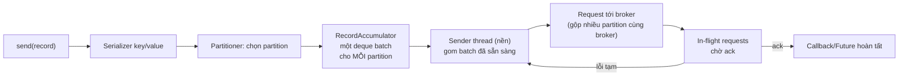

> **Chốt:** Chọn `acks` quyết định độ bền, `linger.ms`/`batch.size` quyết định throughput; bật `enable.idempotence=true` để retry không sinh bản trùng — và đừng bao giờ để `max.in.flight` lớn hơn 1 khi không idempotent.

Tài liệu này giả định bạn đã nắm [replication và durability](../reference/replication-durability.md) và [delivery semantics](../reference/delivery-semantics.md). Ở đây chỉ bàn: gặp một mục tiêu cụ thể thì xoay núm nào.

## Đường đi của một record trong producer

Trước khi chỉnh núm, phải biết record đi qua đâu — vì từng config gắn với một chặng cụ thể.



Bốn ý rút ra từ luồng này:

- **Accumulator gom theo partition.** Mỗi partition có một hàng batch riêng. `batch.size` là trần của **một** batch cho **một** partition, không phải trần toàn producer.
- **`send()` không đồng nghĩa "đã gửi".** Nó chỉ nhét record vào accumulator rồi trả `Future` ngay. Sender thread mới là kẻ thật sự đẩy đi. Vì thế `linger.ms` là "chờ ở accumulator", không phải chờ trên đường mạng.
- **Sender gộp nhiều partition cùng một broker vào một request.** Ít request TCP hơn số partition.
- **`buffer.memory` là tổng bộ nhớ accumulator.** Đầy thì `send()` bị chặn tới `max.block.ms`.

## Bảng config producer đầy đủ

| Config | Mặc định | Làm gì | Khi nào đổi |
|---|---|---|---|
| `acks` | `all` (bản mới) | Số replica xác nhận trước khi coi là ghi xong | `0`/`1` chỉ khi chấp nhận mất để đổi throughput/latency |
| `enable.idempotence` | `true` (bản mới) | Gán PID + sequence để broker khử bản trùng do retry | Hầu như luôn để `true`; tắt chỉ khi broker cũ không hỗ trợ |
| `retries` | `2147483647` | Số lần thử lại khi lỗi tạm | Hiếm khi đổi; giới hạn thực tế là `delivery.timeout.ms` |
| `delivery.timeout.ms` | `120000` | Trần tổng thời gian từ `send()` tới thành công/bỏ (gồm cả retry) | Tăng nếu broker hay chậm; đây là núm "bỏ cuộc" thật sự, không phải `retries` |
| `request.timeout.ms` | `30000` | Chờ tối đa cho **một** request tới broker trước khi coi là fail (rồi retry) | Tăng khi mạng/broker chậm; phải nhỏ hơn `delivery.timeout.ms` |
| `linger.ms` | `0` | Chờ tối đa để gom thêm record vào batch trước khi gửi | Tăng 5–20 để batch to hơn, throughput cao hơn |
| `batch.size` | `16384` (16 KB) | Trần một batch mỗi partition, byte | Tăng khi record nhỏ và nhiều; là trần, không phải mục tiêu |
| `buffer.memory` | `33554432` (32 MB) | Tổng bộ nhớ cho accumulator | Tăng khi producer nhanh mà broker/mạng chậm, để không chặn `send()` |
| `max.block.ms` | `60000` | `send()` chặn tối đa bao lâu khi buffer đầy hoặc metadata chưa có | Giảm nếu muốn fail nhanh thay vì treo |
| `max.in.flight.requests.per.connection` | `5` | Số request chưa ack cho phép song song trên một connection | Ép `1` nếu cần thứ tự mà KHÔNG bật idempotence |
| `compression.type` | `none` | Nén batch: `none`/`lz4`/`zstd`/`snappy`/`gzip` | Bật `lz4`/`zstd` để giảm mạng và tăng dung lượng batch hiệu dụng |

> Cột "Mặc định" ghi giá trị **mặc định** của client chính thức; bản Kafka cũ có thể khác — kiểm bằng doc đúng version, đừng bịa.

## Gặp tình huống → chỉnh gì

### Muốn không mất message → `acks`

`acks` là số replica phải xác nhận trước khi producer coi là ghi thành công.

| `acks` | Ý nghĩa | Rủi ro |
|---|---|---|
| `0` | Bắn xong quên luôn, không chờ ack | Mất ngay khi broker rớt hoặc mạng lỗi. Chỉ dùng cho metric/log chấp nhận mất |
| `1` | Leader ghi xong là xong | Mất nếu leader chết trước khi follower kịp sao chép — xem [case study mất dữ liệu acks=1](../case-studies/mat-du-lieu-acks-1.md) |
| `all` (`-1`) | Chờ đủ replica trong ISR xác nhận | Bền nhất. Phải đi kèm `min.insync.replicas` ở broker/topic mới có nghĩa |

Bẫy phổ biến: đặt `acks=all` nhưng để `min.insync.replicas=1`. Lúc đó "all" chỉ còn một replica trong ISR, độ bền tụt về ngang `acks=1` mà không ai báo. Muốn bền thật thì `acks=all` + `min.insync.replicas=2` (với replication factor 3).

### Muốn retry không sinh bản trùng → idempotence

```properties
enable.idempotence=true
```

Ở các bản Kafka mới đây, đây là **mặc định**. Khi bật, mỗi producer có một PID (Producer ID) và mỗi message trên mỗi partition mang một sequence number tăng dần. Broker nhớ sequence cuối đã ghi cho từng `(PID, partition)`:

- Sequence đúng bằng "cái tiếp theo mong đợi" → ghi.
- Sequence **trùng** cái đã ghi (do retry sau timeout) → broker bỏ qua, trả về như đã thành công. Không sinh bản đôi.
- Sequence **nhảy cóc** (thiếu ở giữa) → broker ném `OutOfOrderSequenceException`, buộc xử lý tường minh thay vì âm thầm mất thứ tự.

Idempotence ràng buộc ba thứ, và producer sẽ tự set hoặc báo lỗi nếu bạn chỉnh ngược:

```properties
enable.idempotence=true
acks=all                                   # bắt buộc
max.in.flight.requests.per.connection=5    # tối đa 5 để vẫn giữ thứ tự
retries=2147483647                         # >0, thường để rất lớn
```

Lưu ý: idempotence chỉ chống trùng **trong một session của một producer**, không phải exactly-once đầu-cuối. Muốn exactly-once qua nhiều topic/partition cần transaction (`transactional.id` + `initTransactions`), nằm ngoài phạm vi note này.

## Idempotence ↔ ordering ↔ max.in.flight

`max.in.flight.requests.per.connection` là số request chưa được ack mà producer cho phép gửi song song trên một connection. Đây là chỗ ba khái niệm giao nhau, và cũng là chỗ dễ mất thứ tự âm thầm nhất.

- **Không idempotent + `max.in.flight` lớn hơn 1**: nếu request 1 fail và được retry trong khi request 2 (gửi sau) đã thành công, thứ tự trên partition đảo — message sau nằm trước message trước. Không lỗi nào báo.
- **Idempotent bật**: broker dùng sequence number để phát hiện gap và từ chối batch sai thứ tự, buộc client gửi lại đúng trình tự. Nên `max.in.flight` tới 5 vẫn an toàn về thứ tự.

Kịch bản đảo thứ tự cụ thể (minh hoạ, chưa chạy), producer **không** idempotent, `max.in.flight=2`:

```text
t0  gửi batch A (msg 1,2)  và batch B (msg 3,4)  song song
t1  broker nhận B trước, ghi 3,4
t2  A gặp lỗi tạm (timeout), producer retry
t3  broker ghi A → 1,2  ĐỨNG SAU 3,4
     partition log: [3,4,1,2]   ← thứ tự vỡ, không exception
```

Kết luận: nếu vì lý do nào đó không bật idempotence mà vẫn cần thứ tự, phải ép `max.in.flight.requests.per.connection=1` — trả giá throughput.

## Batching: linger.ms và batch.size

Producer gom message thành batch theo partition. Hai núm chính:

```properties
linger.ms=10          # chờ tối đa 10ms gom thêm message trước khi gửi
batch.size=32768      # kích thước batch tối đa mỗi partition, byte (mặc định 16384)
```

- `linger.ms=0` (mặc định) gửi ngay khi sender rảnh — độ trễ thấp nhất, batch nhỏ, throughput kém.
- Tăng `linger.ms` lên 5–20ms cho phép gom batch lớn hơn: ít request hơn, nén tốt hơn, throughput cao hơn, đổi lại thêm vài ms độ trễ. Đây là đánh đổi trung tâm.
- `batch.size` là trần, không phải mục tiêu. Nếu message tới nhanh, batch đầy trước khi hết `linger.ms` và gửi luôn.

### Sizing bằng ví dụ số (minh hoạ, chưa chạy)

Giả sử mỗi record ~1 KB, muốn nhắm batch ~32 KB để nén và request hiệu quả:

```text
# Số minh hoạ — chưa chạy
Throughput mục tiêu:  10.000 msg/s  ×  1 KB  = ~10 MB/s
batch.size:           32 KB  ≈  32 record một batch
Thời gian gom đủ 32:  32 / 10.000  ≈  3,2 ms

→ đặt linger.ms = 5 (hơi dư 3,2ms) để batch thường đầy trước khi hết linger
→ nếu đặt linger.ms = 50: batch vẫn ~32 record (đầy trước), chỉ tăng latency vô ích
→ nếu traffic tụt còn 1.000 msg/s: batch chỉ gom được ~5 record trong 5ms
    muốn batch to lại thì phải tăng linger.ms, đổi latency lấy throughput
```

Rút ra: `linger.ms` chỉ "cắn" khi traffic **thấp hơn** tốc độ làm đầy batch. Traffic cao thì batch đầy trước, `linger.ms` gần như vô hiệu — tăng nó lúc đó chỉ hại latency.

## Compression: CPU vs mạng vs dung lượng batch

Nén xảy ra ở producer, trên nguyên **batch** (không phải từng message), và broker thường lưu nguyên trạng nén đó — consumer mới giải nén. Vì nén cả batch nên batch càng to, tỉ lệ nén càng tốt (nhiều dữ liệu lặp hơn để khai thác).

| `compression.type` | CPU producer | Tỉ lệ nén | Ghi chú |
|---|---|---|---|
| `none` | 0 | 1× | Latency thấp nhất, tốn mạng nhất |
| `lz4` | Thấp | Trung bình | Cân bằng tốt, mặc định thực dụng cho nhiều ca |
| `snappy` | Thấp | Trung bình-thấp | Rất nhẹ CPU, nén vừa |
| `zstd` | Trung bình | Cao | Tỉ lệ nén tốt nhất nhóm, CPU chấp nhận được — tốt khi mạng là nút cổ chai |
| `gzip` | Cao | Cao | Nén mạnh nhưng ngốn CPU, ít khi đáng so với zstd |

Đánh đổi ba chiều:

- **Mạng là nút cổ chai** → `zstd` (nén mạnh, giảm byte trên dây).
- **CPU producer eo hẹp** → `lz4`/`snappy`.
- **Latency là trên hết, mạng dư** → `none`.

Bẫy: nén hiệu quả cần batch đủ to. Nén với `linger.ms=0` và record lẻ tẻ thì tỉ lệ nén kém mà vẫn tốn CPU — nén và batching nên đi cùng nhau.

## Partitioner: cùng key vào cùng partition

Partitioner quyết định message đi partition nào:

- **Có key**: `partition = hash(key) % số_partition`. Cùng key → cùng partition → giữ thứ tự cho key đó. Đây là cơ chế bạn dựa vào để bảo toàn thứ tự per-key.
- **Key null**: bản mới dùng **sticky partitioner** — dồn vào một partition tới khi batch đầy rồi mới đổi, để batch to hơn thay vì rải đều từng message. Kết quả: throughput cao hơn round-robin cũ mà vẫn cân bằng dài hạn.

Bẫy chết người: **đổi số partition của topic làm `hash(key) % N` đổi kết quả**, key cũ có thể nhảy sang partition khác và thứ tự lịch sử vỡ. Xem [case study mất thứ tự vì đổi key](../case-studies/mat-thu-tu-vi-doi-key.md). Với dữ liệu cần thứ tự per-key, coi số partition gần như bất biến.

## Bảng "muốn X → chỉnh Y"

| Muốn | Chỉnh |
|---|---|
| Không mất message | `acks=all` + `min.insync.replicas=2` |
| Retry không sinh trùng | `enable.idempotence=true` (kéo theo `acks=all`, `retries>0`, `max.in.flight` tối đa 5) |
| Throughput cao | tăng `linger.ms` (5–20), tăng `batch.size`, bật `compression.type=lz4/zstd` |
| Độ trễ thấp nhất | `linger.ms=0`, không nén |
| Không treo khi buffer đầy | giảm `max.block.ms`, hoặc tăng `buffer.memory` |
| Không bỏ cuộc quá sớm khi broker chậm | tăng `delivery.timeout.ms` (và `request.timeout.ms` con nhỏ hơn) |
| Giữ thứ tự per-key | gửi có key + giữ nguyên số partition |
| Giữ thứ tự khi KHÔNG idempotent | `max.in.flight.requests.per.connection=1` |

## Common Mistakes

| Sai | Hậu quả | Sửa |
|---|---|---|
| `acks=all` nhưng `min.insync.replicas=1` | Độ bền thật chỉ ngang `acks=1` | Đặt `min.insync.replicas=2` |
| Tắt idempotence, để `max.in.flight=5` | Đảo thứ tự khi retry | Bật idempotence, hoặc ép `max.in.flight=1` |
| Tăng `linger.ms` rất cao để "nhanh hơn" | Độ trễ end-to-end phình ra | Giữ 5–20ms là đủ cho phần lớn ca |
| Chỉnh `retries` nhỏ để "fail nhanh" | Vô nghĩa — `delivery.timeout.ms` mới là trần thật | Chỉnh `delivery.timeout.ms` |
| Nén nhưng `linger.ms=0`, record lẻ tẻ | Tốn CPU, tỉ lệ nén kém | Nén đi kèm batching |
| Đổi số partition trên topic có key | Vỡ thứ tự per-key lịch sử | Cố định số partition khi cần thứ tự |

## FAQ

<details>
<summary>Đặt retries=0 cho "sạch" có nên không?</summary>

Không. `retries=0` biến mọi lỗi tạm thời (leader election, timeout mạng) thành mất message. Cứ để retries lớn và bật idempotence để retry không trùng. Núm để "bỏ cuộc" đúng nghĩa là `delivery.timeout.ms`, không phải `retries`.

</details>

<details>
<summary>batch.size to hơn thì luôn nhanh hơn?</summary>

Không tuyến tính. Batch quá to tốn bộ nhớ buffer và có thể tăng độ trễ nếu `linger.ms` cũng cao. Núm điều tiết thực sự cho độ trễ là `linger.ms`; `batch.size` chỉ là trần.

</details>

<details>
<summary>send() trả về Future rồi mà message vẫn mất được không?</summary>

Có. `Future` chỉ nghĩa "đã vào accumulator", chưa phải "đã ghi ở broker". Muốn biết ghi thật hay chưa phải chờ callback/`.get()` thành công. Với `acks=0` thì callback thành công cũng không đảm bảo bền.

</details>

## Related Topics

- [Replication và durability](../reference/replication-durability.md)
- [Delivery semantics](../reference/delivery-semantics.md)
- [Topic, partition, offset](../reference/topic-partition-offset.md)
- [Consumer group và rebalance](consumer-groups.md)
- [Vận hành và consumer lag](operations-lag.md)
- [Case study — mất dữ liệu acks=1](../case-studies/mat-du-lieu-acks-1.md)
- [Case study — mất thứ tự vì đổi key](../case-studies/mat-thu-tu-vi-doi-key.md)
- [Kafka index](../index.md)
