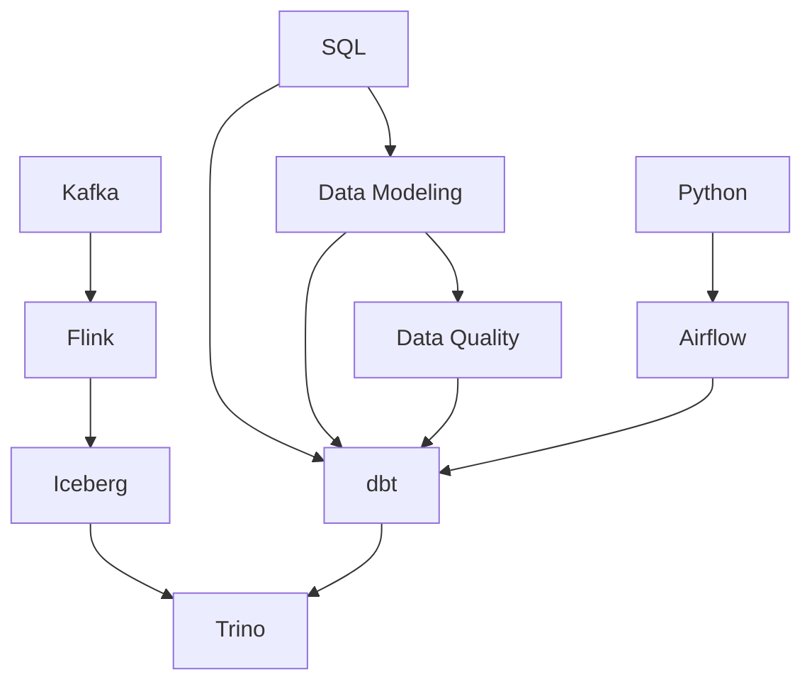

# Mục lục `docs/`

Trang này liệt kê **mọi file** trong `docs/` ở một chỗ, để không phải mở lần lượt từng
`index.md` con. Mỗi thư mục công nghệ vẫn có `index.md` riêng với bản đồ khái niệm và
lộ trình chi tiết — trang này chỉ trả lời *"thứ tôi cần nằm ở file nào"*.

**Ký hiệu:** ✅ đã chạy tay · 📝 lý thuyết, chưa kiểm chứng · 🟡 mới có khung + bẫy · 🗂️ mục lục

> **Hai đường vào cùng một tập file.** Trang này gom theo **chủ đề**. Muốn gom theo
> **dạng tài liệu** — tài liệu tham chiếu / bài tập / case study / cheatsheet — thì xem
> [`catalog.md`](catalog.md). Muốn cắt theo cả hai cùng lúc thì dùng trang tag, ví dụ
> [`/tags/data-modeling`](/tags/data-modeling).

## Data Modeling

Thiết kế bảng. Đọc [`grain`](data-modeling/reference/grain.md) trước mọi thứ khác.

| File | Trả lời câu hỏi | TT |
|---|---|---|
| [data-modeling/index](data-modeling/index.md) | Bản đồ khái niệm + thứ tự đọc | 🗂️ |
| [grain](data-modeling/reference/grain.md) | Một dòng của bảng này đại diện cho cái gì | ✅ |
| [fact-and-dimension](data-modeling/reference/fact-and-dimension.md) | Cái gì đo được vào fact, cái gì mô tả vào dimension | 📝 |
| [scd](data-modeling/skills/scd.md) | Thuộc tính đổi thì báo cáo quá khứ dùng giá trị nào — sáu cách | 📝 |
| [scd-change-detection](data-modeling/skills/scd-change-detection.md) | Bốn cách biết dòng nào đã đổi, và bốn bẫy của hash | 🟡 |
| [junk-dimension](data-modeling/skills/junk-dimension.md) | Cột cardinality thấp: để thẳng trong fact, tách dimension, hay gộp chung | 🟡 |
| [mini-dimension](data-modeling/skills/mini-dimension.md) | Tách cột đổi nhanh khỏi dim lớn — lịch sử chuyển sang fact | 🟡 |
| [role-playing-dimension](data-modeling/skills/role-playing-dimension.md) | Một dim nhiều vai — dùng view có tên rõ nghĩa, không copy bảng | 🟡 |
| [conformed-dimension](data-modeling/skills/conformed-dimension.md) | Cùng khoá và cùng nghĩa thì mới ghép được số giữa hai fact | 🟡 |
| [bridge-table](data-modeling/skills/bridge-table.md) | Nhiều-nhiều: hệ số phân bổ để tổng không phồng | 🟡 |
| [design-process](data-modeling/reference/design-process.md) | Từ yêu cầu nghiệp vụ mơ hồ tới bảng chạy được, bốn bước | 📝 |
| [star-snowflake-obt](data-modeling/reference/star-snowflake-obt.md) | Ba cách bố trí; đo thật OBT vs star: 0.76x hay 10.23x tuỳ cardinality | 📝 |
| [surrogate-key](data-modeling/reference/surrogate-key.md) | Vì sao không dùng thẳng mã nghiệp vụ làm khoá dimension | 🟡 |

## Data Quality

| File | Trả lời câu hỏi | TT |
|---|---|---|
| [data-quality/index](data-quality/index.md) | Ba tầng bảo vệ dữ liệu, không phụ thuộc công cụ | 🗂️ |
| [six-dimensions](data-quality/six-dimensions.md) | Uniqueness, completeness, validity, integrity, timeliness, accuracy | 📝 |

## ETL & Streaming

### dbt — [`etl/dbt/`](etl/dbt/index.md)

Lab ở `~/Documents/learn-lab/dbt` (ngoài repo): venv riêng, `dbt-duckdb`, seed sẵn.

| # | File | Trả lời câu hỏi | TT |
|---|---|---|---|
| — | [etl/dbt/index](etl/dbt/index.md) | Bản đồ khái niệm + lộ trình | 🗂️ |
| 01 | [what-is-dbt](etl/dbt/reference/what-is-dbt.md) | SQL mà dbt sinh ra thật sự trông thế nào | ✅ |
| 02 | [project-structure](etl/dbt/reference/project-structure.md) | `dbt_project.yml`, `profiles.yml`; `compiled/` khác `run/` chỗ nào | 📝 |
| 03 | [models-and-ref](etl/dbt/reference/models-and-ref.md) | `ref()` là cách duy nhất khai báo phụ thuộc; DAG selector, ephemeral, vòng | 📝 |
| 04 | [sources-seeds-snapshots](etl/dbt/reference/sources-seeds-snapshots.md) | source freshness, seed, và vì sao snapshot mất là mất luôn | 📝 |
| 05 | [materializations](etl/dbt/reference/materializations.md) | Cùng SELECT khác DDL; `is_incremental()` trước/sau, bốn câu hỏi | 📝 |
| 06 | [testing](etl/dbt/reference/testing.md) | Ba tầng: test · contract · unit test | 📝 |
| 07 | [macros-jinja-packages](etl/dbt/reference/macros-jinja-packages.md) | Jinja biến mất trong SQL compile; macro, run_query, hook | 📝 |
| 08 | [docs-and-lineage](etl/dbt/reference/docs-and-lineage.md) | manifest = ý định, catalog = hiện thực; `state:modified` cho CI | 📝 |
| SK | [skills/implementing-tests](etl/dbt/skills/implementing-tests.md) | Sáu loại test dbt: generic, package, singular, tự viết, unit test, contract | 📝 |
| CS | [case-studies/ai-sinh-sai-ten-catalog-trino](etl/dbt/case-studies/ai-sinh-sai-ten-catalog-trino.md) | Vì sao `verified_at` tồn tại — AI bịa tên catalog, mất một buổi | 📝 |

Bài tập chạy thật: [`etl/dbt/tutorials/dbt-lab-duckdb.md`](etl/dbt/tutorials/dbt-lab-duckdb.md).

### Streaming

| File | Chốt một câu | TT |
|---|---|---|
| [etl/kafka/index](etl/kafka/index.md) | Kafka là một cái log, không phải hàng đợi — message không mất khi đọc xong | 🟡 |
| [etl/flink/index](etl/flink/index.md) | Engine stream có state; event time và watermark là chỗ sai nhiều nhất | 🟡 |

## Storage · Query Engines · Orchestration

| File | Chốt một câu | TT |
|---|---|---|
| [storage/iceberg/index](storage/iceberg/index.md) | Table format — lớp metadata, không phải file format, không phải engine | 🟡 |
| [query-engines/trino/index](query-engines/trino/index.md) | Query engine phân tán, không lưu dữ liệu; đọc nhiều nguồn qua connector | 🟡 |
| [orchestration/airflow/index](orchestration/airflow/index.md) | Airflow điều phối, không xử lý — `logical_date` không phải "bây giờ" | 🟡 |

## Nền tảng

| File | Chốt một câu | TT |
|---|---|---|
| [databases/sql/index](databases/sql/index.md) | Phần SQL mà dbt và Trino bắt phải chắc: grain, join, window function, plan | 🟡 |
| [languages/python/index](languages/python/index.md) | Phần Python hạ tầng dữ liệu thật sự dùng — và khi nào **không** nên dùng pandas | 🟡 |

## Thư mục đã dựng, chưa có nội dung

[concepts](concepts/) · [architecture](architecture/) · [patterns](patterns/) ·
[algorithms](algorithms/) · [protocols](protocols/) · [tools](tools/) ·
[backend](backend/) · [frontend](frontend/) · [devops](devops/) · [cloud](cloud/) ·
[ai](ai/) · [security](security/) · [networking](networking/)

Mỗi thư mục có `_category_.json` (nhãn + thứ tự sidebar) và một `index.md` giữ chỗ —
Docusaurus báo lỗi nếu một category rỗng.

## Loại tài liệu khác

**Bài tập, case study, cheatsheet nằm *trong* từng chủ đề**, không gom ở thư mục toàn
cục nữa — mở dbt là thấy luôn bài tập và case study của dbt.

| Dạng | Ở đâu | Ví dụ |
|---|---|---|
| Bài tập | `docs/<chủ đề>/tutorials/` | [etl/dbt/tutorials/](etl/dbt/tutorials/index.md) |
| Case study | `docs/<chủ đề>/case-studies/` | [etl/dbt/case-studies/](etl/dbt/case-studies/index.md) |
| Cheatsheet | `docs/<chủ đề>/cheatsheets/` | [data-modeling/cheatsheets/](data-modeling/cheatsheets/index.md) |
| FAQ | toàn cục — cắt ngang nhiều chủ đề | [faqs/](faqs/index.md) |
| Thuật ngữ | toàn cục — cắt ngang nhiều chủ đề | [glossary/](glossary/index.md) |

`inbox/`, `templates/` và `anki/` nằm **ngoài** `docs/` nên không lên site — chúng phục
vụ việc vận hành repo và ôn tập, không phải nội dung tri thức. `anki/` chứa 215 thẻ TSV
sinh từ data-modeling và dbt; xem `anki/README.md`.

## Đường đi phụ thuộc

Học theo chiều mũi tên — cái sau giả định cái trước đã chắc.

