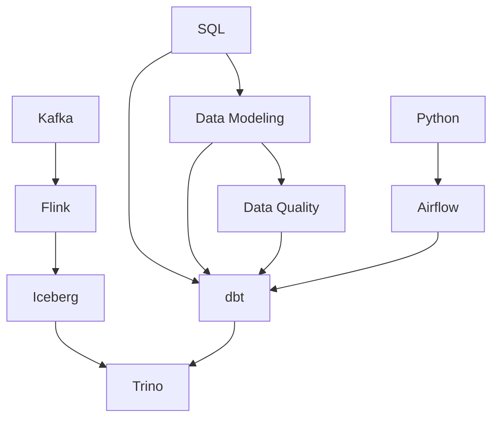

# Mục lục `docs/`

Trang này liệt kê **mọi file** trong `docs/` ở một chỗ, để không phải mở lần lượt từng
`index.md` con. Mỗi thư mục công nghệ vẫn có `index.md` riêng với bản đồ khái niệm và
lộ trình chi tiết — trang này chỉ trả lời *"thứ tôi cần nằm ở file nào"*.

**Ký hiệu:** ✅ đã chạy tay · 📝 lý thuyết, chưa kiểm chứng · 🟡 mới có khung + bẫy · 🗂️ mục lục

## Data Modeling

Thiết kế bảng. Đọc [`grain`](data-modeling/grain.md) trước mọi thứ khác.

| File | Trả lời câu hỏi | TT |
|---|---|---|
| [data-modeling/index](data-modeling/index.md) | Bản đồ khái niệm + thứ tự đọc | 🗂️ |
| [grain](data-modeling/grain.md) | Một dòng của bảng này đại diện cho cái gì | ✅ |
| [fact-and-dimension](data-modeling/fact-and-dimension.md) | Cái gì đo được vào fact, cái gì mô tả vào dimension | 📝 |
| [scd](data-modeling/scd.md) | Thuộc tính đổi thì báo cáo quá khứ dùng giá trị nào — sáu cách | 📝 |
| [junk-dimension](data-modeling/junk-dimension.md) | Cột cardinality thấp: để thẳng trong fact, tách dimension, hay gộp chung | 🟡 |
| [design-process](data-modeling/design-process.md) | Từ yêu cầu nghiệp vụ mơ hồ tới bảng chạy được, bốn bước | 📝 |
| [star-snowflake-obt](data-modeling/star-snowflake-obt.md) | Ba cách bố trí fact quanh dimension; lakehouse đảo chiều lời khuyên cũ | 🟡 |
| [surrogate-key](data-modeling/surrogate-key.md) | Vì sao không dùng thẳng mã nghiệp vụ làm khoá dimension | 🟡 |

## Data Quality

| File | Trả lời câu hỏi | TT |
|---|---|---|
| [data-quality/index](data-quality/index.md) | Ba tầng bảo vệ dữ liệu, không phụ thuộc công cụ | 🗂️ |
| [six-dimensions](data-quality/six-dimensions.md) | Uniqueness, completeness, validity, integrity, timeliness, accuracy | 📝 |

## ETL & Streaming

### dbt — [`etl/dbt/`](etl/dbt/index.md)

Lab ở `~/Documents/learn-lab/dbt` (ngoài repo): venv riêng, `dbt-duckdb`, seed sẵn.

| # | File | Trả lời câu hỏi | TT |
|---|---|---|---|
| — | [etl/dbt/index](etl/dbt/index.md) | Bản đồ khái niệm + lộ trình | 🗂️ |
| 01 | [what-is-dbt](etl/dbt/what-is-dbt.md) | SQL mà dbt sinh ra thật sự trông thế nào | ✅ |
| 02 | [project-structure](etl/dbt/project-structure.md) | `dbt_project.yml`, `profiles.yml`, `target/` | 🟡 |
| 03 | [models-and-ref](etl/dbt/models-and-ref.md) | `ref()` là cách duy nhất khai báo phụ thuộc | 🟡 |
| 04 | [sources-seeds-snapshots](etl/dbt/sources-seeds-snapshots.md) | Đưa dữ liệu vào DAG khi không phải model | 🟡 |
| 05 | [materializations](etl/dbt/materializations.md) | `view` / `table` / `incremental` / `ephemeral` | 🟡 |
| 06 | [testing](etl/dbt/testing.md) | Ba tầng: test · contract · unit test | 📝 |
| 07 | [macros-jinja-packages](etl/dbt/macros-jinja-packages.md) | Jinja chạy trước khi SQL rời máy | 🟡 |
| 08 | [docs-and-lineage](etl/dbt/docs-and-lineage.md) | `dbt docs`, rà tác động khi sửa cột | 🟡 |

Bài tập chạy thật: [`tutorials/dbt-lab-duckdb.md`](tutorials/dbt-lab-duckdb.md).

### Streaming

| File | Chốt một câu | TT |
|---|---|---|
| [etl/kafka/index](etl/kafka/index.md) | Kafka là một cái log, không phải hàng đợi — message không mất khi đọc xong | 🟡 |
| [etl/flink/index](etl/flink/index.md) | Engine stream có state; event time và watermark là chỗ sai nhiều nhất | 🟡 |

## Storage · Query Engines · Orchestration

| File | Chốt một câu | TT |
|---|---|---|
| [storage/iceberg/index](storage/iceberg/index.md) | Table format — lớp metadata, không phải file format, không phải engine | 🟡 |
| [query-engines/trino/index](query-engines/trino/index.md) | Query engine phân tán, không lưu dữ liệu; đọc nhiều nguồn qua connector | 🟡 |
| [orchestration/airflow/index](orchestration/airflow/index.md) | Airflow điều phối, không xử lý — `logical_date` không phải "bây giờ" | 🟡 |

## Nền tảng

| File | Chốt một câu | TT |
|---|---|---|
| [databases/sql/index](databases/sql/index.md) | Phần SQL mà dbt và Trino bắt phải chắc: grain, join, window function, plan | 🟡 |
| [languages/python/index](languages/python/index.md) | Phần Python hạ tầng dữ liệu thật sự dùng — và khi nào **không** nên dùng pandas | 🟡 |

## Thư mục đã dựng, chưa có nội dung

[concepts](concepts/) · [architecture](architecture/) · [patterns](patterns/) ·
[algorithms](algorithms/) · [protocols](protocols/) · [tools](tools/) ·
[backend](backend/) · [frontend](frontend/) · [devops](devops/) · [cloud](cloud/) ·
[ai](ai/) · [security](security/) · [networking](networking/)

Mỗi thư mục có `_category_.json` (nhãn + thứ tự sidebar) và một `index.md` giữ chỗ —
Docusaurus báo lỗi nếu một category rỗng.

## Loại tài liệu khác

| Thư mục | Chứa gì |
|---|---|
| [tutorials/](tutorials/) | Bài tập chạy thật, có ô dán output |
| [case-studies/](case-studies/) | Sự cố thật, kèm giả thuyết sai lúc đầu |
| [examples/](examples/) | Code chạy được nguyên trạng, để copy |
| [cheatsheets/](cheatsheets/) | Bảng tra nhanh khi **đang làm** |
| [faqs/](faqs/) | Câu hỏi cắt ngang nhiều chủ đề |
| [glossary/](glossary/) | Thuật ngữ, định nghĩa một câu |

`inbox/` và `templates/` nằm **ngoài** `docs/` nên không lên site — chúng phục vụ việc
vận hành repo, không phải nội dung tri thức.

## Đường đi phụ thuộc

Học theo chiều mũi tên — cái sau giả định cái trước đã chắc.

