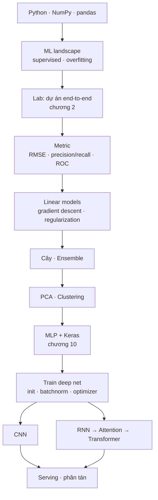

# Machine Learning

**Đây là nhóm *khái niệm* có kèm công cụ.** Khác data-modeling ở chỗ mọi thứ đều phải
chạy được — một mô hình không train ra số thì không có gì để tin. Khác dbt/Kafka ở chỗ
phần lý thuyết (bias/variance, gradient descent, attention) **mất giá rất chậm**, còn
phần API (`tf.keras`, `sklearn`) đổi mỗi phiên bản.

Vì thế kho này tách hai phần, và **đầu tư khác nhau cho từng phần**: lý thuyết viết kỹ
một lần, API chỉ ghi ở `cheatsheets/` để tra rồi vứt.

> Chỗ này trả lời **"mô hình học thế nào, và vì sao nó sai"**. Phần *đưa dữ liệu tới
> chỗ mô hình đọc được* nằm ở [ETL](../etl/index.md) và [Data Modeling](../data-modeling/index.md).

Trạng thái: **chưa bắt đầu**. Toàn bộ bảng dưới là mục lục dự kiến — chưa file nào được viết.

## Nguồn

Aurélien Géron — *Hands-On Machine Learning with Scikit-Learn, Keras & TensorFlow*,
ấn bản 3 (2022). **19 chương · 310 bài · 1.550 câu hỏi trắc nghiệm**, đọc trên một
platform học nội bộ.

Chọn một cuốn làm xương sống thay vì gom tài liệu rời là cố ý: có một thứ tự đã được
kiểm chứng thì mới đo được *còn thiếu bao nhiêu*. Bảng [Độ phủ](#độ-phủ-so-với-homl3)
bên dưới tồn tại để trả lời đúng câu đó.

## Hai chủ đề con

| Chủ đề | Chương HOML3 | Nội dung | Trạng thái |
|---|---|---|---|
| [**Foundations**](foundations/index.md) | 1–9 | Scikit-Learn — hồi quy, phân loại, SVM, cây, ensemble, PCA, clustering | ⬜ chưa bắt đầu |
| [**Deep Learning**](deep-learning/index.md) | 10–19 | Keras / TensorFlow — MLP, CNN, RNN, transformer, GAN, RL, deploy | ⬜ chưa bắt đầu |

**Tách ở ranh giới chương 9/10 vì đó là ranh giới thật của cuốn sách** — Part I dừng ở
chỗ mọi thứ còn fit trong `sklearn`, Part II bắt đầu khi phải tự viết vòng lặp train.
Gộp cả 19 chương vào một thư mục thì `reference/` có hơn 25 file và mục lục không đọc nổi.

## Learning path

**Đường ngắn nhất tới chỗ dùng được: ML landscape → Lab end-to-end → Metric → Linear
models → Ensemble.** Năm bước đó đủ để làm một bài toán tabular thật. Deep learning chỉ
trả công khi dữ liệu là ảnh, chữ hoặc chuỗi — với bảng số thì gradient boosting vẫn thắng.

## Bẫy lớn nhất, nói trước

| Bẫy | Hậu quả | Nằm ở |
|---|---|---|
| Fit scaler/imputer **trước** khi tách test set | Điểm test đẹp giả, production sập | [Foundations · case study](foundations/index.md) |
| Dùng accuracy trên dữ liệu lệch lớp | Đoán "luôn luôn không" cũng được 99% | [Foundations · metric](foundations/index.md) |
| Chọn hyperparameter bằng test set | Test set thành tập train thứ hai | [Foundations · cross-validation](foundations/index.md) |
| RNN dự báo time series học lặp lại giá trị cuối | Đường dự báo đẹp mà vô dụng | [Deep Learning · RNN](deep-learning/index.md) |
| Preprocessing lúc train khác lúc serve | Training/serving skew — mô hình đúng, output sai | [Deep Learning · serving](deep-learning/index.md) |

Cả năm đều **không phải lỗi code**. Chương trình chạy xanh, loss giảm đẹp. Sai ở bước
quyết định trước khi gọi `.fit()`.

## Độ phủ so với HOML3

| Chương | Tiêu đề | Số bài | Chủ đề | Trạng thái |
|---|---|---|---|---|
| 1 | The Machine Learning Landscape | 11 | Foundations | ⬜ |
| 2 | End-to-End Machine Learning Project | 20 | Foundations | ⬜ |
| 3 | Classification | 12 | Foundations | ⬜ |
| 4 | Training Models | 15 | Foundations | ⬜ |
| 5 | Support Vector Machines | 9 | Foundations | ⬜ |
| 6 | Decision Trees | 9 | Foundations | ⬜ |
| 7 | Ensemble Learning and Random Forests | 12 | Foundations | ⬜ |
| 8 | Dimensionality Reduction | 11 | Foundations | ⬜ |
| 9 | Unsupervised Learning Techniques | 16 | Foundations | ⬜ |
| 10 | Introduction to ANN with Keras | 22 | Deep Learning | ⬜ |
| 11 | Training Deep Neural Networks | 17 | Deep Learning | ⬜ |
| 12 | Custom Models and Training with TensorFlow | 12 | Deep Learning | ⬜ |
| 13 | Loading and Preprocessing Data with TensorFlow | 20 | Deep Learning | ⬜ |
| 14 | Deep Computer Vision Using CNNs | 24 | Deep Learning | ⬜ |
| 15 | Processing Sequences Using RNNs and CNNs | 15 | Deep Learning | ⬜ |
| 16 | NLP with RNNs and Attention | 18 | Deep Learning | ⬜ |
| 17 | Autoencoders, GANs, and Diffusion Models | 16 | Deep Learning | ⬜ |
| 18 | Reinforcement Learning | 12 | Deep Learning | ⬜ |
| 19 | Training and Deploying TF Models at Scale | 20 | Deep Learning | ⬜ |

**291 bài lý thuyết + 19 bộ bài tập cuối chương = 310.** Cột *Trạng thái* chuyển sang
🟡 khi chương đó đã có ít nhất một file, ✅ khi lab của nó đã chạy tay ra số.

Phủ hết 19 chương **không** phải mục tiêu. Chương 12 (custom TF) và 18 (RL) có thể dừng
ở mức một file reference — chúng hiếm dùng tới mức viết case study sẽ là bịa tình huống,
đúng thứ luật [R15](https://github.com/vuhoang001/knowledge/blob/main/ROUTING.md) tồn tại để chặn.

## Lab chạy ở đâu

Cùng quy ước với phần còn lại của kho: **code sống ngoài repo**, ở `~/learn-lab/ml/`
(venv riêng, `scikit-learn` + `tensorflow`). Repo chỉ giữ **input** và **kết quả đã dán lại**.

Khác với lab dbt ở một điểm: dataset của HOML3 (California housing, MNIST, Fashion-MNIST,
CIFAR-10) tải bằng hàm của thư viện, nên không cần seed trong `lab-starter/`. Cái phải
ghi lại là **seed ngẫu nhiên và phiên bản thư viện** — thiếu hai thứ đó thì con số dán
vào note không tái lập được, và note mất giá trị kiểm chứng.

## Related Topics

- [Python](../languages/python/index.md) — NumPy, pandas, nền của mọi thứ ở đây
- [Data Quality](../data-quality/index.md) — dữ liệu bẩn vào thì mô hình bẩn ra
- [Data Modeling](../data-modeling/index.md) — feature lấy từ bảng nào, grain nào
- [Glossary](../glossary/index.md)
