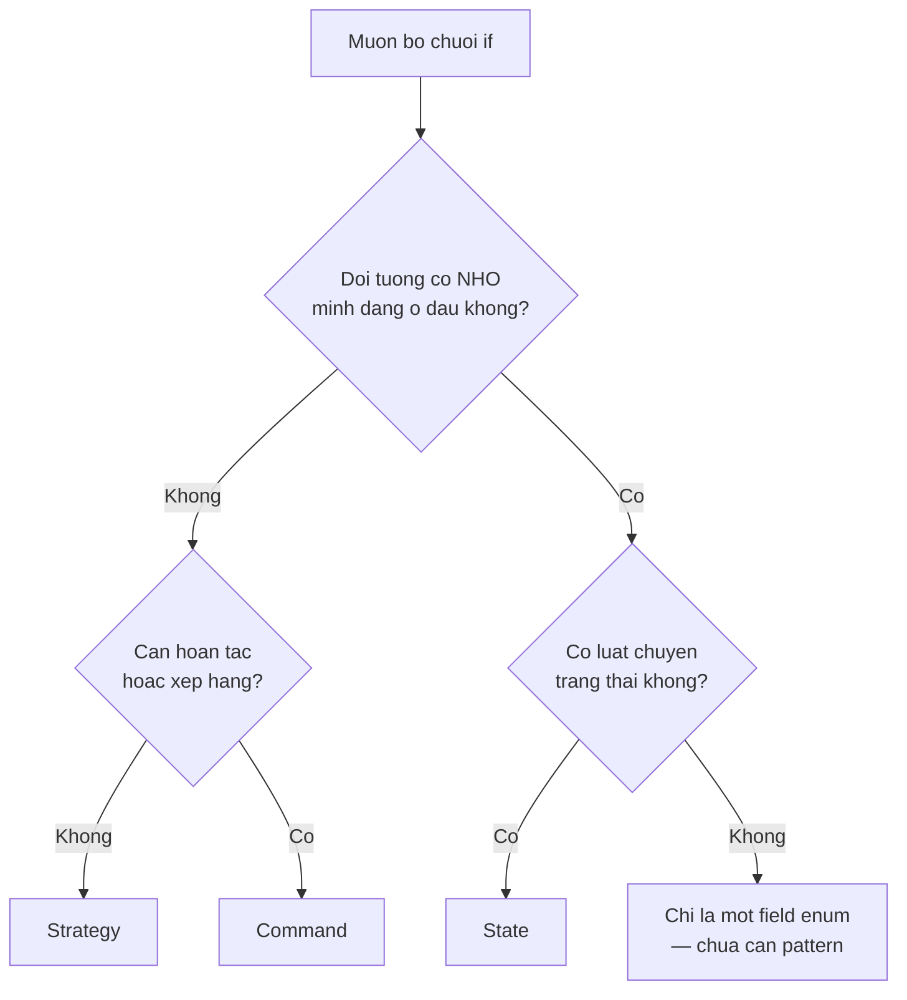

# Chọn pattern nào — đi từ triệu chứng, không từ danh sách

> **Chốt:** Đừng hỏi *"pattern nào hay?"*. Hỏi *"code của tôi đang đau ở đâu?"* rồi tra
> ngược. Ba pattern trông giống hệt nhau trên UML — Strategy, State, Command — trả lời
> ba câu hỏi khác hẳn, và ở dưới có bằng chứng chạy được.

## Mục tiêu

Biến 23 cái tên thành một bảng tra dùng được lúc đang sửa code, thay vì một danh sách
phải nhớ thuộc lòng.

## Đi từ triệu chứng

Tìm dòng mô tả đúng cái đang làm bạn khó chịu. Cột phải là chỗ đọc tiếp.

### Triệu chứng về việc tạo đối tượng

| Triệu chứng trong code | Pattern |
|---|---|
| `switch` trên một mã loại chỉ để `new` đúng lớp tương ứng | [Factory Method](../skills/factory-method.md) |
| Nhiều họ sản phẩm phải khớp nhau (nút + ô nhập + menu của cùng một theme) | [Abstract Factory](../skills/abstract-factory.md) |
| Constructor 9 tham số, nửa số đó `null`, gọi sai thứ tự vẫn biên dịch được | [Builder](../skills/builder.md) |
| Tạo mới rất đắt (đọc file, query), cần nhiều bản gần giống nhau | [Prototype](../skills/prototype.md) |
| Cần đúng một thể hiện dùng chung toàn ứng dụng | [Singleton](../skills/singleton.md) — đọc kỹ phần "khi nào đừng" |

### Triệu chứng về cách ghép các đối tượng

| Triệu chứng trong code | Pattern |
|---|---|
| Thư viện ngoài có API không khớp cái mình cần | [Adapter](../skills/adapter.md) |
| Tên lớp con ghép từ hai danh mục (`MysqlBaoCaoPdf`, `PostgresBaoCaoExcel`) | [Bridge](../skills/bridge.md) |
| Xử lý "một cái" và "một nhóm cái" bằng hai nhánh code khác nhau | [Composite](../skills/composite.md) |
| Muốn thêm hành vi (log, cache, retry) mà không sửa lớp gốc | [Decorator](../skills/decorator.md) |
| Người gọi phải biết 6 lớp và đúng thứ tự gọi mới xong một việc | [Facade](../skills/facade.md) |
| Hàng triệu đối tượng gần giống nhau ăn hết RAM | [Flyweight](../skills/flyweight.md) |
| Cần chen vào trước khi chạm tới đối tượng thật (lười tải, kiểm quyền, gọi xa) | [Proxy](../skills/proxy.md) |

### Triệu chứng về cách chúng nói chuyện

| Triệu chứng trong code | Pattern |
|---|---|
| Chuỗi `if` kiểm tra nhiều điều kiện, mỗi điều kiện một người xử lý | [Chain of Responsibility](../skills/chain-of-responsibility.md) |
| Cần undo/redo, hàng đợi thao tác, hoặc ghi lại thao tác để chạy lại | [Command](../skills/command.md) |
| Có một ngôn ngữ nhỏ cần phân tích (biểu thức lọc, công thức) | [Interpreter](../skills/interpreter.md) |
| Muốn duyệt một cấu trúc mà không lộ cách nó lưu bên trong | [Iterator](../skills/iterator.md) |
| n lớp cùng biết nhau, thành mạng nhện n×n | [Mediator](../skills/mediator.md) |
| Cần khôi phục trạng thái cũ mà không phá đóng gói | [Memento](../skills/memento.md) |
| Một chỗ đổi, nhiều chỗ cần biết, và số "nhiều chỗ" thay đổi được | [Observer](../skills/observer.md) |
| `if (trangThai == ...)` lặp lại ở nhiều method, và có luật chuyển trạng thái | [State](../skills/state.md) |
| Nhiều thuật toán cùng mục đích, chọn một lúc chạy | [Strategy](../skills/strategy.md) |
| Nhiều luồng giống nhau, khác đúng vài bước ở giữa | [Template Method](../skills/template-method.md) |
| Cần thêm **thao tác mới** lên một cây kiểu cố định | [Visitor](../skills/visitor.md) |

## Cây quyết định cho ba pattern hay bị lẫn



Nhánh `H` là nhánh hay bị bỏ quên nhất, và cũng là câu trả lời đúng thường xuyên nhất.

## Ví dụ xuyên suốt — bằng chứng ba pattern không thay thế nhau

Trên UML, Strategy / State / Command đều là *"một interface, nhiều lớp cài"*. Nhìn hình
thì y hệt. Cho **cùng một dãy thao tác** đi qua cả ba, kết quả nói rõ chúng khác nhau
chỗ nào.

Chạy bằng `dotnet run 05-choosing.cs` trên .NET 11.0.0. Dãy thao tác: nhấn ba lần.

```csharp
var day = new[] { "nhan", "nhan", "nhan" };
```

### Strategy — mỗi lần gọi độc lập

```csharp
interface IGiamGia { decimal Ap(decimal gia); }
sealed class GiamPhanTram(int pt) : IGiamGia { public decimal Ap(decimal gia) => gia * (100 - pt) / 100m; }
```

### State — đối tượng nhớ mình đang ở đâu

```csharp
sealed class DenGiaoThong
{
    public string TrangThai { get; private set; } = "Do";
    public void Nhan() => TrangThai = TrangThai switch { "Do" => "Xanh", "Xanh" => "Vang", _ => "Do" };
}
```

### Command — yêu cầu là đối tượng, nên hoàn tác được

```csharp
interface ILenh { void ThucThi(); void HoanTac(); }
sealed class RutTien(TaiKhoan tk, decimal tien) : ILenh
{
    public void ThucThi() => tk.So -= tien;
    public void HoanTac() => tk.So += tien;
}
```

### Kết quả

```text
Strategy — moi lan goi doc lap:
  gia 100.000 -> 90,000
  gia 100.000 -> 90,000
  gia 100.000 -> 90,000
State — cung mot thao tac, ket qua doi theo lich su:
  nhan -> Xanh
  nhan -> Vang
  nhan -> Do
Command — hoan tac duoc vi yeu cau la doi tuong:
  rut 20.000 -> so du 80,000
  rut 20.000 -> so du 60,000
  rut 20.000 -> so du 40,000
  hoan tac    -> so du 60,000
  hoan tac    -> so du 80,000
  hoan tac    -> so du 100,000

pattern      nho trang thai?   hoan tac?    ai chon nhanh?
----------------------------------------------------------
Strategy               khong       khong         nguoi goi
State                     co       khong   chinh doi tuong
Command         co (de undo)          co         nguoi goi
```

**Ba lần nhấn, ba kiểu kết quả.** Strategy ra ba dòng giống hệt — nó không có ký ức.
State ra ba dòng khác nhau — cùng một lệnh `Nhan()` cho ba kết quả vì đối tượng nhớ
lịch sử. Command ra sáu dòng — ba lần làm và ba lần gỡ ngược lại, vì mỗi thao tác đã
được vật hoá thành một đối tượng giữ đủ thông tin để tự đảo ngược.

### Bảng phân biệt

| Câu hỏi | Strategy | State | Command |
|---|---|---|---|
| Ai quyết định dùng nhánh nào | Người gọi | Chính đối tượng | Người gọi |
| Nhánh này có biết nhánh kế tiếp không | Không | **Có** — đó là luật chuyển trạng thái | Không |
| Gọi hai lần liên tiếp có ra kết quả giống nhau | Có | **Không** | Không (đã đổi trạng thái ngoài) |
| Lưu lại rồi chạy sau được không | Không có nghĩa | Không | **Có** |
| Nhầm sang cái này thì hỏng gì | Dùng Strategy cho luồng có luật chuyển → luật nằm rải ở người gọi | Dùng State cho thuật toán thuần → thêm tầng vô ích | Dùng Command khi không cần undo → mọi lệnh phải viết `HoanTac` rỗng |

Hàng cuối là chỗ đáng nhớ. Ca hỏng do dùng nhầm Strategy cho một máy trạng thái:
[Chuyển trạng thái trái phép](../case-studies/chuyen-trang-thai-trai-phep.md).

## Khi câu trả lời đúng là "không pattern nào"

Ba tình huống, cả ba đều phổ biến hơn người ta tưởng:

| Tình huống | Vì sao đừng |
|---|---|
| Chỉ có **một** biến thể, và không ai hứa sẽ có cái thứ hai | Trừu tượng hoá từ một mẫu gần như luôn chọn sai trục biến thiên |
| Danh sách nhánh do lập trình viên quyết định và chỉ dùng ở một chỗ | `switch` tại chỗ đọc nhanh hơn, và trình biên dịch kiểm tra được tính đầy đủ |
| Cả đội chưa ai từng đọc pattern đó | Chi phí giải thích vượt chi phí bài toán; pattern là từ vựng, từ vựng chỉ có giá trị khi được chia sẻ |

Xem thêm [Khi nào đừng dùng pattern](what-is-a-pattern.md#khi-nào-không-nên-dùng-pattern)
và ca hỏng [Abstract Factory cho một hiện thực](../case-studies/abstract-factory-cho-mot-hien-thuc.md).

## Các cặp hay bị lẫn

| Cặp | Khác nhau ở |
|---|---|
| [Adapter](../skills/adapter.md) ↔ [Facade](../skills/facade.md) | Adapter đổi **hình dạng** một API cho khớp; Facade **giấu bớt** nhiều API sau một cửa |
| [Decorator](../skills/decorator.md) ↔ [Proxy](../skills/proxy.md) | Decorator **thêm hành vi**, người gọi chọn bọc mấy lớp; Proxy **kiểm soát truy cập**, thường chỉ một lớp và người gọi không biết |
| [Strategy](../skills/strategy.md) ↔ [Template Method](../skills/template-method.md) | Strategy cắm đối tượng vào lúc chạy; Template Method cố định bằng kế thừa lúc biên dịch |
| [Composite](../skills/composite.md) ↔ [Decorator](../skills/decorator.md) | Cùng cấu trúc cây, nhưng Composite có **nhiều** con, Decorator có **đúng một** |
| [Mediator](../skills/mediator.md) ↔ [Observer](../skills/observer.md) | Mediator biết tất cả và điều phối; Observer chỉ phát tín hiệu, không biết ai nghe |
| [Builder](../skills/builder.md) ↔ [Abstract Factory](../skills/abstract-factory.md) | Builder dựng **một** object phức tạp theo nhiều bước; Abstract Factory dựng **một họ** object trong một lần |
| [State](../skills/state.md) ↔ [Strategy](../skills/strategy.md) | Xem bảng ở mục trên — State biết trạng thái kế tiếp, Strategy không |

## Trade-offs

| Được khi tra ngược từ triệu chứng | Mất |
|---|---|
| Không phải nhớ 23 cái tên | Phải mô tả được triệu chứng — cần đọc code kỹ trước |
| Tránh áp pattern khi chưa có vấn đề | Bảng tra có thể dẫn tới pattern quá mạnh cho vấn đề nhỏ |
| Nói chuyện với đội bằng vấn đề, không bằng giải pháp | Một triệu chứng đôi khi ứng với 2–3 pattern; vẫn phải đọc phần hệ quả |

## Common Mistakes

| Lỗi | Hậu quả |
|---|---|
| Chọn pattern theo cái vừa học xong | Mọi bài toán trông giống cái đinh |
| Dừng ở bảng tra, không đọc mục "khi nào KHÔNG dùng" của pattern đó | Áp đúng công thức, sai ngữ cảnh |
| Dùng Strategy cho luồng có luật chuyển trạng thái | Luật chuyển nằm rải ở mọi người gọi, không ai giữ |
| Dùng Command khi không có nhu cầu undo/queue | Mỗi lệnh phải có `HoanTac()` rỗng — mã chết |
| Áp hai pattern chồng lên cùng một chỗ đau | Không gỡ được cái nào ra khi bài toán đổi |

## FAQ

<details>
<summary>Một triệu chứng ra hai pattern thì chọn thế nào?</summary>

Chọn cái **yếu hơn** trước. Thứ tự leo thang thường dùng:

`switch` tại chỗ → delegate/`Func` → Strategy có lớp → Factory + Strategy → Abstract Factory

Dừng ở mức đầu tiên giải quyết được vấn đề hôm nay. Leo lên một bậc luôn dễ hơn tụt
xuống một bậc, vì tụt xuống nghĩa là gỡ abstraction mà cả đội đã quen.

</details>

<details>
<summary>Bảng tra này có đủ cho code không hướng đối tượng không?</summary>

Phần lớn vẫn đúng, chỉ đổi hiện thân. Trong C# hiện đại:

- Strategy → `Func<T, TResult>`
- Command → `record` + một hàm `Xu Ly`
- Template Method → hàm nhận delegate cho các bước biến thiên
- Observer → `event` hoặc `IObservable<T>`

Triệu chứng và hệ quả không đổi; chỉ số lượng code giảm. Đó là lý do bảng này tra theo
triệu chứng chứ không theo sơ đồ lớp.

</details>

<details>
<summary>Có nên ghi tên pattern vào tên lớp không?</summary>

Chỉ khi tên đó **giúp người đọc dự đoán đúng**. `PhiShipStrategy` nói thêm được rằng có
nhiều biến thể và chúng thay nhau được — đó là thông tin thật.

Ngược lại `OrderManagerFactoryStrategy` không nói lớp đó *làm gì*. Quy tắc: tên phải trả
lời "nó làm gì" trước, "nó được sắp xếp kiểu gì" sau, và chỉ khi còn chỗ.

</details>

## Related Topics

- [Design pattern là gì](what-is-a-pattern.md) — phần "khi nào đừng dùng"
- [SOLID](solid.md) — lý do đằng sau phần lớn các mục trong bảng
- [Coupling và cohesion](coupling-cohesion.md) — cái giá phải trả cho mỗi lần leo thang
- [Cheatsheet 23 GoF](../cheatsheets/gof-23.md) — bảng một trang, tra khi đang code
- [Bài tập: refactor switch sang pattern](../tutorials/refactor-switch-sang-pattern.md) — làm thật ba bậc leo thang

## References

- GoF — *Design Patterns*, phụ lục "Design Aliases" và bảng phân loại chương 1
