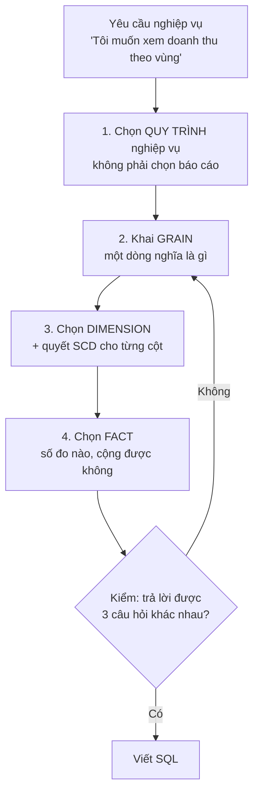

# Quy trình thiết kế 4 bước

> **Chốt:** Bốn bước Kimball — **chọn quy trình nghiệp vụ → khai grain → chọn
> dimension → chọn fact**. Thứ tự này không đổi được. Người mới luôn nhảy thẳng vào
> bước 4 ("cần những cột nào") và đó là lý do bảng của họ không trả lời được câu hỏi
> thứ hai.

## Mục tiêu

Phần lớn tài liệu data modeling dạy *khái niệm là gì* (fact, dimension, SCD) mà không
dạy *làm sao ra được thiết kế*. Đây là phần còn thiếu: quy trình đi từ câu nói của sếp
tới file `.sql`.

## Tổng quan

Vòng lặp về **bước 2** chứ không về bước 1 — vì sai thì gần như luôn sai ở grain.

## Bước 0 — Lấy yêu cầu nghiệp vụ *và* thực trạng dữ liệu, cùng lúc

Kimball xếp *gather business requirements and data realities* làm việc đầu tiên, và nhấn
mạnh chữ **và**: hỏi nghiệp vụ mà không mở dữ liệu nguồn ra xem thì thiết kế ra thứ không
dựng được; đọc dữ liệu nguồn mà không hỏi nghiệp vụ thì dựng ra thứ không ai cần.

Hai việc chạy **song song**, không nối tiếp:

| Phía nghiệp vụ | Phía dữ liệu |
|---|---|
| Anh/chị ra quyết định gì hằng tuần? | Bảng nguồn nào ghi việc đó? |
| Câu hỏi nào hiện không trả lời được? | Cột nào thật sự được điền đủ? |
| Số nào hiện đang phải tính tay bằng Excel? | Dữ liệu về trễ bao lâu ([đo thật](../skills/late-arriving.md)) |
| Khi số sai thì hậu quả là gì? | Bao nhiêu % dòng có khoá mồ côi? |

Cột phải là **đo được**, không phải hỏi. Đội nguồn nói *"cột này luôn có"*, nhưng
`count(*) FILTER (WHERE cot IS NULL)` mới là câu trả lời — và nó hay khác hẳn.

Sản phẩm của bước này là một câu duy nhất: *"quy trình X, grain Y, người dùng Z sẽ dùng
để quyết định W"*. Không viết được câu đó thì chưa đủ để đi tiếp.

### Workshop mô hình hoá chung — vì sao ngồi cùng phòng

Kimball đặt *collaborative dimensional modeling workshops* thành một kỹ thuật riêng, vì
cách làm phổ biến hơn — kiến trúc sư thiết kế xong rồi mang đi trình bày — hỏng theo một
kiểu rất khó sửa: nghiệp vụ gật đầu trong buổi trình bày vì họ không đọc được sơ đồ, rồi
ba tháng sau nói *"cái này không đúng ý tôi"*.

Cách làm thay thế: dựng mô hình **ngay trong phòng**, cùng người nghiệp vụ, trên bảng
trắng. Cụ thể:

- Người nghiệp vụ **tự khai grain** bằng tiếng của họ: *"một dòng là một lần khám"*.
- Mọi cột đều được **đặt tên bằng từ nghiệp vụ dùng**, không phải tên cột hệ nguồn.
- Mỗi thuộc tính đều có người trả lời được câu *"giá trị này đổi thì báo cáo cũ nên ra số
  nào"* — đó chính là quyết định [SCD](../skills/scd.md), và nó là quyết định **nghiệp
  vụ**, không phải kỹ thuật.

Cái đắt nhất mà workshop tránh được: phát hiện sau sáu tháng rằng "khách hàng hoạt động"
có ba định nghĩa, và fact đã nạp theo định nghĩa sai.

## Bước 1 — Chọn quy trình nghiệp vụ, không chọn báo cáo

**Sai:** "làm bảng cho dashboard doanh thu theo vùng".
**Đúng:** "mô hình hoá **sự kiện đặt hàng**".

Khác biệt quyết định tuổi thọ của bảng. Thiết kế theo *báo cáo* thì báo cáo thứ hai cần
một bảng khác, thứ ba cần bảng nữa — sau một năm có 40 mart chồng chéo, không cái nào
khớp cái nào. Thiết kế theo *quy trình* thì một bảng fact phục vụ mọi câu hỏi về sự
kiện đó.

**Cách nhận ra một quy trình nghiệp vụ:** nó là thứ **sinh ra dữ liệu**, thường ứng với
một hành động có thật và một hệ thống nguồn — đặt hàng, thanh toán, nhập kho, khám bệnh.
Nếu nó là "báo cáo tháng", "KPI phòng kinh doanh", "dashboard giám đốc" thì đó là *đầu ra*,
không phải quy trình.

**Chọn cái nào trước?** Cái vừa **đau nhất** vừa **dữ liệu sẵn nhất**. Đừng bắt đầu bằng
quy trình quan trọng nhất nếu nguồn của nó chưa sạch — dự án đầu tiên thất bại thì không
có dự án thứ hai.

### Bus matrix — bản đồ để không mỗi mart một kiểu

Trước khi làm bảng đầu tiên, kẻ một ma trận: hàng là quy trình, cột là dimension.

| Quy trình | Thời gian | Khách hàng | Hàng hoá | Cửa hàng | Nhân viên |
|---|---|---|---|---|---|
| Đặt hàng | ✅ | ✅ | ✅ | ✅ | ✅ |
| Thanh toán | ✅ | ✅ | | ✅ | |
| Nhập kho | ✅ | | ✅ | ✅ | ✅ |
| Trả hàng | ✅ | ✅ | ✅ | ✅ | |

Giá trị nằm ở **các cột dùng chung**. `dim_khach_hang` xuất hiện ở 3 quy trình → phải là
**một** bảng dùng chung (*conformed dimension*), không phải mỗi mart tự dựng một cái.

Không có bus matrix thì sau một năm bạn có ba định nghĩa "khách hàng hoạt động" khác nhau,
ba con số khác nhau cho cùng một câu hỏi, và không ai biết cái nào đúng. Đây là lỗi tổ
chức, không phải lỗi kỹ thuật — nên nó không tự lộ ra qua test.

Bus matrix nên là **một bảng trong kho**, không phải một slide: cách dựng, cách đo độ phủ
và cách dùng nó để xếp thứ tự ưu tiên nằm ở
[bus architecture, bus matrix và value chain](bus-architecture.md).

## Bước 2 — Khai grain

Viết **một câu**, cụ thể tới mức không cãi được:

> "Một dòng của `fct_don_hang_chi_tiet` là **một dòng hàng trong một đơn hàng**."

Không phải "bảng đơn hàng". Xem [Grain](grain.md).

**Ba quy tắc ở bước này:**

1. **Chọn grain mịn nhất có thể.** Cộng lên lúc nào cũng được; tách nhỏ thì không.
2. **Khai grain trước khi chọn cột.** Đảo thứ tự là cái bẫy phổ biến nhất — chọn cột
   trước rồi mới suy ra grain thì grain sẽ được uốn cho vừa với các cột đã chọn.
3. **Viết grain vào tài liệu và vào `schema.yml`.** Grain không ghi lại thì người sau
   đoán, và họ không biết là mình đang đoán.

## Bước 3 — Chọn dimension và quyết SCD

Với grain đã có, hỏi: **"mô tả sự kiện này bằng những chiều nào?"** — ai, cái gì, ở đâu,
lúc nào, thế nào.

Rồi với **từng cột một**, chạy [cây quyết định SCD](../skills/scd.md#khi-nào-nên-dùng). Đây là chỗ
duy nhất trong cả quy trình bắt buộc phải **hỏi người dùng nghiệp vụ**, không tự quyết:

| Hỏi thế này | Đừng hỏi thế này |
|---|---|
| "Khách chuyển từ Miền Bắc vào Nam. Doanh thu tháng 1 của họ hiện ở vùng nào?" | "Anh muốn SCD Type mấy?" |
| "Có khi nào cần in lại đúng báo cáo tháng trước không?" | "Có cần lưu lịch sử không?" |
| "Nếu tôi sửa tên khách hôm nay, báo cáo năm ngoái có được phép đổi không?" | "Cột này Type 1 hay Type 2?" |

Câu hỏi bên phải luôn nhận được câu trả lời "ừ, cứ lưu hết đi" — vô dụng. Câu hỏi bên
trái buộc người ta hình dung hậu quả cụ thể.

Kết quả bước này là một bảng như sau, và nó là **tài liệu thiết kế**:

| Cột | SCD | Vì sao |
|---|---|---|
| `ho_ten` | 1 | Đổi là do sửa lỗi chính tả, không ai chia báo cáo theo tên |
| `khu_vuc` | 2 | Có `GROUP BY`; nghiệp vụ xác nhận cần *as-was* |
| `ngay_mo_tai_khoan` | 0 | Đổi là dữ liệu hỏng |
| `nhom_thu_nhap` | 4 | Đổi hằng quý, dimension 5 triệu dòng |

## Bước 4 — Chọn fact

Cuối cùng mới tới số đo. Với mỗi cột số, hỏi hai câu:

1. **Nó có đúng grain đã khai không?** `thanh_tien` của một dòng hàng — đúng.
   `tong_tien_don_hang` — **sai grain**, nó thuộc mức đơn hàng; để vào đây là cộng lên
   sẽ nhân bản.
2. **Nó cộng được theo mọi chiều không?**
   - Cộng được hết (*additive*) — `thanh_tien`, `so_luong`.
   - Không cộng theo thời gian (*semi-additive*) — số dư cuối ngày.
   - Không cộng được (*non-additive*) — tỉ lệ, phần trăm, đơn giá.

**Tỉ lệ không bao giờ được lưu thẳng vào fact.** Lưu tử số và mẫu số, chia lúc query.
Cộng phần trăm lại rồi chia là ra số sai — và đây là lỗi lặng lẽ nhất trong cả bài này.

## Bước 5 (không có trong sách) — Kiểm trước khi viết SQL

Trước khi gõ dòng SQL đầu tiên, tự kiểm bằng ba câu hỏi **chưa từng nhắc tới lúc thiết kế**:

- "Doanh thu theo nhóm hàng, theo quý, chỉ tính khách ở Miền Nam?"
- "Khách nào mua tháng 1 mà không mua tháng 2?"
- "Trung bình mỗi đơn có bao nhiêu dòng hàng?"

Trả lời được cả ba bằng `GROUP BY` trên mô hình đã thiết kế → đi tiếp. Có câu phải thêm
bảng mới → quay lại **bước 2**, grain đang sai.

Rẻ hơn rất nhiều so với phát hiện sau khi đã nạp 200 triệu dòng.

## Trade-offs

| Làm đủ 4 bước | Nhảy thẳng vào viết SQL |
|---|---|
| Chậm hơn 1–2 ngày ở đầu dự án | Có bảng trong buổi chiều |
| Bảng trả lời được câu hỏi chưa ai hỏi | Mỗi câu hỏi mới là một bảng mới |
| Phải kéo được người nghiệp vụ vào cuộc | Không cần họp |
| Grain sai lộ ra khi còn rẻ | Grain sai lộ ra khi đã có 200 triệu dòng |

Quy trình này **không** đáng cho: bảng dùng một lần, phân tích ad-hoc, hoặc khi bạn là
người dùng duy nhất. Nó đáng khi bảng sẽ sống nhiều năm và nhiều người đọc.

## Common Mistakes

| Lỗi | Hậu quả |
|---|---|
| Thiết kế theo **báo cáo** thay vì theo **quy trình** | Sau một năm có 40 mart chồng chéo, không cái nào khớp |
| Chọn cột trước, suy ra grain sau | Grain bị uốn cho vừa cột đã chọn → sai từ gốc |
| Mỗi mart tự dựng `dim_khach_hang` riêng | Ba định nghĩa "khách hoạt động", ba con số, không ai biết cái nào đúng |
| Hỏi nghiệp vụ "muốn SCD mấy" | Nhận câu trả lời vô nghĩa, rồi tự quyết — và quyết sai |
| Lưu tỉ lệ/phần trăm vào fact | Cộng lên ra số sai, không có lỗi nào báo |
| Trộn hai grain trong một fact | Mọi `SUM` đều nhân đôi |

## FAQ

Quy trình này có còn đúng với lakehouse (Iceberg, dbt) không?

Có, và đúng nguyên. Kimball nói về **mô hình logic** — cái gì là dòng, cái gì là chiều.
Iceberg/dbt/Trino chỉ đổi cách *lưu và chạy*. Điều lakehouse đổi được là chi phí sai:
`table` build lại rẻ hơn ngày xưa nhiều, nên sửa thiết kế đỡ đau hơn — nhưng grain sai
vẫn là grain sai.

Không có ai làm nghiệp vụ để hỏi thì sao?

Đọc báo cáo họ đang dùng — đó là yêu cầu đã được viết ra, chỉ ở dạng khác. Cột nào xuất
hiện trong `GROUP BY` của báo cáo hiện tại thì cột đó cần Type 2. Ghi rõ trong tài liệu
là "giả định, chưa xác nhận" và để `verified_at` trống.

One Big Table thì có cần 4 bước này không?

Cần bước 1 và 2 (quy trình và grain) — chúng độc lập với cách bố trí bảng. Bước 3 và 4
gộp lại. OBT không bỏ được grain; nó chỉ bỏ được join. Xem
[Star, Snowflake, OBT](star-snowflake-obt.md).

Bus matrix vẽ khi nào — trước hay sau bảng đầu tiên?

Trước, nhưng chỉ cần phác. Mục đích không phải liệt kê đủ mọi quy trình, mà là **nhìn
thấy các dimension dùng chung** trước khi lỡ dựng ba bản sao của chúng.

## Related Topics

- [Grain](grain.md) — bước 2, bước quan trọng nhất
- [Fact và Dimension](fact-and-dimension.md) — bước 3 và 4
- [SCD](../skills/scd.md) — quyết định nằm trong bước 3
- [Star, Snowflake, OBT](star-snowflake-obt.md) — bố trí kết quả của 4 bước
- [6 chiều chất lượng](../../data-quality/six-dimensions.md) — kiểm sau khi đã có bảng

## References

- Kimball & Ross — *The Data Warehouse Toolkit* (3rd ed.), chương 1: "Four-Step
  Dimensional Design Process" và "Enterprise Data Warehouse Bus Matrix"
