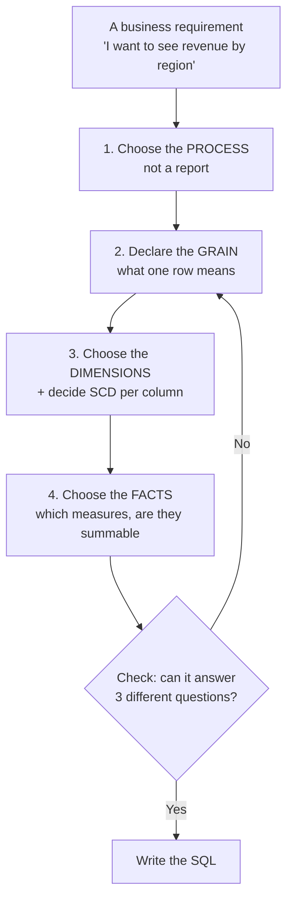

# The 4-step design process

> **Takeaway:** Kimball's four steps — **choose the business process → declare the grain → choose the
> dimensions → choose the facts**. That order can't be changed. Beginners always jump straight to
> step 4 ("which columns do I need") and that's why their table can't answer the second
> question.

## The goal

Most data-modeling documentation teaches *what the concepts are* (fact, dimension, SCD) without
teaching *how to arrive at a design*. This is the missing part: the process from your boss's sentence
to a `.sql` file.

## Overview

The loop goes back to **step 2**, not step 1 — because when it's wrong, it's almost always wrong at the grain.

## Step 0 — Gather the business requirements *and* the data realities, at the same time

Kimball puts *gather business requirements and data realities* first, and emphasises the
**and**: ask the business without opening the source data and you design something unbuildable;
read the source data without asking the business and you build something nobody needs.

The two run **in parallel**, not in sequence:

| The business side | The data side |
|---|---|
| What decisions do you make each week? | Which source table records that? |
| Which question can't be answered today? | Which columns are actually populated? |
| Which number is currently computed by hand in Excel? | How late does the data arrive ([measured for real](../skills/late-arriving.md)) |
| What's the consequence when a number is wrong? | What % of rows have orphaned keys? |

The right column must be **measured**, not asked. The source team says *"this column is always there"*, but
`count(*) FILTER (WHERE cot IS NULL)` is the actual answer — and it's often entirely different.

The output of this step is a single sentence: *"process X, grain Y, and user Z will use it
to decide W"*. If you can't write that sentence, you don't have enough to go on.

### Collaborative modeling workshops — why you sit in the same room

Kimball makes *collaborative dimensional modeling workshops* a technique in its own right, because
the more common approach — the architect designs it and then presents it — fails in a way that's very
hard to fix: the business nods along in the presentation because they can't read the diagram, and then
three months later says *"this isn't what I meant"*.

The alternative: build the model **right there in the room**, with the business people, on a
whiteboard. Specifically:

- The business person **declares the grain themselves**, in their own words: *"one row is one consultation"*.
- Every column is **named with the words the business uses**, not the source system's column name.
- Every attribute has somebody who can answer *"if this value changes, what number should an old
  report show"* — that is precisely the [SCD](../skills/scd.md) decision, and it's a **business**
  decision, not a technical one.

The most expensive thing a workshop avoids: discovering six months later that "active customer"
has three definitions, and the fact was loaded with the wrong one.

## Step 1 — Choose a business process, not a report

**Wrong:** "build a table for the revenue-by-region dashboard".
**Right:** "model the **order-placement event**".

The difference decides the table's lifespan. Design by *report* and the second report needs
a different table, the third needs another one — after a year you have 40 overlapping marts, none of
which agrees with any other. Design by *process* and one fact table serves every question about that
event.

**How to recognise a business process:** it's the thing that **produces data**, usually corresponding to
a real action and a source system — placing an order, taking a payment, receiving stock, seeing a patient.
If it's "the monthly report", "the sales department's KPI", "the director's dashboard", that's an *output*,
not a process.

**Which to pick first?** The one that's both **most painful** and has the **most available data**. Don't start with
the most important process if its source isn't clean yet — if the first project fails, there won't
be a second.

### The bus matrix — the map that keeps every mart from doing its own thing

Before building the first table, draw a matrix: rows are processes, columns are dimensions.

| Process | Time | Customer | Product | Store | Employee |
|---|---|---|---|---|---|
| Order placement | ✅ | ✅ | ✅ | ✅ | ✅ |
| Payment | ✅ | ✅ | | ✅ | |
| Stock receipt | ✅ | | ✅ | ✅ | ✅ |
| Returns | ✅ | ✅ | ✅ | ✅ | |

The value is in the **shared columns**. `dim_khach_hang` appears in 3 processes → it must be
**one** shared table (a *conformed dimension*), not each mart building its own.

Without a bus matrix, after a year you have three different definitions of "active customer",
three different numbers for the same question, and nobody knowing which is right. This is an organisational
error, not a technical one — so it never surfaces through a test.

The bus matrix should be **a table in the repo**, not a slide: how to build it, how to measure its coverage
and how to use it to order priorities is in
[bus architecture, the bus matrix and the value chain](bus-architecture.md).

## Step 2 — Declare the grain

Write **one sentence**, specific enough to be indisputable:

> "One row of `fct_don_hang_chi_tiet` is **one line item within one order**."

Not "the orders table". See [Grain](grain.md).

**Three rules at this step:**

1. **Choose the finest grain you can.** Rolling up is always possible; splitting down isn't.
2. **Declare the grain before choosing columns.** Reversing the order is the most common trap — choose the columns
   first and then infer the grain, and the grain gets bent to fit the columns you already chose.
3. **Write the grain into the documentation and into `schema.yml`.** An unrecorded grain means whoever comes next
   guesses, and they don't know they're guessing.

## Step 3 — Choose the dimensions and decide SCD

With the grain in hand, ask: **"which dimensions describe this event?"** — who, what, where,
when, how.

Then, **column by column**, run the [SCD decision tree](../skills/scd.md#when-to-use-which). This is the only
place in the whole process where you're obliged to **ask a business user** rather than decide yourself:

| Ask this | Don't ask this |
|---|---|
| "A customer moves from the North to the South. Which region does their January revenue sit in now?" | "Which SCD Type do you want?" |
| "Will you ever need to reprint last month's report exactly?" | "Do you need history stored?" |
| "If I fix a customer's name today, is last year's report allowed to change?" | "Is this column Type 1 or Type 2?" |

The right-hand questions always get the answer "sure, store everything" — useless. The left-hand
ones force people to picture a concrete consequence.

The output of this step is a table like the following, and it *is* the **design document**:

| Column | SCD | Why |
|---|---|---|
| `ho_ten` | 1 | Changes are spelling corrections; nobody splits reports by name |
| `khu_vuc` | 2 | It's in a `GROUP BY`; the business confirmed they need *as-was* |
| `ngay_mo_tai_khoan` | 0 | A change means corrupt data |
| `nhom_thu_nhap` | 4 | Changes quarterly, on a 5-million-row dimension |

## Step 4 — Choose the facts

Only at the end do you get to the measures. For each numeric column, ask two questions:

1. **Is it at the declared grain?** The `thanh_tien` of one line item — correct.
   `tong_tien_don_hang` — **the wrong grain**, it belongs at the order level; putting it here means summing it
   will duplicate.
2. **Is it summable along every dimension?**
   - Summable everywhere (*additive*) — `thanh_tien`, `so_luong`.
   - Not summable over time (*semi-additive*) — an end-of-day balance.
   - Not summable at all (*non-additive*) — ratios, percentages, unit prices.

**A ratio must never be stored directly in a fact.** Store the numerator and denominator, and divide at query time.
Adding percentages and then dividing gives a wrong number — and this is the quietest error in this whole document.

## Step 5 (not in the book) — Check before writing SQL

Before typing the first line of SQL, test yourself with three questions **never mentioned during the design**:

- "Revenue by product group, by quarter, counting only customers in the South?"
- "Which customers bought in January but not in February?"
- "How many line items does an order have on average?"

Answer all three with a `GROUP BY` on the model you designed → carry on. If one requires a new
table → go back to **step 2**, the grain is wrong.

Far cheaper than finding out after loading 200 million rows.

## Trade-offs

| Doing all 4 steps | Jumping straight to writing SQL |
|---|---|
| 1–2 days slower at the start of the project | A table by the afternoon |
| The table can answer questions nobody has asked yet | Every new question is a new table |
| You have to get the business people involved | No meetings needed |
| A wrong grain surfaces while it's still cheap | A wrong grain surfaces once there are 200 million rows |

This process is **not** worth it for: a one-off table, an ad-hoc analysis, or when you're
the only user. It's worth it when the table will live for years and be read by many people.

## Common Mistakes

| Mistake | Consequence |
|---|---|
| Designing by **report** rather than by **process** | After a year, 40 overlapping marts, none of which agrees |
| Choosing columns first and inferring the grain after | The grain is bent to fit the chosen columns → wrong from the root |
| Each mart building its own `dim_khach_hang` | Three definitions of "active customer", three numbers, nobody knowing which is right |
| Asking the business "which SCD do you want" | A meaningless answer, and then deciding yourself — wrongly |
| Storing ratios/percentages in a fact | Summing gives a wrong number, with no error reported |
| Mixing two grains in one fact | Every `SUM` doubles |

## FAQ

Does this process still apply to a lakehouse (Iceberg, dbt)?

Yes, entirely. Kimball is talking about the **logical model** — what a row is, what a dimension is.
Iceberg/dbt/Trino only change how it's *stored and run*. What the lakehouse does change is the cost of being wrong:
rebuilding a `table` is far cheaper than it used to be, so fixing a design hurts less — but a wrong grain
is still a wrong grain.

What if there's no business person to ask?

Read the reports they're using — those are written-down requirements, just in another form. Any column appearing
in a current report's `GROUP BY` needs Type 2. Note clearly in the documentation
that it's "an assumption, not confirmed" and leave `verified_at` empty.

Does One Big Table need these 4 steps?

It needs steps 1 and 2 (the process and the grain) — they're independent of the table layout. Steps 3 and 4
merge. OBT doesn't dispense with grain; it only dispenses with joins. See
[Star, snowflake, OBT](star-snowflake-obt.md).

When do you draw the bus matrix — before or after the first table?

Before, but a sketch is enough. The aim isn't to enumerate every process, but to **see
the shared dimensions** before you accidentally build three copies of them.

## Related Topics

- [Grain](grain.md) — step 2, the most important step
- [Facts and dimensions](fact-and-dimension.md) — steps 3 and 4
- [SCD](../skills/scd.md) — the decision that lives inside step 3
- [Star, snowflake, OBT](star-snowflake-obt.md) — laying out the result of the 4 steps
- [The six quality dimensions](../../data-quality/six-dimensions.md) — verifying once you have the table

## References

- Kimball & Ross — *The Data Warehouse Toolkit* (3rd ed.), chapter 1: "Four-Step
  Dimensional Design Process" and "Enterprise Data Warehouse Bus Matrix"
