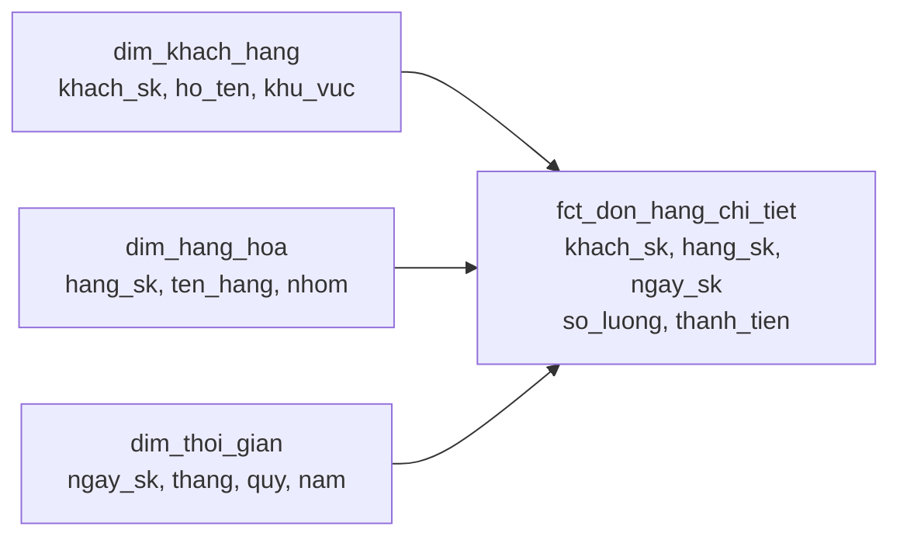

# Facts and dimensions

> **Takeaway:** a fact is **what's measurable** (how much money, how many items) — long, narrow, and growing
> every day. A dimension is **what's descriptive** (who, what, where) — short, wide, slow-changing.
> Putting one column in the wrong place breaks the whole model; it isn't a matter of aesthetics.

## The goal

To give you a decidable rule: which table does this column belong to. Only from there do you get a star schema
and the ability to answer an analytical question without joining at random.

## Overview

| | Fact | Dimension |
|---|---|---|
| Contains | Measures (`thanh_tien`, `so_luong`) + the keys | Descriptive attributes (`ten`, `khu_vuc`, `nhom`) |
| Shape | **Long and narrow** — millions of rows, few columns | **Short and wide** — thousands of rows, many columns |
| Change rate | Rows added continuously, rarely edited | Slow-changing, a few times a year → [SCD](../skills/scd.md) |
| Role in a query | You `SUM` / `COUNT` this | You `GROUP BY` / `WHERE` on this |
| Grain | One event = one row | One entity (or one version) = one row |

**The one-sentence test:** will you `SUM` this column or `GROUP BY` it? `SUM` → a fact. `GROUP BY` → a dimension.

## The example



```text
fct_don_hang_chi_tiet   ← grain: một dòng hàng trong một đơn hàng
khach_sk | hang_sk | ngay_sk  | so_luong | thanh_tien
2        | 17      | 20260110 | 2        | 300000
```

The fact holds only **keys and numbers**. To know the customer's name you join to a dimension. That's
deliberate: when a customer's name changes you edit **one** dimension row, not a million fact rows.

## The three kinds of fact

Kimball divides facts into three kinds by **grain** and **how they're loaded**. Choosing the wrong kind isn't
a matter of aesthetics — some kinds **can't be summed over time**, and summing them wrongly gives a
meaningless number with nothing reported.

| Kind | Grain | How it's loaded | Summable over time |
|---|---|---|---|
| **Transaction** | One event | `INSERT` only | ✅ yes |
| **Periodic snapshot** | One period × one entity | `INSERT` per period | ❌ **no** |
| **Accumulating snapshot** | One process instance | `INSERT` then `UPDATE` several times | ⚠️ depends on the column |

### 1. Transaction facts — the most common kind

One row = **one thing that happened**. Once written, never edited.

```text
fct_don_hang_chi_tiet
don_hang_id | dong | ngay       | khach_sk | so_luong | thanh_tien
DH001       | 1    | 2026-07-01 | 2        | 2        | 300000
DH001       | 2    | 2026-07-01 | 2        | 1        | 300000
```

This is the **easiest and safest** kind:

- Summable along **every** dimension — by day, by customer, by product, by any combination.
- `INSERT` only, never `UPDATE` → naturally suits `incremental`.
- If it's wrong, it can be rebuilt from the source.

**This should be your default.** The two kinds below are only for when a transaction fact can't answer
the question.

### 2. Periodic snapshots — a snapshot at intervals

One row = **one entity's state at the end of one period**. Use it when the question is *"what was the
situation at that moment"*, with no event to count.

```text
fct_so_du_cuoi_ngay
┌────────────┬───────────┬──────────┐
│    ngay    │ tai_khoan │  so_du   │
├────────────┼───────────┼──────────┤
│ 2026-07-01 │ TK01      │ 10000000 │
│ 2026-07-02 │ TK01      │ 10000000 │
│ 2026-07-03 │ TK01      │ 12000000 │
│ 2026-07-01 │ TK02      │  5000000 │
│ 2026-07-02 │ TK02      │  5000000 │
│ 2026-07-03 │ TK02      │  4000000 │
└────────────┴───────────┴──────────┘
```

Does a balance exist as an event? No — it's a **state**. There's no "balance transaction"
to write into a transaction fact.

#### The trap: summing over time gives a meaningless number

```sql
SELECT sum(so_du) AS tong FROM fct_so_du;
```

```text
┌───────────────┐
│ tong_vo_nghia │
├───────────────┤
│      46000000 │
└───────────────┘
```

**46 million doesn't exist.** The real total assets are at most 16 million. The 46 million figure comes
from adding the same money several times — once per day.

The two **correct** ways to sum:

```sql
-- Cong theo TAI KHOAN, tai MOT thoi diem: hop le
SELECT ngay, sum(so_du) AS tong_tai_san FROM fct_so_du GROUP BY 1;
```

```text
┌────────────┬──────────────┐
│    ngay    │ tong_tai_san │
├────────────┼──────────────┤
│ 2026-07-01 │     15000000 │
│ 2026-07-02 │     15000000 │
│ 2026-07-03 │     16000000 │
└────────────┴──────────────┘
```

```sql
-- Theo thoi gian thi dung TRUNG BINH, khong dung tong
SELECT tai_khoan, round(avg(so_du)) AS so_du_tb FROM fct_so_du GROUP BY 1;
```

```text
┌───────────┬────────────┐
│ tai_khoan │  so_du_tb  │
├───────────┼────────────┤
│ TK01      │ 10666667.0 │
│ TK02      │  4666667.0 │
└───────────┴────────────┘
```

**The rule:** a measure summable along *some* dimensions but not *all* of them is called
**semi-additive**. Along the time dimension, use `avg`, `max`, or take the end-of-period value —
don't use `sum`.

### 3. Accumulating snapshots — tracking a process

One row = **one run of a multi-step process**. It differs from the two above in that the row is
**`UPDATE`d several times** as the process progresses.

```text
fct_don_hang_qua_trinh
┌─────────┬────────────┬───────────────┬────────────┬────────────┐
│ ma_don  │  ngay_dat  │ ngay_dong_goi │ ngay_giao  │ ngay_nhan  │
├─────────┼────────────┼───────────────┼────────────┼────────────┤
│ DH1     │ 2026-07-01 │ 2026-07-01    │ 2026-07-02 │ 2026-07-05 │
│ DH2     │ 2026-07-02 │ 2026-07-04    │ 2026-07-05 │ NULL       │
│ DH3     │ 2026-07-03 │ NULL          │ NULL       │ NULL       │
└─────────┴────────────┴───────────────┴────────────┴────────────┘
```

Each milestone column is a `NULL` waiting to be filled. `DH3` was just placed, `DH2` is in transit, `DH1` is done.

#### The real value: measuring the latency of each stage

This is what a transaction fact **can't** do — it has the discrete events, but nowhere to
compute the gap between them without a self-join.

```sql
SELECT ma_don,
  date_diff('day', ngay_dat,       ngay_dong_goi) AS cho_dong_goi,
  date_diff('day', ngay_dong_goi,  ngay_giao)     AS cho_giao,
  date_diff('day', ngay_giao,      ngay_nhan)     AS cho_nhan,
  date_diff('day', ngay_dat,       ngay_nhan)     AS tong_thoi_gian
FROM fct_don_hang_qua_trinh;
```

```text
┌─────────┬──────────────┬──────────┬──────────┬────────────────┐
│ ma_don  │ cho_dong_goi │ cho_giao │ cho_nhan │ tong_thoi_gian │
├─────────┼──────────────┼──────────┼──────────┼────────────────┤
│ DH1     │            0 │        1 │        3 │              4 │
│ DH2     │            2 │        1 │     NULL │           NULL │
│ DH3     │         NULL │     NULL │     NULL │           NULL │
└─────────┴──────────────┴──────────┴──────────┴────────────────┘
```

And counting how many orders are stuck at each stage — the classic operations report:

```text
┌──────────────┬───────────────┬───────────┬──────────┐
│ cho_dong_goi │ dang_cho_giao │ dang_giao │ hoan_tat │
├──────────────┼───────────────┼───────────┼──────────┤
│            1 │             0 │         1 │        1 │
└──────────────┴───────────────┴───────────┴──────────┘
```

#### The three prices you pay

| The price | Detail |
|---|---|
| There are `UPDATE`s | You can't use append-style `incremental`; you need a `unique_key` |
| `NULL` columns everywhere | An ordinary `JOIN` **wipes out** unfinished rows — see [a real case](../case-studies/don-dang-giao-bien-mat.md) |
| No state history | You only know *when* a milestone was reached, not whether it went backwards |

### Additivity — more important than any of the three kinds

Classifying by *summable or not* is in fact more useful than classifying by name.

**The commonly misunderstood point:** additivity is **not a property of the measure alone** — it's
a property of the **(measure × dimension) pair**. The same column can be summable along one dimension and
not along another. That's exactly why the word *semi*-additive exists.

| Measure | By customer | By product | By **time** |
|---|---|---|---|
| `thanh_tien` | ✅ | ✅ | ✅ → **additive** |
| `so_du` | ✅ | — | ❌ → **semi-additive** |
| `so_luong_ton_kho` | — | ✅ | ❌ → **semi-additive** |
| `ty_le_loi` | ❌ | ❌ | ❌ → **non-additive** |

Read the table row by row: summing `so_du` by customer is correct (the total assets of all customers), while
summing it over time is meaningless. `thanh_tien` sums correctly in every direction.

### Additive — sum freely

Measures that are **countable and naturally accumulate**: `thanh_tien`, `so_luong`, `chi_phi`, `so_gio`.

The sign to look for: if you halve the time interval and add the two halves back, do you get the original
total? Yes → additive.

This is the only kind that **needs no thought** when writing a report. Try to design facts so that most of the
measures are of this kind.

### Semi-additive — summable, except along time

Almost always a measure describing **a state existing at a moment**: a balance, inventory, an employee
count, active subscriptions.

The reason it doesn't sum over time: **the same entity exists across several periods**. Summing across
periods counts it again — as the [Periodic snapshots](#2-periodic-snapshots--a-snapshot-at-intervals)
section demonstrated: 46 million when the real total is at most 16 million.

Four correct ways to aggregate over time, chosen by the **business question**:

| Approach | The question it answers | Example use |
|---|---|---|
| The **end-of-period** value | "How much is there now" | The month-end balance in a financial report |
| The **average** | "How much was maintained on average" | The average balance for computing interest |
| The **max / min** | "What was the peak / trough" | Peak inventory for sizing warehouse capacity |
| The **start-of-period** value | "How much was there at the start" | Reconciling opening ↔ closing |

None is "the most correct" — the mistake is using `sum`, and choosing among these four
is a business question.

### Non-additive — summable along no dimension at all

Three common families, and all three break the same way: **they're the result of a division
performed too early.**

#### Family 1 — ratios and percentages

```text
┌──────────┬────────┬────────┬───────────────┐
│ khu_vuc  │ so_loi │ so_don │ ty_le_loi_pct │
├──────────┼────────┼────────┼───────────────┤
│ Miền Bắc │     90 │    100 │          90.0 │
│ Miền Nam │      5 │   1000 │           0.5 │
└──────────┴────────┴────────┴───────────────┘
```

```text
┌──────────────────────────┬────────────┐
│ trung_binh_cac_ty_le_SAI │ ty_le_dung │
├──────────────────────────┼────────────┤
│                    45.25 │       8.64 │
└──────────────────────────┴────────────┘
```

**More than five times wrong** — because the two regions' denominators differ by a factor of 10, while `avg` treats them as equals.

#### Family 2 — pre-computed averages

The same nature but more often overlooked, and far more badly wrong:

```text
┌──────────┬────────┬───────────┬────────────┐
│ khu_vuc  │ so_don │ tong_tien │    gtdh    │   ← giá trị đơn hàng trung bình
├──────────┼────────┼───────────┼────────────┤
│ Miền Bắc │    100 │   1000000 │    10000.0 │
│ Miền Nam │      1 │  50000000 │ 50000000.0 │
└──────────┴────────┴───────────┴────────────┘
```

```text
┌───────────────┬──────────┐
│ tb_cua_tb_SAI │ tb_that  │
├───────────────┼──────────┤
│    25005000.0 │ 504950.0 │
└───────────────┴──────────┘
```

**49 times wrong.** An average of averages isn't an average — unless every group
has the same element count, which is almost never true.

#### Family 3 — distinct counts (`count distinct`)

This family is rarely classed as non-additive, but it breaks identically:

```text
┌────────────┬──────────────┐
│    ngay    │ dau_moi_ngay │   ← khách truy cập duy nhất mỗi ngày
├────────────┼──────────────┤
│ 2026-07-01 │            3 │
│ 2026-07-02 │            2 │
│ 2026-07-03 │            2 │
└────────────┴──────────────┘
```

So how many unique customers were there over the whole period?

```text
cộng ba ngày   = 7      ← SAI
đếm cả kỳ      = 4      ← ĐÚNG
```

**75% inflated**, because `U1` appeared on all three days and got counted three times. This is why a
*"monthly active users"* metric **can't** be derived from a daily table — it has to be recomputed
from the raw data at exactly the time level you need.

### The storage rule: don't divide early

All three non-additive families have **the same fix**:

> **Store the numerator and the denominator in the fact. Let the reporting layer divide.**

| Don't store | Store instead | The report computes |
|---|---|---|
| `ty_le_loi` | `so_loi`, `so_don` | `sum(so_loi) / sum(so_don)` |
| `gia_tri_don_tb` | `tong_tien`, `so_don` | `sum(tong_tien) / sum(so_don)` |
| `ty_le_chuyen_doi` | `so_mua`, `so_xem` | `sum(so_mua) / sum(so_xem)` |

That way **every aggregation level is correct** — by day, by month, by region, by any combination —
without anybody having to remember a rule.

With `count distinct` there's no numerator/denominator to store. Two options: recompute from the detailed fact
at exactly the level you need, or store an approximate structure such as HyperLogLog if the warehouse supports it.

### The one-sentence test

Before putting a numeric column into a fact, ask:

> **"If this column is summed across any two rows, is the result meaningful?"**

- Yes along every dimension → additive, no worries.
- Yes along some dimensions → semi-additive, and **write into the column description** which dimension doesn't sum.
- No along any dimension → non-additive, and **don't store it** — store the numerator and denominator.

That "write into the column description" step matters more than it looks: whoever writes a report six months later doesn't
read this file, they read `schema.yml`. See [Docs and lineage](../../etl/dbt/reference/docs-and-lineage.md).

### Which kind to choose

```text
Có sự kiện rời rạc để ghi không?
├─ Có  → Transaction fact          ← mặc định, chọn cái này
└─ Không
   ├─ Cần trạng thái tại từng thời điểm  → Periodic snapshot
   │                                       (nhớ: semi-additive)
   └─ Cần đo độ trễ giữa các bước       → Accumulating snapshot
                                          (nhớ: có UPDATE, có NULL)
```

The three kinds are **not mutually exclusive**. A mature system usually has all three for the same
business process: transaction for detailed analysis, periodic for inventory/balance reporting, and accumulating
for operational tracking.

### The rarer fourth kind: the factless fact

A fact with **no measures at all**, only keys. Used to record *"this happened"*
or *"this relationship exists"*:

```text
fct_sinh_vien_diem_danh
ngay_sk | sinh_vien_sk | lop_sk        ← khong co cot so nao
```

You count with `count(*)`. Its greatest value is answering the **negative** question: *"which students
attended NO session"* — something only answerable when you have a table recording the events that did happen
to compare against the full list.

## Is this number an attribute or a fact?

Not every numeric column is a fact, and not every text column is a dimension. A product's list
price is a number — but it **describes the product**, it doesn't measure an event.

Kimball calls this situation *numeric values as attributes or facts*, and the test is:

> **Will you `SUM` this column, or will you `WHERE` and `GROUP BY` on it?**

| The sign | It's |
|---|---|
| Summing it is meaningful | **A fact** |
| Used to filter, group, band | **A dimension attribute** |
| Changes per event | A fact |
| Changes per entity, stable between events | An attribute |
| Users ask "what's the total" | A fact |
| Users ask "how many are in the range X–Y" | An attribute |

**The most common answer is: both.** The list price is both an attribute of
`dim_san_pham` (to filter "products under 1 million") and a fact in `fct_ban` (the actual price
at the time of sale, which may differ from the list price because of a promotion).

That isn't duplication — the two columns answer two different questions, and **the price at the time of sale is
the transaction's truth**. Details in [year-to-date and timespan](../skills/ytd-timespan-facts.md):
using the current price instead of the price at sale skews revenue by 39%.

When a numeric column sits in a dimension and needs grouping by threshold, use a band table rather than
`CASE WHEN` — see [putting behaviour into a dimension](../skills/behavior-dimension.md).

## Trade-offs

| Separating fact/dimension (a star) | Merging everything into one table (OBT) |
|---|---|
| No data repetition; edit an attribute in one place | No joins needed, simple queries |
| You have to join every time | Changing a customer's name = rewriting a million rows |
| Naturally supports [SCD](../skills/scd.md) | History gets muddled, and as-was is very hard |

See [Star, snowflake, OBT](star-snowflake-obt.md).

## Common Mistakes

| Mistake | Consequence |
|---|---|
| Keeping a descriptive attribute (`ten_khach`) in the fact | A rename means rewriting a million rows; and which name is "correct"? |
| Keeping a continuously changing measure in a dimension | The dimension bloats without bound if it's Type 2 — **that's a fact** |
| Summing a periodic snapshot over time | A meaningless number, with no error reported |
| A fact holding the natural key instead of the surrogate key | Rows duplicate when the dim is Type 2 — see [SCD](../skills/scd.md#common-mistakes) |
| No `dim_thoi_gian`, using the date column directly | You can't `GROUP BY` quarter/week/holiday without writing a function every time |

## FAQ

<details>
<summary>The <code>trang_thai_don_hang</code> column — fact or dimension?</summary>

The classic trap. It *describes*, so it sounds like a dimension — but it changes **continuously** over
an order's lifetime. The correct approach: the current `trang_thai` lives in an accumulating snapshot fact
(a timestamp column per step), while the *catalogue* of statuses ("Delivered", "Cancelled")
is a small dimension.

And when a status is frozen at write time, the question becomes *its own dimension or
straight into the fact* — see [Junk dimensions](../skills/junk-dimension.md).

</details>

<details>
<summary>Why do I need <code>dim_thoi_gian</code> when the table already has a date column?</summary>

So you can `GROUP BY quy`, `WHERE la_ngay_le = true`, `GROUP BY tuan_tai_chinh` without
writing date functions in every query — and so every report uses **the same** definition
of a quarter. This is the only dimension you can generate in advance with a script.

</details>

<details>
<summary>Can a fact be joined directly to another fact?</summary>

Avoid it. Joining two facts of different grain duplicates rows. The correct approach: aggregate each fact to
the same grain first, and only then combine — or join indirectly through a shared dimension.

</details>

## Related Topics

- [Grain](grain.md) — you must declare a fact's grain before choosing columns
- [SCD](../skills/scd.md) — how to handle a changing dimension
- [Star, snowflake, OBT](star-snowflake-obt.md) — how to arrange facts around dimensions
- [Surrogate keys](surrogate-key.md) — what connects a fact to a dimension
- [The design process](design-process.md) — steps 3 and 4 are precisely choosing dims and facts

## References

- Kimball & Ross — *The Data Warehouse Toolkit*, chapters 1–3
