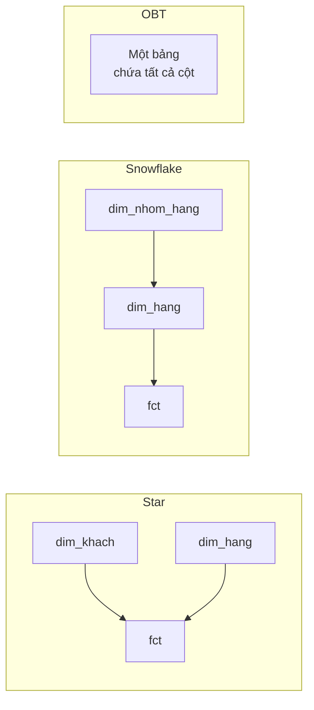

# Star, Snowflake và One Big Table

> **Chốt:** Cùng một mô hình logic ([grain](grain.md), [fact/dim](fact-and-dimension.md))
> bố trí được theo ba cách. Chọn cách nào là **quyết định hiệu năng và chi phí**, không
> phải quyết định mô hình hoá.

## Tổng quan



| | Star | Snowflake | OBT |
|---|---|---|---|
| Dimension | Dẹt, 1 tầng | Chuẩn hoá, nhiều tầng | Nhúng thẳng vào fact |
| Số join | Ít | Nhiều | Không |
| Lặp dữ liệu | Có (trong dim) | Ít nhất | Nhiều nhất |
| Sửa một thuộc tính | 1 dòng dim | 1 dòng bảng con | **Triệu dòng** |
| Hợp với | Warehouse cổ điển | Nơi chi phí lưu trữ đắt | Lakehouse dạng cột, BI đọc nhiều |

## Vì sao Kimball chống snowflake, dù snowflake "chuẩn hơn"

Chuẩn hoá tồn tại để giải hai vấn đề của OLTP: **tiết kiệm chỗ** và **tránh update
anomaly**. Trên dimension thì **cả hai đều không còn**:

- Dimension nhỏ hơn fact vài bậc độ lớn. Chuẩn hoá `dim_hang` 50 nghìn dòng trong khi
  fact có 2 tỷ dòng — tiết kiệm được phần nghìn tổng dung lượng.
- Update anomaly xảy ra khi **người** gõ tay vào nhiều chỗ. Dimension do ETL nạp, một
  chỗ duy nhất, có test. Vấn đề đó không tồn tại.

Cái mất thì thật, nhưng chi phí lớn nhất **không phải hiệu năng**. Star schema có một
tính chất mà snowflake phá mất: **nhìn là hiểu**. Fact ở giữa, dim xung quanh, mọi câu
hỏi đều có dạng "join fact với vài dim" — người dùng BI tự viết được query. Snowflake
bắt họ biết `dim_hang` nối `dim_nhom_hang` nối `dim_nganh_hang`, và họ sẽ hỏi bạn, mỗi lần.

**Ngoại lệ hợp lý — outrigger:** tách một nhóm thuộc tính cồng kềnh và ít dùng (ví dụ
toàn bộ thông tin nhân khẩu học) ra bảng phụ. Đó là snowflake **một tầng, có chủ đích**,
không phải chuẩn hoá cho đủ chuẩn.

## OBT tốn chỗ bao nhiêu — đo thật

Lập luận "OBT lặp dữ liệu nên tốn chỗ" là lập luận của **thời row-store**. Trên Parquet
mỗi cột lưu riêng và được dictionary-encode, nên chi phí phụ thuộc **cardinality của cột
bị nhúng**, không phụ thuộc số dòng fact.

Đo trên DuckDB, 2 triệu dòng fact × 50 nghìn khách, xuất Parquet nén ZSTD:

### Ca 1 — nhúng cột cardinality thấp (`khu_vuc`, `nhom`: 3 giá trị)

```text
bang               dong   parquet zstd
dim_khach        50,000         104 KB
fct_star      2,000,000       3,469 KB
obt           2,000,000       2,704 KB

STAR (dim+fct) = 3,573 KB
OBT            = 2,704 KB
OBT / STAR     = 0.76x
```

**OBT nhỏ hơn star.** Vì nó bỏ luôn cột `khach_sk` (2 triệu số nguyên) và thay bằng ba
cột dictionary-encode cực tốt — `khu_vuc` chỉ có 3 giá trị phân biệt.

### Ca 2 — nhúng cột cardinality cao (`dia_chi`, `ghi_chu`: 50 nghìn giá trị dài)

```text
  dim_rong       1,441 KB
  fct            3,469 KB
  obt_rong      50,205 KB
  STAR = 4,910 KB | OBT = 50,205 KB | OBT/STAR = 10.23x
```

**OBT gấp hơn 10 lần.**

### Kết luận rút ra từ hai con số

Câu "OBT tốn chỗ" **sai ở dạng tổng quát**. Luật đúng là:

> Chi phí OBT tỷ lệ với **cardinality × độ rộng** của những cột bạn nhúng, không tỷ lệ
> với số dòng fact.

Nhúng vài cột phân loại ít giá trị (`khu_vuc`, `nhom`, `trang_thai`) thì gần như miễn
phí — có khi còn rẻ hơn vì bỏ được khoá. Nhúng cột tự do như địa chỉ, ghi chú, mô tả thì
phải trả giá thật.

## OBT và SCD Type 2 — điểm yếu chí mạng

Chỗ này ngược đời và hay bị hiểu sai. OBT nhúng thuộc tính vào dòng fact **tại thời điểm
ghi**, nên nó **as-was miễn phí**: đơn tháng 1 giữ nguyên "Miền Bắc" mãi mãi.

Nghe như OBT giải quyết [SCD](../skills/scd.md) Type 2 không tốn gì. Nhưng nó chỉ giải
được **một nửa** câu hỏi, và mất hẳn nửa kia:

| Câu hỏi | Star + SCD2 | OBT |
|---|---|---|
| Doanh thu theo khu vực **lúc mua** (as-was) | được | được, miễn phí |
| Doanh thu theo khu vực **hiện tại** (as-is) | join `is_current` | **phải join lại về dim** — mất lý do dùng OBT |
| Khách đổi khu vực **khi nào** | `valid_from` | **không biết** |
| Trạng thái tại một ngày bất kỳ trong quá khứ | as-of query | **không làm được** |
| Sửa lỗi chính tả tên khách | 1 dòng dim | **viết lại triệu dòng fact** |

OBT không có khái niệm *phiên bản*, chỉ có *ảnh chụp đông cứng rải rác trong fact*. Tốt
cho đúng một câu hỏi as-was, tệ cho mọi câu hỏi khác về thời gian.

Chú ý: columnar **không cứu được** nhược điểm này. Nén giải quyết chi phí lưu trữ, không
giải quyết chuyện sửa một giá trị phải viết lại toàn bộ file.

## Mô hình lai — câu trả lời thực tế

"Lakehouse đảo chiều lời khuyên cũ" là nói quá. Không đảo chiều — mà **thêm một tầng**:

```text
nguồn → silver: star schema, dim + fact, SCD2 đầy đủ    ← nguồn sự thật
      → gold:   OBT dẹt, một bảng cho mỗi use case BI   ← sản phẩm dẫn xuất
```

Điểm mấu chốt: OBT ở tầng gold là thứ **tái tạo được bằng `dbt run`**. Mọi nhược điểm
biến mất theo:

| Vấn đề của OBT | Khi OBT là tầng gold dẫn xuất |
|---|---|
| Sửa tên khách phải viết lại triệu dòng | Sửa ở dim silver, chạy lại model gold |
| Không trả lời được as-is | Sinh thêm một OBT khác từ cùng silver |
| Không có lịch sử phiên bản | Lịch sử nằm ở silver, gold không cần giữ |
| OBT sai | Xoá, build lại |

**OBT chỉ nguy hiểm khi nó là nơi lưu trữ duy nhất.** Khi nó là cache dẹt của một star
schema có SCD2 đứng sau, nó gần như không có nhược điểm nào.

## Data Vault đứng ở đâu

Data Vault (hub / link / satellite) **không cạnh tranh với star** — nó ở tầng khác:

```text
nguồn → Data Vault (integration) → star / OBT (phục vụ)
```

| | Data Vault | Star |
|---|---|---|
| Tầng | integration / raw | phục vụ |
| Tối ưu cho | nạp song song, audit, nhiều nguồn, schema đổi liên tục | người đọc query |
| Thêm một nguồn mới | thêm satellite, không sửa mô hình cũ | phải sửa dimension |
| Người dùng cuối query trực tiếp | **không** — quá nhiều join | có |

Đáng dùng khi có nhiều hệ nguồn và yêu cầu truy vết nghiêm ngặt (ngân hàng, bảo hiểm).
Với một hệ nguồn và một team, nó là chi phí thuần.

## Trade-offs

| Được | Mất |
|---|---|
| Star: cân bằng, dễ hiểu, hỗ trợ SCD tự nhiên | Vẫn phải join |
| Snowflake: ít lặp nhất | Nhiều join, người dùng BI khó tự viết query |
| OBT: query nhanh nhất, không join | Sửa thuộc tính rất đắt; **as-is** gần như không làm được |

## Common Mistakes

| Lỗi | Hậu quả |
|---|---|
| Dùng OBT làm **nơi lưu trữ duy nhất** | Cần as-is hoặc sửa một thuộc tính là bế tắc |
| Snowflake hoá vì "chuẩn hoá là tốt" | Tiết kiệm vài MB, đánh đổi bằng mọi query của người dùng cuối |
| Nhúng cột tự do (địa chỉ, ghi chú) vào OBT | Đo được: gấp 10 lần dung lượng — xem hai ca ở trên |
| Tin "OBT luôn tốn chỗ" mà không đo | Bỏ lỡ trường hợp OBT còn **nhỏ hơn** star |
| Dựng Data Vault cho một hệ nguồn | Rất nhiều bảng, không đổi lấy gì |

## Related Topics

- [Fact và Dimension](fact-and-dimension.md)
- [Quy trình thiết kế](design-process.md)
- [SCD](../skills/scd.md)
- [Iceberg](../../storage/iceberg/index.md) — lưu trữ dạng cột đổi phép tính chi phí

## References

- Kimball & Ross — *The Data Warehouse Toolkit*, chương 1
