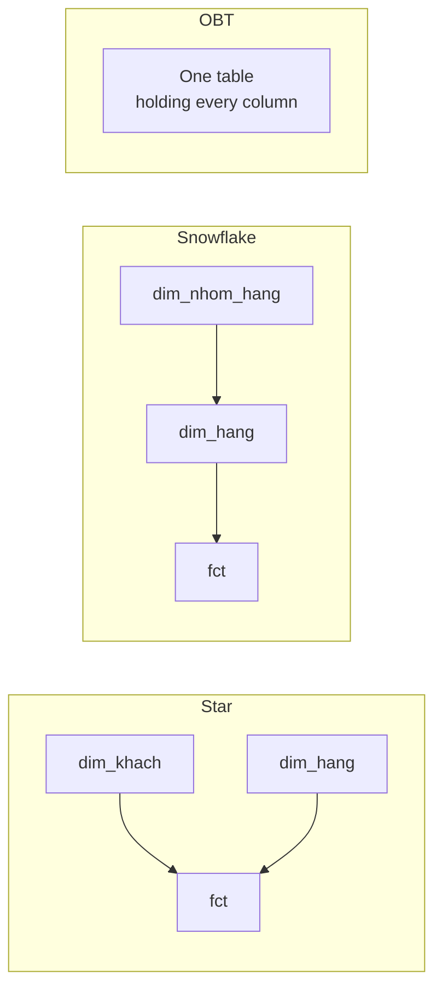

# Star, snowflake and One Big Table

> **Takeaway:** the same logical model ([grain](grain.md), [fact/dim](fact-and-dimension.md))
> can be laid out three ways. Which one you choose is a **performance and cost decision**, not
> a modeling decision.

## Overview



| | Star | Snowflake | OBT |
|---|---|---|---|
| Dimensions | Flat, 1 level | Normalised, several levels | Embedded straight into the fact |
| Joins | Few | Many | None |
| Data repetition | Yes (inside the dim) | The least | The most |
| Editing one attribute | 1 dim row | 1 child-table row | **A million rows** |
| Suits | The classic warehouse | Places where storage is expensive | A columnar lakehouse, read-heavy BI |

## Why Kimball opposes snowflaking, even though snowflake is "more correct"

Normalisation exists to solve two OLTP problems: **saving space** and **avoiding update
anomalies**. On a dimension, **neither applies any more**:

- A dimension is orders of magnitude smaller than a fact. Normalising a 50,000-row `dim_hang` while
  the fact has 2 billion rows saves a thousandth of the total volume.
- Update anomalies happen when **people** type into several places by hand. A dimension is loaded by ETL, in one
  single place, with tests. That problem doesn't exist.

The loss is real, but the biggest cost is **not performance**. A star schema has a
property snowflake destroys: **you look at it and understand it**. The fact in the middle, dims around it, and every
question taking the form "join the fact with a few dims" — a BI user can write the query themselves. Snowflake
requires them to know that `dim_hang` joins `dim_nhom_hang` joins `dim_nganh_hang`, and they'll ask you, every time.

**The reasonable exception — an outrigger:** splitting out one bulky, rarely used attribute group (say
an entire demographic profile) into a side table. That's a **single-level, deliberate** snowflake,
not normalising for the sake of normalising.

## How much space does OBT cost — measured for real

The argument "OBT repeats data so it costs space" is an argument from the **row-store era**. On Parquet
each column is stored separately and dictionary-encoded, so the cost depends on the **cardinality of the embedded
column**, not on the fact's row count.

Measured on DuckDB, 2 million fact rows × 50,000 customers, exported as ZSTD-compressed Parquet:

### Case 1 — embedding low-cardinality columns (`khu_vuc`, `nhom`: 3 values)

```text
bang               dong   parquet zstd
dim_khach        50,000         104 KB
fct_star      2,000,000       3,469 KB
obt           2,000,000       2,704 KB

STAR (dim+fct) = 3,573 KB
OBT            = 2,704 KB
OBT / STAR     = 0.76x
```

**OBT is smaller than the star.** Because it drops the `khach_sk` column entirely (2 million integers) and replaces it with three
columns that dictionary-encode extremely well — `khu_vuc` has only 3 distinct values.

### Case 2 — embedding high-cardinality columns (`dia_chi`, `ghi_chu`: 50,000 long values)

```text
  dim_rong       1,441 KB
  fct            3,469 KB
  obt_rong      50,205 KB
  STAR = 4,910 KB | OBT = 50,205 KB | OBT/STAR = 10.23x
```

**OBT is more than 10 times bigger.**

### What the two numbers tell you

The sentence "OBT costs space" is **wrong in its general form**. The correct rule is:

> OBT's cost is proportional to the **cardinality × width** of the columns you embed, not proportional
> to the fact's row count.

Embedding a few low-value categorical columns (`khu_vuc`, `nhom`, `trang_thai`) is essentially
free — sometimes even cheaper, because you drop the key. Embedding free-text columns like addresses, notes and descriptions
means paying a real price.

## OBT and SCD Type 2 — the fatal weakness

This part is counter-intuitive and often misunderstood. OBT embeds attributes into the fact row **at write
time**, so it gets **as-was for free**: a January order keeps "Miền Bắc" forever.

That sounds like OBT solves [SCD](../skills/scd.md) Type 2 for nothing. But it only solves
**half** the question, and loses the other half entirely:

| Question | Star + SCD2 | OBT |
|---|---|---|
| Revenue by region **at purchase time** (as-was) | works | works, for free |
| Revenue by **current** region (as-is) | join `is_current` | **you must join back to the dim** — losing the reason for using OBT |
| **When** the customer changed region | `valid_from` | **unknown** |
| The state on an arbitrary past date | an as-of query | **impossible** |
| Fixing a typo in a customer name | 1 dim row | **rewriting a million fact rows** |

OBT has no notion of *versions*, only *frozen snapshots scattered through the fact*. Good
for exactly one as-was question, bad for every other question about time.

Note: columnar storage **can't rescue** this weakness. Compression solves the storage cost, not the fact
that editing one value means rewriting whole files.

## The hybrid model — the practical answer

"The lakehouse reverses the old advice" is an overstatement. It doesn't reverse it — it **adds a layer**:

```text
nguồn → silver: star schema, dim + fact, SCD2 đầy đủ    ← nguồn sự thật
      → gold:   OBT dẹt, một bảng cho mỗi use case BI   ← sản phẩm dẫn xuất
```

The crucial point: the gold-layer OBT is something **reproducible with `dbt run`**. Every drawback
disappears with it:

| The OBT problem | When OBT is a derived gold layer |
|---|---|
| Fixing a customer name means rewriting a million rows | Fix it in the silver dim and re-run the gold model |
| Can't answer as-is | Generate another OBT from the same silver |
| No version history | The history lives in silver; gold needn't keep it |
| The OBT is wrong | Delete it, rebuild |

**OBT is only dangerous when it's the only place the data is stored.** When it's a flat cache of a star
schema with SCD2 behind it, it has essentially no drawbacks.

## Where Data Vault stands

Data Vault (hub / link / satellite) **doesn't compete with star** — it sits at a different layer:

```text
nguồn → Data Vault (integration) → star / OBT (phục vụ)
```

| | Data Vault | Star |
|---|---|---|
| Layer | integration / raw | serving |
| Optimised for | parallel loading, auditing, many sources, continuously changing schemas | the person querying |
| Adding a new source | add a satellite, no change to the old model | you must change the dimension |
| End users query it directly | **no** — too many joins | yes |

Worth using when you have many source systems and strict traceability requirements (banking, insurance).
With one source system and one team, it's pure cost.

## Trade-offs

| You get | You lose |
|---|---|
| Star: balanced, understandable, naturally supports SCD | You still have to join |
| Snowflake: the least repetition | Many joins, and BI users can't write their own queries |
| OBT: the fastest queries, no joins | Editing an attribute is very expensive; **as-is** is essentially impossible |

## Common Mistakes

| Mistake | Consequence |
|---|---|
| Using OBT as the **only place data is stored** | Needing as-is or editing one attribute becomes a dead end |
| Snowflaking because "normalisation is good" | Saving a few MB at the cost of every end-user query |
| Embedding free-text columns (addresses, notes) into OBT | Measurably 10× the volume — see the two cases above |
| Believing "OBT always costs space" without measuring | Missing the case where OBT is actually **smaller** than the star |
| Building Data Vault for a single source system | Very many tables in exchange for nothing |

## Related Topics

- [Facts and dimensions](fact-and-dimension.md)
- [The design process](design-process.md)
- [SCD](../skills/scd.md)
- [Iceberg](../../storage/iceberg/index.md) — columnar storage changes the cost arithmetic

## References

- Kimball & Ross — *The Data Warehouse Toolkit*, chapter 1
