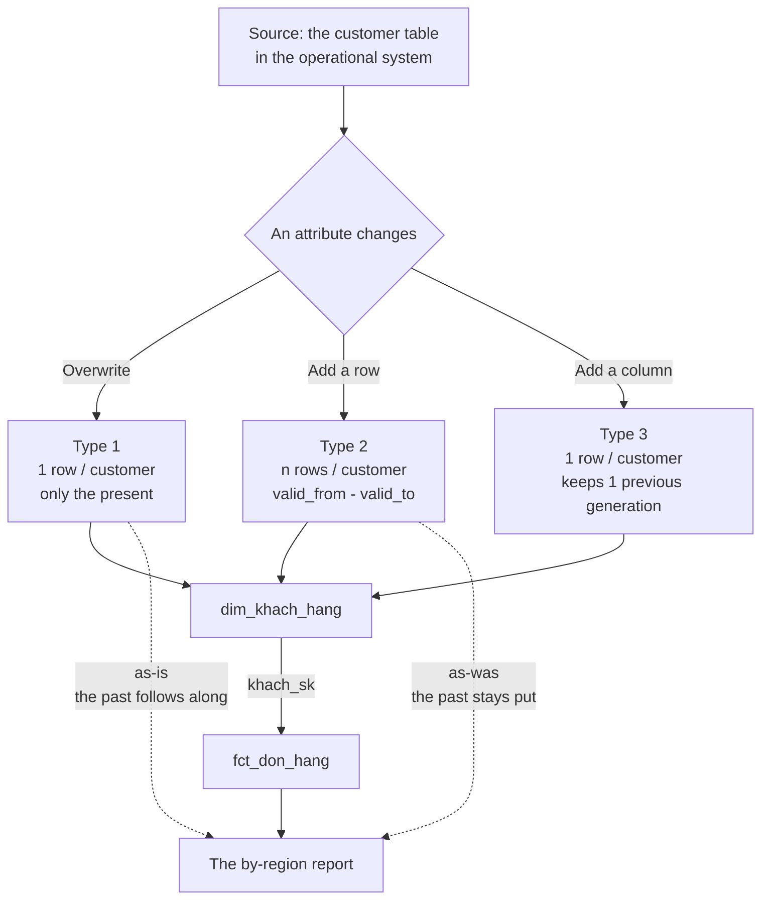
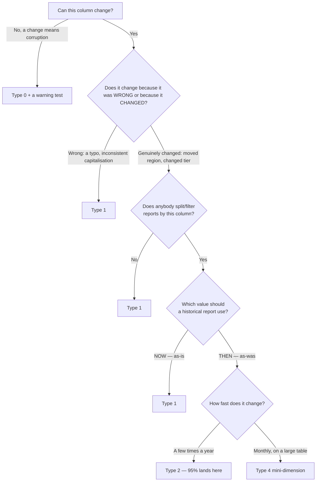

# SCD — Slowly Changing Dimension

> **Takeaway:** SCD isn't a technique but **a business decision**: when an entity's
> attribute changes, should a historical report use the value *then* or the value
> *now*? Only once that's chosen do you get to write SQL. Choose wrongly and correct SQL still gives wrong numbers.

## The goal

To answer a very specific question that appears in **every** reporting system:

> A customer moves from the North to the South. The order they placed in January — while still
> in the North — which region should it count in now?

There's no universally correct answer. There are **two** answers, both reasonable, and
they lead to two different table designs. SCD is the vocabulary for talking about that choice
and the ways of realising it.

## Overview

A dimension is a table describing *entities* (customers, products, stores). Their attributes
change — slowly, a few times a year. On each change, the system has to decide what to do with
the old value: **overwrite** (losing the history) or **keep it** (costing space and complicating the join).

The eight "Types", numbered 0 to 7, are eight ways of handling it. In practice **95% is Type 1 and
Type 2** — learn those two solidly, and knowing the other three exist is enough.

> **Why "slowly".** A column that changes hourly (an account balance, an order status) is not
> a dimension attribute — it's a **fact**. Get this wrong and you build SCD Type 2 for something
> that changes continuously, and the table bloats thousands of times over. See [Facts and dimensions](../reference/fact-and-dimension.md).

## Why you need it

Without SCD — that is, overwriting everything by default — a system has one very hard-to-detect bug:

**Historical reports change their numbers depending on when you run them.**

Run the January revenue report in February and get one figure. Run exactly the same report in
April and get a different one — even though January is closed with no new orders. The cause:
somebody edited a master-data row in between.

This is the class of bug that destroys trust in the whole system, because it **doesn't look like a bug**. No
exception, no red test, no log. It looks like somebody changing the numbers.

## The architecture



The crucial part of the diagram: **the `khach_sk` arrow from dim to fact.** Type 2 only has an
effect if the fact holds the surrogate key of *the version correct at the time of the event*. See §
[Common Mistakes](#common-mistakes).

## The components

The column set of a Type 2 dimension table:

| Column | Role | What happens without it |
|---|---|---|
| `khach_sk` | The **surrogate key** — the real key. One value per *version* | The fact can't point at the right version → the whole point of Type 2 is lost |
| `khach_hang_id` | The **natural key** — the business code. **Repeats** across versions | You can't group a customer's versions together |
| `valid_from` | Exactly when this row starts | You can't tell which version applies to which date |
| `valid_to` | When this row stops being valid | As above |
| `is_current` | A convenience flag, equal to `valid_to = '9999-12-31'` | Nothing lost, just more verbose queries |
| `dbt_scd_id` / a hash | The version's fingerprint, for change detection | You have to compare each column by hand |

## The workflow

One Type 2 load cycle:

1. **Read the source** — today's snapshot of the customer table.
2. **Compare against the `is_current` rows** in the dimension by natural key.
   The four ways of comparing — and each one's trap — are in [change detection](scd-change-detection.md).
3. **Unchanged** → do nothing.
4. **Changed** → close the old row: `valid_to = today`, `is_current = false`.
5. **Add the new row**: a new SK, `valid_from = today`, `valid_to = '9999-12-31'`.
6. **A new natural key** → add a completely new row.
7. **A natural key that disappeared from the source** → mark `is_deleted`, and **don't** delete the row.
8. **Load the fact** → look up the SK by time interval (a dimension lookup, see [the example](#the-example)).

Step 7 is often skipped. If the source hard-deletes a customer and the dimension doesn't know, that customer
lives forever in the reports.

## The example

Customer `KH001` — Nguyễn Văn A — registered in the **North**. On 2026-03-15 they move
south and a staff member edits the record to the **South**. Two orders:

| Order | Date | Amount |
|---|---|---|
| DH500 | 2026-01-10 | 5,000,000 |
| DH900 | 2026-05-20 | 3,000,000 |

### Type 0 — frozen

```text
khach_hang_id | ho_ten       | ngay_mo_tai_khoan
KH001         | Nguyễn Văn A | 2024-06-01         ← không bao giờ đổi
```

This isn't "updates aren't supported yet" but **updates are forbidden**. If the account-opening date can
change, that's corrupt data, not new data. The value of naming it explicitly:
you can write a test — this column changing between two runs is a **warning**.

### Type 1 — overwrite

```text
TRƯỚC:
khach_hang_id | ho_ten       | khu_vuc
KH001         | Nguyễn Văn A | Miền Bắc

SAU 15/03/2026:
khach_hang_id | ho_ten       | khu_vuc
KH001         | Nguyễn Văn A | Miền Nam     ← Miền Bắc biến mất vĩnh viễn
```

January's revenue now appears under the **South**, even though the customer was in the North at the time.

**Always valid for Type 1:** fixing a typo in a name, normalising capitalisation, correcting a mistyped
email. Those have no "history" worth keeping — only a right version and a wrong one.

### Type 2 — add a row

```text
khach_sk | khach_hang_id | ho_ten       | khu_vuc  | valid_from | valid_to   | is_current
1        | KH001         | Nguyễn Văn A | Miền Bắc | 2024-06-01 | 2026-03-15 | false
2        | KH001         | Nguyễn Văn A | Miền Nam | 2026-03-15 | 9999-12-31 | true
```

**The table's grain has changed.** It's no longer "one customer per row" but **"one version of
one customer per row"**. The direct consequence: `unique` on `khach_hang_id` will FAIL — and
that's a correct failure, exactly the case really encountered in [dbt: testing](../../etl/dbt/reference/testing.md).

The correct tests for a Type 2 table:

```yaml
models:
  - name: dim_khach_hang
    tests:
      - unique:
          column_name: khach_sk                       # SK là khoá thật
      - dbt_utils.unique_combination_of_columns:
          combination_of_columns: [khach_hang_id, valid_from]
      - dbt_utils.expression_is_true:
          expression: "valid_from < valid_to"          # không có khoảng lộn ngược
```

**The fact must hold the SK, not the natural key:**

```text
don_hang_id | khach_sk | ngay        | thanh_tien
DH500       | 1        | 2026-01-10  | 5000000     ← SK 1 = phiên bản Miền Bắc
DH900       | 2        | 2026-05-20  | 3000000     ← SK 2 = phiên bản Miền Nam
```

Assigning the right SK while loading the fact is called a **dimension lookup**:

```sql
select
    f.don_hang_id,
    d.khach_sk,                          -- SK đúng của thời điểm đó
    f.ngay,
    f.thanh_tien
from {{ ref('stg_don_hang') }} f
join {{ ref('dim_khach_hang') }} d
  on  f.khach_hang_id = d.khach_hang_id
  and f.ngay >= d.valid_from
  and f.ngay <  d.valid_to               -- ← điều kiện khoảng thời gian
```

After that a report just does `join ... on f.khach_sk = d.khach_sk` — no time condition
needed, and it automatically gives the correct *as-was*.

### Type 3 — add a column

```text
khach_hang_id | khu_vuc  | khu_vuc_truoc | ngay_doi_khu_vuc
KH001         | Miền Nam | Miền Bắc      | 2026-03-15
```

Still **one row per customer**, so every existing join keeps working. A second change loses the first
generation.

### Type 4 — a mini-dimension

Split the few fast-changing columns out of a large dimension, so Type 2 doesn't make the whole table bloat at
the fastest column's rate:

```text
dim_khach_hang       (ổn định: tên, ngày sinh, ngày mở tài khoản)
dim_khach_hang_nhom  (hay đổi: nhóm thu nhập × nhóm tuổi — chỉ vài chục tổ hợp)
fct_don_hang         (khach_sk, khach_nhom_sk, ...)
```

The reversal: history moves out of the dimension and into the **fact**. How to build it, a runnable example and
the traps are in [Mini-dimensions](mini-dimension.md).

### Type 6 — combining 1+2+3

A full Type 2 table plus one Type-1-ised column across **every** row of the same customer:

```text
khach_sk | khach_hang_id | khu_vuc_luc_do | khu_vuc_hien_tai | valid_from | valid_to
1        | KH001         | Miền Bắc       | Miền Nam         | 2024-06-01 | 2026-03-15
2        | KH001         | Miền Nam       | Miền Nam         | 2026-03-15 | 9999-12-31
```

`GROUP BY khu_vuc_luc_do` gives *as-was*, `GROUP BY khu_vuc_hien_tai` gives *as-is* — one
table answering both questions. The price: each time a customer changes region you have to `UPDATE`
**every** historical row for that customer.

### Type 5 — a mini-dimension plus a Type 1 outrigger

Type 4 solves the fast-changing column bloating the dimension, but leaves a hole: from
`dim_khach_hang` you **can't see** the customer's current group. To know "which group is this customer in now"
you have to go through the fact.

Type 5 patches that hole: add a key to the main dimension pointing at the mini-dimension, **updated
Type 1 style**.

```text
dim_khach_hang       khach_sk | khach_id | ho_ten | khach_nhom_sk_hien_tai
dim_khach_hang_nhom  khach_nhom_sk | nhom_thu_nhap | nhom_tuoi
fct_don_hang         khach_sk | khach_nhom_sk  ← nhom LUC DO
```

Two paths, two answers:

| To know | Which path |
|---|---|
| The group **at transaction time** (as-was) | `fct.khach_nhom_sk` |
| The **current** group (as-is) | `dim_khach_hang.khach_nhom_sk_hien_tai` |

The `khach_nhom_sk_hien_tai` column is a **Type 1 outrigger** — it's overwritten whenever the customer changes
group, so it holds no history and must not be used for historical reporting. The same trap described
in [dimension-to-dimension joins](centipede-fact.md#dimension-to-dimension-join).

When to use it: you're already using Type 4 and have the question *"which group is this customer in now"* without
wanting to scan the fact.

### Type 7 — two parallel dimensions

Type 6 crams both as-was and as-is into one table, and has to `UPDATE` all the history on each change.
Type 7 avoids that by having the fact carry **two keys**:

```text
fct_don_hang   khach_sk        → dim_khach_hang       (Type 2, day du lich su)
               khach_durable   → dim_khach_hien_tai   (Type 1, mot dong moi khach)
```

```sql
-- as-was: khu vuc luc mua
SELECT d.khu_vuc, sum(f.doanh_thu) FROM fct_don_hang f
JOIN dim_khach_hang d USING (khach_sk) GROUP BY 1;

-- as-is: khu vuc hien tai
SELECT h.khu_vuc, sum(f.doanh_thu) FROM fct_don_hang f
JOIN dim_khach_hien_tai h USING (khach_durable) GROUP BY 1;
```

`dim_khach_hien_tai` is usually just a **view** over the Type 2 dim filtering `la_hien_tai`, keyed
by the [durable key](../reference/surrogate-key.md) — costing no extra storage.

| | Type 6 | Type 7 |
|---|---|---|
| Tables | 1 | 2 (one usually a view) |
| On a value change | `UPDATE` **every** historical row for the customer | No `UPDATE` at all |
| The fact carries | 1 key | 2 keys |
| Adding another attribute needing as-is | A new column + a full-table backfill | Already there |
| A user picking the wrong one | Easy — two columns side by side | Harder — they must pick a table |

**Type 7 is a better default than Type 6** when more than one or two attributes need
both views. The condition: the dimension must have a durable key.

## When to use which

Ask in exactly this order, **column by column** — not for the whole table:



**Three questions to ask a business user rather than decide yourself:**

1. *"A customer moves from the North to the South. Which region should their January revenue appear
   in?"* — ask with a concrete example, don't ask "which SCD do you want".
2. *"Will you ever need to see exactly the report printed last month?"* — if so, every column
   used to split reports must be Type 2.
3. *"How long do you keep history?"* — unlimited Type 2 is expensive; many places only need 2 years.

## When NOT to use it

| Don't use | When | Use instead |
|---|---|---|
| Type 2 | The column changes daily/hourly | It's a **fact**, not a dimension attribute |
| Type 2 | Nobody `GROUP BY`s or filters on the column | Type 1 — keeping history nobody asks about is wasted space |
| Type 2 | An enormous dimension table with only a few fast-changing columns | A Type 4 mini-dimension |
| Type 3 | You need history over time | Type 3 keeps exactly 1 generation — it's **not** cheap Type 2 |
| Type 1 | The column is used to split financial reports | Type 2 — otherwise historical numbers change by themselves |
| SCD generally | The source is already a table with `valid_from`/`valid_to` (bitemporal) | Use it directly, don't build another history layer on top |

## Advantages

- **Type 1** — the simplest, the smallest table, the fastest join, and the grain unchanged.
- **Type 2** — you can reproduce exactly the report of any past day; it's the foundation
  for auditing and reconciliation.
- **Type 3** — keeps two parallel classifications without changing the grain, so every existing query keeps working.
- **Type 4** — stops the dimension bloating at the fast-changing column's rate.
- **Type 6** — one query answers both *as-was* and *as-is*.

## Disadvantages

- **Type 1** — history lost **permanently**, and historical reports change their numbers.
- **Type 2** — the grain changes (every test and join must be updated), the table bloats, joins get more
  complicated, and it's **very easy to use wrongly** (see Common Mistakes).
- **Type 3** — keeps only one generation; the second change loses the first.
- **Type 4** — another table, another key in the fact, another place to go wrong.
- **Type 6** — a cascading `UPDATE` across all the history on each change; the most expensive to operate.

## Trade-offs

| You get | You lose | In exchange for |
|---|---|---|
| Type 2: full history | A large table, a changed grain, joins needing the SK | The ability to reproduce historical reports |
| Type 1: simple and fast | You can't reproduce the past | Low storage cost and low complexity |
| Type 4: the dimension doesn't bloat | Another table and key | Performance when a column changes fast |
| Type 6: answers both questions | Cascading updates, a high write cost | Convenience at query time |

**The asymmetry that decides everything:** you can always step down from Type 2 to Type 1 (just
filter `is_current`). Going up from Type 1 to Type 2, **overwritten history can't be recovered**
— you only start recording from the day you switch. So **when unsure, choose Type 2.**

## Best Practices

1. **Decide per column, not per table.** A dimension usually mixes: name →
   Type 1, region → Type 2, account-opening date → Type 0.
2. **Use `9999-12-31` for `valid_to`, not `NULL`.** See Common Mistakes.
3. **The fact holds only `_sk`, not the natural key** (or holds both but joins on `_sk`).
4. **Have an "Unknown" row with `_sk = -1`** for a late-arriving dimension — a fact arriving
   before the dim points there and gets patched later. Don't leave `NULL` and lose the row on an inner join.
5. **Test the time intervals**: `valid_from < valid_to`, and no two rows with the same natural
   key having overlapping intervals.
6. **Test the total against the source** after switching to Type 2. This is the *accuracy* dimension
   in [the six quality dimensions](../../data-quality/six-dimensions.md) — the only dimension that catches
   duplication caused by a wrong join.
7. **Test-run the snapshot on a copy first.** See Common Mistakes, the last row.

## Common Mistakes

| Mistake | Consequence | Prevented by |
|---|---|---|
| The fact joins on the **natural key** on a Type 2 dim | One order matches **every** version → revenue doubles. The tests stay green because the fact didn't change | The fact holds only `_sk`; add a total-vs-source test |
| A join with `where is_current = true` | Every order is attributed to the current version — you built Type 2 carefully and then used it exactly like Type 1 | Only use `is_current` when you **deliberately** want the *as-is* question |
| Leaving `valid_to` as `NULL` | `ngay < NULL` → `NULL` ≠ `true` → **the newest orders vanish** from the report, silently | Use `9999-12-31`, or `coalesce(valid_to, '9999-12-31')` |
| Type 2 for a column that changes daily | The dimension bloats a hundredfold and queries slow down | That column is a fact, or split out a mini-dimension |
| Overlapping `valid` intervals | One order matches 2 rows → duplication | A no-overlap test by natural key |
| The source **hard-deletes** a row | The dim doesn't know, and the customer lives forever in reports | An `is_deleted` column, comparing the key list on each run |
| A late-arriving dimension | The fact arrives before the dim → no SK found → the row is lost | An "Unknown" row with `_sk = -1`, patched later |
| A dbt `snapshot` run wrongly once | **The history is permanently wrong** — no source can rebuild it | Test-run on a copy; see [sources-seeds-snapshots](../../etl/dbt/reference/sources-seeds-snapshots.md) |

The last trap deserves emphasis: `snapshot` is the **only** thing in dbt that isn't reproducible. A wrong
model gets `dbt run` again; a wrong snapshot loses the history it already recorded for good.

## FAQ

<details>
<summary>How does SCD Type 2 differ from Type 1 — in business terms, not technical ones</summary>

Type 1 answers *"which region is this customer in **now**"*; Type 2 answers *"which region was the
customer in when that order was placed"*. Whether you add a row or overwrite is only the implementation.

</details>

<details>
<summary>On a Type 2 dim table, which column gets the <code>unique</code>?</summary>

`khach_sk` (the surrogate key). `khach_hang_id` **repeats** across versions, so putting
`unique` on it fails — and correctly so, because the grain has changed to "one version per row".

</details>

<details>
<summary>Revenue spontaneously doubled after switching the dim to Type 2 — what do you suspect first?</summary>

The fact is joining on the natural key, so it matches **every** version of the customer. It must join
on `_sk`, or if it joins by natural key it must include the time-interval condition
`ngay >= valid_from and ngay < valid_to`.

</details>

<details>
<summary>Why shouldn't <code>valid_to</code> be <code>NULL</code>?</summary>

`ngay < NULL` returns `NULL`, not `true` → the current row doesn't satisfy the join
condition → the newest data vanishes from reports with no error reported. This is where
three-valued NULL bites in exactly the most painful place.

</details>

<details>
<summary>Torn between Type 1 and Type 2 with nobody to ask — which one?</summary>

Type 2. The asymmetry: you can always step down from Type 2 to Type 1, but going up from Type 1 to
Type 2, overwritten history **can't be recovered**.

</details>

<details>
<summary>When is Type 3 more sensible than Type 2?</summary>

When you need **two parallel classifications over the same period** (the old region vs the new one after a
reorganisation), rather than needing history over time.

</details>

<details>
<summary>Iceberg has time travel — what do I need Type 2 for?</summary>

Different purposes. Time travel gives you *the table's state at a moment* — used for debugging
and recovery. Type 2 puts the history into **the data model itself**, so an ordinary `GROUP BY`
gives the correct *as-was* numbers. Nobody writes a daily report by time-travelling
to each individual day and adding it up.

</details>

## Interview Questions

1. Explain SCD Type 1 and Type 2 with a business example, without using the words "overwrite"
   or "add a row".
2. On a Type 2 dimension table, what is the primary key, and why isn't it the customer code?
3. After switching a dimension from Type 1 to Type 2, total revenue doubled.
   How do you debug it?
4. Why should `valid_to` be `9999-12-31` rather than `NULL`? *(this one filters for people who've done it for real)*
5. A dimension has 5 million rows and one attribute changing monthly. What's the problem with Type 2 and
   how do you handle it?
6. The business wants historical revenue by **both** the region then and the current region
   in the same report. How do you design it?
7. The source hard-deletes a customer. How does a Type 2 dimension react?

## Feynman Explanation

Imagine you have an address book for your friends.

A friend moves house. There are three ways to handle the book:

- **Way 1 — erase and rewrite.** The book stays tidy and is always right for posting a letter *today*.
  But if somebody asks "where did I send last year's wedding invitation?" you're stuck — the old
  address was erased.

- **Way 2 — write a new line, strike out the old one and note "used until 15/03".** The book
  gets thicker and lookups take a little longer, but it answers every question about the past.

- **Way 3 — add an "old address" column beside it.** Tidier than way 2, but it only remembers
  one move. On the second move you forget the first house.

Here's where the complexity lies: every letter you ever sent also has to record **which line in the
book it used**. If you only record "sent to Nam" and Nam has two lines in the book, counting
letters gives double — one per line. That's exactly the doubled-revenue bug.

## Flashcards

```text
Q: SCD giải quyết vấn đề gì? (một câu, bằng ngôn ngữ nghiệp vụ)
A: Khi thuộc tính đổi, báo cáo về quá khứ dùng giá trị lúc đó (as-was) hay giá trị bây giờ (as-is).
---
Q: SCD Type 1 làm gì khi giá trị đổi?
A: Ghi đè. Mất lịch sử vĩnh viễn. Báo cáo quá khứ đổi số theo.
---
Q: SCD Type 2 làm gì khi giá trị đổi?
A: Đóng dòng cũ (valid_to = hôm nay), thêm dòng mới với surrogate key mới.
---
Q: Primary key của bảng dimension SCD Type 2 là cột nào?
A: Surrogate key (mỗi phiên bản một giá trị) — KHÔNG phải natural key, vì natural key lặp lại.
---
Q: Grain của dimension Type 2?
A: Một PHIÊN BẢN của một thực thể = một dòng. Không phải một thực thể một dòng.
---
Q: Vì sao valid_to nên là 9999-12-31 thay vì NULL?
A: So sánh với NULL trả về NULL chứ không phải true → dòng hiện tại không khớp join → dữ liệu mới nhất biến mất khỏi báo cáo.
---
Q: Fact table join vào dimension Type 2 bằng cột nào?
A: Bằng surrogate key đã tra sẵn lúc nạp fact. Join bằng natural key làm doanh thu nhân đôi.
---
Q: Phân vân Type 1 hay Type 2 thì chọn gì, vì sao?
A: Type 2. Hạ từ 2 xuống 1 lúc nào cũng được; lên từ 1 lên 2 thì lịch sử đã mất không lấy lại được.
---
Q: Khi nào dùng Type 4 (mini-dimension)?
A: Dimension lớn nhưng chỉ vài cột đổi nhanh — tách cột đó ra bảng nhỏ để dimension chính không phình.
---
Q: Type 3 giữ được bao nhiêu đời lịch sử?
A: Đúng một. Dùng khi cần hai cách phân loại song song, không phải khi cần lịch sử theo thời gian.
```

## An illustrative situation — not yet a case study

This is a situation **reconstructed to explain**, not an incident encountered and debugged. The real case
studies are in [`case-studies/`](../case-studies/index.md) and are required to have real output;
this section doesn't meet that bar, so it isn't called a case study.

**Context** — the revenue-by-region mart problem, taken from the lab being studied.

If `dim_khach_hang` switches to Type 2 while the fact table still joins
by `khach_hang_id` as before, `DH500` will match **both** rows of `KH001` — turning
total revenue of 5,000,000 into 10,000,000.

**What makes it dangerous:** no test catches it.

- `unique` on the fact — still green, the fact didn't change.
- `not_null` — still green.
- `relationships` — still green, `khach_hang_id` still exists in the dim.
- The fact's row count — still correct.

Only the **total amount** is wrong, and it's only detectable by a singular test reconciling against
the source system — that is, the *accuracy* dimension, the only one with no ready-made test. This is a
concrete example of the argument in [the six quality dimensions](../../data-quality/six-dimensions.md): the other
five can all be green while accuracy is wrong and the numbers are still wrong.

**Not run by hand.** It needs verifying in the [dbt lab](../../etl/dbt/tutorials/dbt-lab-duckdb.md)
and then `verified_at` updating. This is theoretical content — read it sceptically
until there's real output pasted in.

## Learning Path

```text
SQL: join, grain
      ↓
Grain
      ↓
Fact và Dimension
      ↓
Surrogate key  ────┐
      ↓            │
    SCD  ←─────────┘
      ↓
Triển khai bằng dbt snapshot
      ↓
Data Vault / bitemporal (nâng cao)
```

## Related Topics

- [Grain](../reference/grain.md) — Type 2 changes a dimension's grain; the most easily forgotten point
- [Facts and dimensions](../reference/fact-and-dimension.md) — a fast-changing column is a fact, not a dimension
- [Surrogate keys](../reference/surrogate-key.md) — why Type 2 **requires** an SK
- [The design process](../reference/design-process.md) — SCD is decided at step 3
- [The six data-quality dimensions](../../data-quality/six-dimensions.md) — accuracy catches duplication

## Prerequisites

- [SQL: joins and grain](../../databases/sql/index.md)
- [Grain](../reference/grain.md)
- [Facts and dimensions](../reference/fact-and-dimension.md)

## Next Topics

- [The 4-step design process](../reference/design-process.md)
- [dbt: sources, seeds, snapshots](../../etl/dbt/reference/sources-seeds-snapshots.md) — the tool that realises Type 2
- [Iceberg](../../storage/iceberg/index.md) — how time travel differs from Type 2

## References

- Ralph Kimball & Margy Ross — *The Data Warehouse Toolkit* (3rd ed.), chapter 5:
  the origin of the Type 0–7 numbering
- Kimball Group — *Slowly Changing Dimensions, Part 1 & 2* (Design Tips)
- dbt docs — *Snapshots* (`strategy: timestamp` vs `check`)

## Further Reading

- Data Vault 2.0 — a different approach to history: satellites instead of SCD Type 2
- Bitemporal modeling — two time axes (*when the thing happened* vs *when the system knew*),
  needed in finance and insurance
- [The SCD cheatsheet](../cheatsheets/scd.md) — a quick lookup while you work
