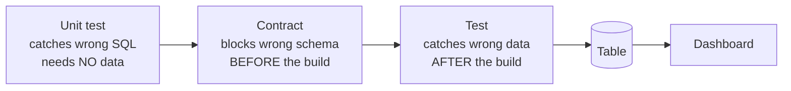

# Data Quality

**Concepts, not tools.** The three layers and six dimensions below hold for dbt, Great
Expectations, Soda, or hand-written SQL — only the syntax differs.

## The three layers of protection

The order in time is what decides each layer's value:

| Layer | Catches what | Runs when | Can a broken table be born? |
|---|---|---|---|
| **Unit test** | Wrong transformation logic | Before, with no real data | No |
| **Contract** | Wrong column type / missing column | Before the build | No |
| **Test** | Wrong data | After the build | **Yes** — and a dashboard may already have read it |

Three different things; don't lump them together as "tests". A model with the **wrong
formula** still passes every `unique`/`not_null` check — the data is valid, the result is
wrong. Only a unit test catches that case.

## Contents

| Document | Answers the question | Status |
|---|---|---|
| [Six quality dimensions](six-dimensions.md) | Which dimension am I missing? | 📝 review |

## Implementation

| You want to | See |
|---|---|
| Do it with dbt | [dbt: testing](../etl/dbt/reference/testing.md) |
| Check source freshness | [dbt: sources, seeds, snapshots](../etl/dbt/reference/sources-seeds-snapshots.md) |
| Understand why a test fails on correct data | [Grain](../data-modeling/reference/grain.md) |

## Related Topics

- [Data Modeling](../data-modeling/index.md) — model it right and you need fewer tests
- [Grain](../data-modeling/reference/grain.md) — step 0 of every test
