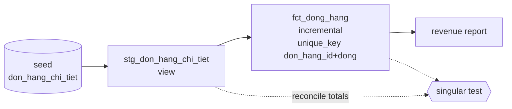
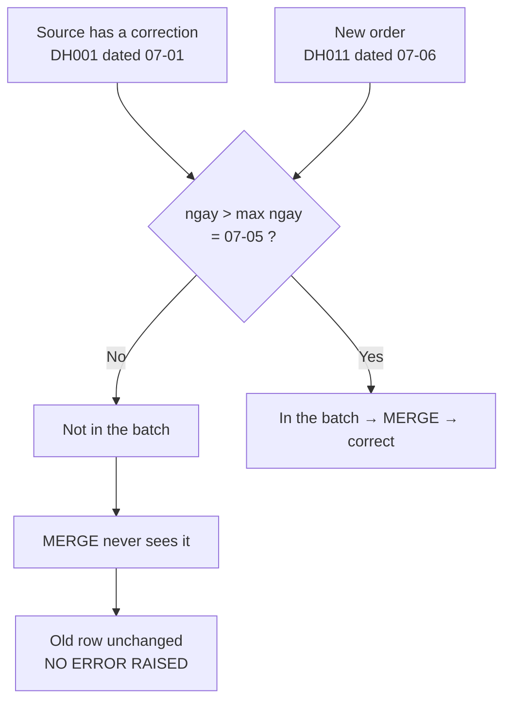

# E-commerce — the incremental model dropped a late-edited order

> **Takeaway:** when an incremental table's numbers are off while the **row** count still
> matches the source, suspect the filter first and the join second. A `ngay > max(ngay)`
> filter looks at the **business date** — every correction to an old row sits below the
> watermark and never enters the batch.

> **On authenticity.** The business context below is a reconstruction, told this way because
> it reads better. **All the code, output and numbers are real**, produced on the lab at
> `~/Documents/learn-lab/dbt` (dbt-core 1.12.0 + dbt-duckdb 1.10.1) — including the bug.
> `verified_at` is still empty because the repo owner hasn't re-run it.

## Context

An e-commerce marketplace. The line-item table (`don_hang_chi_tiet`) is the largest one —
rebuilding it every night took too long, so it was switched to `incremental`.

The business process had one detail the data team didn't notice: **customer support is allowed
to change the quantity on an existing order** for a few days afterwards (the customer calls to
change quantity, the warehouse reports a shortage, someone mistyped it at entry). The
correction overwrites the old row in the source system and **keeps the original order date**.

## Symptoms

Accounting reported that the month's revenue disagreed with the ERP. Not by much — under 1%.
The data team checked:

| What was checked | Result |
|---|---|
| `dbt run` | green |
| `dbt test` — `unique`, `not_null`, `relationships` | all passing |
| `fct_dong_hang` row count versus `stg_don_hang_chi_tiet` | **matching** |
| Total revenue | **wrong** |

This is the worst kind of symptom: everything automated is green.

## The wrong first hypotheses

**Hypothesis 1: a join is dropping rows.** Reasonable — an `inner join` losing rows is the
most common cause of a wrong number. But if the join dropped rows, **the row count would
differ**, and it matched. Ruled out.

**Hypothesis 2: a rounding or data-type problem.** Also reasonable at under 1%. But
`describe` showed every money column was an integer, with no division anywhere. Ruled out.

**Hypothesis 3: an order is being counted twice somewhere.** Wrong sign — duplication would
make revenue **higher**, and it was lower. Ruled out.

The turning point was someone asking: *"the row count matches, but are we sure every
individual row matches?"*

## Reproducing it — the minimum to see the bug

### Architecture



### The buggy model

```sql
-- models/marts/fct_dong_hang.sql
{{ config(materialized='incremental', unique_key=['don_hang_id', 'dong']) }}

select don_hang_id, dong, ma_hang, so_luong, don_gia, thanh_tien, ngay
from {{ ref('stg_don_hang_chi_tiet') }}


where ngay > (select coalesce(max(ngay), date '1900-01-01') from {{ this }})

```

At a glance it's textbook: it has `is_incremental()`, it has `unique_key`, it has a `coalesce`
guarding the first run.

### The reproduction

Once the table held 15 rows (revenue 10,215,000), two rows were added to the source — exactly
the two things that happen daily on a marketplace:

```text
DH011,1,SP-C,1,900000,2026-07-06
DH001,1,SP-A,4,150000,2026-07-01
```

The first is a new order. The second is a **late edit** — `so_luong` goes from 2 to 4, and the
date stays at 2026-07-01.

```bash
dbt seed -s don_hang_chi_tiet --profiles-dir .
dbt run  -s fct_dong_hang     --profiles-dir .
```

```text
02:39:11  1 of 1 OK loaded seed file main.don_hang_chi_tiet .............................. [INSERT 16 in 0.06s]
02:39:14  1 of 1 OK created sql incremental model main_marts.fct_dong_hang ............... [OK in 0.11s]
```

No error, no warning. But:

```text
┌───────────────────┬─────────┬───────────┐
│       bang        │ so_dong │ doanh_thu │
├───────────────────┼─────────┼───────────┤
│ fct (incremental) │      16 │  11115000 │
│ stg (nguon that)  │      16 │  11415000 │
└───────────────────┴─────────┴───────────┘
```

**16 = 16. But 11,115,000 ≠ 11,415,000.**

Looking straight at the suspect row:

```text
┌─────────────┬───────┬─────────┬──────────┬─────────┬────────────┬────────────┐
│ don_hang_id │ dong  │ ma_hang │ so_luong │ don_gia │ thanh_tien │    ngay    │
├─────────────┼───────┼─────────┼──────────┼─────────┼────────────┼────────────┤
│ DH001       │     1 │ SP-A    │        2 │  150000 │     300000 │ 2026-07-01 │
└─────────────┴───────┴─────────┴──────────┴─────────┴────────────┴────────────┘
```

`so_luong` is still **2** while the source says **4**. The gap is exactly
`2 × 150,000 = 300,000`.

## Root cause

The filter asks *"which rows have a date greater than the greatest date I already hold?"*. The
corrected `DH001` carries **2026-07-01**, below the **2026-07-05** watermark → it isn't in the
batch that gets read → the `MERGE` statement never sees it → the old row sits there.

`unique_key` worked exactly as designed. The problem is that it can only merge **what made it
into the batch**, and the batch was selected by business date rather than by when the record
changed.



## The fix

### 1. A lookback window

```sql

-- A 7-day lookback window: catches late edits, not just new rows.
where ngay >= (select coalesce(max(ngay), date '1900-01-01') - interval 7 day from {{ this }})

```

```text
┌───────────────────┬─────────┬───────────┐
│       bang        │ so_dong │ doanh_thu │
├───────────────────┼─────────┼───────────┤
│ fct (lookback 7d) │      16 │  11415000 │
│ stg (nguon that)  │      16 │  11415000 │
└───────────────────┴─────────┴───────────┘
```

Matching. The window is only safe **because `unique_key` exists** — re-reading 7 days becomes a
merge rather than duplicate inserts.

Pick the window width from data, not from a feeling:

```sql
select date_diff('day', ngay, _cap_nhat_luc) as tre_ngay, count(*)
from nguon group by 1 order by 1 desc limit 20;
```

Take the 99th percentile and add margin. A tail longer than the window is exactly why you still
need a periodic `--full-refresh`.

### 2. Filter on when the record changed, if the source supports it

The lookback window treats the symptom. The root-cause fix is to filter on the thing that
actually means "this record just changed":

```sql

where _cap_nhat_luc > (select coalesce(max(_cap_nhat_luc), timestamp '1900-01-01') from {{ this }})

```

The precondition: the source must carry a **trustworthy** `updated_at`/`_cap_nhat_luc` — one
the source system really touches on every edit. Many ERPs don't, and that's when you fall back
to the lookback window.

### 3. A test that catches this class of bug

No standard test does. You have to write one:

```sql
-- tests/tong_fct_khop_staging.sql
with a as (select sum(thanh_tien) t from {{ ref('fct_dong_hang') }}),
     b as (select sum(thanh_tien) t from {{ ref('stg_don_hang_chi_tiet') }})
select a.t as fct, b.t as staging from a, b where a.t <> b.t
```

That test scans the whole table, so it's expensive — tag it `tags: ['hang_ngay']`, run it in the
nightly job, and keep it out of every PR.

## Result

| | Before | After |
|---|---|---|
| Row count | 16 (matching) | 16 (matching) |
| Revenue | 11,115,000 | **11,415,000** (matching the source) |
| A test that catches it | none | a singular test reconciling totals |
| What you accept | — | every run re-reads 7 days of data |

## Lessons

1. **A matching row count doesn't prove the data is right.** You have to reconcile the totals
   of the **measures**. That sentence is worth putting on the wall.
2. **`unique_key` can't rescue a wrong filter.** It only merges what made it into the batch.
3. **The incremental filter has to ask the right question.** The right question is *"which
   record just changed"*, not *"which event just happened"*. Those two coincide only when the
   source never edits the past — and that assumption is almost always false.
4. **Turning on incremental means taking on obligations.** The four mandatory questions are in
   [Writing an incremental model](../skills/viet-incremental-model.md).
5. **Standard tests check the rows that are there, not the rows that should be.** That gap has
   to be filled by a reconciliation test.

## Related Topics

- [Writing an incremental model](../skills/viet-incremental-model.md) — how to get it right from the start
- [Materializations](../reference/materializations.md) — when NOT to go incremental
- [Late arriving](../../../data-modeling/skills/late-arriving.md) — this problem at the modelling layer
- [Intermediate exercises](../tutorials/bt-02-trung-binh.md) — exercise T1 reconstructs this whole case
