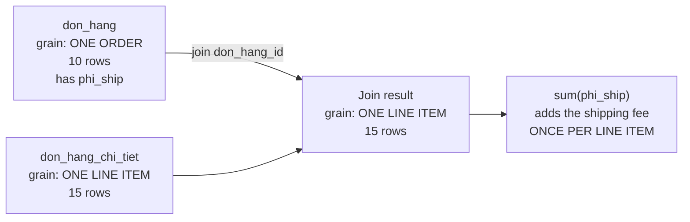

# Marketplace — shipping fees double-counted after a join

> **Takeaway:** joining the order table to the line-item table **inflates the grain**. Every
> `sum()` over a column belonging to the order table — shipping fee, order-level discount,
> invoice-level tax — is then added once per line item. The SQL is syntactically correct, dbt
> runs green, the numbers are wrong.

> **On authenticity.** The context is a reconstruction; **the output and the numbers are real**,
> produced on the lab at `~/Documents/learn-lab/dbt` (dbt-core 1.12.0 + dbt-duckdb 1.10.1).
> `verified_at` is empty because the repo owner hasn't re-run it.

## Context

A marketplace. A manager wanted a single "revenue per day" table covering both merchandise
revenue and shipping fees, so nobody had to open two dashboards.

At that point the data team hadn't introduced layers — each request became a model, and each
model read straight from `source()` and did everything itself.

## The original model

```sql
-- models/marts/doanh_thu.sql  ← one model does everything
select
    cast(d.ngay_dat as date) as ngay,
    k.khu_vuc,
    sum(cast(ct.so_luong as bigint) * cast(ct.don_gia as bigint)) as doanh_thu
from {{ source('raw', 'don_hang') }} d
join {{ source('raw', 'don_hang_chi_tiet') }} ct on d.don_hang_id = ct.don_hang_id
join {{ source('raw', 'khach_hang') }} k on d.khach_id = k.khach_id
group by 1, 2
```

A new request arrived: *"add the shipping fee in as well"*. One line changed:

```sql
    sum(ct.thanh_tien) + sum(d.phi_ship) as doanh_thu   -- phí ship bị cộng đôi
```

`dbt run` went green. The dashboard showed numbers. Nobody reconciled them.

## Symptoms

Three weeks later, accounting reported that dashboard revenue was **higher** than the books by
roughly 7%. Not on one odd day — every day was higher, by a varying proportion.

## The wrong first hypotheses

**Hypothesis 1: cancelled orders are still counted.** The most plausible one — a missing status
filter is easy to forget. Checked: adding `where trang_thai <> 'huy'` **lowered** the number,
but it was still above the books, and the size of the gap didn't track the cancellation rate.
Not the main cause.

**Hypothesis 2: duplicate orders at the source.** Checked `count(*)` against
`count(distinct don_hang_id)` on the order table — equal. Ruled out.

**Hypothesis 3: a time-zone problem pushing orders into the wrong day.** That would shift
numbers **between days**, not inflate the **total**. Ruled out.

The turning point came when somebody asked the most basic question of all: *"after the join,
what is one row?"*

## Root cause



Order `DH001` has 2 line items → after the join, its `phi_ship = 60,000` appears **twice**. An
order with 1 line is correct; an order with 3 lines is tripled. That's why the proportion
varies by day: it depends on the average number of line items per order that day.

The `phi_ship` column belongs to the **order grain**; after the join the table is at the **line
item grain**. Aggregating a coarse-grained column over a table that has been made finer is a
meaningless operation — and SQL has no way of knowing that.

## Measuring the bug

Write a singular test reconciling the mart against staging:

```sql
-- tests/tong_mart_khop_staging.sql
with a as (select sum(doanh_thu)  t from {{ ref('mart_doanh_thu_ngay') }}),
     b as (select sum(thanh_tien) t from {{ ref('stg_don_hang_chi_tiet') }})
select a.t as mart, b.t as staging
from a, b
where a.t <> b.t
```

```bash
dbt build -s mart_doanh_thu_ngay --profiles-dir . --store-failures
```

```text
02:41:13  4 of 5 FAIL 1 tong_mart_khop_staging ........................................... [FAIL 1 in 0.09s]
02:41:13  [ERROR]: in test tong_mart_khop_staging (tests/tong_mart_khop_staging.sql)
02:41:13    Got 1 result, configured to fail if != 0
02:41:13  Done. PASS=4 WARN=0 ERROR=1 SKIP=0 NO-OP=0 REUSED=0 TOTAL=5
```

`--store-failures` writes the failing rows into `main_dbt_test__audit`:

```text
┌──────────┬──────────┐
│   mart   │ staging  │
├──────────┼──────────┤
│ 10925000 │ 10215000 │
└──────────┴──────────┘
```

Off by **710,000** on 10,215,000 — **7.0%**. Exactly the total of the over-counted shipping
fees.

## The fix

### 1. Split into layers — one question per model

```sql
-- models/staging/stg_don_hang.sql          (grain: one order)
select don_hang_id, khach_id,
       cast(ngay_dat as date) as ngay_dat,
       trang_thai,
       cast(phi_ship as bigint) as phi_ship
from {{ ref('don_hang') }}
```

```sql
-- models/staging/stg_don_hang_chi_tiet.sql (grain: one line item)
select don_hang_id, dong, ma_hang,
       cast(so_luong as bigint) as so_luong,
       cast(don_gia  as bigint) as don_gia,
       cast(so_luong as bigint) * cast(don_gia as bigint) as thanh_tien
from {{ ref('don_hang_chi_tiet') }}
```

### 2. Aggregate to a common grain **before** joining

```sql
-- models/marts/mart_doanh_thu_ngay.sql
{{ config(materialized='table') }}

with hang_theo_don as (          -- bring the line-item table down to ORDER grain first
    select don_hang_id, sum(thanh_tien) as tien_hang
    from {{ ref('stg_don_hang_chi_tiet') }}
    group by 1
)
select
    dh.ngay_dat              as ngay,
    count(*)                 as so_don,
    sum(h.tien_hang)         as doanh_thu_hang,
    sum(dh.phi_ship)         as phi_ship,        -- now correct: one row per order
    sum(h.tien_hang) + sum(dh.phi_ship) as tong_thu
from {{ ref('stg_don_hang') }} dh
join hang_theo_don h using (don_hang_id)
group by 1
```

This pattern — **aggregate the finer table to the coarser grain before joining** — is the
general cure for every fan-out case, not just shipping fees.

The merchandise-only version, reproducing the original correct result:

```text
┌────────────┬────────┬───────────┐
│    ngay    │ so_don │ doanh_thu │
├────────────┼────────┼───────────┤
│ 2026-07-01 │      2 │   1350000 │
│ 2026-07-02 │      2 │   3150000 │
│ 2026-07-03 │      2 │   4200000 │
│ 2026-07-04 │      2 │   1095000 │
│ 2026-07-05 │      2 │    420000 │
└────────────┴────────┴───────────┘
```

Total 10,215,000 — matching staging, test green.

### 3. Put guardrails in so it can't recur

```yaml
models:
  - name: mart_doanh_thu_ngay
    description: "Doanh thu và số đơn theo ngày đặt. Grain: một dòng một ngày."
    columns:
      - name: ngay
        tests: [unique, not_null]
      - name: doanh_thu
        description: "Tổng thành tiền của các dòng hàng trong ngày, CHƯA gồm phí ship."
        tests: [khong_am]
```

Three layers of guardrail, each catching something different:

| Layer | Catches |
|---|---|
| `unique` on `ngay` | the mart's grain being broken |
| The singular test reconciling totals | any total discrepancy, fan-out included |
| The `description` saying **excluding shipping fees** | the next user not adding them again |

That "excluding shipping fees" clause in the description is something **only a human can
write** — no lineage tool can infer it, and it is precisely the information that was missing
from the start.

## Result

| | Before | After |
|---|---|---|
| Daily revenue (total) | 10,925,000 | **10,215,000** |
| Error versus the books | +7.0% | 0 |
| Marts reading `source()` directly | yes | no — through staging |
| A test reconciling totals | none | yes, run nightly |
| The `description` stating the measure's scope | no | yes |

## Lessons

1. **After every `join`, ask again: what is one row now?** When the grain changes, every
   `sum()` downstream must be re-examined. It's the cheapest question to ask and the most
   frequently skipped.
2. **Aggregate to a common grain before joining.** The `with ... group by` then join pattern is
   the general cure for fan-out.
3. **A coarse-grained column must not be `sum()`-ed once the table has been made finer.**
   Shipping fees, order-level discounts, invoice-level tax — all the same trap.
4. **A model that does everything leaves nowhere to attach tests.** Layering isn't an aesthetic
   convention; it creates the points where verification is possible.
5. **`unique`/`not_null` tests cannot catch this.** Only a reconciliation test can — and it has
   to be written *before* the incident.
6. **A gap whose proportion varies by day points at fan-out**, not at a filter bug. Filter bugs
   produce a more stable proportion.

## Related Topics

- [Layering and naming conventions](../reference/layer-va-dat-ten.md) — why marts don't call `source()`
- [Grain](../../../data-modeling/reference/grain.md) — the original question behind this whole case
- [Joining two facts inflates the total](../../../data-modeling/case-studies/join-hai-fact-lam-phong-tong.md) — the same trap at the modelling layer
- [Implementing tests in dbt](../skills/implementing-tests.md) — singular tests and `--store-failures`
- [Intermediate exercises](../tutorials/bt-02-trung-binh.md) — exercise T2 reconstructs this whole case
