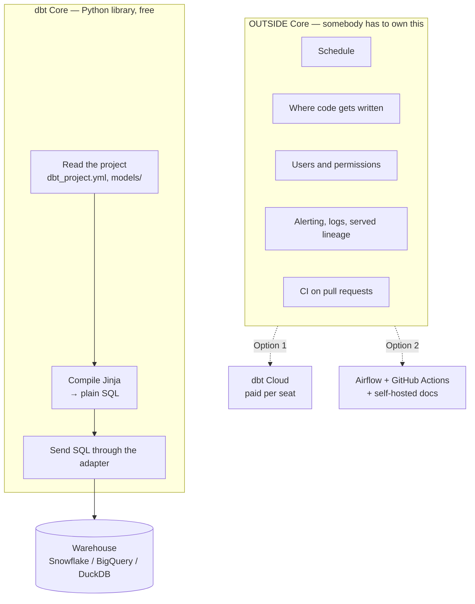
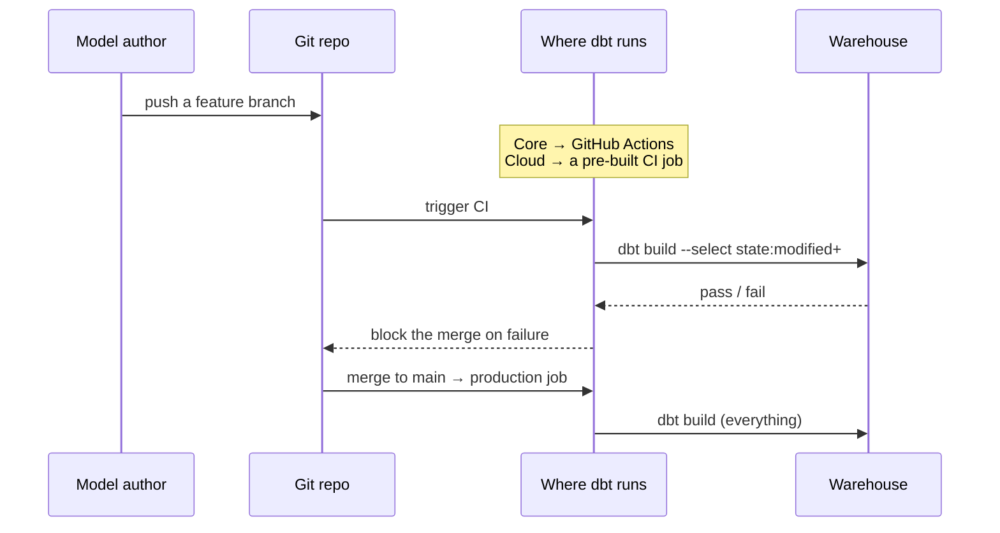

# dbt Core and dbt Cloud

> **Takeaway:** both use **the same compilation engine**. A model written for Core runs
> unchanged on Cloud and vice versa. Cloud does not sell transformation capability — it
> sells **a scheduler, a browser IDE, permission management, and a metadata API**. If you
> already have Airflow and CI, most of what Cloud sells is something you already own.

## Goal

Be able to answer the interview question *"does your team use dbt Cloud or Core, and
why"* without falling into either trap: thinking Cloud is "more powerful", or thinking
Core is "more professional".

## Overview

dbt Core is a **Python library** installed with `pip`. It reads your project, compiles
Jinja into SQL, and sends that SQL to the warehouse. That's it. No schedule, no UI, no
concept of a "user".

Everything else — who presses run, when it runs, who may edit which model, who can see
lineage — lives **outside Core**. dbt Cloud is one way to fill that outside; Airflow +
GitHub Actions + self-hosted `dbt docs` is another.

```bash
# Core: just a command in your terminal
pip install dbt-core dbt-duckdb
dbt run
```

## Why the boundary matters

The real question when choosing isn't "which is better" but **"which piece is my team
missing"**.

A team of two that already runs Airflow for ingestion is missing almost nothing — adding
a `BashOperator` task that calls `dbt build` is the whole job. A team of twenty, half of
them analysts who aren't comfortable with git, is missing exactly the IDE + permissions
piece, and that is the most expensive piece to build yourself.

Choose wrong in the "buy it to be safe" direction and you pay for what you don't use.
Choose wrong in the "build it to stay in control" direction and six months later you own
a homegrown scheduler nobody dares touch.

## Architecture



The key point: **the `CORE` box is identical in both options.** There is no
transformation feature that only Cloud has.

## Components — what belongs to whom

| Piece | dbt Core | dbt Cloud |
|---|---|---|
| Compiling Jinja → SQL | ✅ | ✅ same engine |
| `ref()`, the DAG, materializations | ✅ | ✅ |
| Tests, snapshots, seeds | ✅ | ✅ |
| Packages (`dbt_utils`…) | ✅ | ✅ |
| `dbt docs generate` | ✅ generates static files, you host them | ✅ hosting included |
| **Scheduler** | ❌ your problem — cron/Airflow/Dagster | ✅ |
| **Browser IDE** | ❌ use your own editor | ✅ |
| **Users, roles, per-environment permissions** | ❌ | ✅ |
| **CI on pull requests** | ❌ build it with GitHub Actions | ✅ built in, with `state:modified` |
| **Metadata / Discovery API** | ❌ only a local `manifest.json` | ✅ a queryable API |
| **Semantic Layer** | partly (`dbt-metricflow` installed separately) | ✅ with an API for BI tools |
| Price | 0 | per **developer seat** + usage tier |

## How it flows — the same `dbt build`, a different button



The diagram is identical for both. Only the `Run` box differs.

## When Cloud is the right call

- Most of the people writing models are **analysts who don't use git or a terminal** —
  that IDE piece is very expensive to build.
- **You have no orchestrator yet** and you don't want to stand up Airflow just to run dbt.
- You need **per-environment permissions** (who may run against prod) without building it.
- You need the Semantic Layer served to BI tools over an API.

## When Cloud is the wrong call

- **You already run Airflow/Dagster** reliably — adding a task that calls dbt is a few
  dozen lines.
- Your team is all engineers, comfortable with git and CI — Cloud's most expensive piece
  becomes dead weight.
- Data and connections **must not leave the internal network** and you don't want to build
  a private path.
- Per-seat cost exceeds what you're actually buying: 15 developer seats to run 4 jobs a day
  is paying for an IDE, not a scheduler.

## Trade-offs

| Axis | Core | Cloud |
|---|---|---|
| Cash cost | 0 | per seat, grows with the number of model authors |
| People cost | high — somebody must own the scheduler and CI | low |
| Control | total; you can insert anything anywhere | within what Cloud allows |
| Vendor lock-in risk | low — the project is files in git | medium; **the project stays portable**, what locks you in is jobs/permissions/metadata |
| dbt version upgrades | your choice, your problem | Cloud moves you along its track |
| Time from zero to a daily job | days–weeks | hours |

The lock-in row is the one people overstate. **Models, tests and macros are all `.sql`
and `.yml` files in git** — leaving Cloud doesn't lose them. What you lose is the
schedule, the run history, and any metadata API built on top of them.

## Example — replacing "Cloud's scheduler" with 12 lines

With Core, in many teams the scheduler piece is only this much:

```yaml
# .github/workflows/dbt-prod.yml — runs at 6am every day
name: dbt production
on:
  schedule: [{cron: '0 23 * * *'}]   # 23:00 UTC = 06:00 GMT+7
jobs:
  build:
    runs-on: ubuntu-latest
    steps:
      - uses: actions/checkout@v4
      - run: pip install dbt-core dbt-snowflake
      - run: dbt deps && dbt build --target prod
        env:
          DBT_SNOWFLAKE_PASSWORD: ${{ secrets.DBT_SNOWFLAKE_PASSWORD }}
```

What these 12 lines **don't** give you: a UI for run history, nice alerting,
per-environment permissions, retry from the failed node. That is exactly what Cloud sells.
If none of those four are your team's problem, 12 lines is enough.

## Common Mistakes

| Mistake | Why it's wrong |
|---|---|
| "Cloud runs faster" | Both push SQL down to the warehouse. Speed is the warehouse's business, not dbt's |
| "Core has no CI" | Core doesn't *ship* CI. CI is still buildable with GitHub Actions + `state:modified` |
| "Pick Core and you can never move to Cloud" | Moving means pointing Cloud at that same repo. And back again |
| Buying seats for people who only **read** reports | A developer seat is for people who **write** models; dashboard readers need none |
| Using the Cloud IDE and dropping git discipline | Cloud is still git underneath. Skip PR review and you lose the only guardrail |

## FAQ

<details>
<summary>How do I answer "which one does your team use" in an interview?</summary>

Answer in terms of **the missing piece**, not the product name: "My team already had
Airflow for ingestion, so we use Core, wire dbt in as a task, and run CI in GitHub
Actions with `state:modified+`. If most of the model authors were analysts who don't use
git, I'd seriously consider Cloud, because the IDE and permissions piece is expensive to
build."

That answer shows you understand the engine/shell boundary — which is what the
interviewer actually wants to hear.

</details>

<details>
<summary>Do dbt Fusion / dbt-mcp change this answer?</summary>

They don't change **the boundary**: the engine still compiles Jinja and pushes SQL to the
warehouse, and the shell is still scheduler/IDE/permissions. Product details change every
quarter — **verify with `dbt --version` and the pricing page at the moment you decide**,
don't trust a number in an old note. This is precisely the kind of environment detail this
knowledge base forbids inventing; see the
[case study](../case-studies/ai-sinh-sai-ten-catalog-trino.md).

</details>

<details>
<summary>With Core, where do I look at lineage?</summary>

`dbt docs generate` produces `target/index.html` plus `manifest.json` and `catalog.json`.
Host the `target/` directory anywhere static (S3, GitHub Pages, nginx). See
[dbt docs and lineage](docs-and-lineage.md).

</details>

## Related Topics

- [The structure of a dbt project](project-structure.md) — identical in both editions
- [dbt docs and lineage](docs-and-lineage.md) — self-hosting the metadata piece
- [Setting up CI/CD for a dbt project](../skills/ci-cd-cho-dbt.md) — building the CI piece on Core
- [What dbt is](what-is-dbt.md) — the engine both editions share
