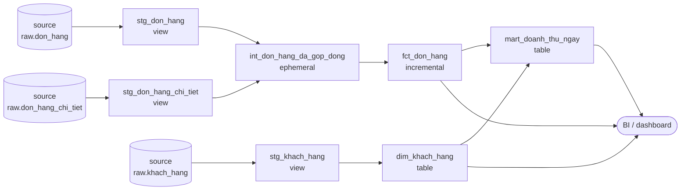

# Layering and naming conventions

> **Takeaway:** the three layers `staging → intermediate → marts` exist so each model has
> to answer only **one** question. Staging answers *"what is this column called, what type
> is it"*; marts answers *"what does this number mean"*. Mixing the two questions into one
> model is why, six months later, nobody dares touch it.

## Goal

Know which layer a new model belongs in, what to name it, and be able to **verify** that
it doesn't violate that layer's rule — rather than "doing it the way everyone else does".

## Overview

| Layer | Prefix | One model corresponds to | Default materialization | Read by end users? |
|---|---|---|---|---|
| staging | `stg_` | **exactly one** source table | `view` | No |
| intermediate | `int_` | one named transformation step | `ephemeral` / `view` | No |
| marts | `fct_` / `dim_` | one business process / one entity | `table` / `incremental` | **Yes** |

Three rules come with it, and each breaks differently:

1. **Staging does not join.** One source, one model. Break it and nothing in the repo says
   "this is what the source table looks like" any more, so every downstream model has to
   guess.
2. **Marts do not call `source()` directly.** Always go through staging. Break it and a
   renamed source column means editing 12 places instead of 1.
3. **Nobody reads intermediate directly.** It exists to name a step, not to be a product.
   Break it and a dashboard points at `int_`, and from then on you can't refactor.

## Why it's needed

Without layers, every model becomes a do-everything model: casting, joining, aggregating
and computing metrics all at once. Concretely:

- **Nothing is reusable.** Model B needs exactly A's casting but not its aggregation →
  copy-paste. Then the two copies drift apart.
- **Tests have nowhere to attach.** Where do you put `unique` on the source key when no
  model represents the source?
- **Changing a source means changing everywhere.** The source renames `customer_id` to
  `cust_id` → edit every model that mentions it, instead of one `stg_`.

Three layers is the cheapest way to make each change touch exactly one place.

## Architecture



Two things you can read off the diagram:

- **Arrows only point right.** Marts never point back at `source`.
- **Only the right-hand boxes connect to `BI`.** No dashboard plugs straight into `stg_`
  or `int_`.

## Components

### The staging layer — `stg_<source>_<table>.sql`

Allowed to do exactly four things:

| Job | Example |
|---|---|
| Rename columns to the house convention | `cust_id` → `khach_id` |
| Cast types | `cast(ngay_dat as date)` |
| Compute **self-evident** derived columns | `so_luong * don_gia as thanh_tien` |
| Filter technical junk rows | `where _deleted = false` |

Not allowed: joins, aggregation (`group by`), business rules.

```sql
-- models/staging/stg_don_hang.sql
with nguon as (
    select * from {{ ref('don_hang') }}
)
select
    don_hang_id,
    khach_id,
    cast(ngay_dat  as date) as ngay_dat,
    cast(ngay_giao as date) as ngay_giao,
    cast(ngay_nhan as date) as ngay_nhan,
    trang_thai,
    cast(phi_ship as bigint) as phi_ship
from nguon
```

The leading `nguon` CTE looks redundant but earns its keep: when debugging, commenting out
one line swaps the source for a sample table, instead of editing mid-`select`.

### The intermediate layer — `int_<verb describing the step>.sql`

The name must be **a sentence describing a step**, not a table name:
`int_don_hang_da_gop_dong`, `int_khach_hang_da_gan_hang`. Read the name and you know what
the step does.

It exists if and only if: one transformation step is reused by **two or more** mart models,
or a mart model has grown too long to read.

Default it to `ephemeral` — dbt inlines it as a CTE in the downstream model and creates no
object in the warehouse. That matches "nobody reads it directly".

### The marts layer — `fct_` / `dim_` / `mart_`

| Prefix | Contains | Grain |
|---|---|---|
| `dim_` | descriptive attributes of an entity | one row per entity (or per *version*, under SCD2) |
| `fct_` | measures of an event | one row per event |
| `mart_` | a pre-aggregated table for one specific report | one row per dimension combination |

The `fct_` / `mart_` boundary: `fct_` keeps the event's native grain, `mart_` has already
been `group by`-ed. Collapsing both into one name loses your ability to say "how detailed
is this table still".

## Example — one requirement, two ways to organise it

Requirement: *revenue per day, with the customer's region*.

**The one-model way** — it runs, but:

```sql
-- models/marts/doanh_thu.sql  ← one model does everything
select
    cast(d.ngay_dat as date) as ngay,
    k.khu_vuc,
    sum(cast(ct.so_luong as bigint) * cast(ct.don_gia as bigint)) as doanh_thu
from {{ source('raw', 'don_hang') }} d
join {{ source('raw', 'don_hang_chi_tiet') }} ct on d.don_hang_id = ct.don_hang_id
join {{ source('raw', 'khach_hang') }} k on d.khach_id = k.khach_id
group by 1, 2
```

Where it breaks: the source changes the type of `ngay_dat` → edit here; a second model also
needs `thanh_tien` → copy the multiplication again; you want `unique` on the source's
`don_hang_id` → there's nowhere to attach it.

**The layered way** — same result, one job per place:

```sql
-- models/marts/mart_doanh_thu_ngay.sql
select
    dh.ngay_dat                    as ngay,
    count(distinct dh.don_hang_id) as so_don,
    sum(ct.thanh_tien)             as doanh_thu
from {{ ref('stg_don_hang') }} dh
join {{ ref('stg_don_hang_chi_tiet') }} ct using (don_hang_id)
group by 1
```

The `so_luong * don_gia` multiplication lives in **exactly one place**, inside
`stg_don_hang_chi_tiet`. Really run on the lab:

```text
02:37:53  1 of 3 OK created sql view model main_staging.stg_don_hang ..................... [OK in 0.07s]
02:37:53  2 of 3 OK created sql view model main_staging.stg_don_hang_chi_tiet ............ [OK in 0.07s]
02:37:53  3 of 3 OK created sql table model main_marts.mart_doanh_thu_ngay ............... [OK in 0.04s]
02:37:53  Done. PASS=3 WARN=0 ERROR=0 SKIP=0 NO-OP=0 REUSED=0 TOTAL=3
```

Result:

```text
┌────────────┬────────┬───────────┐
│    ngay    │ so_don │ doanh_thu │
├────────────┼────────┼───────────┤
│ 2026-07-01 │      2 │   1350000 │
│ 2026-07-02 │      2 │   3150000 │
│ 2026-07-03 │      2 │   4200000 │
│ 2026-07-04 │      2 │   1095000 │
│ 2026-07-05 │      2 │    420000 │
└────────────┴────────┴───────────┘
```

Total 10,215,000 — matching `sum(so_luong * don_gia)` across all 15 line items.

## Declaring layers in `dbt_project.yml`

Declare default materializations once per directory instead of scattering `config()` across
files:

```yaml
models:
  dbt_lab:
    +materialized: view          # default for the whole project

    staging:
      +schema: staging           # DuckDB creates the schema main_staging

    intermediate:
      +schema: intermediate
      +materialized: ephemeral

    marts:
      +schema: marts
      +materialized: table
```

On DuckDB, `+schema: staging` produces a real schema named **`main_staging`** — dbt
concatenates `<default schema>_<declared schema>`. Every adapter concatenates differently;
verify with `dbt run` output rather than guessing.

## Trade-offs

| Choice | You get | You pay |
|---|---|---|
| Full three layers | each change touches one place; tests attach at the right layer | more files; a longer DAG |
| Dropping the intermediate layer | fewer files | marts bloat; logic repeats across marts |
| Folding staging into marts | fast at first | everything under *Why it's needed* |
| `stg_` as `view` | always fresh, no storage | marts re-read the source on every build |
| `stg_` as `table` | marts build faster | another copy of the data, another refresh step |

Defaulting staging to `view` is the right call until you can **measure** that it's slow. See
[Materializations](materializations.md).

## Common Mistakes

| Mistake | Consequence | How to spot it |
|---|---|---|
| Joining inside `stg_` | no table represents the source any more | grep `join` in `models/staging/` returns hits |
| Marts calling `source()` directly | changing a source means editing many places | grep `source(` outside `models/staging/` |
| A dashboard pointing at `int_` | you can never refactor again | an `int_` materialized as `table`/`view` with query traffic |
| Named `fct_` but already `group by`-ed | nobody knows how detailed the table still is | a `group by` inside an `fct_*.sql` |
| Numbering file names (`01_stg_don_hang`) | dbt orders by the DAG, not by name; the number is pure noise | file names with numeric prefixes |
| One `stg_` for two sources | rule 1 is broken | a `stg_` with two `ref()`/`source()` calls |

## Verify with commands, not by eye

All three rules above are **greppable** — so put them straight into CI:

```bash
# Rule 1 — staging does not join
grep -rn --include='*.sql' -iE '\bjoin\b' models/staging/ && echo 'VI PHAM luat 1'

# Rule 2 — only staging may call source()
grep -rn --include='*.sql' 'source(' models/ | grep -v '^models/staging/' && echo 'VI PHAM luat 2'

# Rule 3 — no model outside marts may ref() an int_
grep -rn --include='*.sql' "ref('int_" models/staging/ && echo 'VI PHAM thu tu tang'
```

A rule with nothing enforcing it drifts within six months — exactly why this knowledge
base's [`ROUTING.md`](https://github.com/vuhoang001/knowledge/blob/main/ROUTING.md) ships a
linter.

## Related Topics

- [Models and `ref()`](models-and-ref.md) — what draws the arrows in the diagram
- [Materializations](materializations.md) — what to pick per layer
- [The structure of a dbt project](project-structure.md) — which directory holds what
- [Facts and dimensions](../../../data-modeling/reference/fact-and-dimension.md) — where `fct_`/`dim_` get their meaning
- [Grain](../../../data-modeling/reference/grain.md) — what decides `fct_` versus `mart_`
