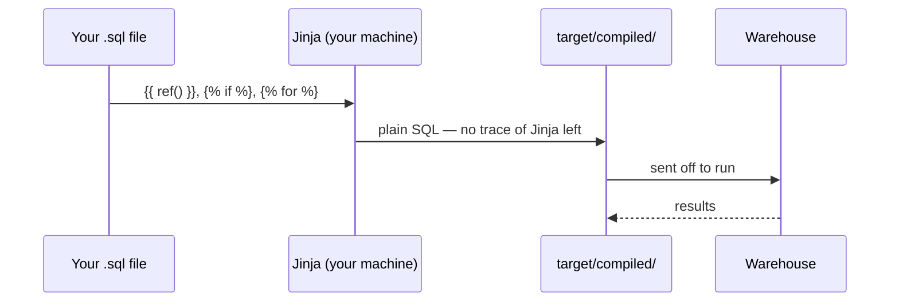

# Writing macros and using Jinja logic

> **Takeaway:** Jinja is a **text generator** that runs entirely on your machine before a
> single line of SQL is sent anywhere. The warehouse never sees a ``. Every
> confusion about macros traces back to forgetting that order.

## Learning goal

Write a macro that takes arguments, use a loop to generate columns, and **always verify in
`target/compiled/`** instead of guessing — even for a three-line macro.

## Step 0 — The order is everything



Direct consequences:

- Don't debug a macro by reading the `.sql` file. Read `target/compiled/`.
- Jinja **doesn't know your data**. For it to know, you must run a query at compile time
  (`run_query` / `dbt_utils.get_column_values`) — which slows down parsing.
- `` is not `case when`. The first chooses *which text gets written*; the second
  chooses *which value gets returned*.

## Step 1 — Your first macro

Macros live in `macros/`. The file name doesn't matter; **the macro name is global**.

```sql
-- macros/vnd.sql

round({{ cot }} / 1000000.0, 2)

```

Using it:

```sql
select {{ vnd('sum(thanh_tien)') }} as doanh_thu_trieu
from {{ ref('stg_don_hang_chi_tiet') }}
```

The threshold for writing a macro: **the same SQL fragment appears for the third time**. The
second time, copying is still cheaper; from the third, the cost of editing them all together
exceeds the cost of one layer of indirection.

## Step 2 — A loop that generates columns

The problem: pivot revenue by product group, where **the list of groups isn't fixed**.

```sql
-- models/marts/mart_pivot_nhom.sql


select
    ct.ngay
    ,
    {{ vnd("sum(case when hh.nhom = '" ~ n ~ "' then ct.thanh_tien else 0 end)") }} as nhom_{{ loop.index }}
    
from {{ ref('stg_don_hang_chi_tiet') }} ct
join {{ ref('hang_hoa') }} hh using (ma_hang)
group by 1
order by 1
```

The compiled SQL — this is what the warehouse receives:

```sql
select
    ct.ngay,
    round(sum(case when hh.nhom = 'Thiết bị nhập' then ct.thanh_tien else 0 end) / 1000000.0, 2) as nhom_1,
    round(sum(case when hh.nhom = 'Màn hình' then ct.thanh_tien else 0 end) / 1000000.0, 2) as nhom_2,
    round(sum(case when hh.nhom = 'Máy tính' then ct.thanh_tien else 0 end) / 1000000.0, 2) as nhom_3
from "lab"."main_staging"."stg_don_hang_chi_tiet" ct
join "lab"."main"."hang_hoa" hh using (ma_hang)
group by 1
order by 1
```

The result (unit: millions of dong):

```text
┌────────────┬────────┬────────┬────────┐
│    ngay    │ nhom_1 │ nhom_2 │ nhom_3 │
├────────────┼────────┼────────┼────────┤
│ 2026-07-01 │   1.05 │    0.3 │    0.0 │
│ 2026-07-02 │   0.45 │    1.8 │    0.9 │
│ 2026-07-03 │    1.5 │    0.0 │    2.7 │
│ 2026-07-04 │    0.2 │    0.9 │    0.0 │
│ 2026-07-05 │   0.42 │    0.0 │    0.0 │
└────────────┴────────┴────────┴────────┘
```

Note that `dbt_utils.get_column_values` **runs a real query at compile time**. Which means:

- The `hang_hoa` table must exist before parsing — CI on a blank environment will break.
- Adding a new product group at the source **changes the model's column count** by itself.
  Convenient, and also a risk: the column contract is no longer stable, and downstream
  dashboards may break.

## Step 3 — Whitespace: ``

Without whitespace control, the compiled SQL looks like this:

```sql
select
    ct.ngay,
    
    
    round(sum(case when hh.nhom = 'Thiết bị nhập' then ct.thanh_tien else 0 end) / 1000000.0, 2)
 as "thiết_bị_nhập",
```

It runs, but it's unreadable — and `target/compiled/` is exactly where you'll be debugging.
The rule: **the `-` goes on the side whose whitespace you want swallowed.**

| Written | Swallows |
|---|---|
| `` | whitespace/newlines **before** the tag |
| `` | whitespace/newlines **after** the tag |
| `` | both sides |

## Step 4 — Built-in variables, used in the right place

| Variable / function | What it is | Use when |
|---|---|---|
| `{{ this }}` | the model being built | incremental: asking "how far have I got" |
| `{{ target.name }}` | the target name (`dev`/`prod`) | limiting data in dev |
| `{{ target.schema }}` | the schema being written to | logging, checks |
| `{{ var('x', default) }}` | a variable from `dbt_project.yml` or `--vars` | parameterising a backfill date |
| `{{ env_var('X') }}` | an environment variable | secrets — **only** in `profiles.yml` |
| `{{ run_started_at }}` | when this invocation began | audit columns |
| `{{ invocation_id }}` | the id of this run | tracing a batch |
| `{{ log(..., info=True) }}` | print to the console at compile time | debugging a macro |

The dev data-limiting pattern — it saves a lot of warehouse money:

```sql
select * from {{ source('erp', 'orders') }}

where order_date >= current_date - interval 7 day

```

## Step 5 — Macros that run queries: `run_query`

```sql
-- macros/liet_ke_nhom.sql

  
  
    {{ log("Nhóm hàng: " ~ kq.columns[0].values(), info=True) }}
  

```

The `` guard is mandatory. dbt parses the project **twice**: the first pass
only builds the DAG (`execute == false`, and `run_query` returns `none`), the second actually
runs. Without the guard you get `'None' has no attribute 'columns'` at parse time.

```bash
dbt run-operation liet_ke_nhom --profiles-dir .   # run a macro standalone, no model needed
```

## Step 6 — Hooks

```yaml
# dbt_project.yml
models:
  dbt_lab:
    marts:
      +post-hook: "insert into audit_log values ('{{ this }}', '{{ run_started_at }}')"

on-run-end:
  - "{{ grant_select_tren_schema(schemas) }}"
```

The most common real-world hook is granting `select` to the BI role after each build —
without it, newly created tables are unreadable by anyone.

## Common errors

| Error | Symptom | Fix |
|---|---|---|
| Debugging a macro by reading the `.sql` file | wasted hours | Read `target/compiled/` |
| Using `` where `case when` belongs | wrong logic, no error | `` picks *text*, `case when` picks *values* |
| Forgetting `` around `run_query` | `'None' has no attribute` at parse time | Add the guard |
| A macro name colliding with a package's macro | dbt picks the wrong one | Macro names are **global**; use your own prefix, e.g. `cty_vnd` |
| No whitespace control | unreadable compiled SQL | `` |
| `env_var()` inside a model | the secret lands in `manifest.json`, then in git | Secrets only in `profiles.yml` |
| A macro generating different SQL in dev and prod unnoticed | prod breaks, dev is green | Diff `target/compiled/` between the two targets |
| Writing a macro on the first repetition | a layer of indirection bought nothing | Wait for the third |

## Verifying

```bash
dbt compile -s mart_pivot_nhom               # compile only, don't run
cat target/compiled/dbt_lab/models/marts/mart_pivot_nhom.sql
dbt run-operation <ten_macro> --args '{x: 1}'
```

The habit to build: **every time you edit a macro, open the compiled SQL and read it
through.** Macros are the one place in dbt where syntactically correct code can still produce
meaningless SQL.

## Related Topics

- [Macros, Jinja and packages](../reference/macros-jinja-packages.md) — the theory
- [Managing packages](quan-ly-package.md) — other people's macros
- [Writing an incremental model](viet-incremental-model.md) — `is_incremental()` is Jinja
- [Intermediate exercises](../tutorials/bt-02-trung-binh.md) — exercise T3
