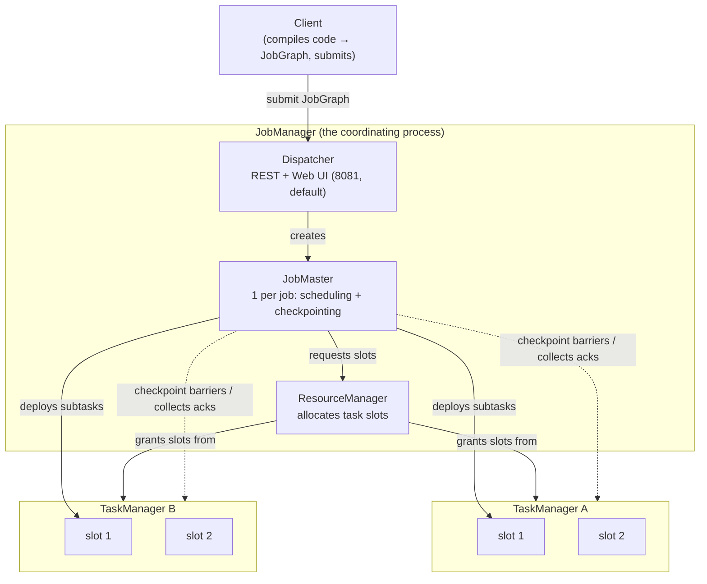

# Flink job architecture

> **Takeaway:** the JobManager *coordinates* (scheduling, checkpointing, recovery) while the TaskManager
> *executes* (running subtasks in task slots); scaling a job is a matter of
> **parallelism** and the number of **slots**, and raising parallelism isn't free because it drags
> state redistribution with it.

A Flink cluster has two kinds of process. Understanding the boundary between them is the precondition
for reading the UI, diagnosing errors, and tuning.

## The overview: who talks to whom



## JobManager — the coordinating brain

The JobManager doesn't run data; it coordinates. Inside it are three components with distinct roles:

- **Dispatcher** — receives job submissions from clients, starts a **JobMaster** for each job, and
  provides the **REST API + Web UI** (port **8081** is the *default*, changeable via config).
  It outlives individual jobs; it's the cluster's front door.
- **ResourceManager** — manages and allocates **task slots** from the TaskManagers. This is the
  component that knows how many free slots the cluster has and grants them to a JobMaster on request. There's
  a version per platform (Standalone, YARN, Kubernetes) — differing in how they *request more*
  TaskManagers when short.
- **JobMaster** — **one per job**. It schedules tasks into slots, **coordinates
  checkpoints** (emitting barriers into the sources, collecting acknowledgements from every subtask, finalising
  a completed checkpoint), and handles **recovery** when a subtask dies (picking the most recent checkpoint and restoring).

The three-way split separates *the cluster's front door* (Dispatcher), *resource accounting* (ResourceManager)
and *one job's lifecycle* (JobMaster) — each job has its own JobMaster, so one broken job doesn't drag
the other jobs in the session down with it.

## TaskManager — where it actually runs

The TaskManager (also called a *worker*) is where data flows through and computation happens:

- It runs the **subtasks** (one parallel copy of one operator).
- It provides **task slots** — a fixed unit of resource; each TaskManager has N slots, dividing its managed
  memory evenly between them.
- It manages the **network buffers** for exchanging data between subtasks (this is also where
  backpressure shows up — a full buffer slows the upstream down; see
  [backpressure-tuning](../skills/backpressure-tuning.md)).

### The TaskManager memory model

This is where tuning hurts most. A TaskManager's memory is **not** just "the heap"; it's divided
into several regions, and Flink allocates them from the total `taskmanager.memory.process.size`:

| Region | Lives in | What it does | Change it when |
|---|---|---|---|
| **Framework heap** | JVM heap | Memory for the Flink framework itself | Almost never touched |
| **Task heap** | JVM heap | *User code* objects (operators, on-heap state) | Large on-heap state/logic → raise it if the heap OOMs |
| **Managed memory** | Off-heap, managed by Flink | The **RocksDB** state backend, buffers for sort/hash (batch) | Using RocksDB, or a batch job with heavy sorting |
| **Network buffers** | Off-heap | Buffers for exchanging data between subtasks (credit-based) | High parallelism/shuffle reports insufficient network buffers |
| **JVM metaspace** | Off-heap | The JVM's class metadata | Loading many classes (many connectors/UDFs) |
| **JVM overhead** | Off-heap | Thread stacks, native memory, GC housekeeping | Heavy native libraries |

Why it's divided this way: **managed memory sits off-heap and Flink manages it** so that RocksDB and the
large buffers stay out of the JVM heap — inside the heap they'd cause long GC pauses and
unpredictable OOMs. Network buffers are separated out so backpressure has a measurable "valve". The classic trap:
turning on RocksDB but leaving managed memory too small → RocksDB allocates memory outside its budget →
the container is **killed for exceeding its limit** by the OS/YARN/K8s, with no Flink error reported.

The concrete figures (each region's limit in MB) depend on the configuration and version — take them from
a real TaskManager's startup log, don't guess. *(illustrative numbers — not run)*

## Task slots vs parallelism

Two easily confused concepts:

- An operator's **parallelism** = the number of parallel copies of it running. Parallelism 4
  means 4 subtasks each processing a quarter of the data (split by key if keyed).
- A **task slot** = a resource *place* on a TaskManager to put a subtask into. The cluster's total slot
  count is the ceiling for parallelism.

The rough rule: **the slots you need ≥ the highest parallelism in the job.**

### Slot sharing groups

By default Flink lets subtasks *belonging to different operators but the same pipeline*
share **one slot** (slot sharing). Thanks to this, one slot can hold the whole
source→map→window→sink chain, and the slots needed equal only the highest parallelism, not the total
subtask count.

Why sharing helps: a slot then holds *a whole vertical slice* of the pipeline, so (1) resources are used
better — a slow source doesn't leave the sink's slot idle; (2) data between operators inside one slot
travels inside one process, avoiding the network. You can split them with
`.slotSharingGroup("name")` to isolate a heavy operator (say an enormous window state)
from the rest, at the cost of extra slots.

## Operator chaining

Flink **merges** adjacent operators into a *chain* to run in one thread, when
they connect 1-to-1 (no partitioning change) and share a parallelism. For example `map → filter` is merged
into one chain.

**What you get:** you eliminate the serialize/deserialize and buffer exchange between two operators — the data
is passed by function call within the same thread. This is one of Flink's biggest optimisations.

A chain is **cut** at a `keyBy` boundary (a partitioning change → it must shuffle over the network), on a
parallelism change, or when you call `disableChaining()`. In the UI, one box = one chain, so
don't confuse "one box" with "one operator".

## Tasks and subtasks

- **Task** = one operator (or one chain) in the JobGraph.
- **Subtask** = one specific parallel copy of that task. A task with parallelism 3 → 3 subtasks.

A subtask is the unit placed into a slot and scheduled.

## From code to ExecutionGraph — four layers of representation

A SQL or DataStream job passes through several representation layers before it can run:

```text
User code (SQL / DataStream)
   │  (client hoặc JobManager biên dịch)
   ▼
StreamGraph      logic thô: mọi operator, chưa chain, chưa tối ưu
   ▼
JobGraph         đã CHAIN operator liền nhau; đơn vị được submit lên cụm
   ▼
ExecutionGraph   TRẢI theo parallelism: mỗi task → N subtask, gán slot, dựng cạnh dữ liệu
   ▼
Physical         subtask thật đặt trên TaskManager cụ thể, chạy
```

- **StreamGraph** — the raw logical representation exactly as you wrote it, one operator per node, with no
  optimisation.
- **JobGraph** — adjacent operators are already **chained** into larger units to reduce
  serialization/network cost. *This is what gets serialized and submitted to the cluster.*
- **ExecutionGraph** — the JobMaster "flattens" the JobGraph by parallelism: each task becomes N
  subtasks, the data-exchange edges are built (forward or shuffle), and slots are assigned. This is the graph
  the JobManager actually **schedules and tracks** — the SCHEDULED/RUNNING/FAILED states you
  see in the UI are at this layer.
- **Physical** — subtasks are deployed into slots on specific TaskManagers.

## The network stack — credit-based flow control

Between two subtasks connected over the network (after a `keyBy` or a parallelism change), Flink uses **credit-based
flow control**:

- The **downstream** subtask tells the upstream how much **credit** it has = how many
  free buffers are ready to receive.
- The upstream **only sends** up to that credit. Slow downstream consumption → credit reaches 0 →
  the upstream stops sending → the upstream's buffers fill → *it* slows down too → the pressure **propagates
  backwards** all the way to the source.

This is exactly the **backpressure** mechanism you can measure in Flink: not "dropping data",
but a *self-closing valve* propagating from the bottleneck back to the source. In the UI, a highly
backpressured subtask means it's being held back by the downstream. The details of reading and tuning it are in
[backpressure-tuning](../skills/backpressure-tuning.md).

## Deployment modes

| Mode | Where user code / the JobGraph is produced | Use when |
|---|---|---|
| **Session** | The client produces it and submits into a shared, already-running cluster | Many short jobs, sharing infrastructure |
| **Application** | Produced **on** the cluster (inside the JobManager), one cluster per app | Production, resource isolation |
| ~~Per-job~~ | (**deprecated**) | — don't use for anything new |

Session mode shares a cluster between several jobs — light for experiments, but one resource-hungry job can
affect the others, and the client has to compile the JobGraph (costing client resources).
Application mode isolates each application in its own cluster and runs `main()` *on* the JobManager —
the current production standard. The old per-job mode is deprecated; if a document still mentions it,
treat it as out of date.

### High availability (HA) — the JobManager isn't a single point of failure

The JobManager is the central coordination point; if it dies without HA, the whole job stops. HA solves this
with:

- **Several JobManagers**, one *leader* at a time, re-elected through **ZooKeeper** or
  **Kubernetes** (leader election). The JobManager dies → another becomes leader.
- **A JobGraph store + checkpoint metadata** stored durably (e.g. on HDFS/S3, with the pointer
  in ZK/a K8s ConfigMap). That way the new JobManager knows *which jobs exist*, where the most recent
  checkpoint is, and can **restore** rather than lose everything.

Without HA the JobManager is a single point of failure; production almost always has HA on.

## The trade-offs of raising parallelism

Raising parallelism is *not* free:

| You get | You lose | In exchange for |
|---|---|---|
| Higher throughput (if you weren't already bottlenecked) | Needing more slots/TaskManagers | Processing more events per second |
| Smaller load per subtask | **State redistribution** on a parallelism change → needing a savepoint, taking time | Scaling while keeping state |
| — | **Key skew**: if one hot key holds most of the data, more subtasks don't help | — |

**The key-skew trap:** parallelism only helps when the data divides evenly by key. If 90% of the events share
one `user_id`, the subtask holding that key is still the bottleneck no matter how far you raise parallelism —
all of a key's events go to exactly one subtask. It has to be solved by changing the key (adding a salt)
or pre-aggregating, not by adding slots.

**Rescaling state:** keyed state is distributed by key across subtasks via *key groups* (the smallest
unit state is split into). Changing parallelism means reassigning key groups to the new subtasks, so state
must be read out and redistributed — Flink can only do this when **restoring from a savepoint**,
never hot on a running job. That's why changing parallelism = stop, savepoint, restore.

## Common Mistakes

| Mistake | Consequence | Prevented by |
|---|---|---|
| Slots < parallelism | The job has nowhere to run and hangs at SCHEDULED | Ensuring total slots ≥ the highest parallelism |
| Raising parallelism to fix key skew | No improvement, wasted resources | Fixing the key distribution first |
| Changing parallelism directly without a savepoint | State lost | Savepoint → restore with the new parallelism ([savepoint-upgrade](../skills/savepoint-upgrade.md)) |
| Mistaking one UI box for one operator | Diagnosing the wrong bottleneck | Remembering one box = one chain |
| Turning on RocksDB with managed memory too small | The container is killed for exceeding memory, with no Flink error | Giving RocksDB enough managed memory |
| Running production without HA | The JobManager dies → the job stops and metadata is lost | Turning HA on via ZK/K8s |

## FAQ

<details>
<summary>How many subtasks can one slot run?</summary>

With slot sharing on (the default), one slot can hold a whole *chain* of subtasks belonging to different
operators of the same pipeline — but only **one** subtask per operator. So
the slots needed equal the highest parallelism, not the total subtask count.

</details>

<details>
<summary>Why does changing parallelism need a savepoint?</summary>

Keyed state is distributed by key (via key groups) across the subtasks. Changing parallelism means the
key partitioning changes, so state has to be read out and redistributed. Flink does this when
restoring from a savepoint; it can't do it on a running job.

</details>

<details>
<summary>What's the most important difference between session mode and application mode?</summary>

Where `main()` (compiling the JobGraph) runs, and whether resources are isolated. Session:
the client compiles and the cluster is shared between jobs → one bad job affects the whole cluster. Application:
`main()` runs on the JobManager, one cluster per app → isolated, the production standard.

</details>

## Related Topics

- [What Flink is](what-is-flink.md) — dataflow and the operator DAG, the foundation for this file
- [State and checkpoints](state-and-checkpoint.md) — how the JobManager coordinates checkpointing
- [Exactly-once in Flink](exactly-once.md) — the JobMaster collecting checkpoint acks to finalise completion
- [Backpressure and tuning](../skills/backpressure-tuning.md) — reading network buffers, credit-based flow control
- [Savepoints and upgrades](../skills/savepoint-upgrade.md) — changing parallelism while keeping state
- [Flink](../index.md) — the topic this file belongs to
