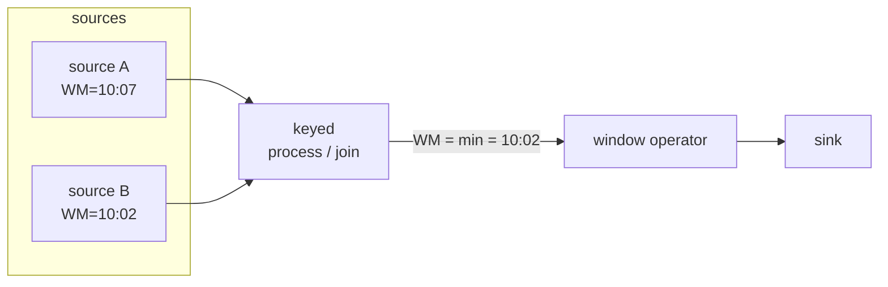
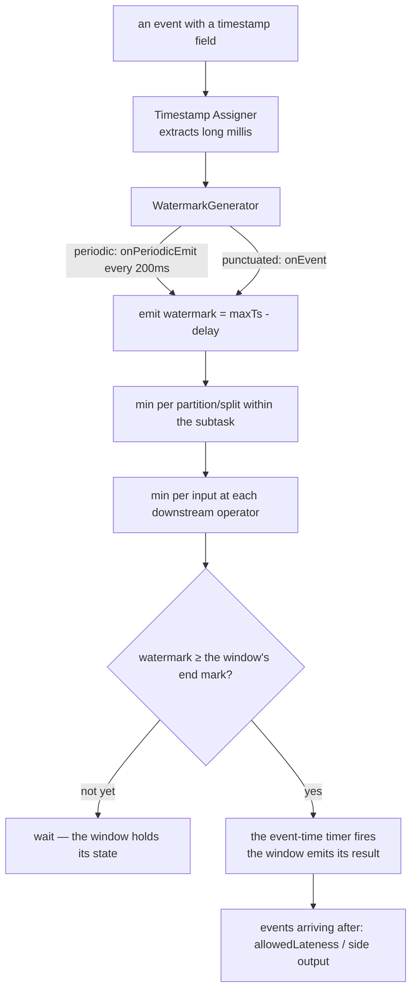

# Event time and watermarks

> **Takeaway:** processing time gives numbers that are **quietly wrong** when data arrives late or
> unevenly — with no error reported. Event time + watermarks are the only way to say
> **"this window has all its events, it can be closed"** based on when things *happened*, not
> when Flink *saw* them.

This is the most important file in the group. Almost every "the streaming numbers don't match
batch" bug traces back here.

## The three kinds of time

| Kind | What it is | Where it lives |
|---|---|---|
| **Event time** | When the thing **happened** at the source | In the data itself (a timestamp field) |
| **Ingestion time** | When the event **entered** the Flink source | Assigned by Flink on read |
| **Processing time** | When the operator **handled** the event | The clock of the machine running the operator |

Processing time is the machine's wall clock. Fast, no watermarks needed, and results that are *not
reproducible* — re-running the same data gives different numbers because the order and the delays differ.

Event time is read from the data. Slower, needs watermarks, but **reproducible** and **correct**:
an event at 10:03 always belongs to the 10:00–10:05 window whether Flink saw it at 10:04 or 10:09.

## Why processing time gives wrong numbers

Network delays, retries, a slow consumer, a backlogged Kafka partition — an event *happens* at
10:03 but *arrives* at the operator at 10:07. With processing time, the 10:00–10:05 window closed long
ago, so this event falls into the 10:05–10:10 window, **wrongly**. No exception, no
warning; just a month-end figure that disagrees with batch and nobody knowing why.

See the [case study on wrong numbers from processing time](../case-studies/so-sai-vi-processing-time.md)
for an example running from the data to the discrepant figure.

## What a watermark is

**A watermark = an assertion flowing in the stream: "there are no more events with timestamp ≤ T".**
It's a special record Flink inserts into the data flow, carrying a time value T. When
an operator sees watermark T, it trusts that *no event with event time ≤ T will arrive
any more* — and so every window ending ≤ T can close and emit its result.

Watermarks are precisely the mechanism that **pushes windows closed**. Without them, an event-time window
would never know when it's "complete" and would never emit a result.

## Generating watermarks — the internal mechanism

Watermarks don't appear by themselves. Flink generates them through a `WatermarkStrategy`, and inside the
strategy is a `WatermarkGenerator` with two callbacks deciding *when* to emit a watermark:

```java
// số minh hoạ — chưa chạy trên cluster
public interface WatermarkGenerator<T> {
    // gọi cho MỖI event — nơi cập nhật timestamp lớn nhất đã thấy
    void onEvent(T event, long eventTimestamp, WatermarkOutput output);

    // gọi ĐỊNH KỲ (theo interval) — nơi phát watermark ra dòng
    void onPeriodicEmit(WatermarkOutput output);
}
```

There are two generation styles, distinguished by *where* the watermark is actually emitted:

| Style | Emits in | Use when | Cost |
|---|---|---|---|
| **Periodic** | `onPeriodicEmit`, called every `auto-watermark-interval` | The default, most cases | Fewer watermark records |
| **Punctuated** | `onEvent`, the moment a special event is seen | The source has events carrying an "end of batch" signal | Many watermarks, the lowest latency |

With **periodic** (the usual style), `onEvent` only updates the `maxTimestamp` seen so far,
while the actual watermark is emitted periodically in `onPeriodicEmit`. That interval is
controlled by config:

```text
pipeline.auto-watermark-interval = 200ms   (mặc định)
```

Setting `0` disables periodic emission. Setting it smaller → watermarks advance more smoothly and windows
close with lower latency, at the cost of more watermark records flowing in the stream.

With **punctuated**, you emit the watermark in `onEvent` based on a flag in the event itself —
for example the last event of a micro-batch carrying an `isEndOfBatch` flag. It doesn't wait for an interval, so
latency is lowest, but each event can generate a watermark → more expensive.

### The two commonly used built-in strategies

```java
// số minh hoạ — chưa chạy trên cluster

// (1) Cho phép trễ tối đa d — watermark = maxTs - d
WatermarkStrategy
    .<Event>forBoundedOutOfOrderness(Duration.ofSeconds(5))
    .withTimestampAssigner((event, ts) -> event.getEventTimeMillis());

// (2) Timestamp tăng đơn điệu (không bao giờ giảm) — watermark = maxTs
WatermarkStrategy
    .<Event>forMonotonousTimestamps()
    .withTimestampAssigner((event, ts) -> event.getEventTimeMillis());
```

- `forBoundedOutOfOrderness(d)` is the periodic style, with the watermark always = (the largest timestamp
  seen − d). This is the pragmatic default for most sources.
- `forMonotonousTimestamps` assumes events arrive in absolutely correct order (timestamps never
  decrease), with the watermark = maxTimestamp and nothing subtracted. Only correct when the source guarantees
  ordering (e.g. one Kafka partition written sequentially by a single producer). Get this assumption wrong and
  every out-of-order event becomes late.

### Bounded out-of-orderness

Real events don't arrive in order (a 10:05 event can arrive before a 10:03 one). The most common
strategy is **bounded out-of-orderness**: accepting a fixed maximum delay.

With a maximum delay of 5 seconds, the watermark is always = (the largest timestamp seen − 5s). This is
**the core trade-off**:

- Set it large (say 5 minutes) → a long wait, windows close late → **high latency** but catching
  many late events.
- Set it small (say 1 second) → windows close quickly → **low latency** but events more than
  1 second late are treated as *late data*.

There's no absolutely right value; it's a decision between latency and completeness.

### A numeric example — watermarks advancing, a window closing

Suppose `forBoundedOutOfOrderness(5s)` and a 10-minute tumbling window `[10:00, 10:10)`. The stream of
arriving events (out of order) and the corresponding watermarks (watermark = maxTs − 5s):

```text
số minh hoạ — chưa chạy trên cluster

event đến   event time   maxTs thấy   watermark phát   ghi chú
─────────   ──────────   ──────────   ──────────────   ──────────────────────────
e1          10:03:00     10:03:00     10:02:55
e2          10:05:00     10:05:00     10:04:55
e3          10:04:30     10:05:00     10:04:55         lệch thứ tự, vẫn nhận vì WM chưa tới 10:04:30
e4          10:11:00     10:11:00     10:10:55         WM ≥ 10:10 → cửa sổ [10:00,10:10) ĐÓNG, phát kết quả
e5          10:09:50     10:11:00     10:10:55         LATE — WM (10:10:55) đã vượt 10:09:50, event bị bỏ
```

The crucial point is at `e4`: it's the *future* event (10:11) that pushes the watermark to 10:10:55, and that's
what makes the window `[10:00, 10:10)` close. A window doesn't close because the machine's clock advances — it closes
because **a new event with a large enough timestamp** dragged the watermark past the mark. A silent source =
a still watermark = a window that doesn't close (see the idleness section below).

## Watermark propagation through the graph

Watermarks aren't only generated at the source; they **flow** through the whole operator graph, and each operator has to
decide *its own* watermark to push further downstream.

The core rule: **an operator with several inputs emits a watermark = `min`(the watermarks of all its
inputs).** The reason: it may only assert "no more events ≤ T" when *every* upstream source
has passed T. If just one input is still at T′ &lt; T, an event ≤ T can still arrive from that
input.



In the diagram above, the join operator emits a watermark = min(10:07, 10:02) = **10:02**. Slow source B
drags the whole pipeline's watermark down. This is the correct behaviour — but also the source of the
idle-partition trap below.

### Per-partition / per-split watermarks, then merged

A parallel source reads several partitions (Kafka) or several splits (files). Flink tracks the
watermark **separately per partition/split** inside a source subtask, and then each subtask
emits a watermark = the min over the partitions it reads. That way a fast partition doesn't "drag" the
watermark past a slow one — preserving the "no more events ≤ T at any source" semantics.

This explains why a whole job's watermark is really **a nested min at several levels**:
min over partitions within a subtask, then min over inputs at each downstream operator. A single
lagging partition drags everything.

## Idleness — a silent source holding the watermark still

An operator's watermark = the **min** watermark of all its input partitions. The dangerous
consequence: **a silent partition (emitting nothing) holds that partition's watermark
still → dragging the min down → no window ever closes.** The job runs, with no error, but
no window emits a result. This is one of Flink's hardest bugs to diagnose.

The cure: **`withIdleness`** — telling Flink to treat a partition as "idle" if it stays silent
for longer than a given period, temporarily excluding it from the min-watermark computation. When that
partition has events again, it's brought back into the min.

```java
// số minh hoạ — chưa chạy trên cluster
WatermarkStrategy
    .<Event>forBoundedOutOfOrderness(Duration.ofSeconds(5))
    .withIdleness(Duration.ofMinutes(1))   // partition im 1 phút → bỏ khỏi min watermark
    .withTimestampAssigner((event, ts) -> event.getEventTimeMillis());
```

**The accompanying trap:** `withIdleness` only loosens the min so the watermark *can advance*. If a
partition ought to have data but is stuck (not genuinely idle), marking it idle will
make the watermark advance too fast and its events, when they do arrive, become late. Idleness is a tool
for sources that are *genuinely* silent sometimes (a sensor that emits nothing at night), not for hiding a
backlogged partition.

See the [case study on a window not firing because of an idle partition](../case-studies/cua-so-khong-chay-idle-partition.md).

## Watermark alignment (FLIP-182)

The inverse problem to idleness: one *fast* source (a partition that has caught up to the present) while
another is still reading an old backlog. The fast source keeps pushing future events in, and buffers/state
bloat waiting for the slow source to catch up before the window closes.

**Watermark alignment** holds the sources back: if one split's watermark exceeds the group's
watermark by a `maxAllowedWatermarkDrift` threshold, Flink **pauses reading** that fast split until
the slow splits catch up within the threshold. That way the global watermark advances evenly and one
fast source doesn't bloat the state.

```java
// số minh hoạ — chưa chạy trên cluster
WatermarkStrategy
    .<Event>forBoundedOutOfOrderness(Duration.ofSeconds(5))
    .withWatermarkAlignment("group-1", Duration.ofSeconds(20), Duration.ofSeconds(1));
    // (tên nhóm, drift tối đa cho phép, chu kỳ cập nhật)
```

This is the line of defence for backfill/replay-from-the-start jobs, where partitions are hours
apart.

## Late data — events arriving after the watermark

An event whose event time is ≤ the current watermark but which *arrives after* the watermark has passed it is
**late data**. By default Flink **drops** them — the window has already closed and emitted (that's exactly
`e5` in the numeric example above).

To keep them, two options:

- **`allowedLateness(Duration)`** — keep the window's state for a further period after the watermark
  passes; late events inside that period *update* the result (emitting an updated version). It costs
  extra state, and the downstream must handle a result being emitted several times (retract/update).
- **`sideOutputLateData(tag)`** — route events that are too late (beyond even allowedLateness) into a
  secondary stream for separate handling: logging, writing into a "late" table to reconcile with batch, or alerting.

```java
// số minh hoạ — chưa chạy trên cluster
OutputTag<Event> lateTag = new OutputTag<>("late-events") {};

SingleOutputStreamOperator<Result> main = stream
    .keyBy(Event::getKey)
    .window(TumblingEventTimeWindows.of(Time.minutes(10)))
    .allowedLateness(Time.minutes(1))   // event trễ ≤ 1 phút vẫn cập nhật lại cửa sổ
    .sideOutputLateData(lateTag)        // trễ hơn nữa → ra side output
    .aggregate(new CountAgg());

DataStream<Event> tooLate = main.getSideOutput(lateTag);   // hứng quá muộn để reconcile
```

The order of defences: the watermark delay catches *normal* out-of-order arrivals → `allowedLateness` catches
*moderately* late ones (in exchange for state + updated results) → the side output catches the *too late* part so
nothing is silently lost. The window types are detailed in [windows](../skills/windows.md).

## Timers in a ProcessFunction

Windows are the high-level API; underneath, the mechanism for "do something when time reaches T" is a **timer**
in a `ProcessFunction`. There are two kinds, and they fire off two different clocks:

| Timer kind | Fires when | Clock used |
|---|---|---|
| **Event-time timer** | the **watermark** passes the registered mark | The watermark (time inside the data) |
| **Processing-time timer** | the **machine clock** (wall clock) reaches the mark | The TaskManager's system clock |

```java
// số minh hoạ — chưa chạy trên cluster
public class MyProcess extends KeyedProcessFunction<String, Event, Result> {
    @Override
    public void processElement(Event e, Context ctx, Collector<Result> out) {
        // đăng ký kích khi WATERMARK vượt 10:10 — không phải khi đồng hồ máy tới 10:10
        ctx.timerService().registerEventTimeTimer(windowEnd);
    }

    @Override
    public void onTimer(long ts, OnTimerContext ctx, Collector<Result> out) {
        // gọi khi watermark ≥ ts — chính là lúc "cửa sổ đủ" để phát
        out.collect(buildResult());
    }
}
```

The important point: **event-time timers are how a window actually "closes".** A window registers an
event-time timer at its end mark; when the watermark passes it, `onTimer` runs and emits the
result. So everything above — the watermark min, idleness, alignment — comes down to one sentence: they
decide *when the event-time timer fires*, and therefore *when the window emits*.

Processing-time timers are independent of the watermark — useful for real timeouts (e.g. "if
30 seconds pass without the session's next event, close the session"), but not reproducible
because they depend on the machine clock.

## The overview — a watermark flowing from source to window closure



## The timestamp assigner

Before there can be a watermark, Flink needs to know where each event's event time lives — that's the job
of the **timestamp assigner** (`withTimestampAssigner`). It extracts a `long` of milliseconds from
each record. If you forget to assign one, Flink has no event time to build watermarks from, and
event-time windows don't fire.

The assigner should return **epoch millis in UTC**. If the source field is an ISO string with a timezone, normalise
it to UTC right here — getting the timezone wrong at this step skews the watermark of the whole pipeline
silently.

## Processing vs event time — the comparison

| | Processing time | Event time |
|---|---|---|
| Time source | The machine clock | A field in the data |
| Needs watermarks | No | **Yes** |
| Reproducible results | No (a re-run gives different numbers) | Yes |
| Correct with late data | **No** — assigned to the wrong window | Yes |
| Latency | The lowest | Depends on the watermark delay |
| Handling late data | The concept doesn't exist | allowedLateness / side output |
| When to use | Only when wrong numbers don't matter (rough monitoring) | Every computation that must be correct |

## The watermark config table

| Config / API | Default | Controls |
|---|---|---|
| `pipeline.auto-watermark-interval` | 200ms | The `onPeriodicEmit` interval for emitting periodic watermarks |
| `forBoundedOutOfOrderness(d)` | — | Watermark = maxTs − d, tolerating disorder up to d |
| `forMonotonousTimestamps()` | — | Watermark = maxTs, assuming absolute ordering |
| `withIdleness(d)` | off | Excludes a partition silent for &gt; d from the min-watermark computation |
| `withWatermarkAlignment(...)` | off | Holds fast sources back to wait for slow ones (FLIP-182) |
| `allowedLateness(d)` | 0 | Keeps the window a further d to update with late events |
| `sideOutputLateData(tag)` | off | Routes too-late events into a secondary stream instead of dropping them |

## Common Mistakes

| Mistake | Consequence | Prevented by |
|---|---|---|
| Using processing time for convenience | Quietly wrong numbers with late data | Using event time for every aggregation that must be correct |
| Forgetting the timestamp assigner | Event-time windows never fire | Always assigning event time before watermarks |
| No `withIdleness` | One silent partition keeps windows from ever closing | Adding `withIdleness` when a source may have silent partitions |
| Marking a backlogged partition idle | The watermark advances too fast → its events become late | Only using idleness for sources that are *genuinely* silent sometimes |
| Using `forMonotonousTimestamps` when the source is out of order | Every out-of-order event becomes late and is dropped | Using `forBoundedOutOfOrderness` unless ordering is certain |
| A watermark delay that's too small | Many events treated as late and dropped | Measuring the real out-of-orderness before setting it |
| A watermark delay that's too large | Windows close late, latency is high | Weighing it against the latency requirement |
| Not side-outputting late data | Late events lost silently, and the batch discrepancy can't be traced | `sideOutputLateData` to reconcile |

## FAQ

<details>
<summary>Is a watermark data?</summary>

Yes — it's a special record Flink inserts into the flow, travelling with the events through the operators.
It differs from an ordinary event in carrying no payload, only a time mark T, and meaning
"no more events ≤ T".

</details>

<details>
<summary>Periodic or punctuated watermarks — which to choose?</summary>

The periodic default (`onPeriodicEmit` every 200ms) is enough for almost every job: it collapses many events
into one watermark, with fewer records. Only pick punctuated (`onEvent`) when the source has a clear
"end of a batch" signal in the events themselves and you need the lowest window-closing latency — in exchange for
more watermarks flowing in the stream.

</details>

<details>
<summary>Why does my window never emit even though the job is running?</summary>

Almost always because the watermark isn't advancing. Three common culprits: (1) forgetting the timestamp assigner
so there's no event time; (2) a silent partition/source dragging the min watermark still — missing
`withIdleness`; (3) no new event with a large enough timestamp to push the watermark past the window's
end mark. Check the operator's current watermark in the Web UI first.

</details>

<details>
<summary>What if the event time in the data is wrong (a timezone offset)?</summary>

The watermark will be computed on that wrong timestamp and the windows will group wrongly — but at least the
result is *reproducible* and you can detect it. With processing time you'd have nothing to compare against.
Normalise timestamps to epoch millis in UTC right at the timestamp assigner.

</details>

## Related Topics

- [Windows](../skills/windows.md) — allowedLateness, side outputs, the window types
- [What Flink is](what-is-flink.md) — why an unbounded stream needs a definition of "when it's enough"
- [State and checkpoints](state-and-checkpoint.md) — windows hold state, closing one releases it; event-time timers live in state
- [Wrong numbers from processing time](../case-studies/so-sai-vi-processing-time.md) — an example running to the discrepant figure
- [A window not firing because of an idle partition](../case-studies/cua-so-khong-chay-idle-partition.md) — the still-watermark trap
- [Flink](../index.md) — the topic this file belongs to
