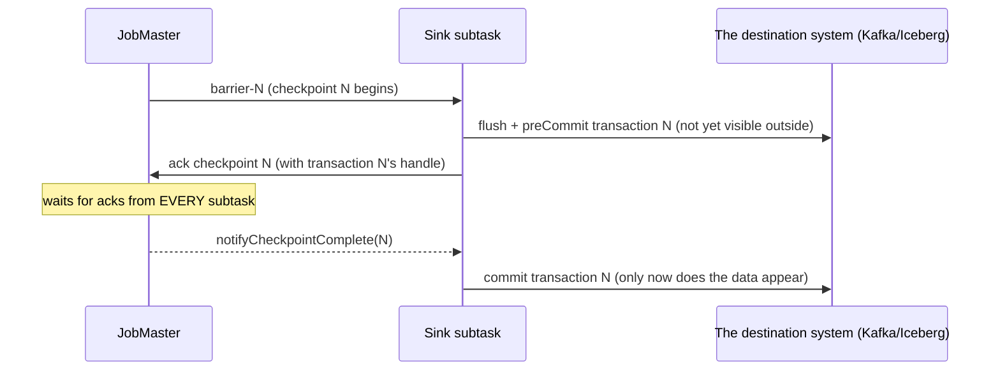
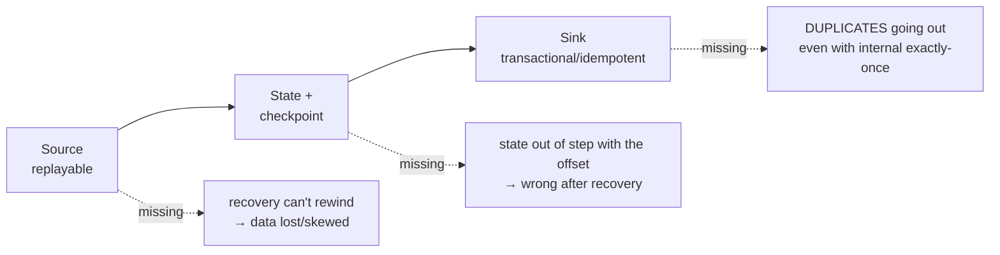

# Exactly-once in Flink

> **Takeaway:** Flink's exactly-once means each event affects **state** exactly once —
> not "is processed exactly once". It stops at the **sink boundary**: going out is only
> at-least-once unless the sink supports **two-phase commit** or is idempotent.

This is the most expensive misunderstanding about Flink. "Exactly-once" sounds like a guarantee that everything
happens only once — it isn't. Understanding its boundary correctly is the precondition for not shipping an
"exactly-once" pipeline that actually still duplicates at the destination.

## What exactly-once means (and doesn't mean)

**It means:** each event affects Flink's **internal state** exactly once. After a failure
and recovery, a counter doesn't increment twice for the same event, and a window doesn't double-count.

**It does NOT mean:** each event is *processed* (run through your function) exactly once. On recovery,
Flink **replays** events from the checkpoint — so an event may *run through* an operator several times.
What's guaranteed is that the *effect on state* counts once, because the state is also **rewound** to the
checkpoint at the same offset. Put differently: a record may be *recomputed*, but because the state also
goes back to exactly that point, the end result is as if it were computed once. This is why a
non-idempotent side effect inside your processing function (calling an external API, writing straight to a DB)
does **not** get exactly-once — only *Flink's state* does.

## The mechanism: checkpoint + rewind + matching state

*Internal* exactly-once rests on three pieces fitting together, all captured in the same checkpoint:

1. **A replayable source** — the source must be rewindable to a saved offset (Kafka: an offset;
   files: a position). A non-replayable source means no exactly-once.
2. **A state checkpoint** — the state is captured at the same moment as that offset.
3. **Rewinding on recovery** — on failure, restore state from checkpoint N and rewind the source to
   exactly the offset saved in checkpoint N.

Because the offset and the state come from the *same* checkpoint, replaying from that offset plus the state
at that point gives the same result as never having died. The foundation is in [state-and-checkpoint](state-and-checkpoint.md).

### Why the checkpoint snapshot is consistent: barrier alignment

The subtle point: how do you snapshot the state of *every* operator at "the same logical moment" when
they run in parallel with unsynchronised clocks? Flink uses a **checkpoint barrier** — a
special mark the JobMaster injects into the stream at the sources, flowing along with the data:

```text
source ─ r1 r2 [BARRIER-N] r3 r4 ─►  operator ─►  ...
                    │
   khi operator thấy barrier-N tới ở MỌI input của nó
   → nó snapshot state ngay tại ranh giới đó (aligned)
```

- When an operator has several inputs (e.g. after a `keyBy` or a join), it **waits for barrier-N on
  all its inputs** before snapshotting — this is an **aligned checkpoint**. Records from inputs that
  arrived early (past the barrier on this input while another hasn't got there) are *held back* until every
  barrier arrives, ensuring the snapshot reflects exactly "everything before barrier-N, nothing after it".
- The result: the state snapshots of every operator correspond to **the same boundary** in the data flow →
  globally consistent. That's what makes exactly-once correct.
- The trade-off: alignment *waits* for the slowest barrier → under heavy backpressure, alignment drags on
  and makes checkpoints slow. Flink has **unaligned checkpoints** as an alternative (capturing the records in
  flight rather than waiting) so checkpoints don't get stuck on backpressure — paying with a larger
  checkpoint. Choosing between them is a tuning dial.

## But going out is another matter

Once the window has computed, the result is **written to a sink** (Kafka, Iceberg, JDBC). The problem: between
writing to the sink and the checkpoint completing, the job can die. On recovery, Flink replays and **writes
that result again** → **duplicates at the destination**, even though the internal state is still exactly-once.

So by default, end-to-end is only **at-least-once**. For exactly-once all the way to the destination, the sink
must be one of two things:

- **Transactional (two-phase commit)** — only "publishing" the data when the checkpoint completes.
- **Idempotent** — writing the same data several times gives the same result as once (e.g. an upsert by
  primary key). A duplicate write is harmless because the later one overwrites the earlier.

## Two-phase commit sinks

The `TwoPhaseCommitSinkFunction` mechanism (and modern sinks following the same model) synchronises the
sink's transaction with the **checkpoint lifecycle**. The crucial part: `preCommit` hooks into the
snapshot (receiving the barrier), while `commit` hooks into the checkpoint **completing globally**
(`notifyCheckpointComplete` — the callback the JobMaster makes after *every* subtask has acked):



- **preCommit** — on receiving the barrier and snapshotting, the sink flushes the data into an *uncommitted*
  transaction and records that transaction's handle in its state (so a restore knows to deal with it).
- **commit** — only when the JobMaster reports checkpoint N *complete* (having collected acks from every
  subtask) via `notifyCheckpointComplete` does the sink commit the transaction. Only from then is the data
  visible to readers.

Three recovery branches, all of which must be handled:

- Dying **before** checkpoint N completes → transaction N isn't committed; when restoring to
  checkpoint N-1, transaction N is **aborted** → the half-finished data never escapes.
- Dying **after** preCommit but **before** the commit (the checkpoint having completed) → on restore, the
  sink reads the transaction handle from state and **commits it again** (the commit must be *idempotent* —
  committing the same transaction twice must be harmless). This is where people go wrong writing their own 2PC sink.
- A transaction "hanging" long enough to exceed the destination system's timeout → data lost; see the trade-offs.

## The Kafka sink's EXACTLY_ONCE mode

Flink's Kafka sink supports `EXACTLY_ONCE` mode using **Kafka transactions**: each
checkpoint opens a transaction, committed when the checkpoint completes. The mechanism relies on:

- **`transactional.id`** — each sink subtask uses a stable transactional.id so the Kafka
  broker recognises and **fences** the old producer when a new one with the same id comes up after
  recovery — blocking the "zombie" of the dead run from writing more.
- **A transaction covering all of one checkpoint's records**, committed exactly when the checkpoint completes.

**The trap on the reading side — the two halves of one guarantee:** the transaction only means something if the
consumer reading that topic sets **`isolation.level=read_committed`**. The consumer default is
`read_uncommitted` — it reads uncommitted data too, and therefore still sees the duplicates of an aborted
run. Setting the sink to EXACTLY_ONCE while forgetting `read_committed` on the reader is wasted effort. There's more in
[Kafka delivery semantics](../../kafka/reference/delivery-semantics.md).

## Iceberg / file sinks

File/table-style sinks (Iceberg, filesystem) achieve exactly-once by **committing per
checkpoint**: the data is written to temporary files (data files), and only *committed* (added to the
table's snapshot/manifest) when the checkpoint completes. Dying mid-way leaves temporary files that never
made it into a snapshot, and they're ignored on recovery. It's essentially 2PC — a written file is
the "preCommit" and adding it to the snapshot is the "commit" — just wrapped in a table format's commit
mechanism instead of a message broker's transaction.

## Idempotent sinks vs transactional sinks

Two routes to *semantic* exactly-once, chosen differently:

| | Transactional (2PC) | Idempotent (upsert) |
|---|---|---|
| Mechanism | Commits the data exactly when the checkpoint completes | Duplicate writes are harmless because they overwrite by key |
| Required at the destination | Transaction support (Kafka EOS, Iceberg commits) | A natural **primary key** to upsert on |
| Latency | Data only appears *after* a checkpoint → latency follows the interval | Appears the moment it's written, adding no transaction latency |
| The reading side | Kafka needs `read_committed` | Nothing special needed |
| Duplicates at the write layer | None | Yes, but harmless |
| Choose when | The destination can't deduplicate (append-only, needing the exact record count) | You have a PK and only need "the final state to be right" |

Rule of thumb: **with a primary key, prefer idempotent** — cheap, adding no latency. Only use
2PC when the destination is append-only or the *number* of records must be exact (counting money, an event log).

## End-to-end exactly-once needs all three

No piece is sufficient alone — this is a chain, and one missing link breaks the whole thing:



| Piece | If it's missing |
|---|---|
| **A replayable source** | Recovery can't rewind → data lost or skewed |
| **State + checkpoints** | State inconsistent with the offset → wrong after recovery |
| **A transactional / idempotent sink** | **Duplicates** going out despite internal exactly-once |

Only with all three fitting together is end-to-end genuinely exactly-once. A missing sink link is the most
common and the most silent failure — there's a case study running all the way to a duplicate for exactly this reason:
[duplicates from a non-transactional sink](../case-studies/trung-lap-vi-sink-khong-transaction.md).
Choosing a sink is an architectural decision, see [connectors](../skills/connectors.md).

## Trade-offs

| You get | You lose | In exchange for |
|---|---|---|
| No duplicates all the way to the destination | **Higher latency** — data only appears when a checkpoint completes | Correct numbers where it matters (money, counts) |
| The strongest guarantee | A long checkpoint interval → a long end-to-end latency to match | Control over the trade-off |
| — | Kafka transactions cost broker resources and limit concurrent transactions | — |
| — | Frequent checkpoints to cut latency → the risk of exceeding Kafka's **transaction timeout** | — |

**The core latency trade-off:** with a 2PC sink, data only appears outside *after* each
checkpoint. A 60s checkpoint interval means a minimum end-to-end latency of ~60s. For lower
latency you checkpoint more often — but too often costs I/O.

**The transaction-timeout trap:** the Kafka broker has a `transaction.max.timeout.ms`; if a
transaction (opened at checkpoint N, committed when N completes) lives longer than that timeout — say
the checkpoint is slowed by backpressure — the broker **aborts** it and the data is lost. So the
producer's `transaction.timeout.ms` must be larger than the *worst-case interval* between two
completed checkpoints, and ≤ the broker's limit. This is why many pipelines choose an **idempotent
sink** (upsert) over 2PC when they have a primary key: they get *semantic* exactly-once without
paying either the latency or the transaction-timeout risk.

## Common Mistakes

| Mistake | Consequence | Prevented by |
|---|---|---|
| Thinking exactly-once spreads to the sink by itself | Duplicated results at the destination | Choosing a 2PC or idempotent sink |
| An EXACTLY_ONCE Kafka sink with `read_committed` forgotten on the reader | The consumer still sees duplicates | Setting `isolation.level=read_committed` |
| A non-idempotent sink + at-least-once | Duplicates on recovery | Upserting by PK, or using 2PC |
| Expecting exactly-once with a non-replayable source | Data lost/skewed on recovery | Using a replayable source (Kafka, files) |
| `transaction.timeout.ms` < the interval between two checkpoints | The broker aborts the transaction → data lost | Setting the timeout > the worst-case interval, ≤ the broker's limit |
| Calling an external API / writing straight to a DB in your processing function | The side effect runs several times on replay | Moving the effect out to a transactional/idempotent sink |

## FAQ

<details>
<summary>Is an idempotent sink exactly-once?</summary>

*Semantically* yes: duplicate writes give the same result (an upsert by PK), so a reader
sees each record applied only once. *Mechanically* it's still at-least-once at the write layer,
just with harmless duplicates. Cheaper than 2PC and adding no transaction latency — so prefer it when
you have a natural primary key.

</details>

<details>
<summary>Why does 2PC increase latency?</summary>

Data is only committed (made visible) when the checkpoint *completes*. So minimum end-to-end
latency ≈ the checkpoint interval. This is a direct trade-off between "no duplicates" and "seeing the data
quickly".

</details>

<details>
<summary>What's the difference between aligned and unaligned checkpoints for exactly-once?</summary>

Both give exactly-once. Aligned waits for barriers on every input before snapshotting — clean
but under heavy backpressure the alignment drags on and makes checkpoints slow. Unaligned captures the
records in flight between operators rather than waiting, so checkpoints don't get stuck on
backpressure — paying with a larger checkpoint. Switch when checkpoints often time out because of
backpressure.

</details>

## Related Topics

- [State and checkpoints](state-and-checkpoint.md) — the foundation of internal exactly-once, and barriers
- [Flink job architecture](architecture.md) — the JobMaster collecting acks to finalise a checkpoint
- [Connectors](../skills/connectors.md) — choosing a transactional / idempotent sink
- [Kafka: delivery semantics](../../kafka/reference/delivery-semantics.md) — Kafka EOS, `transactional.id`, `read_committed`
- [Duplicates from a non-transactional sink](../case-studies/trung-lap-vi-sink-khong-transaction.md) — an example running to a duplicate
- [Flink](../index.md) — the topic this file belongs to
