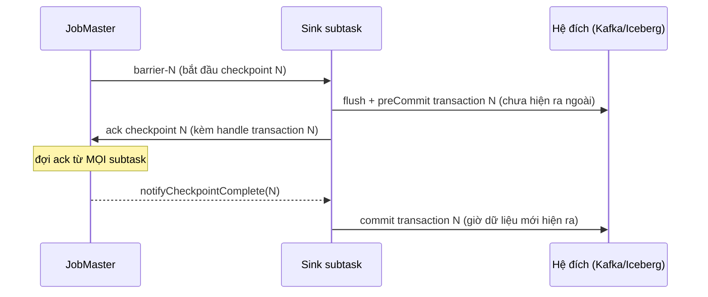
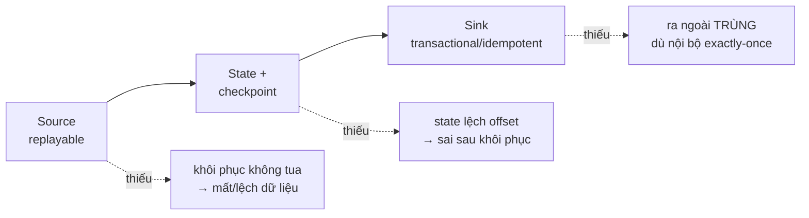

# Exactly-once trong Flink

> **Chốt:** Exactly-once của Flink nghĩa là mỗi event ảnh hưởng **state** đúng một lần —
> không phải "được xử lý đúng một lần". Nó dừng ở **ranh giới sink**: ra ngoài chỉ là
> at-least-once trừ khi sink hỗ trợ **two-phase commit** hoặc idempotent.

Đây là chỗ hiểu nhầm đắt nhất về Flink. "Exactly-once" nghe như bảo đảm mọi thứ chỉ xảy
ra một lần — không phải. Hiểu đúng ranh giới của nó là điều kiện để không giao một pipeline
"exactly-once" mà thực ra vẫn trùng ở đích.

## Exactly-once nghĩa là gì (và không nghĩa là gì)

**Nghĩa là:** mỗi event tác động **state nội bộ** của Flink đúng một lần. Sau một lần
chết và khôi phục, bộ đếm không tăng hai lần cho cùng một event, cửa sổ không gom trùng.

**KHÔNG nghĩa là:** mỗi event được *xử lý* (chạy qua hàm) đúng một lần. Khi khôi phục,
Flink **replay** event từ checkpoint — nên một event có thể *chạy qua* operator nhiều lần.
Cái được đảm bảo là *hiệu ứng lên state* chỉ tính một lần, vì state cũng **rewind** về
checkpoint cùng offset. Nói cách khác: record có thể được *tính lại*, nhưng vì state cũng
lùi về đúng điểm đó, kết quả cuối như thể chỉ tính một lần. Đây là lý do side-effect
không-idempotent trong hàm xử lý (gọi API ngoài, ghi thẳng DB) **không** được exactly-once
— chỉ *state của Flink* mới được.

## Cơ chế: checkpoint + rewind + state khớp

Exactly-once *nội bộ* dựa trên ba mảnh khớp nhau, tất cả chụp trong cùng một checkpoint:

1. **Source replayable** — nguồn phải tua lại được về offset đã lưu (Kafka: offset;
   file: vị trí). Nguồn không replay được thì không có exactly-once.
2. **State checkpoint** — state được chụp cùng thời điểm với offset đó.
3. **Rewind khi khôi phục** — chết thì restore state từ checkpoint N và tua source về
   đúng offset đã lưu trong checkpoint N.

Vì offset và state đến từ *cùng một* checkpoint, replay từ offset đó cộng state tại đó cho
kết quả như chưa từng chết. Nền tảng ở [state-and-checkpoint](state-and-checkpoint.md).

### Vì sao ảnh checkpoint nhất quán: barrier alignment

Điểm tinh tế: làm sao chụp state của *mọi* operator ở "cùng một thời điểm logic" khi
chúng chạy song song và không đồng bộ đồng hồ? Flink dùng **checkpoint barrier** — một
dấu đặc biệt JobMaster tiêm vào stream tại source, chảy cùng dòng dữ liệu:

```text
source ─ r1 r2 [BARRIER-N] r3 r4 ─►  operator ─►  ...
                    │
   khi operator thấy barrier-N tới ở MỌI input của nó
   → nó snapshot state ngay tại ranh giới đó (aligned)
```

- Khi một operator có nhiều input (ví dụ sau `keyBy` hoặc join), nó **đợi barrier-N tới ở
  tất cả input** rồi mới snapshot — đây là **aligned checkpoint**. Record của các input
  đến sớm (đã qua barrier ở input này nhưng input kia chưa) bị *giữ lại* cho tới khi mọi
  barrier tới, đảm bảo state chụp phản ánh đúng "mọi thứ trước barrier-N, không gì sau nó".
- Kết quả: ảnh state của mọi operator ứng với **cùng một ranh giới** trong dòng dữ liệu →
  nhất quán toàn cục. Đó là thứ làm exactly-once đúng.
- Đánh đổi: alignment *đợi* barrier chậm nhất → dưới backpressure nặng, alignment kéo dài
  làm checkpoint lâu. Flink có **unaligned checkpoint** đổi cách này (chụp cả record đang
  bay thay vì đợi) để checkpoint không bị kẹt vì backpressure — trả giá bằng state
  checkpoint lớn hơn. Chọn giữa hai là một núm tuning.

## Nhưng ra ngoài là chuyện khác

Cửa sổ tính xong, kết quả **ghi ra sink** (Kafka, Iceberg, JDBC). Vấn đề: giữa lúc ghi
ra sink và lúc checkpoint hoàn tất, job có thể chết. Khi khôi phục, Flink replay và **ghi
lại** kết quả đó → **trùng ở đích**, dù state nội bộ vẫn exactly-once.

Nên mặc định, end-to-end chỉ là **at-least-once**. Muốn exactly-once tới tận đích, sink
phải một trong hai:

- **Transactional (two-phase commit)** — chỉ "công khai" dữ liệu khi checkpoint hoàn tất.
- **Idempotent** — ghi cùng dữ liệu nhiều lần cho kết quả như một lần (ví dụ upsert theo
  primary key). Trùng ghi không sao vì lần sau đè lần trước.

## Two-phase commit sink

Cơ chế `TwoPhaseCommitSinkFunction` (và các sink hiện đại theo mô hình này) đồng bộ
transaction của sink với **vòng đời checkpoint**. Điểm mấu chốt: `preCommit` gắn vào lúc
snapshot (nhận barrier), còn `commit` gắn vào lúc checkpoint **hoàn tất toàn cục**
(`notifyCheckpointComplete` — callback JobMaster gọi sau khi *mọi* subtask đã ack):



- **preCommit** — khi nhận barrier và snapshot, sink flush dữ liệu vào một transaction
  *chưa commit* và ghi nhận handle của transaction đó vào state (để restore biết mà xử lý).
- **commit** — chỉ khi JobMaster báo checkpoint N *hoàn tất* (đã gom đủ ack từ mọi
  subtask) qua `notifyCheckpointComplete`, sink mới commit transaction. Từ đây dữ liệu mới
  hiện ra với người đọc.

Ba nhánh khôi phục, phải xử đủ cả ba:

- Chết **trước** khi checkpoint N hoàn tất → transaction N chưa commit; khi restore về
  checkpoint N-1, transaction N bị **abort** → dữ liệu dở dang không lọt ra ngoài.
- Chết **sau** preCommit nhưng **trước** commit (checkpoint đã hoàn tất) → khi restore,
  sink đọc handle transaction từ state và **commit lại** (commit phải *idempotent* —
  commit hai lần cùng transaction không sao). Đây là chỗ hay sai khi tự viết 2PC sink.
- Transaction "treo" quá lâu vượt timeout của hệ đích → mất dữ liệu; xem trade-offs.

## Kafka sink EXACTLY_ONCE

Kafka sink của Flink hỗ trợ chế độ `EXACTLY_ONCE` bằng **Kafka transaction**: mỗi
checkpoint mở một transaction, commit khi checkpoint hoàn tất. Cơ chế dựa trên:

- **`transactional.id`** — mỗi subtask sink dùng một transactional.id ổn định để Kafka
  broker nhận ra và **fence** (khoá) producer cũ khi có producer mới cùng id lên sau khôi
  phục — chặn "zombie" của lần chạy chết ghi thêm.
- **Transaction bao mọi record của một checkpoint**, commit đúng khi checkpoint hoàn tất.

**Bẫy phía đọc — hai nửa của cùng một bảo đảm:** transaction chỉ có nghĩa nếu consumer
đọc topic đó đặt **`isolation.level=read_committed`**. Mặc định consumer là
`read_uncommitted` — nó đọc cả dữ liệu chưa commit, nên vẫn thấy bản trùng của lần chạy
bị abort. Đặt sink EXACTLY_ONCE mà quên `read_committed` phía đọc = công cốc. Xem thêm ở
[Kafka delivery semantics](../../kafka/reference/delivery-semantics.md).

## Iceberg / file sink

Sink kiểu file/table (Iceberg, filesystem) đạt exactly-once bằng cách **commit theo
checkpoint**: dữ liệu được ghi ra file tạm (data file), và chỉ *commit* (thêm vào
snapshot/manifest của bảng) khi checkpoint hoàn tất. Chết giữa chừng thì file tạm chưa
được đưa vào snapshot bị bỏ qua ở lần khôi phục. Bản chất giống 2PC — file đã ghi là
"preCommit", đưa vào snapshot là "commit" — chỉ là gói trong cơ chế commit của table
format thay vì transaction của một message broker.

## Idempotent sink vs transactional sink

Hai đường tới exactly-once *ngữ nghĩa*, chọn khác nhau:

| | Transactional (2PC) | Idempotent (upsert) |
|---|---|---|
| Cơ chế | Commit dữ liệu đúng khi checkpoint hoàn tất | Ghi trùng cũng không sao vì đè theo key |
| Cần ở đích | Hỗ trợ transaction (Kafka EOS, Iceberg commit) | Có **primary key** tự nhiên để upsert |
| Độ trễ | Dữ liệu chỉ hiện *sau* checkpoint → trễ theo interval | Hiện ngay khi ghi, không cộng độ trễ transaction |
| Phía đọc | Kafka cần `read_committed` | Không cần gì đặc biệt |
| Trùng ở tầng ghi | Không có | Có, nhưng vô hại |
| Chọn khi | Đích không dedup được (append-only, cần đúng số bản ghi) | Có PK và chỉ cần "trạng thái cuối đúng" |

Kinh nghiệm: **có primary key thì ưu tiên idempotent** — rẻ, không cộng độ trễ. Chỉ dùng
2PC khi đích là append-only hoặc phải đúng *số lượng* bản ghi (đếm tiền, event log).

## End-to-end exactly-once cần đủ ba

Không mảnh nào tự đủ — đây là mắt xích, thiếu một mắt là gãy cả chuỗi:



| Mảnh | Nếu thiếu |
|---|---|
| **Source replayable** | Khôi phục không tua lại được → mất hoặc lệch dữ liệu |
| **State + checkpoint** | State không nhất quán với offset → sai sau khôi phục |
| **Sink transactional / idempotent** | Ra ngoài **trùng** dù nội bộ exactly-once |

Chỉ khi cả ba khớp thì end-to-end mới thật sự exactly-once. Thiếu mắt sink là lỗi hay gặp
nhất và im lặng nhất — đã có case study đi tới bản trùng vì đúng chỗ này:
[trùng lặp vì sink không transaction](../case-studies/trung-lap-vi-sink-khong-transaction.md).
Chọn sink là quyết định kiến trúc, xem [connectors](../skills/connectors.md).

## Trade-offs

| Được | Mất | Đổi lấy |
|---|---|---|
| Không trùng tới tận đích | **Độ trễ tăng** — dữ liệu chỉ hiện khi checkpoint hoàn tất | Số đúng ở nơi quan trọng (tiền, đếm) |
| Bảo đảm mạnh nhất | Checkpoint interval dài → độ trễ end-to-end dài theo | Kiểm soát được đánh đổi |
| — | Transaction Kafka tốn tài nguyên broker, giới hạn số transaction đồng thời | — |
| — | Checkpoint dày để giảm trễ → nguy cơ vượt **transaction timeout** của Kafka | — |

**Đánh đổi cốt lõi về độ trễ:** với 2PC sink, dữ liệu chỉ hiện ra ngoài *sau* mỗi
checkpoint. Checkpoint interval 60s nghĩa là độ trễ end-to-end tối thiểu ~60s. Muốn độ
trễ thấp thì checkpoint dày hơn — nhưng dày quá thì tốn I/O.

**Bẫy transaction timeout:** Kafka broker có `transaction.max.timeout.ms`; nếu một
transaction (mở lúc checkpoint N, commit lúc N hoàn tất) sống lâu hơn timeout đó — ví dụ
checkpoint bị chậm vì backpressure — broker **abort** nó và dữ liệu mất. Nên
`transaction.timeout.ms` của producer phải lớn hơn *khoảng thời gian tệ nhất* giữa hai
checkpoint hoàn tất, và ≤ giới hạn broker. Đây là lý do nhiều pipeline chọn **idempotent
sink** (upsert) thay vì 2PC khi có primary key: được exactly-once *ngữ nghĩa* mà không
phải trả độ trễ lẫn rủi ro timeout của transaction.

## Common Mistakes

| Lỗi | Hậu quả | Phòng bằng |
|---|---|---|
| Nghĩ exactly-once tự lan tới sink | Kết quả trùng ở đích | Chọn sink 2PC hoặc idempotent |
| Kafka sink EXACTLY_ONCE, quên `read_committed` phía đọc | Consumer vẫn thấy bản trùng | Đặt `isolation.level=read_committed` |
| Sink không idempotent + at-least-once | Trùng khi khôi phục | Upsert theo PK, hoặc dùng 2PC |
| Kỳ vọng exactly-once với source không replay được | Mất/lệch dữ liệu khi khôi phục | Dùng source replayable (Kafka, file) |
| `transaction.timeout.ms` < khoảng giữa hai checkpoint | Broker abort transaction → mất dữ liệu | Đặt timeout > interval tệ nhất, ≤ giới hạn broker |
| Gọi API ngoài / ghi thẳng DB trong hàm xử lý | Side-effect chạy nhiều lần khi replay | Đưa hiệu ứng ra sink transactional/idempotent |

## FAQ

<details>
<summary>Idempotent sink có phải exactly-once không?</summary>

Về *ngữ nghĩa* thì có: ghi trùng nhiều lần cho cùng kết quả (upsert theo PK), nên người
đọc thấy như mỗi record chỉ áp một lần. Về *cơ chế* nó vẫn là at-least-once ở tầng ghi,
chỉ là trùng không gây hại. Rẻ hơn 2PC và không cộng độ trễ transaction — nên ưu tiên khi
có primary key tự nhiên.

</details>

<details>
<summary>Vì sao 2PC làm tăng độ trễ?</summary>

Dữ liệu chỉ commit (hiện ra ngoài) khi checkpoint *hoàn tất*. Nên độ trễ end-to-end tối
thiểu ≈ checkpoint interval. Đây là đánh đổi trực tiếp giữa "không trùng" và "thấy dữ liệu
nhanh".

</details>

<details>
<summary>Aligned và unaligned checkpoint khác nhau chỗ nào cho exactly-once?</summary>

Cả hai đều cho exactly-once. Aligned đợi barrier tới ở mọi input rồi mới snapshot — sạch
sẽ nhưng dưới backpressure nặng thì alignment kéo dài làm checkpoint chậm. Unaligned chụp
luôn cả record đang bay giữa các operator thay vì đợi, nên checkpoint không bị kẹt vì
backpressure — trả giá bằng state checkpoint lớn hơn. Đổi khi checkpoint hay timeout do
backpressure.

</details>

## Related Topics

- [State và checkpoint](state-and-checkpoint.md) — nền của exactly-once nội bộ, barrier
- [Kiến trúc job Flink](architecture.md) — JobMaster gom ack để chốt checkpoint hoàn tất
- [Connector](../skills/connectors.md) — chọn sink transactional / idempotent
- [Kafka: delivery semantics](../../kafka/reference/delivery-semantics.md) — Kafka EOS, `transactional.id`, `read_committed`
- [Trùng lặp vì sink không transaction](../case-studies/trung-lap-vi-sink-khong-transaction.md) — ví dụ đi tới bản trùng
- [Flink](../index.md) — chủ đề chứa file này
