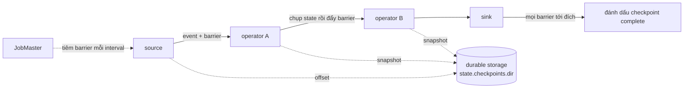

# State và checkpoint

> **Chốt:** State là *bộ nhớ* của một stream chạy mãi (bộ đếm, cửa sổ, bảng join);
> checkpoint là *ảnh chụp định kỳ* của toàn bộ state để, khi job chết, nó tự restart từ
> ảnh gần nhất và replay từ offset đã lưu — không mất, không tính lại từ đầu.

Vì stream không bao giờ hết, Flink phải tự nhớ. Và vì nó chạy mãi trên phần cứng sẽ hỏng,
nó phải tự khôi phục cái đã nhớ. Đó là hai nửa của file này.

## Keyed state vs operator state

**Keyed state** — gắn với một *key* (sau `keyBy`). Flink tự phân vùng theo key: mỗi
subtask chỉ giữ state của những key thuộc về nó. Đây là loại dùng 95% thời gian:

| Loại | Giữ gì | Dùng khi |
|---|---|---|
| `ValueState<T>` | Một giá trị mỗi key | Đếm, cờ, giá trị mới nhất |
| `ListState<T>` | Danh sách mỗi key | Gom event chờ xử lý |
| `MapState<K,V>` | Map mỗi key | Dedup, bảng phụ theo key |
| `ReducingState<T>` | Một giá trị, gộp bằng reduce func | Tổng/max tăng dần |
| `AggregatingState<IN,OUT>` | Như reducing, kiểu vào/ra khác nhau | Trung bình, aggregate phức tạp |

**Operator state** — gắn với một *instance operator*, không theo key. Ít gặp; chủ yếu
connector dùng (ví dụ Kafka source giữ offset mỗi partition). Khi đổi parallelism, Flink
phân bố lại theo các scheme như *even-split*.

### State primitives — code minh hoạ

State không phải biến thường: nó được Flink quản lý (đưa vào checkpoint, phân vùng theo
key, dọn khi rescale). Bạn khai báo qua một `StateDescriptor` trong `open()` rồi truy cập
trong `processElement()`. Truy cập keyed state **luôn ngầm định** theo key hiện tại của
record đang xử lý — không cần truyền key.

```java
// số minh hoạ — chưa chạy trên cluster
public class DedupCount extends KeyedProcessFunction<String, Event, Long> {
    private transient ValueState<Long> count;      // một số mỗi key
    private transient MapState<String, Boolean> seen;   // dedup theo id mỗi key
    private transient ListState<Event> buffer;     // gom event mỗi key
    private transient AggregatingState<Event, Double> avg;   // trung bình mỗi key

    @Override
    public void open(Configuration cfg) {
        count = getRuntimeContext().getState(
            new ValueStateDescriptor<>("count", Long.class));
        seen = getRuntimeContext().getMapState(
            new MapStateDescriptor<>("seen", String.class, Boolean.class));
        buffer = getRuntimeContext().getListState(
            new ListStateDescriptor<>("buffer", Event.class));
        avg = getRuntimeContext().getAggregatingState(
            new AggregatingStateDescriptor<>("avg", new AvgFn(), Double.class));
    }

    @Override
    public void processElement(Event e, Context ctx, Collector<Long> out) throws Exception {
        if (seen.contains(e.id)) return;      // đã thấy id này cho key hiện tại → bỏ
        seen.put(e.id, true);
        Long c = count.value();               // null nếu key chưa có state
        count.update(c == null ? 1 : c + 1);
        buffer.add(e);
        avg.add(e);
        out.collect(count.value());
    }
}
```

`ReducingState` và `AggregatingState` khác `ValueState` ở chỗ *gộp tại chỗ*: mỗi `add`
gọi hàm gộp ngay, nên không giữ cả danh sách — nhẹ hơn nhiều khi chỉ cần tổng/max/avg.
`ReducingState` bắt kiểu vào = kiểu ra; `AggregatingState` cho phép kiểu accumulator và
kiểu output khác kiểu input (ví dụ tích luỹ `(sum, count)` nhưng xuất `Double`).

## Key groups & rescale — vì sao đổi parallelism cần savepoint

Đây là cơ chế ít người biết nhưng giải thích nhiều ràng buộc vận hành. Flink **không**
phân keyed state trực tiếp theo `hash(key) % parallelism`. Nếu làm vậy, đổi parallelism sẽ
xáo trộn *mọi* key sang subtask khác → phân phối lại toàn bộ state, rất đắt.

Thay vào đó, keyed state chia thành **key groups**: mỗi key được gán vào một key group cố
định bằng `hash(key) % maxParallelism`. Số key group = **`maxParallelism`** (đặt lúc tạo
job, mặc định suy ra từ parallelism ban đầu, cận trên 32768). Mỗi subtask nhận một *dải*
liên tục key group:

```text
số minh hoạ — chưa chạy trên cluster
maxParallelism = 128  → 128 key groups (0..127)

parallelism = 4:
  subtask 0: key groups 0..31
  subtask 1: key groups 32..63
  subtask 2: key groups 64..95
  subtask 3: key groups 96..127

rescale → parallelism = 8:
  subtask 0: 0..15   subtask 1: 16..31   ...   subtask 7: 112..127
  (mỗi key group vẫn nguyên khối, chỉ ĐỔI CHỦ — không cần hash lại từng key)
```

Hệ quả rút ra từ đây:

- **Đổi parallelism cần restart từ savepoint/checkpoint.** Không thể đổi khi đang chạy;
  phải dừng, phân phối lại key group theo parallelism mới, rồi khởi động lại. Flink chỉ
  cần chuyển *nguyên khối* key group giữa các subtask, không hash lại từng key.
- **Không thể vượt `maxParallelism`.** Vì số key group cố định, parallelism không thể lớn
  hơn số key group — mỗi subtask cần ít nhất một key group. Nếu đặt `maxParallelism` = 128
  thì mãi mãi không scale quá 128, dù có thêm máy. Không sửa được sau khi job có state.
- **Đặt `maxParallelism` cao ngay từ đầu** (ví dụ 128 hoặc 720) để còn đường scale; nhưng
  quá cao thì tốn metadata cho mỗi key group. Đây là quyết định một chiều, cân từ trước.

## State backend — giữ state ở đâu

| Backend | State nằm ở | Tốc độ | Dung lượng | Checkpoint | Dùng khi |
|---|---|---|---|---|---|
| **HashMapStateBackend** | Heap JVM (on-heap object) | Nhanh nhất, không serialize mỗi truy cập | Giới hạn bởi RAM | **Full** mỗi lần | State nhỏ, độ trễ tối thượng |
| **EmbeddedRocksDBStateBackend** | RocksDB (off-heap, trên đĩa local) | Chậm hơn (serialize + có thể chạm đĩa) | Lớn hơn RAM nhiều (hàng trăm GB) | **Incremental** được (qua SST files) | State lớn, nhiều key |

**Cơ chế bên trong — vì sao tốc độ khác nhau:**

- **HashMapStateBackend** giữ state là *object Java sống* trong heap. Đọc/ghi là truy cập
  con trỏ, không serialize → nhanh nhất. Nhưng: state đếm vào heap → **GC nặng** khi lớn,
  và không vượt được RAM. Checkpoint là **full**: mỗi lần chép toàn bộ state ra durable
  storage.
- **EmbeddedRocksDBStateBackend** lưu state đã **serialize thành bytes** trong RocksDB (một
  LSM-tree ghi ra file `.sst` trên đĩa local, off-heap). Mỗi lần đọc state phải
  *deserialize*, mỗi lần ghi phải *serialize* → chậm hơn, và có thể chạm đĩa nếu không nằm
  trong block cache. Đổi lại state không giới hạn bởi RAM và không đè lên GC của JVM.

**Incremental checkpoint chỉ RocksDB có** vì nó tận dụng cấu trúc LSM: RocksDB ghi các file
SST *bất biến* (immutable); một checkpoint incremental chỉ cần chép **các SST file mới** kể
từ checkpoint trước, không chép lại toàn bộ. HashMap không có cấu trúc này nên luôn full.

```text
số minh hoạ — chưa chạy trên cluster
RocksDB incremental checkpoint:
  checkpoint 1: sst_001 sst_002 sst_003          (chép cả 3)
  checkpoint 2: + sst_004                          (chỉ chép SST MỚI, tham chiếu 001-003)
  checkpoint 3: + sst_005, compaction gộp 001+002 → sst_006  (chép 005, 006)
```

**Đánh đổi cốt lõi:** HashMap nhanh vì mọi thứ trong heap, nhưng state không vượt được
RAM và làm GC nặng. RocksDB chứa được state khổng lồ vì tràn xuống đĩa và hỗ trợ
incremental checkpoint, đổi lại mỗi lần đọc/ghi phải serialize và có thể chạm đĩa — chậm
hơn. Chọn RocksDB khi state lớn, nhiều key, hoặc cần incremental checkpoint.

## Checkpoint — ảnh chụp để khôi phục

Checkpoint là ảnh chụp *nhất quán* của toàn bộ state của mọi operator tại một thời điểm
logic, ghi ra durable storage (`state.checkpoints.dir` trên S3, HDFS...). Cơ chế là thuật
toán **Chandy-Lamport** bằng **barrier**:

```text
source ─●─────●─────●─►  operator ─●─►  sink
        │     │     │              │
     barrier trôi theo dòng dữ liệu, kẹp giữa các event
```

1. JobMaster tiêm một **barrier** vào source (một record đặc biệt) theo `interval`.
2. Barrier **trôi theo dataflow** cùng event. Khi một operator nhận barrier, nó chụp
   state của mình (bất đồng bộ, gửi ra durable storage) rồi đẩy barrier xuống downstream.
3. Khi barrier tới mọi sink và mọi operator đã chụp xong, checkpoint hoàn tất — được đánh
   dấu "complete" trên durable storage và có thể dùng để khôi phục.

Điểm hay: **không dừng dòng dữ liệu** để chụp; barrier trôi *giữa* các event, nên xử lý
vẫn tiếp diễn.



### Aligned vs unaligned checkpoint

Khi một operator có nhiều input, barrier từ các input tới không cùng lúc.

- **Aligned checkpoint** (mặc định) — operator *đợi* barrier từ **mọi** input tới rồi mới
  chụp; các input có barrier tới trước bị **buffer** lại (chặn tạm) cho tới khi input chậm
  nhất cũng gửi barrier. Chính xác, checkpoint nhẹ hơn (không chứa dữ liệu in-flight),
  nhưng dưới **backpressure** barrier bị kẹt sau hàng dài buffer chưa xử lý → alignment
  lâu → checkpoint chậm hoặc timeout.

```text
số minh hoạ — chưa chạy trên cluster — ALIGNED tại operator 2 input:
  input A: ...e e e |barrier|              → barrier A tới trước, buffer các event sau nó
  input B: ...e e e e e e e |barrier|      → chờ tới đây mới ĐỦ → chụp state → đẩy barrier
```

- **Unaligned checkpoint** — chụp ngay khi barrier *đầu tiên* tới, **vượt qua** hàng buffer
  và đưa cả dữ liệu **in-flight** (các event đang nằm trong buffer/network) vào checkpoint.
  Vượt qua được backpressure (barrier không phải chờ alignment), đổi lại checkpoint **to
  hơn** (chứa dữ liệu đang bay). Bật khi checkpoint hay timeout vì backpressure.

## Khôi phục — job chết thì sao

1. Một task chết (máy hỏng, OOM, exception).
2. JobManager phát hiện, **restart** job (theo restart strategy).
3. Mọi operator **nạp lại state từ checkpoint hoàn tất gần nhất** (phân phối lại key group
   nếu parallelism đổi).
4. Source **replay từ offset đã lưu trong checkpoint đó** (ví dụ tua Kafka consumer về
   offset đã checkpoint).

Vì state và offset được chụp *cùng một* checkpoint nên chúng nhất quán: replay từ offset
đó cộng với state tại đó cho kết quả như chưa từng chết. Đây là nền của exactly-once *nội
bộ* — xem [exactly-once](exactly-once.md) cho phần ra sink.

### Exactly-once vs at-least-once (checkpoint mode)

`execution.checkpointing.mode` có hai giá trị, và chúng chính là aligned vs không:

- **EXACTLY_ONCE** (mặc định) — dùng **aligned** barrier (hoặc unaligned nếu bật). Vì
  operator chờ *đủ* barrier mọi input trước khi chụp, state ảnh chụp nhất quán tuyệt đối:
  mỗi record đóng góp vào state *đúng một lần*. Đây là ngữ nghĩa cần cho phép đếm/tổng đúng.
- **AT_LEAST_ONCE** — **không align**: operator chụp ngay khi barrier đầu tiên tới mà
  *không* buffer input khác. Nhẹ hơn, độ trễ thấp hơn, nhưng khi khôi phục một số record
  có thể được xử *hơn một lần* (state đã hấp thụ event vượt barrier). Chấp nhận được cho
  job không cần đếm chính xác, không cho job tài chính.

Lưu ý: unaligned checkpoint *vẫn* cho exactly-once — nó chụp cả in-flight buffer nên khôi
phục vẫn nhất quán. Đừng nhầm "unaligned" với "at-least-once"; chúng là hai trục khác nhau.

## Các tham số checkpoint

- **interval** — bao lâu chụp một lần. Ngắn → khôi phục ít replay hơn nhưng tốn I/O
  thường xuyên; dài → nhẹ hơn nhưng chết thì replay nhiều hơn.
- **timeout** — quá lâu mà chưa xong thì huỷ checkpoint đó.
- **incremental checkpoint** (chỉ RocksDB) — chỉ ghi phần state *thay đổi* (SST file mới)
  từ checkpoint trước, không ghi lại toàn bộ. Bắt buộc khi state lớn — nếu không mỗi
  checkpoint ghi cả trăm GB thì không kịp interval.

### Bảng config checkpoint đầy đủ

| Config | Mặc định | Điều khiển |
|---|---|---|
| `execution.checkpointing.interval` | tắt (phải bật) | Chu kỳ chụp checkpoint |
| `execution.checkpointing.mode` | `EXACTLY_ONCE` | `EXACTLY_ONCE` (aligned) hay `AT_LEAST_ONCE` |
| `execution.checkpointing.timeout` | 10 phút | Quá lâu chưa xong thì huỷ checkpoint đó |
| `execution.checkpointing.min-pause` | 0 | Khoảng nghỉ tối thiểu giữa hai checkpoint (giữ CPU cho xử lý) |
| `execution.checkpointing.max-concurrent-checkpoints` | 1 | Số checkpoint chạy song song |
| `execution.checkpointing.unaligned.enabled` | `false` | Bật unaligned để vượt backpressure |
| `execution.checkpointing.externalized-checkpoint-retention` | tắt (dọn khi huỷ job) | Giữ checkpoint sau khi job dừng để khôi phục thủ công |
| `state.checkpoints.dir` | — | Thư mục durable storage lưu checkpoint (DFS/S3) |
| `state.backend.incremental` | `false` | Bật incremental checkpoint (chỉ RocksDB) |

Ghi chú: tên và default config có thể đổi giữa các phiên bản Flink; những giá trị trên là
mặc định thường thấy — kiểm chứng bằng tài liệu đúng version trước khi dựa vào chúng.

## State TTL — bẫy state chỉ tăng

Keyed state **không tự dọn**. Nếu key liên tục mới (mỗi `session_id` chỉ xuất hiện một
lần), số key chỉ tăng, state phình mãi → checkpoint chậm dần → cuối cùng OOM hoặc
checkpoint timeout. Job "chạy tốt" vài tuần rồi chết, và nguyên nhân cách xa triệu chứng.
Đây là lý do TTL gần như **bắt buộc** với mọi keyed state có **key space vô hạn** (session
id, request id, user-agent... — thứ không bao giờ lặp lại).

Chữa bằng **state TTL** (`StateTtlConfig`): hết hạn thì Flink dọn.

```java
// số minh hoạ — chưa chạy trên cluster
StateTtlConfig ttl = StateTtlConfig
    .newBuilder(Time.hours(24))
    .setUpdateType(StateTtlConfig.UpdateType.OnCreateAndWrite)
    .setStateVisibility(StateTtlConfig.StateVisibility.NeverReturnExpired)
    .cleanupInRocksdbCompactFilter(1000)
    .build();
descriptor.enableTimeToLive(ttl);
```

- `UpdateType.OnCreateAndWrite` — TTL reset mỗi lần *ghi*; `OnReadAndWrite` reset cả khi đọc.
- `StateVisibility.NeverReturnExpired` — không bao giờ trả state đã hết hạn dù chưa kịp dọn.
- `cleanupInRocksdbCompactFilter(N)` — dọn state hết hạn *trong lúc RocksDB compaction* (mỗi
  N phần tử kiểm một lần), thay vì chờ truy cập. Quan trọng với RocksDB: không có nó thì
  state hết hạn vẫn nằm trên đĩa cho tới khi bị đọc lại — mà key một-lần thì không bao giờ
  đọc lại → không bao giờ dọn.

Xem [case study state phình vì thiếu TTL](../case-studies/state-phinh-thieu-ttl.md).

## Trade-offs

| Được | Mất | Đổi lấy |
|---|---|---|
| RocksDB: state khổng lồ | Chậm hơn HashMap (serialize + đĩa) | Không giới hạn bởi RAM |
| RocksDB: incremental checkpoint | Checkpoint gồm nhiều SST, phục hồi ghép lại | Không ghi lại trăm GB mỗi lần |
| Checkpoint thường xuyên | I/O liên tục | Khôi phục replay ít |
| Unaligned checkpoint | Checkpoint to hơn (chứa in-flight) | Vượt qua backpressure |
| EXACTLY_ONCE (aligned) | Alignment chậm khi backpressure | State nhất quán, đếm đúng |
| `maxParallelism` cao | Metadata mỗi key group nhiều hơn | Còn đường scale về sau |
| State TTL | Có thể mất history cũ ngoài ý muốn nếu đặt sai | State không phình vô hạn |

## Common Mistakes

| Lỗi | Hậu quả | Phòng bằng |
|---|---|---|
| Không đặt state TTL cho key space vô hạn | State chỉ tăng → checkpoint chậm → OOM | Đặt TTL cho keyed state có key liên tục mới |
| TTL RocksDB thiếu `cleanupInRocksdbCompactFilter` | State hết hạn vẫn nằm đĩa vì key không đọc lại | Bật compact filter cleanup |
| Đặt `maxParallelism` quá thấp | Không scale được quá ngưỡng, không sửa được | Đặt cao (128/720) từ đầu |
| Kỳ vọng đổi parallelism khi đang chạy | Không làm được | Dừng → savepoint → khởi động lại với parallelism mới |
| HashMap backend với state lớn | OOM khi state vượt RAM, GC nặng | Chuyển sang RocksDB |
| RocksDB không bật incremental | Mỗi checkpoint ghi lại toàn bộ, timeout | Bật incremental checkpoint |
| Checkpoint timeout vì backpressure | Không có checkpoint hoàn tất → mất nhiều khi chết | Bật unaligned checkpoint + xử backpressure |
| Dùng AT_LEAST_ONCE cho job đếm/tài chính | Record xử hơn một lần khi khôi phục → số sai | Giữ EXACTLY_ONCE cho mọi phép cần đúng |

## FAQ

<details>
<summary>Checkpoint và savepoint khác gì?</summary>

Checkpoint là *tự động, định kỳ*, do Flink quản để khôi phục sau lỗi (có thể bị dọn khi
cũ). Savepoint là *thủ công*, do bạn kích, để nâng cấp code hay di chuyển job — bền, bạn
tự quản. Xem [savepoint-upgrade](../skills/savepoint-upgrade.md).

</details>

<details>
<summary>Vì sao đổi parallelism lại cần dừng job và savepoint?</summary>

Vì keyed state phân theo key group cố định (số = maxParallelism), và mỗi subtask giữ một
dải key group. Đổi parallelism = phân phối lại các dải key group giữa các subtask — không
làm được khi đang chạy, phải chụp state (savepoint/checkpoint), dừng, rồi khởi động lại với
bố cục mới. Và không bao giờ vượt được maxParallelism đã đặt.

</details>

<details>
<summary>Barrier trôi chậm thì checkpoint chậm — vì sao?</summary>

Với aligned checkpoint, operator phải đợi barrier từ mọi input. Nếu một input đang
backpressure, barrier kẹt sau hàng dài buffer chưa xử lý → alignment lâu → checkpoint không
hoàn tất kịp timeout. Đó là lý do backpressure và checkpoint timeout thường đi cùng nhau.
Unaligned checkpoint vượt qua được vì nó chụp cả in-flight buffer thay vì chờ.

</details>

<details>
<summary>Unaligned checkpoint có nghĩa là at-least-once không?</summary>

Không. Unaligned vẫn cho exactly-once — nó chụp cả dữ liệu in-flight nên khôi phục vẫn
nhất quán. "Aligned/unaligned" là cách xử lý barrier khi backpressure; "exactly/at-least-once"
là ngữ nghĩa khôi phục. Hai trục độc lập.

</details>

## Related Topics

- [Exactly-once trong Flink](exactly-once.md) — checkpoint là nền, phần ra sink cần thêm gì
- [Event time và watermark](event-time-watermark.md) — cửa sổ giữ state, event-time timer nằm trong keyed state
- [Kiến trúc job Flink](architecture.md) — JobManager điều phối checkpoint thế nào
- [Backpressure và tuning](../skills/backpressure-tuning.md) — vì sao backpressure làm checkpoint timeout
- [Savepoint và nâng cấp](../skills/savepoint-upgrade.md) — rescale, đổi parallelism qua savepoint
- [State phình vì thiếu TTL](../case-studies/state-phinh-thieu-ttl.md) — bẫy state chỉ tăng
- [Flink](../index.md) — chủ đề chứa file này
