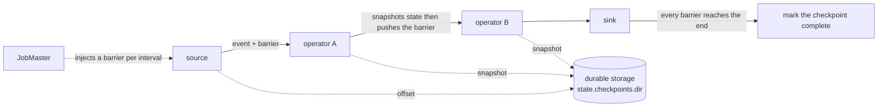

# State and checkpoints

> **Takeaway:** state is the *memory* of a stream that runs forever (counters, windows, join tables);
> a checkpoint is a *periodic snapshot* of all that state so that, when the job dies, it restarts from
> the most recent snapshot and replays from the saved offset — nothing lost, nothing recomputed from scratch.

Because a stream never ends, Flink has to remember things itself. And because it runs forever on hardware
that will fail, it has to restore what it remembered. Those are the two halves of this file.

## Keyed state vs operator state

**Keyed state** — attached to a *key* (after a `keyBy`). Flink partitions it by key: each
subtask only holds the state of the keys belonging to it. This is the kind you use 95% of the time:

| Kind | Holds | Use when |
|---|---|---|
| `ValueState<T>` | One value per key | Counters, flags, the latest value |
| `ListState<T>` | A list per key | Gathering events awaiting processing |
| `MapState<K,V>` | A map per key | Deduplication, a side table per key |
| `ReducingState<T>` | One value, merged by a reduce function | An incremental sum/max |
| `AggregatingState<IN,OUT>` | Like reducing, with different in/out types | Averages, complex aggregation |

**Operator state** — attached to an *operator instance*, not to a key. Less common; mostly used by
connectors (e.g. a Kafka source holding the offset per partition). On a parallelism change, Flink
redistributes it according to schemes like *even-split*.

### State primitives — illustrative code

State isn't an ordinary variable: it's managed by Flink (included in checkpoints, partitioned by
key, cleaned on rescale). You declare it through a `StateDescriptor` in `open()` and then access it
in `processElement()`. Accessing keyed state is **always implicitly** scoped to the current key of the
record being processed — you don't pass the key.

```java
// số minh hoạ — chưa chạy trên cluster
public class DedupCount extends KeyedProcessFunction<String, Event, Long> {
    private transient ValueState<Long> count;      // một số mỗi key
    private transient MapState<String, Boolean> seen;   // dedup theo id mỗi key
    private transient ListState<Event> buffer;     // gom event mỗi key
    private transient AggregatingState<Event, Double> avg;   // trung bình mỗi key

    @Override
    public void open(Configuration cfg) {
        count = getRuntimeContext().getState(
            new ValueStateDescriptor<>("count", Long.class));
        seen = getRuntimeContext().getMapState(
            new MapStateDescriptor<>("seen", String.class, Boolean.class));
        buffer = getRuntimeContext().getListState(
            new ListStateDescriptor<>("buffer", Event.class));
        avg = getRuntimeContext().getAggregatingState(
            new AggregatingStateDescriptor<>("avg", new AvgFn(), Double.class));
    }

    @Override
    public void processElement(Event e, Context ctx, Collector<Long> out) throws Exception {
        if (seen.contains(e.id)) return;      // đã thấy id này cho key hiện tại → bỏ
        seen.put(e.id, true);
        Long c = count.value();               // null nếu key chưa có state
        count.update(c == null ? 1 : c + 1);
        buffer.add(e);
        avg.add(e);
        out.collect(count.value());
    }
}
```

`ReducingState` and `AggregatingState` differ from `ValueState` in *merging in place*: each `add`
calls the merge function immediately, so no list is retained — much lighter when you only need a sum/max/average.
`ReducingState` requires the input type = the output type; `AggregatingState` allows the accumulator type and
the output type to differ from the input type (e.g. accumulating `(sum, count)` but outputting a `Double`).

## Key groups & rescaling — why changing parallelism needs a savepoint

This is a little-known mechanism that explains a lot of operational constraints. Flink does **not**
distribute keyed state directly by `hash(key) % parallelism`. If it did, changing parallelism would
shuffle *every* key to a different subtask → redistributing all the state, which is very expensive.

Instead, keyed state is divided into **key groups**: each key is assigned to a fixed key group by
`hash(key) % maxParallelism`. The number of key groups = **`maxParallelism`** (set when the job is created,
derived from the initial parallelism by default, with an upper bound of 32768). Each subtask gets a contiguous
*range* of key groups:

```text
số minh hoạ — chưa chạy trên cluster
maxParallelism = 128  → 128 key groups (0..127)

parallelism = 4:
  subtask 0: key groups 0..31
  subtask 1: key groups 32..63
  subtask 2: key groups 64..95
  subtask 3: key groups 96..127

rescale → parallelism = 8:
  subtask 0: 0..15   subtask 1: 16..31   ...   subtask 7: 112..127
  (mỗi key group vẫn nguyên khối, chỉ ĐỔI CHỦ — không cần hash lại từng key)
```

The consequences that follow:

- **Changing parallelism requires a restart from a savepoint/checkpoint.** You can't change it while
  running; you must stop, redistribute the key groups for the new parallelism, and start again. Flink only
  needs to move *whole* key groups between subtasks, not rehash individual keys.
- **You can't exceed `maxParallelism`.** Because the key-group count is fixed, parallelism can't be larger
  than the number of key groups — each subtask needs at least one. If you set `maxParallelism` = 128
  you can never scale past 128, however many machines you add. It can't be changed once the job has state.
- **Set `maxParallelism` high from the start** (e.g. 128 or 720) to leave room to scale; but
  too high costs metadata per key group. This is a one-way decision, so weigh it in advance.

## State backends — where state is held

| Backend | State lives in | Speed | Capacity | Checkpoints | Use when |
|---|---|---|---|---|---|
| **HashMapStateBackend** | The JVM heap (on-heap objects) | Fastest, no serialization per access | Bounded by RAM | **Full** every time | Small state, latency above all |
| **EmbeddedRocksDBStateBackend** | RocksDB (off-heap, on local disk) | Slower (serialization + possible disk access) | Far larger than RAM (hundreds of GB) | Can be **incremental** (via SST files) | Large state, many keys |

**The internal mechanism — why the speeds differ:**

- **HashMapStateBackend** keeps state as *live Java objects* in the heap. Reads/writes are pointer
  accesses with no serialization → the fastest. But: the state counts against the heap → **heavy GC** when large,
  and it can't exceed RAM. Checkpoints are **full**: each one copies all the state out to durable
  storage.
- **EmbeddedRocksDBStateBackend** stores state **serialized into bytes** in RocksDB (an
  LSM-tree writing `.sst` files to local disk, off-heap). Each state read must
  *deserialize* and each write must *serialize* → slower, and it may touch disk if the data isn't in
  the block cache. In exchange the state isn't bounded by RAM and doesn't burden the JVM's GC.

**Only RocksDB has incremental checkpoints** because it exploits the LSM structure: RocksDB writes
*immutable* SST files; an incremental checkpoint only needs to copy **the new SST files** since
the previous checkpoint, rather than copying everything. HashMap has no such structure, so it's always full.

```text
số minh hoạ — chưa chạy trên cluster
RocksDB incremental checkpoint:
  checkpoint 1: sst_001 sst_002 sst_003          (chép cả 3)
  checkpoint 2: + sst_004                          (chỉ chép SST MỚI, tham chiếu 001-003)
  checkpoint 3: + sst_005, compaction gộp 001+002 → sst_006  (chép 005, 006)
```

**The core trade-off:** HashMap is fast because everything is in the heap, but the state can't exceed
RAM and it makes GC heavy. RocksDB can hold enormous state because it spills to disk and supports
incremental checkpoints, in exchange for serialization on every read/write and possible disk access — slower.
Choose RocksDB when state is large, keys are many, or you need incremental checkpoints.

## Checkpoints — the snapshot for recovery

A checkpoint is a *consistent* snapshot of all the state of all the operators at one logical
moment, written to durable storage (`state.checkpoints.dir` on S3, HDFS…). The mechanism is the
**Chandy-Lamport** algorithm using **barriers**:

```text
source ─●─────●─────●─►  operator ─●─►  sink
        │     │     │              │
     barrier trôi theo dòng dữ liệu, kẹp giữa các event
```

1. The JobMaster injects a **barrier** into the sources (a special record) per the `interval`.
2. The barrier **flows through the dataflow** with the events. When an operator receives a barrier, it snapshots
   its own state (asynchronously, sending it to durable storage) and then pushes the barrier downstream.
3. When the barrier reaches every sink and every operator has finished snapshotting, the checkpoint is complete — marked
   "complete" on durable storage and usable for recovery.

The elegant part: **the data flow isn't stopped** to snapshot; the barrier travels *between* events, so processing
continues.



### Aligned vs unaligned checkpoints

When an operator has several inputs, the barriers from those inputs don't arrive at the same time.

- **Aligned checkpoint** (the default) — the operator *waits* for barriers from **every** input before
  snapshotting; the inputs whose barriers arrived first are **buffered** (briefly blocked) until the slowest
  input sends its barrier too. Precise, with lighter checkpoints (containing no in-flight data),
  but under **backpressure** a barrier gets stuck behind a long queue of unprocessed buffers → alignment
  takes long → checkpoints are slow or time out.

```text
số minh hoạ — chưa chạy trên cluster — ALIGNED tại operator 2 input:
  input A: ...e e e |barrier|              → barrier A tới trước, buffer các event sau nó
  input B: ...e e e e e e e |barrier|      → chờ tới đây mới ĐỦ → chụp state → đẩy barrier
```

- **Unaligned checkpoint** — snapshots the moment the *first* barrier arrives, **overtaking** the buffer queue
  and including the **in-flight** data (the events sitting in buffers/the network) in the checkpoint.
  It gets past backpressure (the barrier needn't wait for alignment), in exchange for a **larger** checkpoint
  (containing data in flight). Turn it on when checkpoints often time out because of backpressure.

## Recovery — what happens when the job dies

1. A task dies (hardware failure, OOM, an exception).
2. The JobManager notices and **restarts** the job (per the restart strategy).
3. Every operator **reloads its state from the most recent completed checkpoint** (redistributing key groups
   if the parallelism changed).
4. The sources **replay from the offset saved in that checkpoint** (e.g. rewinding the Kafka consumer to
   the checkpointed offset).

Because state and offsets are captured in the *same* checkpoint, they're consistent: replaying from that
offset plus the state at that point gives the same result as never having died. This is the foundation of *internal*
exactly-once — see [exactly-once](exactly-once.md) for the sink part.

### Exactly-once vs at-least-once (checkpoint mode)

`execution.checkpointing.mode` has two values, and they are precisely aligned vs not:

- **EXACTLY_ONCE** (the default) — uses **aligned** barriers (or unaligned if enabled). Because the
  operator waits for *all* its inputs' barriers before snapshotting, the snapshot is absolutely consistent:
  each record contributes to the state *exactly once*. This is the semantics you need for correct counts/sums.
- **AT_LEAST_ONCE** — **no alignment**: the operator snapshots the moment the first barrier arrives without
  buffering the other inputs. Lighter, lower latency, but on recovery some records
  may be processed *more than once* (the state absorbed events beyond the barrier). Acceptable for
  a job that doesn't need exact counts, never for financial ones.

Note: unaligned checkpoints *still* give exactly-once — they capture the in-flight buffers so recovery
is still consistent. Don't confuse "unaligned" with "at-least-once"; they're two different axes.

## The checkpoint parameters

- **interval** — how often to snapshot. Short → less replay on recovery but frequent I/O
  cost; long → lighter but more replay when you die.
- **timeout** — cancel a checkpoint that hasn't finished in time.
- **incremental checkpoints** (RocksDB only) — write only the *changed* state (new SST files)
  since the previous checkpoint, not everything again. Mandatory with large state — otherwise every
  checkpoint writes hundreds of GB and can't keep up with the interval.

### The full checkpoint config table

| Config | Default | Controls |
|---|---|---|
| `execution.checkpointing.interval` | off (must be enabled) | The checkpointing interval |
| `execution.checkpointing.mode` | `EXACTLY_ONCE` | `EXACTLY_ONCE` (aligned) or `AT_LEAST_ONCE` |
| `execution.checkpointing.timeout` | 10 minutes | Cancels a checkpoint that takes too long |
| `execution.checkpointing.min-pause` | 0 | The minimum pause between two checkpoints (leaving CPU for processing) |
| `execution.checkpointing.max-concurrent-checkpoints` | 1 | How many checkpoints run concurrently |
| `execution.checkpointing.unaligned.enabled` | `false` | Enables unaligned checkpoints to get past backpressure |
| `execution.checkpointing.externalized-checkpoint-retention` | off (cleaned when the job is cancelled) | Keeps checkpoints after the job stops for manual recovery |
| `state.checkpoints.dir` | — | The durable-storage directory holding checkpoints (DFS/S3) |
| `state.backend.incremental` | `false` | Enables incremental checkpoints (RocksDB only) |

A note: config names and defaults can change between Flink versions; the values above are the
commonly seen defaults — verify them against the docs for your version before relying on them.

## State TTL — the ever-growing-state trap

Keyed state **doesn't clean itself**. If keys are continuously new (each `session_id` appearing only
once), the key count only grows, state bloats forever → checkpoints get slower → eventually OOM or a
checkpoint timeout. The job "works well" for a few weeks and then dies, with the cause far from the symptom.
This is why a TTL is essentially **mandatory** for any keyed state with an **unbounded key space** (session
ids, request ids, user agents… — anything that never repeats).

The cure is a **state TTL** (`StateTtlConfig`): once expired, Flink cleans it up.

```java
// số minh hoạ — chưa chạy trên cluster
StateTtlConfig ttl = StateTtlConfig
    .newBuilder(Time.hours(24))
    .setUpdateType(StateTtlConfig.UpdateType.OnCreateAndWrite)
    .setStateVisibility(StateTtlConfig.StateVisibility.NeverReturnExpired)
    .cleanupInRocksdbCompactFilter(1000)
    .build();
descriptor.enableTimeToLive(ttl);
```

- `UpdateType.OnCreateAndWrite` — the TTL resets on each *write*; `OnReadAndWrite` resets on reads too.
- `StateVisibility.NeverReturnExpired` — never returns expired state even if it hasn't been cleaned yet.
- `cleanupInRocksdbCompactFilter(N)` — cleans expired state *during RocksDB compaction* (checking every
  N elements), rather than waiting for an access. Important with RocksDB: without it,
  expired state stays on disk until it's read again — and a write-once key is never
  read again → never cleaned.

See the [case study on state bloating for want of a TTL](../case-studies/state-phinh-thieu-ttl.md).

## Trade-offs

| You get | You lose | In exchange for |
|---|---|---|
| RocksDB: enormous state | Slower than HashMap (serialization + disk) | Not being bounded by RAM |
| RocksDB: incremental checkpoints | Checkpoints spanning many SSTs, reassembled on restore | Not rewriting hundreds of GB each time |
| Frequent checkpoints | Continuous I/O | Less replay on recovery |
| Unaligned checkpoints | Larger checkpoints (containing in-flight data) | Getting past backpressure |
| EXACTLY_ONCE (aligned) | Slow alignment under backpressure | Consistent state, correct counts |
| A high `maxParallelism` | More metadata per key group | Room to scale later |
| A state TTL | Possibly losing old history unintentionally if set wrongly | State not bloating without bound |

## Common Mistakes

| Mistake | Consequence | Prevented by |
|---|---|---|
| No state TTL for an unbounded key space | State only grows → checkpoints slow → OOM | Setting a TTL on keyed state whose keys are continuously new |
| A RocksDB TTL without `cleanupInRocksdbCompactFilter` | Expired state stays on disk because the keys are never read again | Enabling compact-filter cleanup |
| Setting `maxParallelism` too low | You can't scale past the threshold, and can't fix it | Setting it high (128/720) from the start |
| Expecting to change parallelism while running | It can't be done | Stop → savepoint → restart with the new parallelism |
| The HashMap backend with large state | OOM once the state exceeds RAM, plus heavy GC | Moving to RocksDB |
| RocksDB without incremental checkpoints enabled | Each checkpoint rewrites everything and times out | Enabling incremental checkpoints |
| Checkpoint timeouts caused by backpressure | No completed checkpoint → losing a lot when you die | Enabling unaligned checkpoints + dealing with the backpressure |
| Using AT_LEAST_ONCE for a counting/financial job | Records processed more than once on recovery → wrong numbers | Keeping EXACTLY_ONCE for anything that must be correct |

## FAQ

<details>
<summary>What's the difference between a checkpoint and a savepoint?</summary>

A checkpoint is *automatic and periodic*, managed by Flink for recovery after a failure (and may be cleaned when
old). A savepoint is *manual*, triggered by you, for upgrading code or moving a job — durable, and
managed by you. See [savepoint-upgrade](../skills/savepoint-upgrade.md).

</details>

<details>
<summary>Why does changing parallelism require stopping the job and taking a savepoint?</summary>

Because keyed state is distributed by fixed key groups (numbering maxParallelism), and each subtask holds a
range of key groups. Changing parallelism = redistributing the key-group ranges between subtasks — which can't
be done while running, so you must snapshot the state (savepoint/checkpoint), stop, and restart with the
new layout. And you can never exceed the maxParallelism you set.

</details>

<details>
<summary>A slow-travelling barrier makes checkpoints slow — why?</summary>

With aligned checkpoints, the operator has to wait for barriers from every input. If one input is
backpressured, its barrier is stuck behind a long queue of unprocessed buffers → alignment takes long → the checkpoint doesn't
finish before the timeout. That's why backpressure and checkpoint timeouts usually come together.
Unaligned checkpoints get past this because they capture the in-flight buffers instead of waiting.

</details>

<details>
<summary>Does an unaligned checkpoint mean at-least-once?</summary>

No. Unaligned still gives exactly-once — it captures the in-flight data so recovery is still
consistent. "Aligned/unaligned" is how barriers are handled under backpressure; "exactly/at-least-once"
is the recovery semantics. Two independent axes.

</details>

## Related Topics

- [Exactly-once in Flink](exactly-once.md) — checkpoints are the foundation, and what the sink part needs on top
- [Event time and watermarks](event-time-watermark.md) — windows hold state, and event-time timers live in keyed state
- [Flink job architecture](architecture.md) — how the JobManager coordinates checkpointing
- [Backpressure and tuning](../skills/backpressure-tuning.md) — why backpressure causes checkpoint timeouts
- [Savepoints and upgrades](../skills/savepoint-upgrade.md) — rescaling and changing parallelism through a savepoint
- [State bloating for want of a TTL](../case-studies/state-phinh-thieu-ttl.md) — the ever-growing-state trap
- [Flink](../index.md) — the topic this file belongs to
