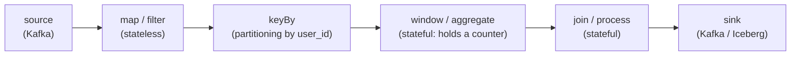
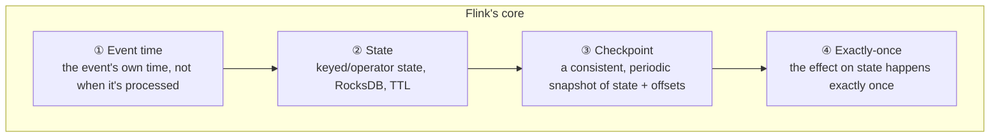

# What Flink is

> **Takeaway:** Flink is a distributed stateful stream processor — it processes data that *never
> ends*, so the root difference from batch is that you have to define **when a computation window
> counts as complete** yourself, and hold the state of a program that runs forever.

Apache Flink is a distributed engine for running computation **over streams** — sequences of events
arriving continuously with no end point. Two important words: *stateful* (Flink remembers things itself,
e.g. a counter or a join table, and restores them after a failure) and *distributed* (one job runs in
parallel across several machines, each holding part of the state).

## The dataflow model: a program = a DAG of operators

The first thing to grasp: a Flink program is **not** a loop you write to pull records one at a time.
You *declare* a **dataflow graph** — a DAG (directed, acyclic) of *operators* — and then the Flink
runtime lets the stream of records flow through that graph, forever.



Three things to take from this model:

- **Each record is a unit that flows** through the graph, without waiting for a batch to gather. A record
  enters the source, passes through each operator, exits at the sink — in a stream.
- **Each operator can be stateful.** `map`/`filter` hold nothing (stateless), but
  `window`, `aggregate`, `join`, or a `ProcessFunction` you write yourself all hold their own state
  for the data they're responsible for. That state is what Flink checkpoints and restores.
- **The graph runs in parallel.** Each operator has a *parallelism* — the number of parallel copies, each
  processing part of the data. After a `keyBy`, every record with the same key always goes to exactly one
  copy, so per-key state is consistent. The parallelism details are in [architecture](architecture.md).

This is the mental difference from a batch script: you design the *shape of the flow*, not a *sequence of
operations*. The same graph runs on 1 machine in testing and 100 in production.

## Bounded vs unbounded streams

Flink models all data as a **stream**, split into two kinds:

- **Unbounded stream** — with no end. The source emits forever (a Kafka topic, a CDC log). You have to
  process *the moment an event arrives*, unable to wait for "reading everything" because it never ends. This is
  where event time and watermarks become mandatory: you need a way of saying "the 10:00–10:05 window has
  had all its events, it can be closed now".
- **Bounded stream** — with a finite start and end (a file, a snapshot table). Read it all and stop.

### Batch execution mode — the same API, running as batch

**Batch is just a special case of a stream** — a bounded one. This isn't a marketing slogan: Flink runs
the same runtime for both. When the source is bounded you can turn on **batch execution mode**, and
Flink is permitted to optimise in a batch style:

| | STREAMING mode | BATCH mode (bounded source) |
|---|---|---|
| Processing | Record by record as they arrive, every operator running simultaneously | It may run in *stages*, finishing one step before the next |
| State | Held in a state backend, checkpointed continuously | No need for time-based state; intermediate results are rebuildable |
| Sort/aggregate | Keeps time-based state, emitting results incrementally | **Sort** then group — like a batch engine |
| Watermarks | Mandatory to close windows | Not needed — "the data ran out" is a natural end point |
| Failure recovery | Restore from the most recent checkpoint | Re-run the broken stage from the intermediate results |

The practical meaning: the same API (DataStream or SQL) can run a historical backfill (bounded, with batch
mode on for speed) and then switch to running live (unbounded, streaming mode) without rewriting the
logic. This is Flink's "unified batch & streaming" promise, and it's genuinely true at the API layer —
even though *operating* the two modes still differs.

## The layered API stack

Flink isn't a single API but a stack of abstraction layers; you pick a layer by the level of control you need:

```text
┌─────────────────────────────────────────────┐
│  SQL / Table API      cao nhất, khai báo     │  ← "viết SELECT, quên vòng đời"
├─────────────────────────────────────────────┤
│  DataStream API       map/keyBy/window/join  │  ← điều khiển luồng, vẫn tiện
├─────────────────────────────────────────────┤
│  ProcessFunction      low-level: state +     │  ← chạm thẳng state, timer, event time
│                       timer + event thô      │
├─────────────────────────────────────────────┤
│  Runtime (dataflow)   operator, checkpoint   │  ← ít khi viết trực tiếp
└─────────────────────────────────────────────┘
```

- **SQL / Table API** — declared in SQL, with Flink translating down to dataflow. The fastest route to
  a result, suiting most streaming ETL/analytics. The trade-off: little fine-grained control.
- **DataStream API** — you wire up `map`, `keyBy`, `window`, `join` yourself. Good control of the flow
  and its state while staying convenient. This is the "workhorse" layer for a pipeline with its own logic.
- **ProcessFunction** — the lowest layer users usually touch: direct access to keyed state, registering
  **timers** (on event time or processing time), handling each raw event.
  Needed when the logic can't be wrapped in a ready-made window/join (e.g. a custom state machine).

The rule: **start at the highest layer that solves the problem.** Drop to ProcessFunction only when
SQL/DataStream can't express it — every layer down is more code you have to maintain yourself.

## The four pillars: why they're "first-class"

What makes Flink different from an ordinary stream-processing library isn't its operator list, but
four things built *into the runtime core* — not bolted on:



1. **Time (event time)** — Flink distinguishes *event time* (the timestamp carried in the event)
   from *processing time* (when the machine handles it). Thanks to **watermarks**, the results are
   correct even when events arrive late or out of order. This is the most-misunderstood concept — see
   [event-time](event-time-watermark.md).
2. **State** — every operator is given a consistent state store, which can be larger than RAM (the
   RocksDB backend writes to disk), can have a TTL, and is checkpointed. You don't have to stand up a Redis alongside.
3. **Checkpoint** — periodically Flink takes a *consistent snapshot* of all the state together with the
   source offsets, without stopping the flow. This is the backbone of fault tolerance — on failure it
   restores from the most recent snapshot. The mechanism is in [state-and-checkpoint](state-and-checkpoint.md).
4. **Exactly-once** — because the three pillars above fit together, each event affects state exactly
   once even across a mid-flight failure. Note: that's the *effect on state*; getting to the sink is another matter —
   see [exactly-once](exactly-once.md).

Because these four live inside the runtime, they can cooperate (a checkpoint captures state, offsets and
watermarks in *one* snapshot). A system where you have to stitch state + offsets + a consistency
guarantee together yourself will always have a gap at recovery time.

## Latency / throughput characteristics

- **Low, stable latency** — because it processes record by record (true streaming), latency can drop
  to milliseconds without oscillating with a batch rhythm. The trade-off: *end-to-end* exactly-once
  via a 2PC sink forces latency to follow the checkpoint interval (see
  [exactly-once](exactly-once.md)) — so "low" refers to processing, not always to when the
  data appears at the sink.
- **High throughput through pipelining + chaining** — records flow continuously, and adjacent operators
  are *chained* to pass data by function call rather than serialising over the network
  (see [architecture](architecture.md)). Backpressure regulates itself when downstream is slow.
- **The latency ↔ throughput trade-off** — gathering large buffers (a high `network buffer timeout`) raises
  throughput but adds latency; small buffers do the reverse. This is a dial, not a constant.

## Flink vs Spark Structured Streaming

| | Flink | Spark Structured Streaming |
|---|---|---|
| Model | **True streaming** — processing each event as it arrives | **Micro-batch** — gathering events into small batches then running batch |
| Latency | Milliseconds, stable | Depends on the batch interval; typically ~100ms–a few seconds |
| State | First-class, RocksDB, incremental checkpoints | Present, but tied to the micro-batch model |
| Event time / watermarks | Core, detailed, supporting complex late data | Present, but less flexible for complex late data |
| Backpressure | Credit-based, propagating backwards by itself | Regulated by batch rate |
| Suits when | You need genuinely low latency, large state, serious event-time semantics | You already have a Spark cluster for batch and a few seconds' latency is acceptable |

Spark has a *continuous processing* mode aiming at low latency, but to date it's still more limited than
the main micro-batch model. In exchange Spark wins when the team already has a Spark cluster for batch and
a few seconds' latency is acceptable — reusing the infrastructure is worth more than the latency.

## Flink vs Kafka Streams vs Storm / Beam

- **Kafka Streams** is a **library embedded** in your application — no separate cluster, scaled by running
  more instances of the app, with state in local RocksDB + a changelog topic on Kafka. The constraint: the
  source/destination is essentially required to be Kafka. Pick it when the pipeline lives entirely inside
  Kafka and you want it to be "just an app".
- **Flink** is a **separate cluster** (JobManager + TaskManager) — heavier to operate,
  but with many connectors (Iceberg, JDBC, filesystem, CDC), stronger event-time support, and resources
  separated from the app. Pick it when you need diverse connectors, serious event-time semantics, or a
  job big enough to justify a cluster.
- **Apache Storm** — the previous generation: true streaming but weak on state and exactly-once, largely
  superseded by Flink for new use cases. Mentioned so you recognise it in a legacy system.
- **Apache Beam** — *not* an engine but a **unified API**: you write once and choose a *runner* to run it
  (Flink, Spark, Google Dataflow…). Beam-on-Flink uses Flink as the runtime. Pick Beam when you need to
  avoid hard lock-in to one engine; you pay with one more abstraction layer and sometimes being unable to
  reach an engine's own features.

## When NOT to use Flink

- **Pure batch** — the data is already there, runs on a schedule, latency doesn't matter. SQL + dbt,
  or Spark, is far simpler. Don't stand up a streaming cluster to run one job a night.
- **Latency doesn't matter** — if "15 minutes late is fine", a batch pipeline running every
  15 minutes is much cheaper and easier to operate.
- **A small team wary of operations** — Flink drags in a whole burden: managing the state backend, tuning
  checkpoints, reading backpressure, handling savepoints on upgrade. Without somebody willing to learn
  that part, a stream job that "worked at first" becomes technical debt when it dies at 3am.

## Trade-offs

| You get | You lose | In exchange for |
|---|---|---|
| Millisecond latency, true streaming | Having to operate a cluster + a state backend | Near-real-time results |
| Correct event-time semantics even with late data | Watermark complexity, needing deep understanding | Right numbers instead of quietly wrong ones |
| State + checkpoints restoring themselves | Checkpoints costing I/O and needing tuning | Fault tolerance without data loss |
| The same runtime for batch and stream | Overhead compared with a simple batch script | Not rewriting the logic when you switch modes |
| Several API layers (SQL → ProcessFunction) | Picking the wrong layer easily over/under-engineers | The right level of control for each problem |

## Common Mistakes

| Mistake | Consequence | Prevented by |
|---|---|---|
| Using Flink for a nightly batch | Operating a streaming cluster for nothing | Asking "does latency actually matter?" first |
| Thinking processing time is enough | Wrong numbers with late data, and no error reported | Using event time from the start — see [event-time](event-time-watermark.md) |
| Forgetting that exactly-once stops at the sink | Results going out still duplicated | The sink must do 2PC — see [exactly-once](exactly-once.md) |
| Not setting a state TTL | State only grows → checkpoints slow → OOM | Setting a TTL on keyed state from the start |
| Dropping to ProcessFunction when SQL suffices | Surplus low-level code to maintain yourself | Starting from the highest API layer that works |

## FAQ

<details>
<summary>Can Flink replace Spark for batch?</summary>

Technically yes — Flink can run a bounded stream as batch, and batch execution mode optimises properly
in a batch style (sorting rather than holding time-based state). But if you already have a Spark cluster
and the whole pipeline is batch, moving to Flink just to "unify" usually isn't worth it.
Flink shines when there's a low-latency streaming part; without one, the advantage fades.

</details>

<details>
<summary>Does Flink require Kafka?</summary>

No. Kafka is the most common source but Flink has connectors for filesystems, JDBC,
Iceberg, CDC (Debezium), Pulsar… Unlike Kafka Streams, which is tightly bound to Kafka.

</details>

<details>
<summary>Should I write SQL, DataStream, or ProcessFunction?</summary>

Start at the highest layer that solves the problem. SQL/Table for most streaming ETL and analytics.
Drop to DataStream when you need specific control of the flow and its state. Only drop to
ProcessFunction when you need custom timers or a state machine that can't be wrapped in a ready-made
window/join — because every lower layer is more low-level code you have to maintain yourself.

</details>

## Related Topics

- [Flink job architecture](architecture.md) — what a job becomes in order to run in parallel
- [Event time and watermarks](event-time-watermark.md) — the most important concept, and the most-mistaken
- [State and checkpoints](state-and-checkpoint.md) — why a stream must remember and restore itself
- [Exactly-once in Flink](exactly-once.md) — the fourth pillar, and its boundary at the sink
- [Kafka](../../kafka/index.md) — the most common input source
- [Flink](../index.md) — the topic this file belongs to
