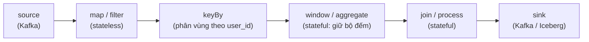
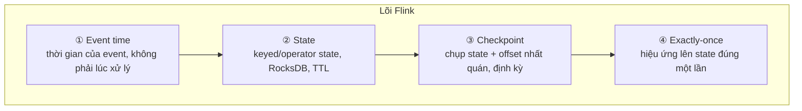

# Flink là gì

> **Chốt:** Flink là stateful stream processor phân tán — nó xử lý dữ liệu *không bao
> giờ hết*, nên khác biệt gốc so với batch là bạn phải tự định nghĩa **khi nào một cửa
> sổ tính toán được coi là đủ**, và phải tự giữ state của một chương trình chạy mãi.

Apache Flink là một engine phân tán để chạy tính toán **trên stream** — chuỗi event
đến liên tục, không có điểm kết. Hai chữ quan trọng: *stateful* (Flink tự nhớ, ví dụ
bộ đếm hay bảng join, và tự khôi phục sau khi chết) và *phân tán* (một job chạy song
song trên nhiều máy, mỗi máy giữ một phần state).

## Mô hình dataflow: chương trình = một DAG toán tử

Điều đầu tiên phải nắm: một chương trình Flink **không phải** một vòng lặp bạn viết để
kéo từng record. Bạn *khai báo* một **đồ thị dataflow** — một DAG (có hướng, không chu
trình) các *operator* — rồi Flink runtime cho stream record chảy qua đồ thị đó, mãi mãi.



Ba điều rút ra từ mô hình này:

- **Mỗi record là một đơn vị chảy** qua đồ thị, không đợi gom lô. Record vào source, đi
  qua từng operator, ra sink — theo dòng.
- **Mỗi operator có thể stateful.** `map`/`filter` không giữ gì (stateless), nhưng
  `window`, `aggregate`, `join`, hay một `ProcessFunction` tự viết đều giữ state riêng
  cho phần dữ liệu chúng phụ trách. State đó là thứ Flink checkpoint và khôi phục.
- **Đồ thị chạy song song.** Mỗi operator có *parallelism* — số bản song song, mỗi bản
  xử lý một phần dữ liệu. Sau `keyBy`, mọi record cùng key luôn đi về đúng một bản, nên
  state theo key nhất quán. Chi tiết song song hoá ở [architecture](architecture.md).

Đây là khác biệt tư duy so với script batch: bạn thiết kế *hình dạng luồng*, không viết
*trình tự thao tác*. Cùng một đồ thị chạy trên 1 máy lúc test và 100 máy lúc production.

## Bounded vs unbounded stream

Flink mô hình hoá mọi dữ liệu là **stream**, chia làm hai:

- **Unbounded stream** — không có kết thúc. Nguồn phát mãi (Kafka topic, CDC log). Phải
  xử lý *ngay khi event tới*, không thể đợi "đọc hết" vì không bao giờ hết. Đây là chỗ
  event time và watermark bắt buộc phải có: bạn cần một cách nói "cửa sổ 10:00–10:05 đã
  đủ event, đóng lại được rồi".
- **Bounded stream** — có điểm đầu và cuối hữu hạn (một file, một bảng snapshot). Đọc
  hết rồi dừng.

### Batch execution mode — cùng API, chạy như batch

**Batch chỉ là trường hợp đặc biệt của stream** — một stream bounded. Đây không phải
khẩu hiệu marketing: Flink chạy cùng một runtime cho cả hai. Khi nguồn là bounded, bạn
có thể bật **batch execution mode**, và Flink được phép tối ưu theo kiểu batch:

| | STREAMING mode | BATCH mode (nguồn bounded) |
|---|---|---|
| Xử lý | Từng record khi tới, mọi operator chạy đồng thời | Có thể chạy theo *stage*, xong bước này mới sang bước sau |
| State | Giữ trong state backend, checkpoint liên tục | Không cần state theo thời gian; kết quả trung gian dựng lại được |
| Sort/aggregate | Giữ state theo thời gian, phát kết quả tăng dần | **Sort** rồi gom — như một engine batch |
| Watermark | Bắt buộc để đóng window | Không cần — "hết dữ liệu" là điểm kết tự nhiên |
| Khôi phục lỗi | Restore từ checkpoint gần nhất | Chạy lại stage bị hỏng từ kết quả trung gian |

Ý nghĩa thực tế: cùng một API (DataStream hoặc SQL) chạy được backfill lịch sử (bounded,
bật batch mode cho nhanh) rồi chuyển sang chạy live (unbounded, streaming mode) mà
không viết lại logic. Đây là lời hứa "unified batch & streaming" của Flink, và nó có
thật ở tầng API — dù việc *vận hành* hai chế độ vẫn khác nhau.

## Stack API phân tầng

Flink không phải một API duy nhất mà là một chồng nhiều tầng trừu tượng; bạn chọn tầng
theo mức kiểm soát cần có:

```text
┌─────────────────────────────────────────────┐
│  SQL / Table API      cao nhất, khai báo     │  ← "viết SELECT, quên vòng đời"
├─────────────────────────────────────────────┤
│  DataStream API       map/keyBy/window/join  │  ← điều khiển luồng, vẫn tiện
├─────────────────────────────────────────────┤
│  ProcessFunction      low-level: state +     │  ← chạm thẳng state, timer, event time
│                       timer + event thô      │
├─────────────────────────────────────────────┤
│  Runtime (dataflow)   operator, checkpoint   │  ← ít khi viết trực tiếp
└─────────────────────────────────────────────┘
```

- **SQL / Table API** — khai báo bằng SQL, Flink tự dịch xuống dataflow. Nhanh nhất để
  ra kết quả, hợp cho phần lớn ETL/analytics streaming. Đánh đổi: ít kiểm soát chi tiết.
- **DataStream API** — bạn tự nối `map`, `keyBy`, `window`, `join`. Kiểm soát tốt luồng
  và state mà vẫn tiện. Đây là tầng "chủ lực" cho pipeline có logic riêng.
- **ProcessFunction** — tầng thấp nhất người dùng thường chạm: truy cập trực tiếp keyed
  state, đăng ký **timer** (theo event time hoặc processing time), xử lý từng event thô.
  Cần khi logic không gói được vào window/join có sẵn (ví dụ máy trạng thái tuỳ biến).

Quy tắc: **bắt đầu từ tầng cao nhất giải được bài toán.** Xuống ProcessFunction chỉ khi
SQL/DataStream không diễn đạt nổi — mỗi tầng xuống là thêm code phải tự bảo trì.

## Bốn trụ: vì sao chúng là "first-class"

Cái làm Flink khác một thư viện xử lý stream thường không phải danh sách operator, mà là
bốn thứ được xây *vào lõi runtime* — không phải bolt-on:



1. **Time (event time)** — Flink phân biệt *event time* (dấu thời gian gắn trong event)
   với *processing time* (lúc máy xử lý). Nhờ **watermark**, kết quả đúng ngay cả khi
   event tới muộn hoặc lệch thứ tự. Đây là khái niệm sai nhiều nhất — xem
   [event-time](event-time-watermark.md).
2. **State** — mọi operator được cấp một kho state nhất quán, có thể lớn hơn RAM (backend
   RocksDB ghi ra đĩa), có TTL, và được checkpoint. Không phải bạn tự dựng Redis bên cạnh.
3. **Checkpoint** — định kỳ Flink chụp một *ảnh nhất quán* của toàn bộ state cùng offset
   nguồn, không dừng luồng. Đây là cột sống của fault tolerance — chết thì restore từ ảnh
   gần nhất. Cơ chế ở [state-and-checkpoint](state-and-checkpoint.md).
4. **Exactly-once** — nhờ ba trụ trên khớp nhau, mỗi event ảnh hưởng state đúng một lần
   dù có chết giữa chừng. Lưu ý: đây là *hiệu ứng lên state*, ra sink là chuyện khác —
   xem [exactly-once](exactly-once.md).

Vì bốn thứ này nằm trong runtime, chúng phối hợp được với nhau (checkpoint chụp cả state
lẫn offset lẫn watermark trong *cùng một* ảnh). Một hệ mà bạn phải tự ghép state + offset
+ đảm bảo nhất quán sẽ luôn có một khe hở lúc khôi phục.

## Đặc tính latency / throughput

- **Latency thấp và ổn định** — vì xử lý từng record (true streaming), độ trễ có thể
  xuống mili-giây và không dao động theo nhịp batch. Đánh đổi: exactly-once *end-to-end*
  bằng 2PC sink lại buộc độ trễ theo checkpoint interval (xem
  [exactly-once](exactly-once.md)) — nên "thấp" là nói tới xử lý, không phải luôn tới
  lúc dữ liệu hiện ở sink.
- **Throughput cao qua pipelining + chaining** — record chảy liên tục, và các operator
  liền nhau được *chain* để truyền dữ liệu bằng lời gọi hàm thay vì serialize qua mạng
  (xem [architecture](architecture.md)). Backpressure tự điều tiết khi downstream chậm.
- **Đánh đổi latency ↔ throughput** — gom buffer lớn (`network buffer timeout` cao) tăng
  throughput nhưng thêm độ trễ; buffer nhỏ ngược lại. Đây là núm chỉnh, không phải hằng số.

## Flink vs Spark Structured Streaming

| | Flink | Spark Structured Streaming |
|---|---|---|
| Mô hình | **True streaming** — xử lý từng event khi tới | **Micro-batch** — gom event thành lô nhỏ rồi chạy batch |
| Độ trễ | Mili-giây, ổn định | Phụ thuộc batch interval; thường ~100ms–vài giây |
| State | First-class, RocksDB, incremental checkpoint | Có, nhưng gắn với mô hình micro-batch |
| Event time / watermark | Cốt lõi, chi tiết, hỗ trợ late data phức tạp | Có, nhưng ít linh hoạt hơn cho late data phức tạp |
| Backpressure | Credit-based, tự lan ngược | Điều tiết theo tốc độ batch |
| Hợp khi | Cần độ trễ thấp thật, state lớn, event-time nghiêm túc | Đã có cụm Spark cho batch, độ trễ vài giây chấp nhận được |

Spark có chế độ *continuous processing* nhắm độ trễ thấp, nhưng đến nay vẫn hạn chế hơn
mô hình chính micro-batch. Đổi lại Spark thắng khi team đã có sẵn cụm Spark cho batch và
độ trễ vài giây là chấp nhận được — dùng lại hạ tầng đáng giá hơn độ trễ.

## Flink vs Kafka Streams vs Storm / Beam

- **Kafka Streams** là một **library nhúng** vào ứng dụng của bạn — không có cluster
  riêng, scale bằng cách chạy thêm instance của app, state nằm ở RocksDB local + changelog
  topic trên Kafka. Ràng buộc: nguồn/đích gần như bắt buộc là Kafka. Chọn nó khi pipeline
  sống trọn trong Kafka và bạn muốn "chỉ là một app".
- **Flink** là một **cluster riêng** (JobManager + TaskManager) — nặng vận hành hơn,
  nhưng nhiều connector (Iceberg, JDBC, filesystem, CDC), event-time mạnh hơn, và tách
  biệt tài nguyên khỏi app. Chọn khi cần connector đa dạng, event-time nghiêm túc, hoặc
  job đủ lớn để đáng có cluster.
- **Apache Storm** — thế hệ trước: true streaming nhưng state và exactly-once yếu, phần
  lớn đã được Flink thay thế cho use case mới. Nhắc để nhận ra khi gặp hệ cũ.
- **Apache Beam** — *không phải* một engine mà là một **API thống nhất**: bạn viết một
  lần, chọn *runner* để chạy (Flink, Spark, Google Dataflow...). Bean-on-Flink dùng
  Flink làm runtime. Chọn Beam khi cần tránh khoá cứng vào một engine; trả giá bằng một
  tầng trừu tượng nữa và đôi khi không chạm được tính năng riêng của engine.

## Khi nào KHÔNG nên dùng Flink

- **Batch thuần** — dữ liệu có sẵn, chạy theo lịch, độ trễ không quan trọng. SQL + dbt,
  hoặc Spark, đơn giản hơn nhiều. Đừng dựng cluster streaming để chạy một job mỗi đêm.
- **Độ trễ không quan trọng** — nếu "trễ 15 phút vẫn ổn", một pipeline batch chạy mỗi
  15 phút rẻ và dễ vận hành hơn hẳn.
- **Team nhỏ, ngại vận hành** — Flink kéo theo cả một gánh: quản state backend, chỉnh
  checkpoint, đọc backpressure, xử lý savepoint khi nâng cấp. Nếu không có người sẵn sàng
  học phần đó, một stream job "chạy được lúc đầu" sẽ thành nợ kỹ thuật khi nó chết lúc 3 giờ sáng.

## Trade-offs

| Được | Mất | Đổi lấy |
|---|---|---|
| Độ trễ mili-giây, true streaming | Phải vận hành cluster + state backend | Kết quả gần real-time |
| Event-time đúng dù dữ liệu đến muộn | Độ phức tạp watermark, phải hiểu sâu | Số đúng thay vì số sai lặng lẽ |
| State + checkpoint tự khôi phục | Checkpoint tốn I/O, phải tuning | Chịu lỗi không mất dữ liệu |
| Cùng runtime cho batch và stream | Overhead so với script batch đơn giản | Không viết lại logic khi đổi chế độ |
| Nhiều tầng API (SQL → ProcessFunction) | Chọn sai tầng dễ over/under-engineer | Đúng mức kiểm soát cho từng bài |

## Common Mistakes

| Lỗi | Hậu quả | Phòng bằng |
|---|---|---|
| Dùng Flink cho batch chạy hằng đêm | Vận hành cluster streaming vô ích | Hỏi "độ trễ có quan trọng không?" trước |
| Nghĩ processing time là đủ | Số sai khi dữ liệu đến muộn, không lỗi nào báo | Dùng event time từ đầu — xem [event-time](event-time-watermark.md) |
| Quên rằng exactly-once dừng ở sink | Kết quả ra ngoài vẫn trùng | Sink phải 2PC — xem [exactly-once](exactly-once.md) |
| Không đặt state TTL | State chỉ tăng → checkpoint chậm → OOM | Đặt TTL cho keyed state ngay từ đầu |
| Xuống ProcessFunction khi SQL đủ | Code low-level thừa phải tự bảo trì | Bắt đầu từ tầng API cao nhất giải được |

## FAQ

<details>
<summary>Flink có thay được Spark cho batch không?</summary>

Về kỹ thuật có — Flink chạy được bounded stream như batch, và batch execution mode tối
ưu đúng kiểu batch (sort thay vì giữ state theo thời gian). Nhưng nếu bạn đã có cụm Spark
và toàn bộ pipeline là batch, chuyển sang Flink chỉ để "thống nhất" thường không đáng.
Flink toả sáng khi có phần streaming độ trễ thấp; nếu không có, lợi thế mờ đi.

</details>

<details>
<summary>Flink có bắt buộc dùng Kafka không?</summary>

Không. Kafka là nguồn phổ biến nhất nhưng Flink có connector cho filesystem, JDBC,
Iceberg, CDC (Debezium), Pulsar... Khác với Kafka Streams vốn gắn chặt với Kafka.

</details>

<details>
<summary>Nên viết SQL, DataStream, hay ProcessFunction?</summary>

Bắt đầu từ tầng cao nhất giải được bài toán. SQL/Table cho phần lớn ETL và analytics
streaming. Xuống DataStream khi cần điều khiển luồng và state cụ thể. Chỉ xuống
ProcessFunction khi cần timer tuỳ biến hoặc máy trạng thái không gói được vào window/join
có sẵn — vì mỗi tầng thấp hơn là thêm code low-level bạn phải tự bảo trì.

</details>

## Related Topics

- [Kiến trúc job Flink](architecture.md) — job biến thành gì để chạy song song
- [Event time và watermark](event-time-watermark.md) — khái niệm quan trọng nhất, chỗ sai nhiều nhất
- [State và checkpoint](state-and-checkpoint.md) — vì sao stream cần tự nhớ và tự khôi phục
- [Exactly-once trong Flink](exactly-once.md) — trụ thứ tư, và ranh giới của nó ở sink
- [Kafka](../../kafka/index.md) — nguồn vào thường gặp nhất
- [Flink](../index.md) — chủ đề chứa file này
