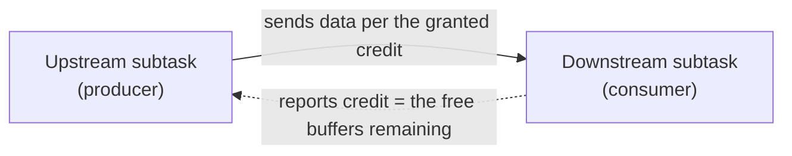
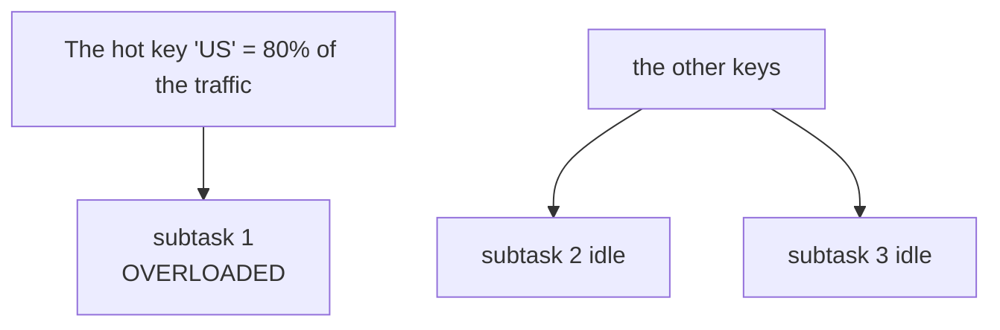
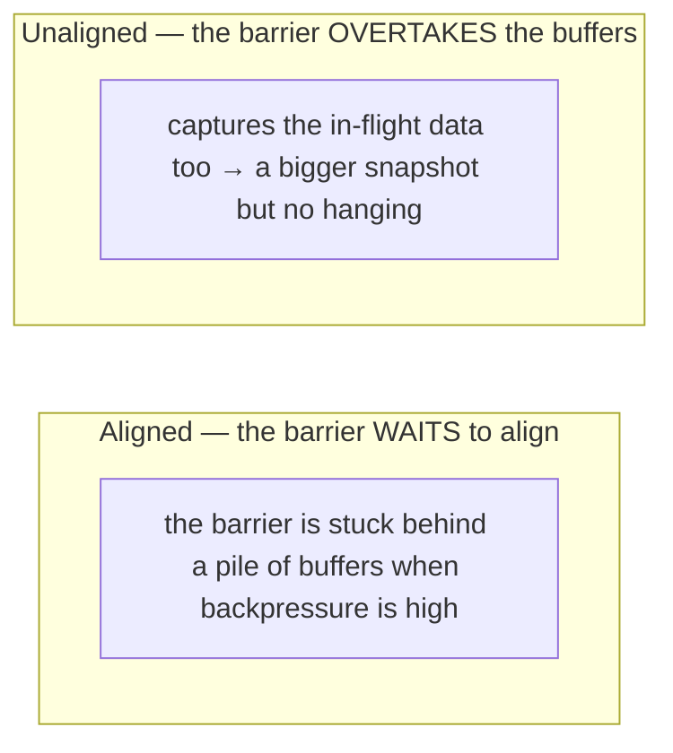

# Backpressure and tuning

> **Takeaway:** backpressure always points **downstream**, but the culprit is the **first
> operator that isn't backpressured while its `busy` is high** — it's slow and holding back the whole chain above it.
> Find that one before tuning; tuning the whole job blindly wastes resources.

A job running slowly or with rising lag almost always comes down to one bottlenecked operator. Backpressure is
how the system tells you where it is.

## The mechanism: credit-based flow control

Backpressure in Flink isn't "buffers fill and overflow" — it's **credit-based flow
control** between subtasks, which is stricter:



- Each downstream subtask announces its **credit** = the number of free network buffers it has left.
- The upstream subtask **only sends when it has credit**. Slow downstream processing → buffers fill → credit
  reaches 0 → the upstream **stops sending**, rather than sending and having it dropped.
- That pressure **is held back hop by hop** up to the source, making the source read more slowly — nothing
  lost, just the whole chain slowing down in step.

That's the **self-regulating** mechanism (the data flow is detailed in
[architecture](../reference/architecture.md)) — backpressure itself isn't a bug, it's a
**symptom** pointing at the bottleneck.

## Reading backpressure in the Flink UI

The Flink UI (port **8081** — the default) colours each operator by three metrics:

- **`busy` %** — the time the operator is **genuinely processing** (its own CPU/logic).
- **`backpressured` %** — the time it's **held back by the downstream**, unable to push output out.
- **`idle` %** — the time it's **free, waiting for input** (with nothing to do). `busy + backpressured
  + idle ≈ 100%`.

```text
Output minh hoạ, chưa chạy — sơ đồ toán tử trong Flink UI:
[ source ]  backpressured=90%  busy=5%   idle=5%    <- bị chặn, KHÔNG phải thủ phạm
     |
[ map    ]  backpressured=88%  busy=8%   idle=4%    <- bị chặn, KHÔNG phải thủ phạm
     |
[ window ]  backpressured=0%   busy=95%  idle=5%    <- THỦ PHẠM: không bị chặn nhưng bận cứng
     |
[ sink   ]  backpressured=0%   busy=20%  idle=80%   <- rảnh, dưới thủ phạm
```

## Finding the bottlenecked operator

The rule: walk downstream from the source and find the **first** operator with `backpressured ≈ 0` but a high
`busy`. Everything **above** it is backpressured because it's pushing back up; everything **below**
it is free (a high `idle`). It's the bottleneck.

If `backpressured=0` everywhere and lag is still rising → the bottleneck is at the **source** (it can't read
fast enough: too few partitions, the network), not in the processing.

## How to fix it — by cause

| Cause | What to tune | Value / rationale |
|---|---|---|
| That operator lacks parallelism | Raise **its own parallelism** | Set it to a multiple of the slots; there's no need to raise the whole job |
| **Data skew** (a hot key) | Change the key, add a salt, or use a two-phase aggregation | One key holding most of the traffic → raising parallelism is useless |
| Large state (GB) slowing it | Switch the state backend to **RocksDB** | State goes to disk and doesn't clog the heap; in exchange access is slower than the heap |
| Checkpoints stuck because backpressure is high | Enable **unaligned checkpoints** | Barriers overtake the buffers rather than waiting for alignment → checkpoints don't hang |
| Insufficient network buffers | Raise the `taskmanager.memory.network` fraction | Only when the UI shows waiting on buffers |
| Expensive serialization | POJO/Avro instead of Kryo + object reuse | Reduces the per-record cost through the network/state |

### The tuning config table

| Config | Default (Flink's default) | What it does | When to change it |
|---|---|---|---|
| `parallelism.default` | 1 | The job-wide parallelism when nothing specific is set | Set it by slot count; prefer setting the bottlenecked operator specifically |
| `taskmanager.memory.network.fraction` | 0.1 | The share of managed memory used for network buffers | Raise it when the UI reports waiting on buffers; rarely needed |
| `state.backend` (`rocksdb` / `hashmap`) | hashmap | Where keyed state is held | RocksDB when the state > RAM or grows over time |
| `execution.checkpointing.unaligned.enabled` | false | Lets barriers overtake buffers | Enable it when checkpoints time out under backpressure |
| `execution.checkpointing.interval` | unset (off) | The checkpointing interval | Short = faster recovery + lower sink latency, but higher overhead |
| `pipeline.object-reuse` | false | Drops the defensive copies between operators | Enable it when your code does NOT retain references to emitted objects |
| `state.backend.incremental` | false (on by default with RocksDB in many versions) | Checkpoints only the delta | Large state, RocksDB |

*(Defaults change between Flink versions — check `flink-conf.yaml` / the docs for the version you're
running, don't trust your memory.)*

### Data skew — the most-overlooked trap

Raising parallelism **doesn't rescue** a hot key: every record with the same key goes to **the same**
subtask.



It has to be fixed at the key layer — a **two-phase aggregation**: aggregate locally by `key+salt` first (spreading
the hot key across several subtasks), then aggregate again by `key` at the second layer. Or choose a more evenly
distributed key. Look at the record distribution across subtasks in the UI (the "Subtasks" tab) to spot it — if
one subtask receives many times more, that's skew.

### RocksDB vs the heap state backend

- **HashMap (heap)** — state in the JVM heap, **the fastest**, but bounded by RAM and
  causing GC pressure when large.
- **RocksDB** — state on disk (an LSM), able to hold state **larger than RAM**, supporting incremental
  checkpoints. In exchange each state read/write is slower (serialization + disk) — every state
  access goes through serialize/deserialize, unlike the heap holding live objects.

The rough threshold: small state, low latency → the heap; large state or state growing over time → RocksDB.
State bloating for want of a TTL is a different matter — see
[state bloating for want of a TTL](../case-studies/state-phinh-thieu-ttl.md), and don't use RocksDB to
paper over a state leak.

### Unaligned checkpoints

Checkpoints normally **align**: the barrier has to wait for every input channel to reach the same point.



With high backpressure, the barrier is stuck behind a pile of buffers → checkpoints are slow or time out.
**Unaligned checkpoints** let the barrier overtake the buffers (capturing the in-flight data too). Enable it when
checkpoints time out under backpressure. The trade-off: a bigger snapshot (containing the in-flight data), and
it isn't always needed when backpressure is low.

## Serialization — the hidden cost

- **Avoid Kryo.** Kryo is the slow fallback when Flink doesn't recognise a type; it serializes each
  record every time it crosses the network/state. Use a proper POJO (an empty constructor, getters/setters,
  public fields or bean style) or Avro so Flink uses a specialised serializer. Registering types or
  enabling the warning (`disableGenericTypes()` to make the job **fail early** if it accidentally falls to Kryo) helps catch it
  early.
- **Object reuse** (`pipeline.object-reuse` / `env.getConfig().enableObjectReuse()`) — drops the
  defensive copies between operators, reducing GC pressure. **The trap:** only enable it when your code does **not retain
  references** to emitted objects — otherwise data is silently overwritten and the numbers go wrong without
  a report.

## The diagnostic checklist

1. Lag rising? Open the Flink UI and look at the `backpressured`/`busy`/`idle` columns per operator.
2. Find the **first** operator with `backpressured≈0` + a high `busy` → the culprit.
3. `backpressured=0` everywhere while lag rises → a **source** bottleneck (partitions/network).
4. Check the Subtasks tab: one subtask receiving many times more records → **data skew**, fix the key.
5. Checkpoints timing out/dragging on? → consider **unaligned** + check the state backend.
6. High GC pauses / a full heap? → **RocksDB** for large state, and check for Kryo.
7. Only after correctly locating the bottleneck should you raise parallelism — **for that operator alone**, not the whole
   job.

## Common Mistakes

| Trap | Consequence |
|---|---|
| Raising the whole job's parallelism instead of the bottlenecked operator's | Wasted slots, and the bottleneck remains if it's skew |
| Treating the operator with high `backpressured` as the culprit | Tuning the wrong place; the culprit is the one with a high `busy` |
| Raising parallelism to fix data skew | Useless — the same key still goes to one subtask |
| Enabling object reuse while your code retains references to emitted objects | Overwritten data, silently wrong |
| Using RocksDB to hide a state leak | It only postpones the OOM/full disk; you must set a TTL |
| Enabling unaligned checkpoints pre-emptively | Pointlessly large snapshots when backpressure is low |
| Letting a type fall to Kryo unnoticed | Silently slow; use `disableGenericTypes()` to fail early |

## FAQ

<details>
<summary>What if backpressured=0 everywhere and lag is still rising?</summary>

The bottleneck is at the source: it can't read fast enough. Usually too few partitions (Kafka) relative to the parallelism,
or the network bandwidth to the broker. Add partitions at the source or check the network — tuning downstream
operators won't help.

</details>

<details>
<summary>Should unaligned checkpoints always be on?</summary>

Not by default. It trades checkpoint stability under backpressure for a bigger snapshot. When the
job is healthy and backpressure is low, aligned checkpoints are tidier. Enable it when you *see* checkpoints
timing out because of backpressure, not pre-emptively.

</details>

<details>
<summary>Is parallelism above the Kafka partition count useful?</summary>

Not for the **reading** part — each partition is read by one reader only, so the surplus subtasks sit idle. But high
parallelism is still useful for the operators **after** the source (windows, heavy joins). If the source
is the bottleneck, add partitions in Kafka first, and only then raise the reader parallelism.

</details>

## Related Topics

- [Flink architecture](../reference/architecture.md) — the data flow and the backpressure mechanism
- [State and checkpoints](../reference/state-and-checkpoint.md) — state backends, checkpoints
- [Savepoints and upgrading a job](savepoint-upgrade.md) — max parallelism when scaling
- [Case: state bloating for want of a TTL](../case-studies/state-phinh-thieu-ttl.md)
- [Skills — Flink](../index.md)
