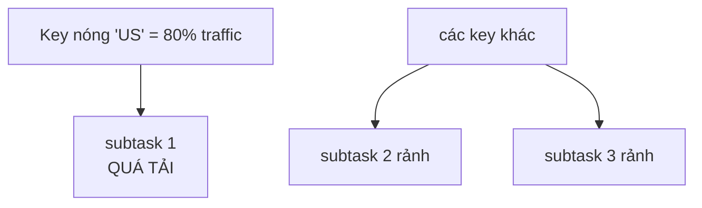
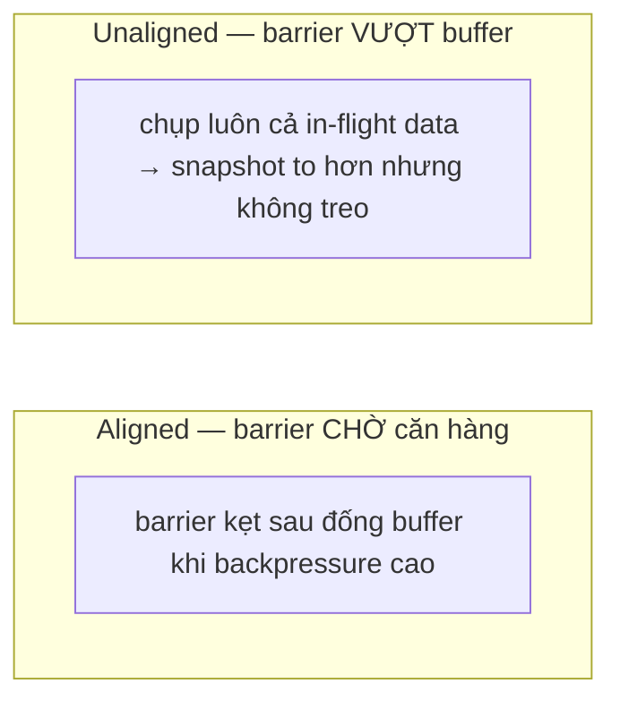

# Backpressure và tuning

> **Chốt:** Backpressure luôn chỉ về **hạ nguồn**, nhưng thủ phạm là toán tử **đầu tiên
> không bị backpressure mà `busy` cao** — nó chậm và đang chặn ngược cả chuỗi phía trên.
> Tìm đúng nó rồi mới chỉnh; chỉnh mù toàn job là phí tài nguyên.

Job chạy chậm hoặc lag tăng dần gần như luôn quy về một toán tử nghẽn. Backpressure là
cách hệ thống tự nói cho bạn nó nằm đâu.

## Cơ chế: credit-based flow control

Backpressure trong Flink không phải "đầy buffer thì tràn" — nó là **credit-based flow
control** giữa các subtask, chặt chẽ hơn:


- Mỗi subtask hạ nguồn công bố **credit** = số network buffer trống nó còn.
- Subtask thượng nguồn **chỉ gửi khi có credit**. Hạ nguồn xử chậm → buffer đầy → credit
  về 0 → thượng nguồn **ngừng gửi**, không phải gửi rồi bị drop.
- Áp lực này **ghì ngược từng chặng** lên tới source, làm source đọc chậm lại — không mất
  dữ liệu, chỉ chậm lại đồng bộ toàn chuỗi.

Đó là cơ chế **tự điều tiết** (chi tiết luồng dữ liệu ở
[architecture](../reference/architecture.md)) — bản thân backpressure không phải lỗi, nó
là **triệu chứng** chỉ chỗ nghẽn.

## Đọc backpressure ở Flink UI

Flink UI (cổng **8081** — cổng mặc định) tô màu mỗi toán tử theo ba chỉ số:

- **`busy` %** — thời gian toán tử **đang thực sự xử lý** (CPU/logic của chính nó).
- **`backpressured` %** — thời gian bị **hạ nguồn chặn**, không đẩy ra được.
- **`idle` %** — thời gian **rảnh, chờ input** (không có gì để làm). `busy + backpressured
  + idle ≈ 100%`.

```text
Output minh hoạ, chưa chạy — sơ đồ toán tử trong Flink UI:
[ source ]  backpressured=90%  busy=5%   idle=5%    <- bị chặn, KHÔNG phải thủ phạm
     |
[ map    ]  backpressured=88%  busy=8%   idle=4%    <- bị chặn, KHÔNG phải thủ phạm
     |
[ window ]  backpressured=0%   busy=95%  idle=5%    <- THỦ PHẠM: không bị chặn nhưng bận cứng
     |
[ sink   ]  backpressured=0%   busy=20%  idle=80%   <- rảnh, dưới thủ phạm
```

## Tìm toán tử nghẽn

Quy tắc: đi từ source xuôi dòng, tìm toán tử **đầu tiên** có `backpressured ≈ 0` nhưng
`busy` cao. Mọi thứ **trên** nó bị backpressure là do nó dội ngược lên; mọi thứ **dưới**
nó rảnh (`idle` cao). Nó là nút thắt.

Nếu `backpressured=0` khắp nơi và lag vẫn tăng → nghẽn ở **source** (đọc không kịp:
partition ít, network) chứ không phải xử lý.

## Cách xử lý — theo nguyên nhân

| Nguyên nhân | Cách chỉnh | Giá trị / lý do |
|---|---|---|
| Toán tử đó thiếu song song | Tăng **parallelism riêng** cho nó | Đặt bằng bội số slot; không cần tăng cả job |
| **Data skew** (key nóng) | Sửa khoá, thêm salt, hoặc two-phase agg | Một key ôm phần lớn traffic → tăng parallelism vô ích |
| State lớn (GB) làm chậm | Đổi state backend sang **RocksDB** | State ra đĩa, không kẹt heap; đổi lại truy cập chậm hơn heap |
| Checkpoint kẹt vì backpressure cao | Bật **unaligned checkpoint** | Barrier vượt qua buffer thay vì chờ căn hàng → checkpoint không treo |
| Network buffer thiếu | Tăng `taskmanager.memory.network` fraction | Chỉ khi UI cho thấy chờ buffer |
| Serialization đắt | POJO/Avro thay Kryo + object reuse | Giảm chi phí mỗi record qua network/state |

### Bảng config tuning

| Config | Mặc định (mặc định Flink) | Làm gì | Khi nào đổi |
|---|---|---|---|
| `parallelism.default` | 1 | Parallelism toàn job nếu không đặt riêng | Đặt theo số slot; ưu tiên đặt riêng toán tử nghẽn |
| `taskmanager.memory.network.fraction` | 0.1 | Phần managed memory làm network buffer | Tăng khi UI báo chờ buffer; hiếm cần |
| `state.backend` (`rocksdb` / `hashmap`) | hashmap | Nơi giữ keyed state | RocksDB khi state > RAM hoặc phình theo thời gian |
| `execution.checkpointing.unaligned.enabled` | false | Cho barrier vượt buffer | Bật khi checkpoint timeout dưới backpressure |
| `execution.checkpointing.interval` | không đặt (tắt) | Chu kỳ checkpoint | Ngắn = phục hồi nhanh + độ trễ sink thấp, nhưng overhead cao |
| `pipeline.object-reuse` | false | Bỏ copy phòng thủ giữa toán tử | Bật khi code KHÔNG giữ ref object đã emit |
| `state.backend.incremental` | false (bật mặc định với RocksDB ở nhiều bản) | Checkpoint chỉ phần delta | State lớn, RocksDB |

*(Giá trị mặc định thay đổi giữa các bản Flink — kiểm bằng `flink-conf.yaml` / doc bản
đang chạy, đừng tin trí nhớ.)*

### Data skew — bẫy hay bị bỏ sót

Tăng parallelism **không cứu** được key nóng: mọi record cùng key vào **cùng một**
subtask.



Phải sửa ở tầng khoá — **two-phase aggregation**: gộp cục bộ theo `key+salt` trước (tán
key nóng ra nhiều subtask), rồi gộp lại theo `key` ở tầng hai. Hoặc chọn khoá phân bố đều
hơn. Nhìn phân bố record giữa các subtask trong UI (tab "Subtasks") để phát hiện — nếu
một subtask nhận nhiều gấp bội, đó là skew.

### RocksDB vs heap state backend

- **HashMap (heap)** — state trong JVM heap, **nhanh nhất**, nhưng giới hạn bởi RAM và
  gây áp lực GC khi lớn.
- **RocksDB** — state ra đĩa (LSM), chịu được state **lớn hơn RAM**, hỗ trợ incremental
  checkpoint. Đổi lại mỗi lần đọc/ghi state chậm hơn (serialize + đĩa) — mỗi truy cập
  state đi qua serialize/deserialize, không như heap giữ object sống.

Ngưỡng thô: state nhỏ, low-latency → heap; state lớn hoặc phình theo thời gian → RocksDB.
State phình vì thiếu TTL là chuyện khác — xem
[state phình thiếu TTL](../case-studies/state-phinh-thieu-ttl.md), đừng dùng RocksDB để
che một rò rỉ state.

### Unaligned checkpoint

Checkpoint thường **align**: barrier phải chờ mọi input channel tới cùng điểm.



Khi backpressure cao, barrier kẹt sau đống buffer → checkpoint chậm hoặc timeout.
**Unaligned checkpoint** cho barrier vượt buffer (chụp luôn cả in-flight data). Bật khi
checkpoint timeout dưới backpressure. Đánh đổi: snapshot to hơn (chứa cả in-flight), và
không phải lúc nào cũng cần khi backpressure thấp.

## Serialization — chi phí ẩn

- **Tránh Kryo.** Kryo là fallback chậm khi Flink không nhận ra kiểu; nó serialize từng
  record mỗi lần qua network/state. Dùng POJO đúng chuẩn (constructor rỗng, getter/setter,
  field public hoặc bean) hoặc Avro để Flink dùng serializer chuyên. Đăng ký type hoặc
  bật cảnh báo (`disableGenericTypes()` để job **fail sớm** nếu lỡ rơi vào Kryo) giúp bắt
  sớm.
- **Object reuse** (`pipeline.object-reuse` / `env.getConfig().enableObjectReuse()`) — bỏ
  copy phòng thủ giữa các toán tử, giảm áp lực GC. **Bẫy:** chỉ bật khi code **không giữ
  tham chiếu** tới object đã emit — nếu không, dữ liệu bị ghi đè âm thầm, sai số không
  báo.

## Checklist chẩn đoán

1. Lag tăng? Mở Flink UI, xem cột `backpressured`/`busy`/`idle` từng toán tử.
2. Tìm toán tử **đầu tiên** `backpressured≈0` + `busy` cao → thủ phạm.
3. `backpressured=0` khắp nơi mà lag tăng → nghẽn **source** (partition/network).
4. Xem tab Subtasks: một subtask nhận record gấp bội → **data skew**, sửa khoá.
5. Checkpoint timeout/kéo dài? → cân nhắc **unaligned** + kiểm state backend.
6. GC pause cao / heap đầy? → **RocksDB** cho state lớn, kiểm Kryo.
7. Chỉ sau khi khoanh đúng nút thắt mới tăng parallelism — **riêng toán tử đó**, không cả
   job.

## Common Mistakes

| Bẫy | Hậu quả |
|---|---|
| Tăng parallelism toàn job thay vì toán tử nghẽn | Phí slot, nghẽn vẫn còn nếu do skew |
| Coi toán tử `backpressured` cao là thủ phạm | Chỉnh nhầm chỗ; thủ phạm là cái `busy` cao |
| Tăng parallelism để chữa data skew | Vô ích — cùng key vẫn về một subtask |
| Bật object reuse mà code giữ ref object đã emit | Ghi đè dữ liệu, sai lặng lẽ |
| Dùng RocksDB để giấu state rò rỉ | Chỉ hoãn OOM/đầy đĩa; phải đặt TTL |
| Bật unaligned checkpoint phòng xa | Snapshot to vô ích khi backpressure thấp |
| Để type rơi vào Kryo mà không biết | Chậm âm thầm; nên `disableGenericTypes()` để fail sớm |

## FAQ

<details>
<summary>backpressured=0 khắp nơi mà lag vẫn tăng thì sao?</summary>

Nghẽn ở source: đọc không kịp. Thường do quá ít partition (Kafka) so với parallelism,
hoặc băng thông mạng tới broker. Tăng partition ở nguồn hoặc kiểm mạng — chỉnh toán tử
downstream không giúp.

</details>

<details>
<summary>Có nên luôn bật unaligned checkpoint không?</summary>

Không mặc định. Nó đổi độ ổn định checkpoint dưới backpressure lấy snapshot to hơn. Khi
job khoẻ, backpressure thấp, aligned checkpoint gọn hơn. Bật khi bạn *thấy* checkpoint
timeout vì backpressure, đừng bật phòng xa.

</details>

<details>
<summary>Parallelism cao hơn số partition Kafka có ích không?</summary>

Không cho phần **đọc** — mỗi partition chỉ một reader đọc, subtask thừa sẽ idle. Nhưng
parallelism cao vẫn có ích cho các toán tử **sau** source (window, join nặng). Nếu source
là nút thắt, tăng partition ở Kafka trước, rồi mới tăng parallelism reader.

</details>

## Related Topics

- [Kiến trúc Flink](../reference/architecture.md) — luồng dữ liệu và cơ chế backpressure
- [State và checkpoint](../reference/state-and-checkpoint.md) — state backend, checkpoint
- [Savepoint và nâng cấp job](savepoint-upgrade.md) — max parallelism khi scale
- [Case: state phình vì thiếu TTL](../case-studies/state-phinh-thieu-ttl.md)
- [Kỹ năng — Flink](../index.md)
