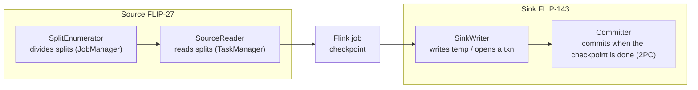
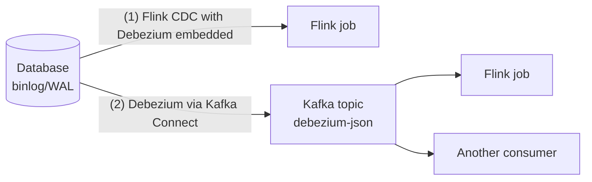

# Flink connectors

> **Takeaway:** Flink's exactly-once is only strong **inside** the job; at the boundary with the world, that
> guarantee only holds if **both the source and the sink** cooperate (the source replayable by offset, the
> sink supporting transactions). Choosing the wrong connector is where duplicates escape.

Connectors are where Flink touches external data — and also where every theoretical guarantee collides with
the reality of the system on the other side.

## The modern source/sink model

Modern Flink connectors follow two FLIPs that unify the interfaces — understanding them explains
why exactly-once works (or doesn't):

- **FLIP-27 (Source)** — split into two parts: a **SplitEnumerator** (running on the JobManager,
  dividing the work into splits: Kafka partitions, file ranges) and a **SourceReader** (running
  on a TaskManager, reading the assigned splits). That separation is what lets one API serve both
  bounded (batch) and unbounded (stream), and lets watermarks be assigned right at the reader per
  split.
- **FLIP-143 (Sink)** — separates the **SinkWriter** (writing the data, accumulating what needs committing) and
  the **Committer** (committing when the checkpoint completes). This is the **2PC** framework: the writer prepares
  (writing temporary files / opening a transaction) and the committer finalises when the checkpoint is done. Iceberg, the Kafka
  EXACTLY_ONCE sink and file sinks are all built on this framework.



## Source vs sink — the exactly-once preconditions

- **Source** — reading into Flink. Good if it's **replayable** by a checkpointed offset (Kafka,
  files with a position). Non-replayable means no exactly-once however perfect the sink.
- **Sink** — writing out. Good if it's **transactional** (2PC) or **idempotent** (an upsert by
  key). A blindly appending sink will write duplicates on a retry after a failure.

## Kafka source

```java
// Code minh hoạ, chưa chạy
KafkaSource<Event> source = KafkaSource.<Event>builder()
    .setBootstrapServers(bootstrap)          // lấy từ config, KHÔNG hardcode host
    .setTopics("clicks")
    .setGroupId("flink-clicks")
    .setStartingOffsets(OffsetsInitializer.committedOffsets(OffsetResetStrategy.EARLIEST))
    .setValueOnlyDeserializer(new EventDeserializer())
    .build();

env.fromSource(source,
    WatermarkStrategy.<Event>forBoundedOutOfOrderness(Duration.ofSeconds(5))
        .withTimestampAssigner((e, ts) -> e.eventTime)
        .withIdleness(Duration.ofMinutes(1)),   // tránh idle partition treo watermark
    "kafka-clicks");
```

Three important points about the source:

- **The offset initializer** — `OffsetsInitializer` decides where to start:
  `earliest()`/`latest()` (the start/end of the topic), `committedOffsets(...)` (from the group's committed
  offset, falling back to earliest/latest if there is none), `timestamp(ms)` (from a point in time).
- **Offsets** are managed by Flink inside checkpoints (not relying on Kafka's `enable.auto.commit`).
  Restoring from a checkpoint = rewinding to exactly that offset → nothing lost or duplicated on the
  reading side. (It still commits offsets back to Kafka for **lag monitoring**, but those offsets aren't the
  source of truth on recovery.)
- **Bounded mode** — `.setBounded(OffsetsInitializer.latest())` turns the Kafka source into a finite one
  (reading up to that offset then ending) — for backfill/batch on the same API.
- **Assigning watermarks right at the source** is usually better than after a `keyBy`, because it tracks
  them per partition. Remember `withIdleness` so a silent partition doesn't hold the global watermark
  still — exactly the trap in the
  [idle-partition case study](../case-studies/cua-so-khong-chay-idle-partition.md).

## Kafka sink — choosing a delivery guarantee

```java
// Code minh hoạ, chưa chạy
KafkaSink<Row> sink = KafkaSink.<Row>builder()
    .setBootstrapServers(bootstrap)
    .setRecordSerializer(/* ... */)
    .setDeliveryGuarantee(DeliveryGuarantee.EXACTLY_ONCE)   // hoặc AT_LEAST_ONCE / NONE
    .setTransactionalIdPrefix("clicks-agg")
    .setProperty("transaction.timeout.ms", "900000")        // > checkpoint interval + margin
    .build();
```

| Guarantee | Mechanism | Trade-off |
|---|---|---|
| `NONE` | Fire-and-forget, no guarantee at all | The fastest, and records **can be lost** on failure |
| `AT_LEAST_ONCE` | Writes and flushes per checkpoint, possibly rewriting after a failure | Nothing lost, but it **can duplicate** — the downstream must deduplicate |
| `EXACTLY_ONCE` | A Kafka **transaction** committed exactly per checkpoint (2PC) | No duplicates, but it needs a `transactionalIdPrefix`, incurs **extra latency** = the checkpoint interval, and consumers must read `read_committed` |

### The `transaction.timeout.ms` trap

With EXACTLY_ONCE, Flink opens a Kafka transaction and **only commits when the checkpoint
completes**. If the checkpoint is slow (backpressure, large state) and the transaction **times out before
the commit**, Kafka aborts the transaction → data lost, or the job stuck unable to recover.

The rule: `transaction.timeout.ms` must be **larger than the maximum interval between two
checkpoints** (the checkpoint interval + how long a checkpoint might drag on under
backpressure), plus a safety margin. It's also capped by the broker's `transaction.max.timeout.ms`
— set it above the broker's limit and the sink refuses to start. Check both sides.

`EXACTLY_ONCE` is only genuinely exactly-once when **the consumer on the other side reads `read_committed`** —
otherwise it still sees uncommitted versions. The two-phase mechanism is detailed in
[exactly-once](../reference/exactly-once.md).

## Iceberg sink

The Iceberg sink **commits files per checkpoint** (built on the FLIP-143 framework): the writer writes data
files between checkpoints, and the committer only **commits into the metadata (a snapshot) when the checkpoint
completes**. That gives exactly-once at the file level — a mid-flight failure leaves uncommitted files that are
dropped and never exposed to queries. This is the archetypal "clean" transactional sink.

```sql
-- Flink SQL ghi ra Iceberg (số/tên minh hoạ)
INSERT INTO iceberg_catalog.db.orders_agg
SELECT window_start, region, SUM(amount)
FROM TABLE(TUMBLE(TABLE orders, DESCRIPTOR(event_time), INTERVAL '1' HOUR))
GROUP BY window_start, region;
```

In exchange, the results are only **visible after each checkpoint** — a 1-minute checkpoint means a minimum
latency to the destination table of ~1 minute. This is the inherent trade-off of every transactional sink, not
a bug. A side consequence: checkpoints too far apart → **many small files** (one batch of files per
checkpoint); you have to balance the interval against compaction on the Iceberg side.

## CDC — two routes

1. **Flink CDC** (Debezium **embedded** in the job) — reading the DB's binlog/WAL **directly**. Fewer
   components, no Kafka Connect needed. The trade-off: the connector runs inside Flink, the initial snapshot
   is heavy, and it depends on having log-read permission on the DB.
2. **Reading a Debezium topic through Kafka** — Debezium (Kafka Connect) writes the changes into a topic and
   Flink reads that topic. It separates the CDC part from Flink and handles load better with many consumers.
   See [kafka-connect-cdc](../../kafka/skills/kafka-connect-cdc.md).



Choose (1) for less infrastructure and a single consumer; choose (2) when the CDC is shared in several places or
you want buffering/pace independence. Both emit a **changelog stream** (before/after/op) — Flink
handles it as retract/upsert, not append.

## changelog / upsert-kafka and formats

- **The `upsert-kafka` connector** — treats a topic as a keyed table: `+I`/`+U` write the new value (under the same
  key), `-D` writes a tombstone (a null value). Use it when the destination is "the latest state per
  key", not an append log. Declaring a `PRIMARY KEY` is mandatory. This is the right sink for
  aggregation results (`GROUP BY`) because it can digest changelogs/retractions.
- **Formats**:

| Format | Characteristics | Use when |
|---|---|---|
| `json` | Readable, schemaless, no type enforcement | Dev, human-readable logs |
| `avro` | Strict, with a schema registry, evolves well | Production, long-lived data |
| `debezium-json` | Wraps a CDC changelog: `before`/`after`/`op` | Reading CDC from a Debezium topic |
| `avro-confluent` | Avro + the Confluent Schema Registry | A stack already using Confluent |

Reading CDC from Kafka is usually `debezium-json` — Flink translates `op` (`c`/`u`/`d`) into
row kinds (`+I`/`+U`/`-D`) itself.

## The exactly-once trap at the boundary

**End-to-end** exactly-once needs **the whole chain** to cooperate:

```text
source replay được  +  Flink checkpoint  +  sink transaction  =  exactly-once thật
        ^ thiếu bất kỳ mắt nào → tụt xuống at-least-once → có TRÙNG
```

A sink with no transaction (an ordinary JDBC append, an HTTP POST) will still **write duplicates** on a retry
after a failure however Flink is configured for exactly-once — exactly the trail of
[duplicates from a non-transactional sink](../case-studies/trung-lap-vi-sink-khong-transaction.md).
For that kind of sink, rescue it with **idempotence** (an upsert by key) rather than hoping for a
transaction.

## Common Mistakes

| Trap | Consequence | How to avoid it |
|---|---|---|
| Enabling EXACTLY_ONCE on an ordinary appending sink | Still duplicates | Switch to a transactional sink or make it idempotent |
| `transaction.timeout.ms` < the checkpoint interval | The txn aborts, data lost / the job stuck | Set the timeout > the maximum interval + a margin, and under the broker's `transaction.max.timeout.ms` |
| A consumer reading an EXACTLY_ONCE topic without `read_committed` | It sees uncommitted versions | Set the isolation level |
| Forgetting `withIdleness` on a Kafka source | An idle partition holds the watermark and windows don't close | Add idleness |
| Expecting an Iceberg sink to show data instantly | The latency = the checkpoint interval | Accept it, or shorten the checkpoint interval |
| Checkpoints too far apart with a file/Iceberg sink | Few large files; too close together gives small files | Balance the interval + compaction |
| Writing a retract stream into an append-only sink | The numbers accumulate wrongly | Use `upsert-kafka` / a sink with a primary key |

## FAQ

<details>
<summary>How much does the Kafka sink's EXACTLY_ONCE slow things down?</summary>

The results only **become visible (commit)** after each checkpoint, so minimum latency ≈ the checkpoint
interval. For lower latency you shorten the interval, in exchange for higher checkpointing overhead. There's no
free lunch here.

</details>

<details>
<summary>Flink CDC or Debezium-through-Kafka?</summary>

Flink CDC is neat for one job with one source. When several systems need the change stream, or the initial
snapshot is too heavy for one job, split it out through Kafka Connect so CDC is independent of processing.

</details>

<details>
<summary>Does transactionalIdPrefix need to be unique across jobs?</summary>

Yes — two jobs sharing a prefix on the same Kafka cluster will **tread on each other's transactions**,
causing cross-aborts or a stuck job. Give each job its own prefix, and keep it stable across restarts
(changing the prefix after a restart can leave a hanging transaction until it times out).

</details>

## Related Topics

- [Exactly-once](../reference/exactly-once.md) — the two-phase mechanism at the boundary
- [Iceberg](../../../storage/iceberg/index.md) — a destination committing transactionally per checkpoint
- [DataStream vs Table/SQL API](datastream-vs-table-sql.md) — changelog/upsert semantics
- [Kafka's delivery semantics](../../kafka/reference/delivery-semantics.md)
- [CDC through Kafka Connect](../../kafka/skills/kafka-connect-cdc.md)
- [Case: duplicates from a non-transactional sink](../case-studies/trung-lap-vi-sink-khong-transaction.md)
- [Skills — Flink](../index.md)
