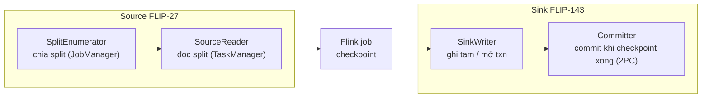
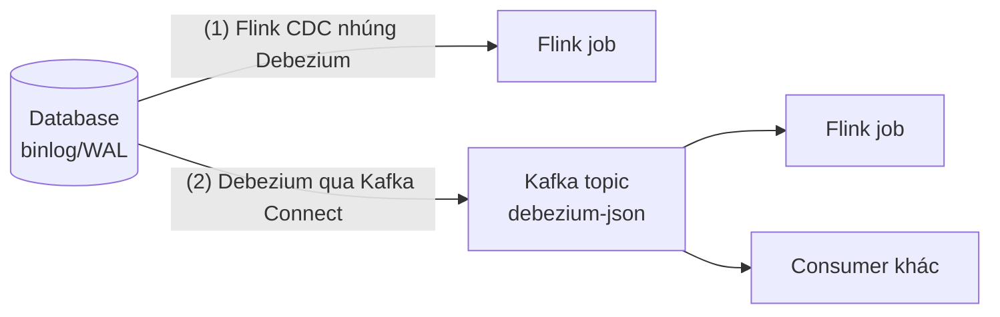

# Connector Flink

> **Chốt:** Flink chỉ mạnh exactly-once **bên trong** job; ở ranh giới với thế giới,
> đảm bảo đó chỉ giữ được nếu **cả source lẫn sink** hợp tác (source replay được offset,
> sink hỗ trợ transaction). Chọn sai connector là chỗ trùng lặp lọt ra ngoài.

Connector là chỗ Flink chạm dữ liệu ngoài — và cũng là chỗ mọi đảm bảo lý thuyết va vào
thực tế của hệ thống bên kia.

## Mô hình source/sink hiện đại

Connector Flink hiện đại theo hai FLIP thống nhất giao diện — hiểu chúng giải thích được
vì sao exactly-once hoạt động (hay không):

- **FLIP-27 (Source)** — tách làm hai phần: **SplitEnumerator** (chạy trên JobManager,
  chia công việc thành split: partition Kafka, khoảng file) và **SourceReader** (chạy
  trên TaskManager, đọc split được giao). Nhờ tách vậy mà một API dùng chung cho cả
  bounded (batch) lẫn unbounded (stream), và watermark gán được ngay tại reader theo từng
  split.
- **FLIP-143 (Sink)** — tách **SinkWriter** (ghi dữ liệu, tích luỹ thứ cần commit) và
  **Committer** (commit khi checkpoint hoàn tất). Đây là khung **2PC**: writer chuẩn bị
  (ghi file tạm / mở transaction), committer chốt khi checkpoint xong. Iceberg, Kafka
  EXACTLY_ONCE, file sink đều dựng trên khung này.



## Source vs sink — điều kiện exactly-once

- **Source** — đọc vào Flink. Tốt nếu **replay được** theo offset đã checkpoint (Kafka,
  file có vị trí). Không replay được thì không có exactly-once dù sink hoàn hảo.
- **Sink** — ghi ra ngoài. Tốt nếu **transaction** (2PC) hoặc **idempotent** (upsert theo
  khoá). Sink chỉ append mù thì retry sau lỗi sẽ ghi trùng.

## Kafka source

```java
// Code minh hoạ, chưa chạy
KafkaSource<Event> source = KafkaSource.<Event>builder()
    .setBootstrapServers(bootstrap)          // lấy từ config, KHÔNG hardcode host
    .setTopics("clicks")
    .setGroupId("flink-clicks")
    .setStartingOffsets(OffsetsInitializer.committedOffsets(OffsetResetStrategy.EARLIEST))
    .setValueOnlyDeserializer(new EventDeserializer())
    .build();

env.fromSource(source,
    WatermarkStrategy.<Event>forBoundedOutOfOrderness(Duration.ofSeconds(5))
        .withTimestampAssigner((e, ts) -> e.eventTime)
        .withIdleness(Duration.ofMinutes(1)),   // tránh idle partition treo watermark
    "kafka-clicks");
```

Ba điểm quan trọng ở source:

- **Offset initializer** — `OffsetsInitializer` quyết định bắt đầu từ đâu:
  `earliest()`/`latest()` (từ đầu/cuối topic), `committedOffsets(...)` (từ offset group
  đã commit, fallback earliest/latest nếu chưa có), `timestamp(ms)` (từ mốc thời gian).
- **Offset** do Flink quản trong checkpoint (không dựa vào `enable.auto.commit` của
  Kafka). Khôi phục từ checkpoint = tua lại đúng offset đó → không mất, không trùng phía
  đọc. (Nó vẫn commit offset về Kafka để **giám sát lag**, nhưng offset đó không phải
  nguồn sự thật khi khôi phục.)
- **Bounded mode** — `.setBounded(OffsetsInitializer.latest())` biến Kafka source thành
  hữu hạn (đọc tới offset đó rồi kết thúc) — dùng cho backfill/batch trên cùng API.
- **Watermark gán ngay tại source** thường tốt hơn gán sau `keyBy`, vì nó theo dõi
  per-partition. Nhớ `withIdleness` để partition im lặng không kéo watermark toàn cục
  đứng lại — đúng cái bẫy trong
  [case idle partition](../case-studies/cua-so-khong-chay-idle-partition.md).

## Kafka sink — chọn delivery guarantee

```java
// Code minh hoạ, chưa chạy
KafkaSink<Row> sink = KafkaSink.<Row>builder()
    .setBootstrapServers(bootstrap)
    .setRecordSerializer(/* ... */)
    .setDeliveryGuarantee(DeliveryGuarantee.EXACTLY_ONCE)   // hoặc AT_LEAST_ONCE / NONE
    .setTransactionalIdPrefix("clicks-agg")
    .setProperty("transaction.timeout.ms", "900000")        // > checkpoint interval + margin
    .build();
```

| Guarantee | Cơ chế | Đánh đổi |
|---|---|---|
| `NONE` | Fire-and-forget, không đảm bảo gì | Nhanh nhất, **có thể mất** record khi lỗi |
| `AT_LEAST_ONCE` | Ghi và flush theo checkpoint, có thể ghi lại sau lỗi | Không mất, nhưng **có thể trùng** — downstream phải dedup |
| `EXACTLY_ONCE` | Kafka **transaction** commit đúng theo checkpoint (2PC) | Không trùng, nhưng cần `transactionalIdPrefix`, chịu **thêm độ trễ** = chu kỳ checkpoint, và consumer phải đọc `read_committed` |

### Bẫy `transaction.timeout.ms`

Với EXACTLY_ONCE, Flink mở một Kafka transaction và **chỉ commit khi checkpoint hoàn
tất**. Nếu checkpoint chậm (backpressure, state lớn) mà transaction **timeout trước khi
kịp commit**, Kafka abort transaction → dữ liệu mất, hoặc job kẹt không khôi phục được.

Quy tắc: `transaction.timeout.ms` phải **lớn hơn khoảng thời gian tối đa giữa hai
checkpoint** (checkpoint interval + thời gian một checkpoint có thể kéo dài dưới
backpressure), cộng biên an toàn. Đồng thời nó bị chặn trên bởi `transaction.max.timeout.ms`
phía broker — nếu đặt cao hơn giới hạn broker, sink từ chối start. Kiểm cả hai phía.

`EXACTLY_ONCE` chỉ thật sự exactly-once khi **consumer bên kia đọc `read_committed`** —
nếu không nó vẫn thấy cả bản chưa commit. Chi tiết cơ chế hai pha ở
[exactly-once](../reference/exactly-once.md).

## Iceberg sink

Iceberg sink **commit file theo checkpoint** (dựng trên khung FLIP-143): writer ghi data
file giữa hai checkpoint, committer chỉ **commit vào metadata (snapshot) khi checkpoint
hoàn tất**. Nhờ đó đạt exactly-once ở mức file — lỗi giữa chừng thì file chưa commit bị
bỏ, không lộ ra query. Đây là mẫu sink transaction "sạch" điển hình.

```sql
-- Flink SQL ghi ra Iceberg (số/tên minh hoạ)
INSERT INTO iceberg_catalog.db.orders_agg
SELECT window_start, region, SUM(amount)
FROM TABLE(TUMBLE(TABLE orders, DESCRIPTOR(event_time), INTERVAL '1' HOUR))
GROUP BY window_start, region;
```

Đổi lại, kết quả chỉ **thấy được sau mỗi checkpoint** — checkpoint 1 phút thì độ trễ tối
thiểu tới bảng đích là ~1 phút. Đây là đánh đổi cố hữu của mọi sink transaction, không
phải lỗi. Một hệ quả phụ: checkpoint quá thưa → **nhiều small file** (mỗi checkpoint một
batch file); cần cân bằng interval với compaction phía Iceberg.

## CDC — hai đường

1. **Flink CDC** (Debezium **nhúng** trong job) — đọc **thẳng** binlog/WAL của DB. Ít
   thành phần, không cần Kafka Connect. Đánh đổi: connector chạy trong Flink, tải snapshot
   ban đầu nặng, và phụ thuộc quyền đọc log của DB.
2. **Đọc topic Debezium qua Kafka** — Debezium (Kafka Connect) ghi thay đổi vào topic,
   Flink đọc topic đó. Tách phần CDC ra khỏi Flink, chịu tải tốt hơn khi nhiều consumer.
   Xem [kafka-connect-cdc](../../kafka/skills/kafka-connect-cdc.md).



Chọn (1) khi muốn ít hạ tầng và một consumer; chọn (2) khi CDC dùng chung nhiều nơi hoặc
muốn buffer/độc lập nhịp. Cả hai phát ra **changelog stream** (before/after/op) — Flink
xử lý như retract/upsert, không phải append.

## changelog / upsert-kafka và format

- **`upsert-kafka` connector** — coi topic như bảng có khoá: `+I`/`+U` ghi bản mới (cùng
  key), `-D` ghi tombstone (value null). Dùng khi đích là "trạng thái mới nhất theo
  khoá", không phải log append. Bắt buộc khai báo `PRIMARY KEY`. Đây là sink hợp cho kết
  quả aggregation (`GROUP BY`) vì nó tiêu hoá được changelog/retract.
- **Format**:

| Format | Đặc điểm | Dùng khi |
|---|---|---|
| `json` | Dễ đọc, không schema, không enforce kiểu | Dev, log người đọc |
| `avro` | Chặt, có schema registry, evolve tốt | Production, dữ liệu sống lâu |
| `debezium-json` | Bọc changelog CDC: `before`/`after`/`op` | Đọc CDC từ topic Debezium |
| `avro-confluent` | Avro + Confluent Schema Registry | Hệ đã dùng Confluent |

Đọc CDC từ Kafka thì thường là `debezium-json` — Flink tự dịch `op` (`c`/`u`/`d`) thành
row kind (`+I`/`+U`/`-D`).

## Bẫy exactly-once ở ranh giới

Exactly-once **end-to-end** cần **cả chuỗi** hợp tác:

```text
source replay được  +  Flink checkpoint  +  sink transaction  =  exactly-once thật
        ^ thiếu bất kỳ mắt nào → tụt xuống at-least-once → có TRÙNG
```

Sink không có transaction (JDBC append thường, HTTP POST) thì dù Flink cấu hình
exactly-once, retry sau lỗi vẫn **ghi trùng** — đúng vết
[trùng lặp vì sink không transaction](../case-studies/trung-lap-vi-sink-khong-transaction.md).
Với sink loại đó, cứu vãn bằng **idempotent** (upsert theo khoá) thay vì trông chờ
transaction.

## Common Mistakes

| Bẫy | Hậu quả | Cách tránh |
|---|---|---|
| Bật EXACTLY_ONCE ở sink append thường | Vẫn trùng | Đổi sink transaction hoặc làm idempotent |
| `transaction.timeout.ms` < checkpoint interval | Txn abort, mất dữ liệu / job kẹt | Đặt timeout > interval tối đa + margin, dưới `transaction.max.timeout.ms` broker |
| Consumer đọc EXACTLY_ONCE topic mà không `read_committed` | Thấy bản chưa commit | Đặt isolation level |
| Quên `withIdleness` ở Kafka source | Idle partition treo watermark, window không đóng | Thêm idleness |
| Kỳ vọng Iceberg sink thấy dữ liệu tức thì | Trễ = chu kỳ checkpoint | Chấp nhận hoặc giảm checkpoint interval |
| Checkpoint quá thưa với file/Iceberg sink | Ít file to; quá dày thì small file | Cân bằng interval + compaction |
| Ghi retract stream vào sink append-only | Số dồn sai | Dùng `upsert-kafka` / sink có primary key |

## FAQ

<details>
<summary>EXACTLY_ONCE của Kafka sink làm chậm bao nhiêu?</summary>

Kết quả chỉ **hiển thị (commit)** sau mỗi checkpoint, nên độ trễ tối thiểu ≈ checkpoint
interval. Muốn nhanh hơn thì giảm interval, đổi lại overhead checkpoint tăng. Không có
bữa trưa miễn phí ở đây.

</details>

<details>
<summary>Flink CDC hay Debezium-qua-Kafka?</summary>

Flink CDC gọn khi một job một nguồn. Khi nhiều hệ cùng cần dòng thay đổi, hoặc snapshot
ban đầu quá nặng cho một job, tách qua Kafka Connect để CDC độc lập với xử lý.

</details>

<details>
<summary>transactionalIdPrefix có cần duy nhất giữa các job không?</summary>

Có — hai job dùng chung prefix trên cùng cluster Kafka sẽ **giẫm transaction của nhau**,
gây abort chéo hoặc kẹt. Đặt prefix riêng cho mỗi job, và giữ ổn định qua các lần restart
(đổi prefix sau restart có thể để lại transaction treo tới khi timeout).

</details>

## Related Topics

- [Exactly-once](../reference/exactly-once.md) — cơ chế hai pha ở ranh giới
- [Iceberg](../../../storage/iceberg/index.md) — đích ghi transaction theo checkpoint
- [DataStream vs Table/SQL API](datastream-vs-table-sql.md) — changelog/upsert semantics
- [Delivery semantics của Kafka](../../kafka/reference/delivery-semantics.md)
- [CDC qua Kafka Connect](../../kafka/skills/kafka-connect-cdc.md)
- [Case: trùng lặp vì sink không transaction](../case-studies/trung-lap-vi-sink-khong-transaction.md)
- [Kỹ năng — Flink](../index.md)
