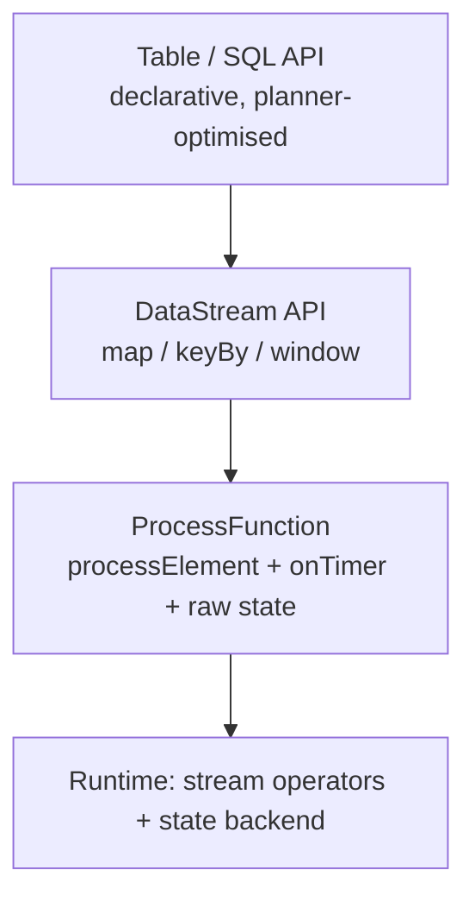

# DataStream API vs Table/SQL API

> **Takeaway:** most ETL and aggregation written in **Table/SQL** is several times shorter and lets
> Flink optimise it for you; only drop down to **DataStream / ProcessFunction** when you need raw state
> access, timer control, or logic SQL can't express (CEP, state machines).

The two APIs aren't two peer tools for one job — they sit at two different **abstraction
levels**, and the price is control traded against code length.

## The three abstraction levels

| Level | API | What you control | What you give up |
|---|---|---|---|
| High | **Table / SQL** | Declaring *what you want*; the planner chooses *how* | No raw state access, hard to insert non-SQL logic |
| Middle | **DataStream** (`map`/`keyBy`/`window`) | The transformation flow, keyed streams, windows | Still using ready-made abstractions for windows/joins |
| Low | **ProcessFunction** | One event at a time, `ValueState`/`ListState`, manual timers | Having to write everything yourself — verbose, error-prone |

`ProcessFunction` is the floor: it gives you `processElement(event, ctx, out)` plus
`onTimer(...)`. Every window, join and aggregation at the layers above ultimately reduces to these two
things. If it's expressible at a higher layer, don't come down here.



Going down a layer, you gain control but shoulder more code and more responsibility for
optimisation. The default rule: **stay at the highest layer that can express the problem**, dropping down only where
it's actually needed.

### The when-to-use-which-layer table

| Problem | The layer to use | Why |
|---|---|---|
| Filtering, projecting columns, joining two tables, windowed aggregation | **SQL / Table** | The planner pushes predicates down, picks a join strategy, generates the watermark logic |
| Enrichment with a lookup on its own TTL, deduplication on a custom key | **DataStream + KeyedProcessFunction** | You need arbitrary state + per-key TTL control |
| Firing timers on your own schedule, expiring state at exactly the right moment | **ProcessFunction** | Only this layer has `ctx.timerService()` |
| Event-sequence patterns (A then B within 5 min) | **CEP** or **ProcessFunction** | Plain SQL can't express a sequence-based state machine |
| A complex state machine (many states, conditional transitions) | **ProcessFunction** | You need `ValueState` to hold the state + your own transition logic |

## Situation X → what to choose

- **Simple aggregation / joins / filters / windows over tables** → **SQL**. Short, the planner can
  push predicates down, and you can change it without rewriting Java.
- **Arbitrary state across events** (deduplication on a custom key, complex session counting,
  enrichment with a lookup on its own TTL) → **DataStream + `KeyedProcessFunction`**.
- **Manual time control** (firing a timer at the right moment, expiring state on your own schedule) →
  **ProcessFunction**.
- **Event-sequence pattern matching** (A then B within 5 minutes) → **CEP** or
  `ProcessFunction`, not plain SQL.

## Changelog semantics — the heart of the Table API

This is the easiest place to trip when converting Table ↔ DataStream: a Table is **not always
an "append-only" stream**. Underneath, each Table is one of two kinds of stream:

| Kind | What the rows carry | Produced by |
|---|---|---|
| **Append-only** | Only `+I` (insert) | `SELECT ... WHERE ...`, projections, windowed aggregation with a window TVF |
| **Changelog (retract)** | `+I`, `-U`, `+U`, `-D` | Non-windowed aggregation (`GROUP BY`), regular joins, deduplication, `ORDER BY ... LIMIT` |
| **Changelog (upsert)** | `+U`/`+I` by key + `-D` tombstones | A sink/source with a **primary key** (`upsert-kafka`, JDBC upsert) |

The row-kind notation in Flink: `+I` (insert), `-U` (update-before, retracting the old value), `+U`
(update-after, emitting the new one), `-D` (delete).

### Why aggregation and joins produce retractions

Consider `SELECT user, COUNT(*) FROM clicks GROUP BY user`. Each new click for `u1` makes `u1`'s
count **change** — but the stream already emitted the old count downstream. You can't "edit" a
row that's already gone. So Flink emits:

```text
Output minh hoạ — chưa chạy:
+I (u1, 1)
-U (u1, 1)      <- rút lại bản cũ
+U (u1, 2)      <- phát bản mới
-U (u1, 2)
+U (u1, 3)
```

The downstream has to understand retractions to subtract the old value before adding the new one, otherwise it accumulates
wrongly. A regular join (not an interval/temporal join) is the same: when one side gets a new matching row,
the old join result must be retracted.

When a table has a declared **primary key**, Flink switches from retract to **upsert mode**: instead
of emitting a `-U`/`+U` pair, it emits a single `+U` carrying the key — and the sink uses the key to overwrite. Tidier,
but it requires a sink that understands upserts.

## Converting Table ↔ DataStream

It isn't a once-per-job choice. You can convert back and forth — but you must pick the right function for the
kind of stream:

| Function | For | What you lose if you pick wrongly |
|---|---|---|
| `toDataStream(table)` | An **append-only** table | Throws an error if the table has updates |
| `toChangelogStream(table)` | A table **with retractions/upserts** | — (keeps all the row kinds) |
| `fromDataStream(ds)` | An ordinary DataStream → an append Table | — |
| `fromChangelogStream(ds)` | A `DataStream<Row>` carrying row kinds → a changelog Table | — |

```java
// Code minh hoạ, chưa chạy
// Table -> DataStream để nhét một ProcessFunction ở giữa
DataStream<Row> stream = tableEnv.toChangelogStream(table);
DataStream<Row> enriched = stream
    .keyBy(r -> r.getField("user_id"))
    .process(new MyKeyedProcessFunction());   // logic state thô ở đây
Table back = tableEnv.fromChangelogStream(enriched);
```

The common pattern: read/aggregate in SQL for brevity, split the hard piece of logic out into
DataStream, then join it back. Don't write the whole job in DataStream just because *one* place needs it.

`toDataStream` on a table with aggregation **throws immediately** (in modern Flink) or silently
loses retractions (the old `toRetractStream`/`toAppendStream` API). Always use `toChangelogStream`
when the table can update.

## Each API's pros / cons

**Table / SQL — the planner optimises for you.** You write *what you want* and a cost-based optimizer chooses *how*:
pushing predicates into the source, picking a join strategy, picking the state layout, generating the
watermark logic once it's declared. The trade-off: the plan can **change between Flink versions** —
the same SQL, a new version, a different plan, and a savepoint that may not be compatible (a SQL job has no
stable uid the way DataStream does).

**DataStream — raw state control.** You own the topology, set fixed `.uid()`s, and know exactly
which operator holds what state. In exchange it's verbose and **you optimise it yourself** — the planner won't help.

## CEP needs DataStream

Complex Event Processing (the `flink-cep` library) — matching **event-sequence patterns** — only runs
on `DataStream`, with no fully equivalent SQL API (`MATCH_RECOGNIZE` in SQL catches part of it
but is more limited).

```java
// Code minh hoạ, chưa chạy — pattern "login thất bại 3 lần trong 1 phút"
Pattern<Event, ?> p = Pattern.<Event>begin("fail")
    .where(e -> e.type.equals("LOGIN_FAIL"))
    .times(3)
    .within(Time.minutes(1));
```

Needing a pattern like this forces you down to DataStream — one of the few problems SQL can't
reach.

## The same problem, two ways — counting per window

**Table/SQL** (a windowing TVF):

```sql
-- Output minh hoạ, chưa chạy:
-- window_start          | user_id | cnt
-- 2026-08-11 10:00:00   | u1      | 42
SELECT window_start, user_id, COUNT(*) AS cnt
FROM TABLE(
  TUMBLE(TABLE clicks, DESCRIPTOR(event_time), INTERVAL '1' MINUTE)
)
GROUP BY window_start, user_id;
```

**DataStream** — the same result, much longer:

```java
// Code minh hoạ, chưa chạy
clicks
  .assignTimestampsAndWatermarks(/* ... */)
  .keyBy(c -> c.userId)
  .window(TumblingEventTimeWindows.of(Time.minutes(1)))
  .aggregate(new CountAgg());   // AggregateFunction đếm incremental
```

The SQL version above is four lines and the planner picks the state backend and generates the watermark logic once
it's declared. Only when you need something SQL won't give you — say emitting an extra side output for
late events with its own metadata — is dropping to DataStream worth it.

## The decision table

| Question | If "yes" | If "no" |
|---|---|---|
| Expressible in plain SQL (filter/join/agg/window)? | **SQL** | Read on |
| Need arbitrary state or a per-key TTL? | **DataStream + KeyedProcessFunction** | Read on |
| Need manual timer control? | **ProcessFunction** | Read on |
| Need event-sequence pattern matching? | **CEP (DataStream)** | Back to **SQL** |

## Trade-offs

| Table / SQL | DataStream / ProcessFunction |
|---|---|
| Short, declarative, planner-optimised | Verbose, you optimise it yourself |
| Anybody who reads SQL can change it | Needs a Java/Scala developer |
| Hard to touch raw state, hard for non-SQL logic | Full control of state + timers |
| Upgrades/plan changes between versions can diverge | More stable, you own the topology (fixed uids) |
| Retractions/upserts handled automatically | You manage row kinds yourself when mixing |

## Common Mistakes

- **Writing the whole job in DataStream because one place needs raw state.** Mix them — SQL for the
  rest.
- **`toDataStream` on a table with aggregation.** Retractions lost → the sink double-counts. Use
  `toChangelogStream`.
- **Thinking SQL has no state.** It does — `GROUP BY`, joins and deduplication all hold state; you still have to worry about
  TTL and checkpoints just as with DataStream.
- **A downstream that doesn't understand changelogs.** Writing a retract stream into an append-only sink → accumulating
  wrongly. The sink must support upsert/delete, or the table must be append-only.
- **Expecting a SQL plan to be stable across versions.** Upgrading Flink can change the plan → a SQL savepoint
  that won't restore. Test on staging.

## FAQ

<details>
<summary>Is SQL slower than DataStream?</summary>

Not inherently. The planner usually produces a better plan than hastily written DataStream code. DataStream
is only faster when you genuinely optimise by hand (avoiding surplus serialization, a tight state layout) —
and that takes effort.

</details>

<details>
<summary>How does ProcessFunction differ from RichFunction?</summary>

`RichFunction` gives you the lifecycle (`open`/`close`) and state access. `ProcessFunction` adds a
`Context` with timers and side outputs — that is, control over time, which RichFunction usually lacks.

</details>

<details>
<summary>When do I need to declare a primary key on a Table?</summary>

When you want Flink to switch from retract to upsert mode — tidier (one `+U` row carrying the key
instead of a `-U`/`+U` pair), and mandatory when the sink is `upsert-kafka` or a JDBC upsert. Without a
primary key, aggregation emits a full retract stream.

</details>

## Related Topics

- [Windows in Flink](windows.md) — windows in both APIs
- [Flink connectors](connectors.md) — `upsert-kafka` and changelog formats
- [What Flink is](../reference/what-is-flink.md) — the underlying processing model
- [Skills — Flink](../index.md)
